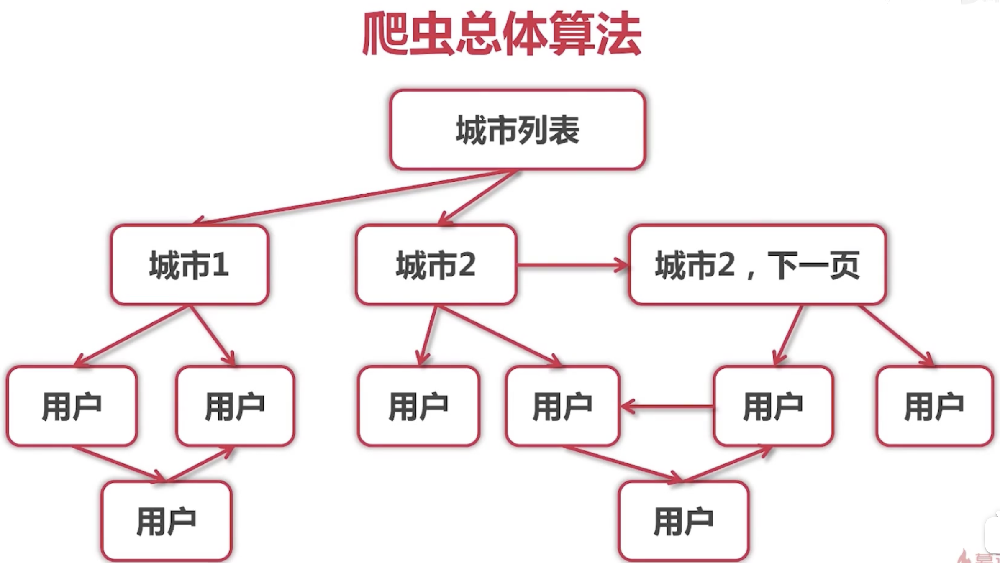
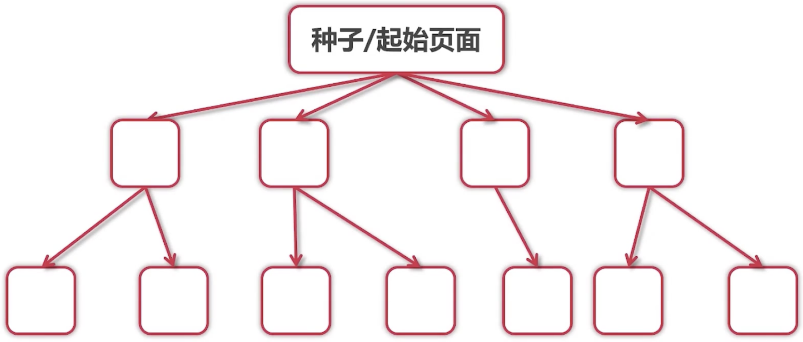
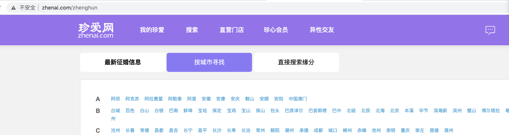
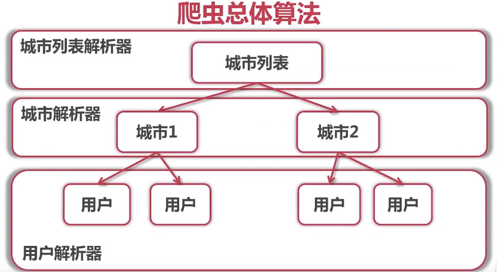
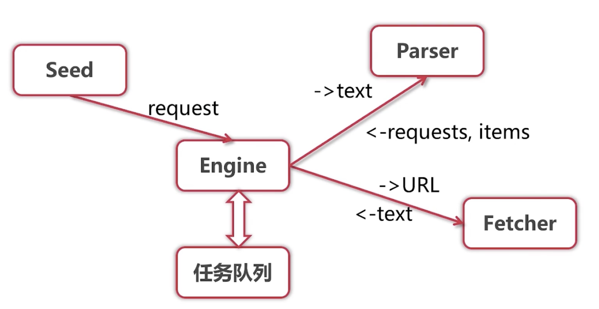
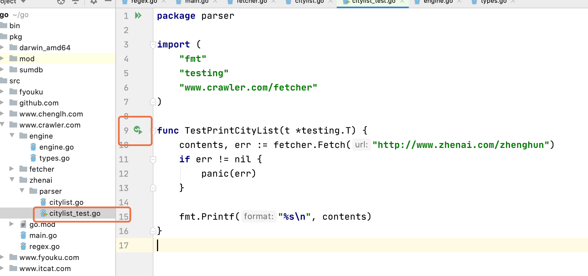

==OSI模型==

> 爬虫

~~~php
https://www.bilibili.com/video/BV1t5411Y7xQ?p=54
~~~

爬虫分类：

1、通用爬虫，如百度、谷歌

2、聚集爬虫，从互联网获取结构化数据(如携程、微博等)。

分布式爬虫  ---》 Internet  ---》 数据存储   ----》 展示

> Go爬虫库、框架

~~~go
henrylee2cn/pholcus

gocrawl

colly

hu17889/go_spider
~~~

> 技术成型：

1、不使用现成爬虫库/框架

2、使用ElasticSearch作为数据存储

3、使用go语言标准http库

> 单任务版   =\===》  并发版     =====》分布式

数据来源：

~~~go
gbk解决乱码问题思路：
go get golang.org/x/text   //是在golang库中但不是标准库

下载包的位置在，pkg/golang.org/x/text@v0.3.4/encoding/simplifiedchinese/gbk.go
~~~

~~~go
自动检测编码库
go get golang.org/x/net/html
~~~

获取页面内容

~~~go
package main

import (
	"bufio"
	"fmt"
	"golang.org/x/net/html/charset"
	"golang.org/x/text/encoding"
	"golang.org/x/text/transform"
	"io"
	"io/ioutil"
	"net/http"
)

// 自动解释得到文件编码
func determineEncoding(r io.Reader) encoding.Encoding {
	bytes, err := bufio.NewReader(r).Peek(1024)
	if err != nil {
		panic(err)
	}

	e, _, _ := charset.DetermineEncoding(bytes, "")
	return e
}

func main() {
	resp, err := http.Get("http://www.zhenai.com/zhenghun")
	if err != nil {
		panic(err)
	}
	defer resp.Body.Close()

	if resp.StatusCode != http.StatusOK {
		fmt.Println("Error: status code", resp.StatusCode)
		return
	}

	encoding := determineEncoding(resp.Body)
	utf8Reader := transform.NewReader(resp.Body, encoding.NewDecoder())
	all, err := ioutil.ReadAll(utf8Reader)
	if err != nil {
		panic(err)
	}

	fmt.Println("%s\n", string(all))
}

~~~

正则

~~~go
//正则
func main() {
	//text := `my email is ccchenglh@gmail.com`
	//resp := regexp.MustCompile(`[a-zA-Z0-9]+@.+\..+`) //这里如果用双引号，必须要写两个\\
	//match := resp.FindString(text)
	//fmt.Println(match)

	text := `my email is ccchenglh@gmail.com
aa@gmail.com
cc  bb@qq.com.cn`
	resp := regexp.MustCompile(`[a-zA-Z0-9]+@.+\..+`)
	match := resp.FindAllString(text, -1)
	fmt.Println(match)
}
~~~

==采集城市和连接==

~~~go
package main

import (
	"bufio"
	"fmt"
	"golang.org/x/net/html/charset"
	"golang.org/x/text/encoding"
	"golang.org/x/text/transform"
	"io"
	"io/ioutil"
	"net/http"
	"regexp"
)

// 自动解释得到文件编码
func determineEncoding(r io.Reader) encoding.Encoding {
	bytes, err := bufio.NewReader(r).Peek(1024)
	if err != nil {
		panic(err)
	}

	e, _, _ := charset.DetermineEncoding(bytes, "")
	return e
}

func printCityList(contests []byte) {
	//<a href="http://www.zhenai.com/zhenghun/yaan" data-v-1573aa7c>雅安</a>
	resp := regexp.MustCompile(`<a href="(http://www.zhenai.com/zhenghun/[0-9a-z]+)"[^>]*>([^<]+)</a>`)
	matches := resp.FindAllSubmatch(contests, -1) //[][][]byte = [][]string
	for _, m := range matches {
		fmt.Printf("city:%s, url:%s\n", m[2], m[1])
	}

}

func main() {
	resp, err := http.Get("http://www.zhenai.com/zhenghun")
	if err != nil {
		panic(err)
	}
	defer resp.Body.Close()

	if resp.StatusCode != http.StatusOK {
		fmt.Println("Error: status code", resp.StatusCode)
		return
	}

	//all, err := ioutil.ReadAll(resp.Body)
	//fmt.Println("%s\n", string(all))
	//return

	encoding := determineEncoding(resp.Body)
	utf8Reader := transform.NewReader(resp.Body, encoding.NewDecoder())
	all, err := ioutil.ReadAll(utf8Reader)
	if err != nil {
		panic(err)
	}

	//fmt.Println("%s\n", string(all))

	printCityList(all)
}
~~~

==测试用例==

~~~go
离异
30岁
魔羯座(12.22-01.19)
160cm
55kg
工作地:阿拉善盟阿拉善左旗
月收入:3-5千
销售总监
大专
汉族籍贯:甘肃天水
体型:一般

不吸烟
不喝酒
租房
未买车
没有小孩
是否想要孩子:视情况而定
何时结婚:一年内
~~~

