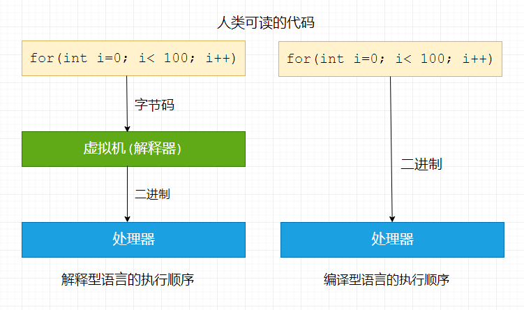
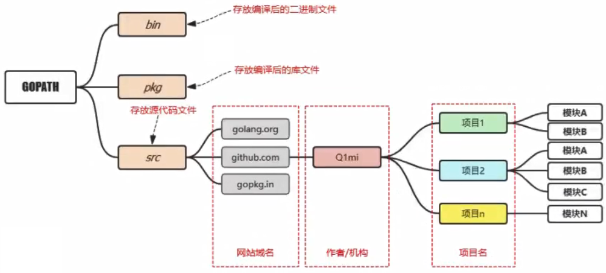
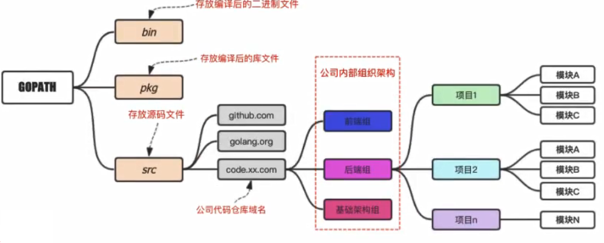
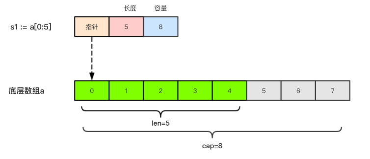
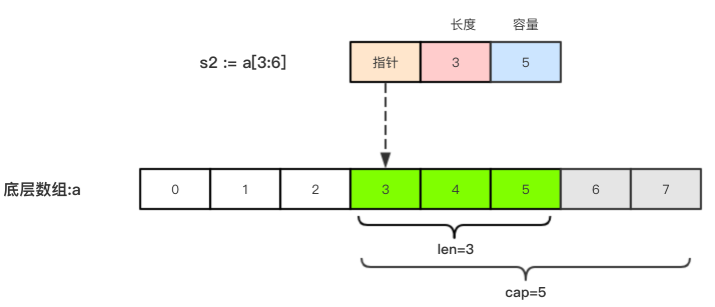
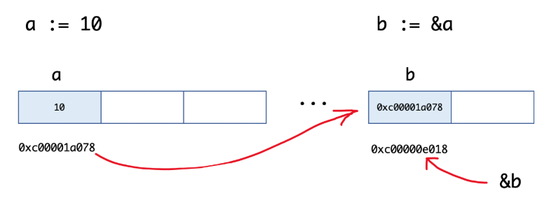
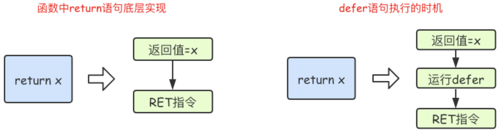
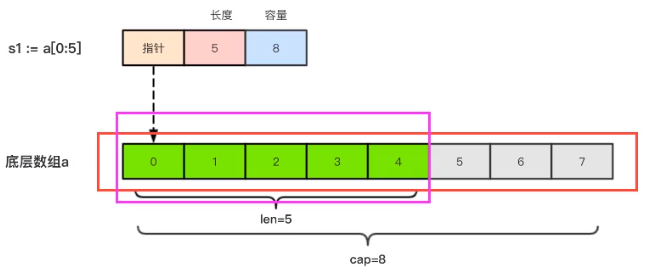

##### 第一天课程

###### 1.1 Go语言基础

> 什么是Go语言

1. Google开源
2. 编译型语言(C、Go等)、而php、Python解析型语言
3. 21世纪的C语言，天生支持并发、执行性能好、真正的企业级编程语言(Java、Go)


**Go语言特点**
1、语法简洁(25个关键字)
2、开发效率高(自带gc)
3、执行性能好


**解析型语言与编译型语言区别**




**编程语言的时间结点**


谁在使用？

```bash
#百度内部Go语言应用
百度流量入口BFE
自动驾驶
百度智能小程序
百度APP
...

#腾讯内部Go语言应用
开源运维平台蓝鲸
开源微服务架构TarsGo
云平台
...

#知乎使用Go语言重构(Py转Go)
节约80%的服务器资源
协作开发效率高
Go成为内部推荐语言
...
```


新兴公司、行业


第一个程序

```go
package main //main就是说能打包成一个可执行的exe文件

//导入语句(包)
import "fmt"

//函数外只能放置标识符(变量\常量\函数\类型)的声明

//程序的入口
func main() {
    fmt.Println("人生苦短，Let's Go!")
}
```


###### 1.2 开发环境

#官方链接(翻墙)： https://golang.org/dl

#官方镜像(推荐)：https://golang.google.cn/dl

```bash
##1、Golang软件下载

##2、安装
双击一步步安装即可

##3、验证(cmd或Git命令面板)
$ go version
go version go1.14.2 windows/amd64

#查看Go环境参数
$ go env
set GO111MODULE=
set GOARCH=amd64
set GOBIN=
set GOCACHE=C:\Users\Administrator\AppData\Local\go-build
set GOENV=C:\Users\Administrator\AppData\Roaming\go\env
set GOEXE=.exe
set GOFLAGS=
...

##4、开发软件
golang 或
vcode

##5、编译文件
> go build
> xxx.exe

> go build main.go
```


旧版本还要设置Gopath

|  平台   |   GOPATH默认值   |        举例        |
| :-----: | :--------------: | :----------------: |
| windows | %USERPROFILE%/go | c:\Users\用户名\go |
|  unix   |     $HOME/go     |  /home/用户名/go   |


**1、适合个人开发者，组织代码**


**2、目前流行的项目结构**



**3、企业项目组织代码**



[官方下载](https://code.visualstudio.com/Download )

1、打开软件，在左侧 “扩展” > 搜索 chinese 汉化插件包 ，重启软件

2、再次 “扩展” > 搜索 go 扩展插件，让软件支持Go语言开发


###### 1.3 项目编译

> 命令行：go build

1. 在项目目录下执行go build
2. 在其他路径下执行go build，需加上项目路径(从GOPATH/src后边写起)，编译后可执行文件保存在当前目录下
3. 可以使用`-o`参数来指定编译后得到的可执行文件的名字

```bash
##方式一
#构建
G:\Go\src\www.testgo.com\day01\helloworld>go build
helloworld.exe

#运行
G:\Go\src\www.testgo.com\day01\helloworld>helloworld.exe
Hello world!

##方式二
cd E:\www
go build www.testgo.com/day01/helloworld
helloworld.exe

##方式三
go build -o hello.exe
hello.exe
```

```php
#常用命令
> go build     	  //构建项目
> go run main.go  //运行项目

> go install
//1、先编译得到exe；
//2、把可执行文件拷贝到"GOPATH/bin"目录下。任意地方直接执行当前可执行文件
```


> 跨平台编译

`go build`生成可执行文件都是当前操作系统可执行的文件，如果想在windows下编译一个linux下可执行文件，那需要怎么做呢？

只需要指定目标操作系统的平台和处理器架构即可 (cmd界面下)

```go
> SET CGO_ENABLED=0  // 禁用CGO，因为使用cgo的代码是不支持跨平台编译的
> SET GOOS=linux     // 目标平台是linux
> SET GOARCH=amd64   // 目标处理器架构是amd64
> go build
```

Mac下编译Linux和Windows平台64位可执行程序

```
CGO_ENABLED=0 GOOS=linux GOARCH=amd64 go build
CGO_ENABLED=0 GOOS=windows GOARCH=amd64 go build
```

Linux下编译Mac和Windows平台64位可执行程序：

```
CGO_ENABLED=0 GOOS=darwin GOARCH=amd64 go build
CGO_ENABLED=0 GOOS=windows GOARCH=amd64 go build
```

Windows下编译Mac平台64位可执行程序：

```
SET CGO_ENABLED=0
SET GOOS=darwin
SET GOARCH=amd64
go build
```


###### 1.4 代码格式化

```go
> go fmt main.go  //格式化代码重排
```


###### 1.5 变量常量

**Go语言中有25个关键字**

```go
break		  default		func		 interface	select
case		  defer		  go			  map			  struct
chan		  if			  else		  goto		  switch
package		const		  range		  type		  fallthrough
continue	for			  import		return		var
```


Go语言37个保留字

```go
Constants:	true  false  iota  nil

Types:		int  int8  int16  int32  int64  
          uint  uint8  uint16  uint32  uint64  uintptr
          float32  float64  complex128  complex64
          bool  byte  rune  string  error

Functions:  make  len  cap  new  append  copy  close  delete
            complex  real  imag
            panic  recover
```


**变量**
Go语言中的变量必须`先声明后才能使用`，同一作用域内不支持重复声明，并且Go语言中的变量声明后必须使用。


> 标准声明

```go
// var 变量名  变量类型
var age int
var name string
var isok bool
```


> 批量声明

~~~go
var (
    //Go语言中推荐使用驼峰式命名
    studentName  string
    studentAge   int
    studentState bool
)

var a1, a2, a3 string
~~~


举个栗子

~~~go
var ( //批量声明
	name string
	age  int
	isok bool
)

func main() {
	name = "chenglh"
	age  = 16
	isok = false

  fmt.Printf("name:%s, age:%d", name, age) //name:chenglh,age:16
	fmt.Print(isok) //false
  fmt.Println() //快捷打印一个空行
  fmt.print("\n")
}
~~~


> 变量的初始化

Go语言在声明变量的时候，会自动对变量对应的内存区域进行初始化操作。

变量的零值：

~~~php
整型和浮点型变量的默认值为0

字符串变量的默认值为空字符串

布尔型变量默认为false

切片、函数、指针变量的默认为nil
~~~


> 变量初始化标准格式

~~~go
//声明变量的同时赋值
var 变量名 类型 = 表达式

//举例子
//单个变量声明
var name string = "chenglh"
var age int = 18

//多个变量声明
var name, age = "chenglh", 18 //go语言中建议使用类型推导
~~~


> 类型推导

将变量的类型省略，编译器会根据等号右边的值来推导变量的类型完成初始化

~~~go
var name = "chenglh"
var age = 18
~~~


> 短变量声明(函数内部)

只在函数内部使用，通过 `:=` 方式声明并初始化变量

~~~go
//全局变量 m
var m = 100

func main() {
    s3 := "haha" //简短变量声明,使用了类型推导
    n  := 10
    m   = 200
    fmt.Println(s3, m, n)// s3, n, m := "haha", 200, 10
}
~~~


> 匿名变量

在使用多重赋值时，如果想要忽略某个值，可以使用`匿名变量（anonymous variable）`。 

匿名变量用一个下划线`_`表示，例如：

```go
func foo() (int, string) {
	return 10, "chenglh"
}
func main() {
	x, _ := foo()
	_, y := foo()
	fmt.Println("x=", x) //10
	fmt.Println("y=", y) //chenglh
}
```

匿名变量不占用命名空间，不会分配内存，所以匿名变量之间不存在重复声明。 (在`Lua`等编程语言里，匿名变量也被叫做哑元变量。)


> 注意事项：

1. 函数外的每个语句都必须以关键字开始（var、const、func等）
2. `:=` 不能使用在函数外。
3. `_` 多用于占位，表示忽略值。
4. <u>同一个作用域中，不能`重复声明`同名的变量</u>

~~~go
//声明变量
/* 单个声明
var name string
var age int
var isOk bool */

//批量声明
var (
	  name string
    age  int
    isOk bool
)

var (
	//student_name string
	studentName  string //使用驼峰式，上面和下面的声明，编辑器会有小波浪线提示
	//StudentName  string
)

func main() {
	//赋值
	name = "chenglh"
	age  = 16
	isOk = true

	fmt.Print(isOk) //在终端打印字符
	fmt.Printf("my name is:%s", name) // %s占位符
	fmt.Printf("my age is:%d", age)   // %d
	fmt.Println("this end")   // 输出+换行符
	fmt.Println() //打印一个空行

  //Go语言中，非全局变量声明后必须使用，不使用就编译不过去
  //var testHeihei string
  //testHeihei = "测试使用"
  //fmt.Print(testHeihei)

  //声明变量同时赋值
	//var setStudentName string = "chenglh"
  var setStudentName = "chenglh"
  //fmt.Print(setStudentName)
}
~~~


**常量**

相对于变量，常量是恒定不变的值，多用于定义程序运行期间不会改变的那些值，常用于全局。 

常量的声明`const`，常量在定义的时候必须赋值。

常量，一经定义后，程序运行期间不能改变

> 单个常量声明

~~~go
const pi = 3.141529
const e = 2.7182
~~~


> 批量常量声明

~~~go
const (
    pi = 3.141529
    e = 2.7182
)
~~~


const同时声明多个常量时，如果省略了值则表示和上面一行的值相同。

~~~go
const (
    n1 = 100
    n2
    n3
    // 相当于常量`n1`、`n2`、`n3`的值都是100
)
~~~


**iota**

`iota`是go语言的常量计数器，只能在常量的表达式中使用。

`iota`在`const关键字出现时将被重置为0`。const中每新增一行常量声明将使`iota`计数一次(iota可理解为const语句块中的行索引)。 

使用iota能简化定义，在定义枚举时很有用。

~~~go
//举个例子
const (
	n1 = iota //0
	n2        //1，默认是 n2 = iota
	n3        //2
	n4        //3
)

const a1 = iota // const关键词出现，iota 重置为0
const (
	a2 = iota     // const关键词出现，iota 重置为0
	a3  //1
	a4  //2
	a5  //3
)
~~~


> 几个常见iota例子

~~~go
//例1：使用`_`跳过某些值
const (
	n1 = iota //n1 = 0
	n2        //n2 = iota => n2 = 1
	_		      //_  = iota => iota = 2
	n4        //n4 = iota => n4 = 3
)

//例2：`iota`声明中间插队
const (
	n1 = iota //n1 = 0
	n2 = 100  //n2 = 100   iota计算器为1
	n3 = iota //n3 = iota => n3 = 2
	n4        //n4 = iota => n4 = 3
)
const n5 = iota //n5 = 0

//例3：多个`iota`定义在一行
const (
	a, b = iota + 1, iota + 2 //a = 0 + 1   ; b = 0 + 2    结果：1 2
	c, d                      //c = iota + 1; d = iota + 2 结果：2,3
	e, f                      //e = iota + 1; f = iota + 2 结果：3,4
)

//例4：定义数量级
const (
	_  = iota
	KB = 1 << (10 * iota)
	MB = 1 << (10 * iota)
	GB = 1 << (10 * iota)
	TB = 1 << (10 * iota)
	PB = 1 << (10 * iota)
    /** <<表示左移操作，1<<10表示将1的二进制表示向左移10位，也就是由1变成了10000000000，
    也就是十进制的1024*/
)
~~~


###### 1.6 数据类型

基本数据类型：**【整型、浮点型、布尔型、字符串】，【数组、切片、结构体、函数、map、通道（channel）】等**


> 整型分两大类

- 带符号整型：int8、int16、int32、int64
- 无符号整型：uint8、uint16、uint32、uint64

|  类型  | 描述                                                         | 占用空间 |
| :----: | ------------------------------------------------------------ | -------- |
|  int8  | 有符号8位整型 (-128 到 127)                                  | 1个字节  |
| int16  | 有符号16位整型 (-32768 到 32767)                             | 2个字节  |
| int32  | 有符号 32位整型 (-2147483648 到 2147483647)                  | 4个字节  |
| int64  | 有符号 64位整型 (-9223372036854775808 到 9223372036854775807) | 8个字节  |
| uint8  | 无符号 8位整型 (0 到 255)                                    | 1个字节  |
| uint16 | 无符号 16位整型 (0 到 65535)                                 | 2个字节  |
| uint32 | 无符号 32位整型 (0 到 4294967295)                            | 4个字节  |
| uint64 | 无符号 64位整型 (0 到 18446744073709551615)                  | 8个字节  |


> 特殊整型(注意：越界或溢出)

| 类型    | 描述                                               |
| :------ | :------------------------------------------------- |
| uint    | 32位操作系统上就是uint32，64位操作系统上就是uint64 |
| int     | 32位操作系统上就是int32，  64位操作系统上就是int64 |
| uintptr | 无符号整型，用于存放一个指针                       |


**查看整型占用的存储空间**

~~~go
import (
	"fmt"
	"unsafe"
)

func main()  {
	var num int8 = 18
	fmt.Println("num=%v; 占空间：%v字节\n", num, unsafe.Sizeof(num))
	//num=18; 占空间：1字节
}
~~~


> 关于字节

字节也叫Byte，是计算机数据的基本存储单位。

8bit(位)     = 1Byte(字节)

1024Byte = 1 KB

1024KB    = 1M

1024M     = 1GB

1024GB   = 1TB

如 8Bit 时，`首位`是标识 **有/无符号**，其他7位用0或1表示，即2^7 -1 = 127


**类型的转换**

~~~go
var a1 int32 = 10
var a2 int64 = 21
fmt.Println(int64(a1)+ a2) //根据赋值的结果，可以转成32或64位来计算
~~~

注意高位向低位转换时，看是否越界而造成结果出错

低位向高位转换就不存在这个问题了


**float类型**

> Go语言中，int和float 默认是跟着系统位数走的，32位系统对应int32、float32；64位系统对应int64，float64

~~~go
//定义float类型
var a float32 = 3.12
fmt.Printf("值：%v, 浮点值：%f，类型：%T\n")
//值：3.14，浮点值：3.140000，类型：float32
//4 float32占4个字节

//float64占8个字节

var c float64 = 3.1415925535
fmt.Printf("原值：%v, 浮点值：%f，类型：%T\n")
//原值：3.1415925535, 浮点值：3.141593，类型：float64 默认4舍5近保留6位小数

//float类型，指定小数位输出结果， 如 %.2f 两位小数 

//64位系统中，浮点数默认类型：float64
f1 := 1.234568
fmt.Printf("%T\n", f1)

//显式声明类型
f2 := float32(1.23552)
fmt.Printf("%T\n", f2)

//float32类型的值不能直接赋值给 float64 ,如错误用法：f1 = f2

/** 科学计数法 */
var aa float32 = 3.14e2  // 3.14乘以10的两次方
fmt.Printf("原值：%v, 浮点值：%f，类型：%T\n", aa, aa, aa)
//原值：314, 浮点值：314.000000，类型：float32

var bb float32 = 3.14e-2 // 3.14除以10的两次方
fmt.Printf("原值：%v, 浮点值：%f，类型：%T\n", bb, bb, bb)
~~~


**float精度丢失问题**

引用第三方类库解决，https://github.com/shopspring/decimal

~~~go
> go get github.com/shopspring/decimal  //下载包
~~~


使用第三方包来解决精度损失的问题

~~~go
import (
	"fmt"
	"github.com/shopspring/decimal"
)

var num float64 = 1129.6
fmt.Println(num * 100) // 112959.99999999999

m1 := 8.2
m2 := 3.4
fmt.Println(m1 - m2) // 4.799999999999999

//修复精度
//加法 Add ；减法 Sub；乘法 Mul；除法 Div
var num1 float64 = 8.2
var num2 int = 2
add_ret := decimal.NewFromFloat(num1).Add(decimal.NewFromFloat(float64(num2)))
fmt.Println(add_ret)
~~~


> 数字字面量语法（Number literals syntax）

Go1.13版本之后引入了数字字面量语法，这样便于开发者以二进制、八进制或十六进制浮点数的格式定义数字。


**八进制**

Go语言中无法直接定义二进制数，关于八进制和十六进制的示例如下：

~~~go
func main()  {
	//十进制
	var a = 10
	fmt.Printf("%d \n", a) // 10
	fmt.Printf("%b \n", a) // 1010

  //八进制 以0开头(文件权限)
	var b = 077
	fmt.Printf("%o \n", b) // 77

  //十六进制 以0x开头(内存地址)
	var c = 0xff
	fmt.Printf("%x \n", c) // ff
	fmt.Printf("%X \n", c) // FF

	var d = int8(9)
	fmt.Printf("%T\n", d)
}
~~~


**布尔值**

Go语言中 bool类型进行声明布尔型数据，只有 true和false两个值

注意：

1. 布尔值变量默认值为 false
2. Go语言中不允许将整型强制转换为布尔型
3. 布尔型无法参与数据运算，也无法与其他类型进行转换

```go
func main()  {
	var a1 = true
	var a2 bool  //默认零值 false

	fmt.Printf("a1类型：%T, val=%v\n", a1, a1) //a1类型：bool, val=true
	fmt.Printf("a2类型：%T, val=%v\n", a2, a2) //a2类型：bool, val=false
}
```


**类型总结**

~~~go
func main()  {
	num := 100
	fmt.Printf("%T\n", num) //查看类型    int
	fmt.Printf("%v\n", num) //万能输出值	 100
  
	fmt.Printf("%b\n", num) //二进制	  1100100
	fmt.Printf("%o\n", num) //八进制	  144
	fmt.Printf("%d\n", num) //十进制	  100
	fmt.Printf("%x\n", num) //十六进制  64
    
	number := 100.98
	fmt.Printf("%T，%f\n", number, number) //%f输出10进制的浮点数,(这里float64，100.980000)

	name := "chenglh"
	fmt.Printf("%s\n", name)  //字符串输出  chenglh
	fmt.Printf("%v\n", name)  //万能输出值  chenglh
	fmt.Printf("%#v\n", name) //"结果串"会自动加上双引号 "chenglh"
    
	//%c 输出单个字符，即对应的是ASCII码
	n1 := '程'
	n2 := 'A'
	fmt.Printf("%c\n",n1) // %c原样输出，否则对应是的ASCII码
	fmt.Printf("%c\n",n2)
}
~~~


**字符串**

> Go语言里的字符串的内部实现使用 UTF-8 编码

字符串定义

~~~go
var str1 string = "值"
var str2 = "值"
str3 := "值"
~~~


1. 字符串：双引号
2. 字符    ：单引号  `[只能是一个字符/英文/汉字/符号]`

~~~go
s := "hello world"
a := '程'
fmt.Println(s)
fmt.Println(a)  //ASCII码值 24352
~~~


**字符串转义**

| 转义符 | 含义                             |
| ------ | -------------------------------- |
| \r     | 回车符(返回行首)                 |
| \n     | 换行符(跳到下一行的同一行列位置) |
| \t     | 制表符                           |
| \\'    | 单引号                           |
| \\"    | 双引号                           |
| \\\    | 反斜杠                           |

~~~go
//s := "I'm ok"
//fmt.Print(s)

//多行原样输出字符串
s2 := `
东风恶
人情薄
雨送黄昏花易落
`
fmt.Print(s2)

s3 := `G:\Go\src\www.testgo.com\day03\fmt`  //原样
s4 := "G:\\Go\\src\\www.testgo.com\\day03\\fmt" //需要转义
~~~


**字符串操作**

|                 方法                 |      说明      |
| :----------------------------------: | :------------: |
|               len(str)               |     求长度     |
|           + 或 fmt.Sprintf           |   字符串拼接   |
|            strings.Split             |   分割字符串   |
|           strings.contains           |  判断是否包含  |
| strings.HasPrefix；strings.HasSuffix |   前后缀判断   |
|  strings.Index()，strings.LastIndex  | 子串出现的位置 |
| strings.Join(a[]string,  sep string) |    join操作    |


~~~go
//字符串长度 len(xx)
s1 := "chenglh"
s2 := "程“"
fmt.Print(len(s1))   // 7个字符，1个汉字或全角字符占3个字符
fmt.Print(len(s1))   // 6

//求字符串长度
s3 := "chenglh程“"

//方法1：
ss1 := len([]rune(s3)) // 9，即9个字符，切片中的内容也是ASCII码
//方法2：
ss2 := strings.Count(s3,"") - 1   //需要引入 strings 类
//方法3：
ss3 := bytes.Count([]byte(s3),nil) - 1  //需要引入 bytes 类

//字符串拼接 +或fmt.Sprintf
s2 := "cheng"
s3 := " li hui"
ss := s2 + s3
fmt.Println(ss)  //第一种：使用 + 连接
fmt.Printf("%s%s\n", s2, s3) //第二种，格式化输出 cheng li hui
ss1 := fmt.Sprintf("%s%s", s2, s3)//第三种，Sprintf格式化后返回值给变量
fmt.Println(ss1) // cheng li hui

//字符串分割 strings.Split
//email := "abc@a.com"
//emailS := strings.Split(email, "@")
//fmt.Println(emailS) //[abc a.com]

s1 := "G:\\aaa\\bb\\ccc"
ss := strings.Split(s1, "\\")
fmt.Println(ss)

//判断包含关系 strings.contains	
name := "cheng lihui"
fmt.Println(strings.Contains(name, "cheng"))  // true
fmt.Println(strings.Contains(name, "test"))   // false

//判断前缀后缀 strings.HasPrefix,strings.HasSuffix	
name := "chenglihui"
fmt.Println(strings.HasPrefix(name, "cheng"))
fmt.Println(strings.HasSuffix(name, "ui"))

//字串出现的位置 strings.Index(),strings.LastIndex()	
name := "chenglihui"
fmt.Println(strings.Index(name, "a"))  //找不到 -1
fmt.Println(strings.Index(name, "c"))  //0 索引位置从0开始
fmt.Println(strings.LastIndex(name, "i"))//最后一次出现i的位置

//join操作，切片连接起来 strings.Join(a[]string, sep string)	
strings.Join(a[] string, sep string)

//切片就是数组
arr := []string{"php","java","golang"}
fmt.Println(strings.Join(arr, "-"))
~~~


**byte和rune类型**

Go语言的字符有以下两种：

1. uint8类型，或叫 byte型，代表ASCII码的一个字符
2. rune类型，代表一个 utf-8 字符

当需要处理中文，日文或其他复合字符时，则需要用到 rune类型，rune类型实际是一个 int32

~~~go
var a := '中' //ASCII对应的码值，%c 原样输出
var b := 'x'
~~~


Go语言的字符有以下两种：

1. uint8类型，或者叫byte型，代表了ASCII码的一个字符
2. rune类型，代表一个UTF-8字符

当需要处理中文、日文或者其他复合字符时，则需要用到`rune`类型。`rune`类型实际是一个`int32`。

~~~go
var name = "chenglh"
fmt.Printf("%c , %T", name[3], name[3]) //n , uint8

//unsafe.Sizeof()没法查看string类型数据所占用的存储空间，全部是返回 16字节
//一个汉字占用 3 字节
~~~


~~~go
//byte和rune类型
//Go语言中为了处理非ASCII码类型的字符，定义了新的rune类型
//英文字符是 byte类型
//其他语言字符是 rune类型

s := "Hello意难平"
n := len(s)    // len()求的是byte字节的数量，有中文，长度会有跳跃
fmt.Println(n) // 值：14

//for i := 0; i < len(s); i++  { //byte
//	fmt.Printf("%c\n", s[i])  // %c：字符，但是这里中文会变成“乱码”
//}

for _, v := range s1 { // rune
    fmt.Printf("%v(%c)\t", v, v)
}
//72(H)   101(e)  108(l)  108(l)  111(o)  24847(意)       38590(难)       24179(平)
~~~


> 字符串底层是一个byte数组，所以可以和`[]byte`类型相互转换


**修改字符串**

要修改字符串，需要先将其转换成 []rune 或 []byte，完成后再转换为 string。无论哪种转换，都会重新分配内存，并复制字节数组。

~~~go
func changeString() {
    //方法一：[]byte类型，单纯的英文，数值，符号等字符串
    s1 := "big"
    // 强制类型转换
    byteS1 := []byte(s1)
    byteS1[0] = 'p'
    fmt.Println(string(byteS1)) // 强制转换成字符串 string(byteS1)
    
    //方法二： []rune类型
    s2 := "白萝卜"
    runeS2 := []rune(s2) //强制转换成切片
    runeS2[0] = '红' //改成 字符，如用双引号会变成红线不能编译
    fmt.Println(string(runeS2))
}
~~~

~~~go
//单双引号的类型是不一样的
s1 := "程"  //string
s2 := '程'  //rune(int32)
fmt.Printf("s1:%T s2:%T", s1, s2)

> go run main.go
s1:string    s2:int32
~~~


**类型转换**

Go语言中只有强制类型转换，没有隐式类型转换。该语法只能在两个类型之间支持相互转换的时候使用。

~~~go
func sqrtDemo() {
	var a, b = 3, 4
	var c int
	// math.Sqrt()接收的参数是float64类型，需要强制转换
	c = int(math.Sqrt(float64(a*a + b*b)))
	fmt.Println(c)
    //尽量低位向高位转换，否则可以数据溢出就影响实际结果
    
    //1、Sprintf函数，其他类型转string
    var e int64 = 1
    var f float64 = 12.456
    var g bool = true
    var h byte = 'a'
    str1 := fmt.Sprintf("%d\n", e)
    str2 := fmt.Sprintf("%f\n", f)
    str3 := fmt.Sprintf("%t\n", g) //bool值  %t格式化
    str4 := fmt.Sprintf("%c\n", h)
    
    //2、strconv包
    var e int64 = 12
	var f float64 = 12.3456
	var g bool = true
	var h byte = 'h'
	str1 := strconv.FormatInt(e, 10) //var e int = 12 就需要转成 int64(e) 作为参数；10进制数形式
	str2 := strconv.FormatFloat(f, 'f',4, 64) //值；格式化类型，f | b | e | E | G；保留几位小数；格式化的类型
	str3 := strconv.FormatBool(g)
	str4 := strconv.FormatUint(uint64(h), 10)
	fmt.Printf("str1:%v type:%T\n", str1, str1)
	fmt.Printf("str2:%v type:%T\n", str2, str2)
	fmt.Printf("str3:%v type:%T\n", str3, str3)
	fmt.Printf("str4:%v type:%T\n", str4, str4)
    /**
    str1:12 type:string
    str2:12.3456 type:string
    str3:true type:string
    str4:104 type:string
    */
}
~~~


###### 1.7 流程控制

**if判断**

~~~go
if 表达式1 {}
   ...
} else if 表达式2 {
   ...
} else {
   ...
}

//例子1
age := 19
if age > 18 {
    fmt.Println("成年了")
} else {
    fmt.Println("去写作业")
}

//例子2
if age := 19; age > 18 {
    fmt.Println("成年了")
} else {
    fmt.Println("去写作业")
}
//fmt.Println(age) 作用域不到这里，飘红不让编译通过
//变量在代码块中的作用域
~~~


**for循环**

~~~go
//第一种：基本格式
for i := 0; i < 10; i++ {
    fmt.Println(i)
}

//变种1
i := 0
for ; i < 10; i++ {
   fmt.Println(i) 
}

//变种2
i := 0
for ; i < 10; {
   fmt.Println(i)
   i++
}

//无限循环
for {
    循环语句
}
//for循环可以通过 break、goto、return、panic 语句强制退出循环
~~~


**for range(键值循环)**

> Go语言中可以使用 for range 遍历数组、切片、字符串、map及通道 channel

1. 数组、切片、字符串返回索引和值
2. map返回键和值
3. 通道(channel)只返回通道内的值

~~~go
s := "cheng天明"
for i,v := range s {
    fmt.Printf("%d %c\n", i, v)
    //汉字占了三个位置，索引会跳跃的
}

>go run main.go
0 c
1 h
2 e
3 n
4 g
5 天  
8 明  //跳跃
~~~


**switch**

~~~go
//* 常用格式
func switchDemo1() {
    n := 1
    switch n {
        case 1 :
        	fmt.Println("this is 1")
        case 2 :
        	fmt.Println("this is 2")
        default :
        	fmt.Println("this is other")
    }
}

//* 一个分支可以有多个值，用逗号分隔
func switchDemo2() {
    switch n := 7; n { //代码块中的变量
        case 1, 3, 5, 7, 9 :
            fmt.Println("奇数")
        case 0, 2, 4, 6, 8 :
        	fmt.Println("偶数")
        default :
        	fmt.Println(n)
    }
}

//* 分支还可以使用表达式
func switchDemo4() {
	age := 30
	switch {
        case age < 25:
            fmt.Println("好好学习吧")
        case age > 25 && age < 35:
            fmt.Println("好好工作吧")
        case age > 60:
            fmt.Println("好好享受吧")
        default:
            fmt.Println("活着真好")
	}
}
~~~


练习

~~~go
//九九乘法表
for i := 1; i < 10; i++ {
	for j := 1; j <= i; j++ {
		fmt.Printf("%d * %d = %d\t", j, i, i * j)
	}
	fmt.Println()
}
~~~


##### 第二天课程

###### 2.1 复习

~~~go
//单行注释

/**
 * 多行注释
 * 多行注释
 */

/**变量声明
1、var name1 string
2、var name2 = "chenglh"
3、函数内部短声明 ： name3 := "test"
*/

s := "hello"
for i,v := range s { //遍历字符串（中文|英文） key , value
   fmt.Printf("%d , %c \n", i, v)
}
for i := range s { // key 只有一个变量是默认是 索引
   fmt.Printf("%d\n", i)
}

匿名变量(哑元变量)
for _,v := range s {
   fmt.Printf("%c \n", v)
}

continue 继续下一次循环
for i := 0; i < 10; i++ {
    if (i == 5) {
        continue
    }
}

基本数据类型
//整型
无符号：uint8,uint16,uint32,uint64
带符号：int8, int16, int32, int64

uint和int：具体是32位还是64位要看操作系统
uintptr：表示指针

Go语言中没办法直接定义二进制数
var n1 = 0777	//八进制
var n2 = 0xff	//十六进制

//浮点型
float32和float64
Go语言中浮点数默认是float64

//布尔值
true和false
不能和其他的类型做转换

//字符串
常用方法
字符串不能修改

//byte和rune类型
都属于类型别名

//字符串、字符、字节
字符串：双引号
字符：单引号，单个字母、单个符号、单个文字
字节：1byte = 8bit
utf-8中，一个常用汉字 一般占用3个字节

//常量
const PI = 3.14159
const UserNotExistErr = 10000

//iota：实现枚举
三个要点：
1、iota在const关键字出现时将被重置为0
2、const中每新增一行常量声明，iota累加1
~~~


###### 2.2 数组

> 数组定义，长度也是数组的一部分，会自动初始化为零o值

~~~go
var 变量名 [元素数量]T
~~~


数组使用时可以修改数组成员，但是数组长度不可变化

~~~go
//不同的类型不能直接赋值
var a [3]int
var b [4]int
a = b //X 不可以这样做，因为此时a和b是不同的类型

fmt.Println(s1, s2)  //[0 0 0] [0 0 0 0]
~~~

举个栗子：

~~~go
func main()  {
	//数组
	//存放元素的容器
	//必须指定存放的元素的类型和容量(即长度)
	var a1 [3]bool //[false false false]
	var a2 [4]bool //[false false false false]

	fmt.Printf("a1：%T，a2：%T\n", a1, a2)  //输出结果： a1：[3]bool，a2：[4]bool

	//数组的初始化
	//默认元素都是零值(布尔值false，整形和浮点型都是0，字符串是"")
	fmt.Println(a1, a2)
}
~~~


> 初始化 ：[默认初始化或指定值初始化]

1、先声明，后赋值

~~~go
var a1 [3]int   // [0 0 0] 默认初始化0值
var a2 [3]bool  // [false false false]

//赋值方法
a1[0] = 100
a2[1] = true
~~~


2、声明和赋值一同

~~~go
a3 := [3]bool{true, false, true}
a4 := [3]int{1, 2, 3}
~~~


3、自行推导数组的长度

~~~go
a5 := [...]string{"北京","上海","深圳","广州"}
a6 := [...]int{0,1,2,3,4,5}

~~~


4、使用指定索引值的方式来初始化数组

~~~GO
a1 := [5]int{1,2} //后面默认值0  [1 2 0 0 0]

//根据索引指定来声明
a5 := [5]int{0:1, 4:3} //[1 0 0 0 3]
fmt.Println(a5)
~~~


**知识点**

~~~go
var ages = [...]int{1:100, 99:200}  //第一个元素100；第99个元素：200，其他的默认为0

var a1 = [...][2]int{ //只有外层才可以...，二维的不可以
    [2]int{1,2},
    [2]int{3,4},
    [2]int{5,6},
}
~~~


**求数组的长度**

~~~go
a1 := [...]int{1:10,3:30,5:50}
len(a1)
~~~


**数组遍历**

~~~go
//一维数组遍历
city := [...]string{"北京","上海","深圳"}

//方法一、根据索引遍历
for i := 0; i < len(city); i++  {
	fmt.Println(city[i])
}

//方法二、for range遍历
for i,v := range city{
	fmt.Println(i,v)
}
~~~


作业一：求数组的和、平均数

~~~go
  //作业：求数组的和、平均数
	var sum = 0
	var arr = [...]int{10, 120, 54, 44, 9}
	for _ ,value := range arr {
		sum += value
	}
	fmt.Printf("数组的和：%v, 平均数：%.2f\n", sum, float64(sum)/float64(len(arr)))
~~~

作业二：求数组最大值及其索引

~~~go
  //作业：求出数组里的最大值，及对应的key
	var arr = [...]int{22,11,9, 10, 1, 5, 10, 45, 2}
	var maxValue,maxIndex = 0, 0
	for index , value := range arr {
		if value > maxValue {
			maxValue = value
			maxIndex = index
		}
	}
	fmt.Printf("数组最大值是：%v，索引是：%v\n", maxValue, maxIndex)
~~~

作业三：从数组[1, 3, 5, 7, 8] 中找出和为8的两个元素的下标分别为(0, 3)、(1, 2)

~~~go
  var arr = [...]int{1, 3, 5, 7, 8}
	for i := 0; i < len(arr); i++ {
		for j := i + 1; j < len(arr); j++ {
			if arr[i] + arr[j] == 8 {
				fmt.Printf("(%v, %v)", i, j)
			}
		}
	}
~~~

作业四：比较算法

~~~go
  //作业：比较算法，前一项与后面所有元素比较
	var arr = [...]int{1, 3, 5, 7, 8, 2}
	for i := 0; i < len(arr); i++ {
		for j := i + 1; j < len(arr); j++ {
			if arr[i] > arr[j] {
				tmpVal := arr[i]
				arr[i] = arr[j]
				arr[j] = tmpVal
			}
		}
	}
	fmt.Println(arr)
~~~

作业五：冒泡算法

~~~go
  //作业：冒泡算法，相邻两元素比较
	var bubbling = [...]int{1, 3, 5, 7, 8, 2}
	for i := 0; i < len(bubbling); i++ {
		for j := 0; j < len(bubbling) - i - 1; j++ {
			if bubbling[j] > bubbling[j+1] {
				tmpVal := bubbling[j]
				bubbling[j] = bubbling[j+1]
				bubbling[j+1] = tmpVal
			}
		}
	}
	fmt.Println(bubbling)
~~~


**二维数组定义**

~~~go
var 数组变量名 [元素数量][元素数组]T
~~~


~~~go
// a := [...][2] string{} 只能最外一层是推导，二维或以上的不能推导
a := [3][2]string{
    {"北京", "上海"},
    {"广州", "深圳"},
    {"成都", "重庆"},
}
fmt.Println(a)		   // [ [北京 上海] [广州 深圳] [成都 重庆] ]
fmt.Println(a[2][1]) // 支持索引取值:重庆
~~~


**多维数组遍历**

~~~go
var all = [3][2]int {
    [2]int{1,2},
    [2]int{3,4},
    [2]int{5,6},
}

fmt.Println(all)  // [[1,2] [3,4] [5,6]]
for _,v := range all {
    for _,vv := range v {
        fmt.Println(vv)
    }
}
~~~


###### 2.3 切片

> 数组的局限性，因为数组的长度是固定的并且数组长度属于类型的一部分

~~~go
func arraySum(x [3]int) int{
    sum := 0;
    for _,v := range x{
        sum += v
    }
    return sum
}

//这个求各函数只能接受 [3]int类型，其他的都不支持

a := [3]int{1,2,3}
//只要定义了a数组，就不能再继续往数组a中添加新元素了
~~~


**切片**

切片(Slice)是一个拥有相同类型元素的`可变长度的序列`。它是基于`数组类型`做的一层封装。它非常灵活，支持自动扩容。

切片是一个**引用类型**，它的内部结构包含：`地址、长度和容量`。切片一般用于快速地操作一块数据集合。


> 切片定义

~~~go
var name []T     //声明没有初始化，即没有申请内存
var name = []T{} //声明切片，并初始化变量
~~~

- name：表示变量名
- T ：表示切片中的元素类型


切片的声明与初始化

~~~go
  var arr1 []int   //没有初始化，nil 不能直接设置值
  //arr1[0] = 10   这样是不允许的
  //golang中，是没法通过下标来给切片扩容的。越界操作

  //方法1：定义并初始化变量
  var arr2 = []int{1, 3, 4, 6} //推导长度，容量

  //方法2：指定索引初始化
  var arr3 = []int{1:10, 2: 20, 3:30, 4:50}
  fmt.Println(arr3)

  //方法3：append() 追加方式，给切片扩容，长度和容量都能改变！
  var arr4 []int
  arr4 = append(arr4, 10, 1)
  fmt.Println(arr4)

  //方法4：make()
  var arr5 = make([]int, 4, 8)
  fmt.Println(arr5)			//arr5:[0 0 0 0]，长度：4,容量：8

  //方法5：切片追加切片，即合并切片
  var slicesA = []string{"php","java"}
  var slicesB = []string{"c++","vb"}
  slicesA = append(slicesA, slicesB...) // ...表示把切片分割成字符串追加

	//切片是引用类型
	sliceA := []int{1, 2, 3, 4, 5}
	sliceB := sliceA
	fmt.Printf("a:%v，b:%v\n", sliceA, sliceB)//a:[1 2 3 4 5]，b:[1 2 3 4 5]

	sliceB[1] = 20
	fmt.Printf("a:%v，b:%v\n", sliceA, sliceB)//a:[1 20 3 4 5]，b:[1 20 3 4 5]
~~~


举个例子：

~~~go
func main() {
	var a []string              //声明一个字符串切片，只声明没初始化
	var b = []int{}             //声明一个整型切片并初始化
	var c = []bool{false, true} //声明一个布尔切片并初始化
	var d = []bool{false, true} //声明一个布尔切片并初始化
    
	fmt.Println(a)              //[]
	fmt.Println(b)              //[]
	fmt.Println(c)              //[false true]
    
	fmt.Println(a == nil)       //true , 没有申请内存
	fmt.Println(b == nil)       //false
	fmt.Println(c == nil)       //false
	// fmt.Println(c == d)      //切片是引用类型，不支持直接比较，只能和nil比较，会飘红，不让编译通过
}
~~~


> make()函数创造切片

~~~go
make([]T, size, cap)
~~~

- T     ：切片的元素类型
- size：切片中元素的数量
- cap：切片的容量


举个栗子：

~~~go
func main() {
	a := make([]int, 2, 10)
	fmt.Println(a)      //[0 0]
	fmt.Println(len(a)) //2
	fmt.Println(cap(a)) //10
}

//上面代码中a的内部存储空间已经分配了10个，但实际上只用了2个。 容量并不会影响当前元素的个数，所以len(a)返回2，cap(a)则返回该切片的容量。
~~~


**切片遍历**

切片的遍历方式和数组是一致的，支持索引遍历和`for range`遍历。

~~~go
var strSlices = []string{"php", "java", "c++","golang", "python"}

//修改对就的值，和修改数组的值一样，strSlices[1] = "xxx"

//切片遍历方法一
for i := 0 ; i < len(strSlices); i++ {
		fmt.Println(strSlices[i])
}

//切片遍历方法二
for _,val := range strSlices {
		fmt.Println(val)
}
~~~


**切片是基于数组**

~~~go
//基于数组定义切片
a := [5]int{0, 1, 2 ,3, 4} //这里是数组
b := a[:] //获取数组里面的所有值

fmt.Printf("a:%v，类型：%T\n", a, a) //a是数组
fmt.Printf("b:%v，类型：%T\n", b, b) //b是切片

//a:[0 1 2 3 4]，类型：[5]int
//b:[0 1 2 3 4]，类型：[]int

c := a[1:3]   // [1, 3) 左包右不包
fmt.Printf("c:%v，类型：%T\n", c, c)
//c:[1 2]，类型：[]int

d := a[2:] // 从下标2开始 到 最后
//d:[2 3 4]，类型：[]int

e := a[:3] //[0 ,3)
//e:[0,1,2]
~~~


**切片的长度和容量**

> 切片拥有自己的长度和容量，可以通过内置的len()函数求长度，使用内置的cap()函数求切片的容量。

~~~go
func main()  {
	//初始化
	s1 = []int{1,2,3}
	s2 = []string{"广东","广州","天河"}
	fmt.Println(s1, s2)

  //1、计算-长度len()和容量cap()
	fmt.Printf("s1:len:%d s1:cap:%d\n", len(s1), cap(s1))
	fmt.Printf("s2:len:%d s2:cap:%d\n", len(s2), cap(s2))
    
  //2、由数组得到切片
	s1 := [...]int{1,3,5,7,9,11}
	s2 := s1[0:4] 	 // 基于一个数组切割，左包含右不包含，(0 <= 索引 < 4) => [1 3 5]
	fmt.Println(s2)  // [1 3 5 7] 索引0-3

	s3 := s1[1:6]  
	fmt.Println(s3)	// [3 5 7 9 11]
    
  s4 := s1[:4]  	// [0:4]
	s5 := s1[3:]  	// [3:最后即len(s1)]
	s6 := s1[:]  	  // [0:最后即len(s1)]
	fmt.Println(s4, s5, s6)
}

>go run main.go
[1 2 3] [广东 广州 天河]
s1:len:3 s1:cap:3
s2:len:3 s2:cap:3
~~~

关于切片的长度和容量

* 长度：切片的长度就是它包含元素的个数
* 容量：切片的容量是从它的第一个元素开始数，到其底层数组元素末尾的个数


**完整切片表达式**

~~~go
a[low : high : max]
~~~

上面的代码会构造与简单切片表达式`a[low: high]`相同类型、相同长度和元素的切片。

另外，它会将得到的结果切片的容量设置为`max - low`(作差法)。

在完整切片表达式中只有第一个索引值（low）可以省略；它默认为0。

~~~go
func main() {
	a := [5]int{1, 2, 3, 4, 5}
	t := a[1:3:5]
	fmt.Printf("t:%v len(t):%v cap(t):%v\n", t, len(t), cap(t))
    //t:[2 3] len(t):2 cap(t):4
}
~~~


> 切片的本质

切片就是一个框，框住了一块连续的内存。**属于引用类型**

切片的本质就是对底层数组的封装，它包含了三个信息：**底层数组的指针、切片的长度（len）和切片的容量（cap）**。


举个例子，现在有一个数组a := [8]int{0, 1, 2, 3, 4, 5, 6, 7}，切片s1 := a[:5]，相应示意图如下



切片s2 := a[3:6]，相应示意图如下：



~~~go
func main() {
    a := [8]int{0,1,2,3,4,5,6,7}
    s1 := a[:5]
    s1[2] = 22
    fmt.Println(a, s1)
    //[0 1 22 3 4 5 6 7] [0 1 22 3 4]
    //切片是引用类型，都指向了底层的一个数组，如果底层数组修改了，其他切片数据读取也是跟着改变的
}
~~~


> 判断切片是否为空

要检查切片是否为空，请始终使用len(s) == 0来判断，而不应该使用s == nil来判断


> 切片不能直接比较

切片之间是不能比较的，我们不能使用==操作符来判断两个切片是否含有全部相等元素。 切片唯一合法的比较操作是和nil比较。 

一个nil值的切片并没有底层数组，一个nil值的切片的长度和容量都是0。但是我们不能说一个长度和容量都是0的切片一定是nil

~~~go
var s1 []int         //len(s1)=0;cap(s1)=0;s1==nil
s2 := []int{}        //len(s2)=0;cap(s2)=0;s2!=nil  有初始化，已开辟内存空间
s3 := make([]int, 0) //len(s3)=0;cap(s3)=0;s3!=nil	有初始化，已开辟内存空间
~~~


**切片的赋值拷贝**

拷贝前后两个变量共享底层数组，对一个切片的修改会影响另一个切片的内容。

~~~go
值类型：  改变变量副本值的时候，不会改变变量本身的值。
引用类型：改变变量副本值的时候，会改变变量本身的值。
~~~


举个栗子：

~~~go
func main() {
	s1 := make([]int, 3) //[0 0 0]
	s2 := s1  //将s1直接赋值给s2，s1和s2共用一个底层数组
  //指向的是同一个内存地址
  
	s2[0] = 100
	fmt.Println(s1)      //[100 0 0]
	fmt.Println(s2)      //[100 0 0]
  
  //1、copy()函数，复制切片
  sliceA := []int{1,2,3,45}
  sliceB := make([]int, 4, 4)
  copy(sliceB, sliceA)
  fmt.Println(sliceA, sliceB) //两个值相同
  sliceB[0] = 111 //修改切片
  fmt.Println(sliceA, sliceB) //两个值不一样
}
~~~


**切片添加元素**

Go语言的内建函数`append()`可以为切片动态添加元素。 可以一次添加一个元素，可以添加多个元素，也可以添加另一个切片中的元素。

例如：

~~~go
func main() {
    //1、append()切片扩容
    var sliceA []int
    sliceA = append(sliceA, 12) //追加1个或多个
    
    //2、append()合并切片
    sliceA1 = []string{"php","js","go"}
    sliceB1 = []string{"linux","vb"}
    sliceA1 = append(sliceA1, sliceB1...) // ...
    
    s := []string{"北京","上海","南宁"}
    //s[3] = "广州"  //索引溢界，错误写法，会导致编译错误
	  fmt.Printf("s=%v  len(s)=%d  cap(s)=%d\n", s, len(s), cap(s))
    
    //添加一个或多个元素
	  s = append(s, "广州","深圳")
	  fmt.Printf("s=%v  len(s)=%d  cap(s)=%d\n", s, len(s), cap(s))
    
    //添加另一个切片中元素
	  s1 := []string{"天津", "武汉"}
  	s = append(s, s1...) //...表示拆开(为字符串)
	  fmt.Printf("s=%v  len(s)=%d  cap(s)=%d\n", s, len(s), cap(s))
    
    //4、切片的扩容策略
    var sliceA []int
    for i := 1; i <= 10; i++ {
        sliceA = append(sliceA, i)
        fmt.Printf("sliceA=%v  len(sliceA)=%d  cap(sliceA)=%d\n", sliceA, len(sliceA), cap(sliceA))
    }
}

> go run main.go
s=[北京 上海 南宁]  len(s)=3  cap(s)=3
s=[北京 上海 南宁 广州 深圳]  len(s)=5  cap(s)=6
s=[北京 上海 南宁 广州 深圳 天津 武汉]  len(s)=7  cap(s)=12
~~~


> 注意：通过var声明的零值切片可以在`append()`函数直接使用，无需初始化。

~~~go
func main() {
	s := []int{}  // 没有必要初始化
	s = append(s, 1, 2, 3)

	var s = make([]int)  // 没有必要初始化
	s = append(s, 1, 2, 3)
}
~~~

每个切片会指向一个底层数组，这个数组的容量够用就添加新增元素。
当底层数组不能容纳新增的元素时，切片就会自动按照一定的策略进行“扩容”，此时该切片指向的底层数组就会更换。
“扩容”操作往往发生在append()函数调用时，所以我们通常都需要用原变量接收append函数的返回值。

~~~go
//调用append()函数必须用原来的切片变量来接收返回值
//变量名字不变，但是内存地址可能已变化
//append追加元素，原来的底层数组放不下的时候，Go底层就会把底层数组换一个位置
~~~


slice扩容策略：

~~~go
func main() {
	var numSlice []int
	for i := 0; i < 10; i++ {
		numSlice = append(numSlice, i)
		fmt.Printf("%v  len:%d  cap:%d  ptr:%p\n", numSlice, len(numSlice), cap(numSlice), numSlice)
	}
}

> go run main.go
[0]  									len:1  cap:1  ptr:0xc00000a0d8
[0 1]  								len:2  cap:2  ptr:0xc00000a130 //扩容后地址改变
[0 1 2]  							len:3  cap:4  ptr:0xc00000c3c0 //扩容后地址改变
[0 1 2 3]  						len:4  cap:4  ptr:0xc00000c3c0
[0 1 2 3 4]  					len:5  cap:8  ptr:0xc00000e200 //扩容后地址改变
[0 1 2 3 4 5]  				len:6  cap:8  ptr:0xc00000e200
[0 1 2 3 4 5 6]  			len:7  cap:8  ptr:0xc00000e200
[0 1 2 3 4 5 6 7]  		len:8  cap:8  ptr:0xc00000e200
[0 1 2 3 4 5 6 7 8]  	len:9  cap:16 ptr:0xc000076080 //扩容后地址改变
[0 1 2 3 4 5 6 7 8 9]	len:10 cap:16 ptr:0xc000076080

//从上面的结果可以看出：
//1、append()函数将元素追加到切片的最后并返回该切片
//2、切片numSlice的容量按照1，2，4，8，16这样的规则自动进行扩容，每次扩容后都是扩容前的2倍
~~~


**切片扩容策略**

> 可以通过查看`$GOROOT/src/runtime/slice.go`源码

~~~go
newcap := old.cap
doublecap := newcap + newcap
if cap > doublecap {
    newcap = cap
} else {
    if old.len < 1024 {
        newcap = doublecap
    } else {
        // Check 0 < newcap to detect overflow
        // and prevent an infinite loop.
        for 0 < newcap && newcap < cap {
            newcap += newcap / 4
        }
        // Set newcap to the requested cap when
        // the newcap calculation overflowed.
        if newcap <= 0 {
            newcap = cap
        }
    }
}
~~~

从上面的代码可以看出以下内容：

- 首先判断，如果新申请容量（cap）大于2倍的旧容量（old.cap），最终容量（newcap）就是新申请的容量（cap）
- 否则判断，如果旧切片的长度小于1024，则最终容量(newcap)就是旧容量(old.cap)的两倍，即（newcap=doublecap）
- 否则判断，如果旧切片长度大于等于1024，则最终容量（newcap）从旧容量（old.cap）开始循环增加原来的1/4，即（newcap=old.cap,for {newcap += newcap/4}）直到最终容量（newcap）大于等于新申请的容量(cap)，即（newcap >= cap）
- 如果最终容量（cap）计算值溢出，则最终容量（cap）就是新申请容量（cap）

需要注意的是，切片扩容还会根据切片中元素的类型不同而做不同的处理，比如`int`和`string`类型的处理方式就不一样。


**copy()拷贝切片**

切片是引用类型，所以变量a = 变量b的赋值，其实都指向了同一块内存地址

Go语言内建的`copy()`函数可以迅速地将一个切片的数据复制到另外一个切片空间中，是两个不同内存地址


拷贝格式如下：

~~~go
copy(destSlice, srcSlice []T)
~~~

- destSlice: 目标切片
- srcSlice: 数据来源切片

~~~go
func main()  {
  sliceA := []int{1, 2, 3, 45}
  sliceB := make([]int, 4, 4)
  copy(sliceB, sliceA)
  fmt.Println(sliceA, sliceB) //[1 2 3 45] [1 2 3 45]
  
  sliceB[0] = 114
  fmt.Println(sliceA, sliceB) //[1 2 3 45] [114 2 3 45]
}
~~~


**切片删除元素**

> Go语言中并没有删除切片元素的专用方法，我们可以使用切片本身的特性来删除元素。

~~~go
func main()  {
	a1 := [...]int{1, 3/*要删*/, 5, 7, 9, 11, 13, 17}
	s1 := a1[:]

	//删除索引为1的那个3值
	s1 = append(s1[:1], s1[2:]...)
	fmt.Println(s1) //[1 5 7 9 11 13 17]

	fmt.Println(a1) //后续数据：5 7 9 11 13 17 往前移动到"索引为1"的位置上，即得到结果[1 5 7 9 11 13 17 17]
}
~~~


作业：修改字符串中指定字符

~~~go
  //字符串转成切片，修改字符
	str := "chenglh,hello welcome!"
	sliceStr := []byte(str)
	fmt.Println(sliceStr)
	sliceStr[8] = 'H'
	fmt.Println(string(sliceStr))

	//中英混合
	str2 := "程辉chenglh"
	sliceStr2 := []rune(str2)
	sliceStr2[1] = '平'
	fmt.Println(string(sliceStr2))
~~~


作业：升序

~~~go
  //切片排序
	intList := []int{2, 4, 5, 1, 0, 3}
	float64List := []float64{4.2, 5.9, 12.2, 10.2, 3.1, 3.15098, 10.99, 1.222}
	stringList := []string{"a", "c", "b", "z", "x", "d", "f", "i"}

	//1、sort升序
	sort.Ints(intList)
	sort.Float64s(float64List)
	sort.Strings(stringList)

	fmt.Println(intList)
	fmt.Println(float64List)
	fmt.Println(stringList)
~~~


作业：降序

~~~go
	intList := []int{2, 4, 5, 1, 0, 3}
	float64List := []float64{4.2, 5.9, 12.2, 10.2, 3.1, 3.15098, 10.99, 1.222}
	stringList := []string{"a", "c", "b", "z", "x", "d", "f", "i"}

  //2、sort降序排序
	sort.Sort(sort.Reverse(sort.IntSlice(intList)))
	sort.Sort(sort.Reverse(sort.Float64Slice(float64List)))
	sort.Sort(sort.Reverse(sort.StringSlice(stringList)))
~~~


自定义函数，实现切片升序，降序

~~~go
/**
 * 切片的排序
 */
func sliceIntSortAsc(slice []int) {
	for i := 0; i < len(slice); i++ { //拿到这一项 与后面的每一项作对比
		for j := i + 1; j < len(slice); j++ {
			if slice[i] < slice[j] {  //【改变一下符号就是降序了】
				tempVal := slice[i]
				slice[i] = slice[j]
				slice[j] = tempVal
			}
		}
	}
}

  //因为切片是引用类型，所以没有返回值也可以。
  var slice = []int{3, 1, 2, 9, 11, 4, 5, 6}
	sliceIntSortAsc(slice)
	fmt.Println(slice)
~~~


~~~go
func main()  {
	var a = make([]int, 5, 10) //定义了一个切片，长度是5，容量是10
  fmt.Println(a)   // [0 0 0 0 0]
    
	for i := 0; i < 10; i++ {
		a = append(a, i) //再追加元素 0-9
	}
	fmt.Println(a) //[0 0 0 0 0 0 1 2 3 4 5 6 7 8 9]
  //容量是动态扩容，打印出的容量数值是变化的
    
  //数组排序
  var a = [...]int{1,9,3,0,2,7,4}
	sort.Ints(a[:])

	fmt.Println(a)
}
~~~


###### 2.4 指针

Go语言中的值类型（int、float、bool、string、array、struct）都有对应的指针类型，如：*int、*int64、*string等。

只需要记住两个符号：`&`（取地址）和`*`（根据地址取值）


取变量指针的语法如下：

~~~go
ptr := &v    // v的类型为T
~~~

- v   ：变量名，类型为T
- ptr：用于接收地址的变量，ptr的类型就为\*T，称做T的指针类型(int、string等)。\*代表指针


例如：变量b存储的是变量a的地址，变量b本身就有一个指针地址



~~~go
func main()  {
	// 1. & 取地址
	// 2. * 根据地址取值

	n := 18
  s := "chenglh"
    
	age := &n			// 取变量n的地址，将指针保存到age中
  name := &s		// 取变量s的地址，将指针保存到name中
    
  fmt.Println(age)		 			// age变量的值是内存地址
  fmt.Printf("%T\n", age)  	// *int返回int类型的指针
	fmt.Println(name)		 			// 内存地址
	fmt.Printf("%T\n", name) 	// *string返回是字符串类型的指针

	//根据地址取值
	fmt.Printf("%v\n", *age)
	fmt.Printf("%v\n", *name)
}
~~~


**总结：** 取地址操作符`&`和取值操作符`*`是一对互补操作符，`&`取出地址，`*`根据地址取出地址指向的值。

~~~go
//错误写法
func main() {
	var a *int	// nil pointer，只是声明了一个指针变量a但是没有初始化,即没有开劈内存空间
	*a = 100	// 空指针，找不到地址去赋值，编译没问题
  //但是运行时会报错：runtime error: invalid memory address or nil pointer dereference
	fmt.Println(*a)

	var b map[string]int // nil
	b["沙河娜扎"] = 100
	fmt.Println(b)
}
~~~


**Go语言中new()和make()，主要用来分配内存**

> new()是一个内置的函数，它的函数签名如下：

~~~go
func new(Type) *Type
~~~

- Type表示类型，new函数只接受一个参数，这个参数是一个类型
- *Type表示类型指针，new函数返回一个指向该类型内存地址的指针


举个例子：

~~~go
//事实上new函数不太常用，使用new函数得到的是一个类型的指针，并且该指针对应的值为该类型的零值
func main() {
	a := new(int)
	b := new(bool)
    
	fmt.Printf("%T\n", a) // *int
	fmt.Printf("%T\n", b) // *bool
	fmt.Println(*a)       // 0
	fmt.Println(*b)       // false
    
  *a = 100
	*b = true
	fmt.Printf("%v\n", *a) // 100
	fmt.Printf("%v\n", *b) // true
}
~~~


~~~go
//上面错误写法的解决办法
func main() {
	var a *int
  fmt.Println(a)  //<nil>
	a  = new(int)
	*a = 10
	fmt.Println(*a)
}
~~~


> make()，也是用于内存分配的，它只用于slice、map以及chan的内存创建，而且它返回的类型就是这三个类型本身，因为这三种类型就是引用类型，所以就没有必要返回他们的指针了。


**make()的函数签名**

```go
func make(t Type, size ...IntegerType) Type
```

`var b map[string]int`只是声明变量b是一个map类型的变量，需要使用make函数进行初始化操作之后，才能对其进行键值对赋值：

~~~go
func main() {
	var b map[string]int
	b = make(map[string]int, 10)

	b["沙河娜扎"] = 100
	fmt.Println(b)
}
~~~


> new与make的区别

1. 二者都是用来做内存分配的。
2. make只用于slice、map以及channel的初始化，返回的还是这三个引用类型本身；
3. 而new用于类型的内存分配，并且内存对应的值为类型零值，返回的是指向类型的指针。


###### 2.5 Map

Go语言中提供的映射关系容器为Map，其内部使用散列表（hash）实现。

map是一种无序的基于key-value的数据结构，Go语言中的map是**引用类型**，必须初始化才能使用


> map定义

~~~go
map[KeyType]ValueType
~~~

- KeyType    ：表示键的类型
- ValueType：表示键对应的值的类型

举例说明

```go
func main() {
    //以下编译是没有问题，但是运行时会出问题
    var m1 map[string]int
    fmt.Println(m1 == nil) //还没有初始化，没有在内存中开辟空间
    m1["age1"] = 18
    m1["age2"] = 30
    //以上赋值是不成功的

    //正确例子
    m1 := make(map[string]int, 10) //第二个参数"容量"可以不写，自动扩容；
    //但是最好估算好容量，避免在程序运行期间再动态扩容，增加开销
    m1["age1"] = 18
    m1["age2"] = 30
}
```


> map类型初始化分配内存，【默认初始值为nil，需要使用make()函数来分配内存】

语法如下：

```go
make(map[KeyType]ValueType, [cap])
//其中cap表示map的容量，该参数虽然不是必须的，但是我们应该在初始化map的时候就为其指定一个合适的容量
```


**Map的使用**

~~~go
func main()  {
  //方式一、make创建map类型数据
	scoreMap := make(map[string]float32, 10) //10个容量
  
  //键值对出现
	scoreMap["张三"] = 90.40
	scoreMap["李明"] = 95.00
	scoreMap["赵宁"] = 89.95
    
	fmt.Printf("scoreMap Type：%T\n", scoreMap) //scoreMap Type：map[string]float32
	fmt.Println(scoreMap)  											//map[张三:90.4 李明:95 赵宁:89.95]
	fmt.Println(scoreMap["赵宁"]) 							 //89.95
  
  //方式二、map声明的时候填充元素
  //声明 map变量
	//var studentInfo map[string]string
	//fmt.Println(studentInfo == nil, studentInfo) //true map[]

	//初始化
	studentInfo := make(map[string]string)
	studentInfo["username"] = "chenglh"
	studentInfo["age"] = "18"
	studentInfo["sex"] = "男"
	fmt.Println(studentInfo)

	//map的 CURD操作

	//增加
	studentInfo["regtime"] = "2020-08-24 12:10:22"
	fmt.Println(studentInfo)

	//修改
	studentInfo["username"] = "zhangsan"
	fmt.Println(studentInfo)

	//删除
	delete(studentInfo, "username")
	fmt.Println(studentInfo)

	//查询是否存在
	val,ok := studentInfo["age"]
	if !ok {
		fmt.Println("当前key不存在")
	} else {
		fmt.Println(val)
	}
  
  //如果直接查询不存在的key，会返回对应类型的零值。
  
  //map类型的遍历
  //map遍历
	for index,value := range studentInfo{
		fmt.Println(index,":",value)
	}
  
  //切片是引用类型
	var userInfo1 = make(map[string]string)
	userInfo1["name"] = "chenglh"
	userInfo1["age"]  = "20"
	userInfo2 := userInfo1
  
	userInfo2["age"] = "21"
	fmt.Println(userInfo1, userInfo2) //map[age:21 name:chenglh] map[age:21 name:chenglh]
  
  // map[string]T 类型； []string切片
	var userInfo3 = make(map[string][]string)
	userInfo3["hobby"] = []string{
		"php",
		"java",
		"c++",
	}
	userInfo3["sport"] = []string{
		"zhuqiu",
		"lanqiu",
	}
}
~~~


**判断map中某个键是否存在**

~~~go
val,ok := map[key]
~~~


**Map遍历**

Go语言中使用for range遍历map。

~~~go
func main() {
	scoreMap := make(map[string]int, 10)
	scoreMap["zhangsan"] = 88
	scoreMap["lisi"] = 79
	scoreMap["wangwu"] = 90
    
	for index,value := range scoreMap{
		fmt.Printf("姓名：%v 成绩：%v\n",index,value)
	}
    
  //如果只想要key的时候
  for kk := range userInfo {
		fmt.Println(kk)
	}
}
~~~

**注意：** 遍历map时的元素顺序与添加键值对的顺序无关，【每次的结果可能不一样】


**delete()函数删除键值对**

~~~go
delete(map, key)
~~~

- map：表示要删除键值对的map
- key  ：表示要删除的键值对的键


举个例子：

~~~go
func main() {
  scoreMap := make(map[string]int)
	scoreMap["zhangsan"] = 88
	scoreMap["lisi"] = 79
	scoreMap["wangwu"] = 90
    
	delete(scoreMap, "lisi")
	delete(scoreMap, "wangliu") //删除不存在的key，什么也不干的
	fmt.Println(scoreMap)
}

//查看文档：
>go doc builtin.delete
 If m is nil or there is no such element, delete is a no-op.

//https://studygolang.com/pkgdoc
~~~


**按照指定顺序遍历map**

~~~go
package main
import (
	"fmt"
	"math/rand"
	"sort"
	"time"
)

func main()  {
	//初始化随机数种子
	rand.Seed(time.Now().UnixNano()) //时间，加上纳秒

	//创建map
	var scoreMap  = make(map[string]int, 20)

	//遍历填充值
	for i := 0; i < 10; i++ {
		key := fmt.Sprintf("stu%04d", i) //生成stu开头的学号字符串
		value := rand.Intn(100) //生成0-99的随机整数
		scoreMap[key] = value
	}
	fmt.Println(scoreMap)
  //map[No00:21 No01:52 No02:26 No03:57 No04:40 No05:1 No06:0 No07:37 No08:89 No09:29]

	//取出map中的所有key存入切片keys
	var keys  = make([]string, 0, 10)
	for key := range scoreMap {
		keys = append(keys, key)
	}
	fmt.Println(keys)
  //[No08 No09 No00 No07 No03 No04 No05 No06 No01 No02]

	//对切片进行排序
	sort.Strings(keys)
	fmt.Println(keys)
  //[No00 No01 No02 No03 No04 No05 No06 No07 No08 No09] 排序后的结果

	//按照排序后的key遍历map
	for _, key := range keys {
		fmt.Printf("%v：%v\n", key, scoreMap[key])
	}
}
~~~


**元素为map类型的切片**

~~~go
func main() {
    //在切片里放一系列用户信息，即切片里放切片
    var userInfo = make([]map[string]string, 3)
	  for index, value := range userInfo {
		    fmt.Printf("index:%d value:%v\n", index, value)
	  }
    /** 打印结果：
     * index:0 value:map[]  也是 nil 值
     * index:1 value:map[]
     * index:2 value:map[]
	   */
    
    // 对切片中的map元素进行初始化
    if userInfo[0] == nil {
	      userInfo[0] = make(map[string]string, 10)
	      userInfo[0]["name"] = "chenglh"
	      userInfo[0]["password"] = "123456"
	      userInfo[0]["address"] = "广东"
	      for index, value := range userInfo[0] {
		        fmt.Printf("index:%d value:%v\n", index, value)
	      }
    }

    if userInfo[1] == nil {
	      userInfo[1] = make(map[string]string, 10)
	      userInfo[1]["name"] = "flp"
	      userInfo[1]["password"] = "123123"
	      userInfo[1]["address"] = "广东"
	      for index, value := range userInfo[1] {
		        fmt.Printf("index:%d value:%v\n", index, value)
	      }
    }
    
    //遍历
    for _,val := range userInfo {
		  for index,value := range val{
			  fmt.Println(index,":",value)
		  }
	  }
}
~~~


**值为切片类型的map**

~~~go
func main() {
    var sliceMap = make(map[string][]string, 3)
	  fmt.Println(sliceMap)
    //map[]

	  key := "中国"
	  value, ok := sliceMap[key]
	  if !ok {
	  	value = make([]string, 0, 2)
	  }
	  value = append(value, "北京", "上海")
	  sliceMap[key] = value
	  fmt.Println(sliceMap)
    //map[中国:[北京 上海]]
}
~~~


作业：切片排序

~~~go
/**
 * 切片中的签名排序
 * 签名升序形式返回字符串, str1=val1&str2=val2&....
 */
func sliceSort(m map[string]string) string {
	var signString string
	
	//1、把map的key放在切片里面
	var keySlice []string
	for key,_ := range m {
		keySlice = append(keySlice, key)
	}

	//2、按照key进行升级排序
	sort.Strings(keySlice)

	//3、遍历keySlice切片
	for _, val := range keySlice {
		signString += fmt.Sprintf("%v=%v&", val, m[val])
	}

	return strings.Trim(signString, "&")
}
~~~

作业：统计字符串中出现单词个数

~~~go
/**
 * 统计字符串每个单词出现的次数
 */
func countWords(str string) map[string]int {
	var cWords = make(map[string]int)
	
  //1、分割字符串
	splitSlice := strings.Split(str, " ")

	//2、遍历统计个数
	for _, val := range splitSlice {
		cWords[val] ++
	}

	return cWords
}
~~~


###### 2.6 函数

Go语言中支持：函数、匿名函数和闭包。


> 函数的定义

~~~go
func 函数名(参数)(返回值) {
    //函数体
}
~~~


求两个数之和：

~~~go
//有返回值
func intSum(x int, y int) int {
    return x + y
}
~~~


> 类型简写

~~~go
//函数的参数中如果相邻变量的类型相同，则可以省略类型
func intSum(x, y int) int {
    return x + y
}
~~~


> 可变参数 , 通常作为最后一个参数

~~~go
func intSum2(x ...int) int { //参数：x 是一个切片
	fmt.Println(x)
	sum := 0
	for _, v := range x { //遍历
		sum = sum + v
	}
	return sum
}

//函数的调用
ret1 := intSum2()
ret2 := intSum2(10)
ret3 := intSum2(10, 20)
ret4 := intSum2(10, 20, 30)
fmt.Println(ret1, ret2, ret3, ret4) //0 10 30 60
~~~


> 固定参数搭配可变参数使用时，可变参数要放在固定参数的后面

~~~go
func intSum3(x int, y ...int) int {
	fmt.Println(x, y)
	sum := x
	for _, v := range y {
		sum = sum + v
	}
	return sum
}

//函数的调用
ret5 := intSum3(100)
ret6 := intSum3(100, 10)
ret7 := intSum3(100, 10, 20)
ret8 := intSum3(100, 10, 20, 30)
fmt.Println(ret5, ret6, ret7, ret8) //100 110 130 160
~~~


**返回值**

> 多返回值，Go语言中函数支持多返回值，函数如果有多个返回值时必须用`()`将所有返回值包裹起来。

~~~go
func calc(x, y int) (int, int) {
	sum := x + y
	sub := x - y
	return sum, sub
}
~~~


> 返回值命名，函数定义时可以给返回值命名，并在函数体中直接使用这些变量，最后通过`return`关键字返回。

~~~go
func calc(x, y int) (sum, sub int) { //使用命名方式返回，return 可以不写
	sum = x + y
	sub = x - y
	return
}
~~~


>返回值补充，当我们的一个函数返回值类型为slice时，nil可以看做是一个有效的slice，没必要显示返回一个长度为0的切片。

~~~go
func someFunc(x string) []int {
	if x == "" {
	    return nil // 没必要返回[]int{}
	}
	...
}
~~~

**Go**语言中函数没有默认参数这个概念，函数可以做为参数传递，也可以作为返回值传递

> 函数也是一种类型

~~~go
type calcType func(int, int) int //表示定义一个calc的类型
type myInt int
func add(x , y int) int {
    return x + y
}

//func calc(int, int, c func(int, int) int) int {
func calc(int , int, c calcType) int {
    return c(x , y)
}

//func calc(x int , y int, c calcType) int {
//    c = func(aa , bb int) int {
//				return aa + bb
//    }
//    return c(x, y)
//}

/**
 * 调用方式 - 函数作为返回值传递
 * var a = do("+)
 * a(12, 4)
 */
func do(str string) calcType {
	switch str {
	case "+":
		return Add
	case "-":
		return Sub
	case "*":
		return func(x, y int) int {
			return x * y
		}
	case "/":
		return func(x, y int) int {
			return int(x / y)
		}
	default:
		return nil
	}
}

func main() {
    var c calcType
    c = add
    fmt.Printf("c的类型：%T", c) //c的类型：main.calcType
    fmt.Println(c(1 ,2)) //3
  
    var a = 10
	  var b myInt = 10
	  fmt.Printf("a的类型：%T,b的类型：%T\n", a, b) //a的类型：int,b的类型：main.myInt
  
    //调用
    calc(1, 2, add)
}
~~~


**匿名函数**

> 匿名函数是没有名字的函数，一般在函数内部定义和使用，可保存到变量或直接使用。


**闭包**

1、闭包是指有权访问另一个函数作用域中的变量的函数

2、创建闭包的常见的方式就是在一个函数内部创建另一个函数，通过另一个函数访问这个函数的局部变量

注意：由于闭包里作用域返回的局部变量资源不会被立刻销毁回收，所以可能会占用更多的内存，过度使用会导致性能下降，建议在非常有必要的时候才使用。

~~~go
//闭包的写法，函数里面嵌套一个函数 最后返回里面的函数
func adder() func() int {
	var i = 10
	return func() int {
		return i + 1
	}
}
~~~


**函数作用域**

> 全局变量

全局变量是定义在函数外部的变量，它在程序整个运行周期内都有效。在函数中可以访问到全局变量。

~~~go
全局变量特点：
1、常驻内存
2、污染全局

局部变量特点：
1、不常驻内存
2、不污染全局

闭包：
1、可以让一个变量常驻内存
2、可以让一个变量不污染全局
~~~


> 局部变量

 函数内定义的变量无法在该函数外使用，如果局部变量和全局变量重名，优先访问局部变量。

~~~go
//定义全局变量num
var num int64 = 10

func testNum() {
	num := 100
	fmt.Printf("num=%d\n", num) // 函数中优先使用局部变量
}
~~~

语句块定义的变量

~~~go
if x > 0 {
		z := 100 //变量z只在if语句块生效
		fmt.Println(z)
}
~~~


###### 2.7 defer

Go语言中的defer语句会将其后面跟随的语句进行延迟处理；在defer归属的函数即将返回时，将延迟处理的语句按deffer定义的逆序进行执行，即先被defer的语句最后被执行，最后定义的defer最先被执行。

在Go语言的函数中`return`语句在底层并不是原子操作，它分为给返回值赋值和RET指令两步。

而`defer`语句执行的时机就在返回值赋值操作后，RET指令执行前。

~~~go
func f1() int {
	var a int
	defer func() {
		a++
	}()
	return a
}
func f2() (a int) {
	defer func() {
		a++
	}()
	return
}
func main()  {
	fmt.Println(f1())  //匿名返回 得到的时 0
	fmt.Println(f2())  //命名返回 得到的是 1
	//命名的返回值是在 defer操作后的值
}
~~~


具体如下图所示：




**常见面试题**

~~~go
func f1() int {
	x := 5
	defer func() {
		x++
	}()
	return 5  //匿名返回，5
}
func f2() (x int) {
	defer func() {
		x++
	}()
	return 5 //命名返回，6
}
func f3() (y int) { //如果这里修改成 x 变量，返回值就是6了
	x := 5
	defer func() {
		x++
	}()
	return x // 名字不一样，5
}
func f4() (x int) {
	defer func(x int) {
		fmt.Println("f4,x:", x)
		x++
	}(x) //这里的 x 默认值是0
	return 5 // 返回 5
}
~~~

**注意：defer注册要延迟执行的函数时，该函数所有的参数都需要确定其值。**

~~~go
func calc(index string, a, b int) int {
	ret := a + b
	fmt.Println(index, a, b, ret)
	return ret
}

func main()  {
	x := 1
	y := 2
	defer calc("AA", x, calc("A", x, y))
	x = 10
	defer calc("BB", x, calc("B", x, y))
	y = 20

	/**
	一、注册顺序
	defer calc("AA", x, calc("A", x, y))
	defer calc("BB", x, calc("B", x, y))
	二、执行顺序
	1、defer calc("BB", x, calc("B", x, y))
	2、defer calc("AA", x, calc("A", x, y))

	//1、calc("A", x, y)  A 1 2 3 =》 defer calc("AA", 1, 3)
	//2、calc("B", x, y)  B 10 2 12 => defer calc("BB", 10, 12)
	*/
}
~~~


###### 2.8 panic、recover

Go语言中目前没有异常机制，但是使用 panic/recover模式来处理错误。panic可以在任何地方引发，但是recover只有在defer调用的函数中有效。

程序遇到 panic 会程序终止；可以使用recover接收。

~~~go
func f2()  {
	panic("程序异常")
}

func f3()  {
	defer func() {
		err := recover()
		if err != nil {
			fmt.Println(err)
		}
	}()
	panic("程序异常终止")
}
~~~


###### 2.9 nil值

当声明了一个变量，但却没有赋值时，golang中会自动给变量赋值一个默认零值。

~~~go
bool    > false
numbers > 0
string  > ""

pointers   > nil
slices     > nil
maps       > nil
channels   > nil
functions  > nil
interfaces > nil
~~~


##### 第三天课程

###### 3.1 复习

**运算符**

~~~go
算术运算符：+、-、*、/

逻辑运算符：&& || !

位运算符：>> << | ^ &

赋值运算符： = 、+= 、-= 、 ++ 、--

比较运算符： <、<=、!=、>、>=
~~~

**数组**

~~~go
var ages  [30]int	//元素的个数、类型
var names [30]string

var aa = []int{1,13,50}
bb := aa
fmt.Printf("aa:%T\tbb:%T\n", aa, bb)  //aa:[]int        bb:[]int
fmt.Printf("aa:%p\tbb:%p\n", aa, bb)  //aa:0xc00009e140 bb:0xc00009e140

bb[1] = 2
fmt.Println(aa,bb)  //[1 2 50] [1 2 50]  数组赋值是地址引用
~~~


数组是值类型

~~~go
func main() {
	x := [3]int{1, 2, 3}
	y := x //把x的值拷贝了一份给y
	y[1] = 200 //修改了的是副本y，并不影响x

	fmt.Println(x)
	f1(x)
	fmt.Println(x)
}

func f1(a [3]int)  {
	a[1] = 100
}

func main() {
	var a1 = [...][2]int{ //多维数组只有最外层可以使用...
		[2]int{1,2},
		[2]int{3,4},
		[2]int{5,6},
	}
	fmt.Println(a1)
}
~~~


**切片**

~~~go
//切片(Slice) 方法1：声明+初始化
var s1 []int  //没有分配内存，== nil
fmt.Println(s1) 	 // []
fmt.Println(s1==nil) //true
s1 = []int{1, 2, 3}

//方法2：make初始化，分配内存
s2 := make([]bool, 2, 4) //类型  长度  容量
fmt.Println(s2)		//[false false]
fmt.Println(s2==nil) //false 已经分配内存有内存地址 != nil
~~~

切片本质

切片：指针、长度、容量



切片的拷贝

~~~go
s1 := []int{1, 2, 3}
s2 := s1
fmt.Println(s2) // [1 2 3]
s2[1] = 200
fmt.Println(s2) // [1 200 3]
fmt.Println(s1) // [1 200 3]
~~~

切片不存值，相当于一个框，去底层数组去框值

//切片只是切了一部分数据，但还是同一个内存地址；切片不存值，指向同一个底层数组

 ~~~

 ~~~

切片的扩容策略：

1、如果申请的容量大于原来的2倍，那就直接扩容到新申请的容量

2、如果小于1024，那么直接两倍

3、如果大于1024，就按照1.25倍去扩容

4、具体存储的值类型不同，扩容策略也有差别

~~~go
var s1 []int  // nill
s1 = append(s1, 1) //append函数追加，会自动初始化切片。
fmt.Println(s) // [1]
~~~

copy()

~~~go
s1 := []int{1, 2, 3}
s2 := s1  //赋值
var s3 []int  //nil 所以打印出来的是 []
// var s3 = make([]int, 3)
copy(s3, s1)  //拷贝，注意copy不会自动扩容，make时需要设置长度
fmt.Println(s2) // [1 2 3]
s2[1] = 200
fmt.Println(s2) // [1 200 3]
fmt.Println(s1) // [1 200 3]
fmt.Println(s3) // []
~~~


**指针**

& 和 *

~~~go
addr := "广东"
addrP := &addr
fmt.Println(addrP
fmt.Println(*addrP)
~~~

**map**

map存储的是键值对

~~~go
var m1 map[string]int
fmt.Println(m1 == nil)  //true

//声明变量且申请内存地址
var m1 = make(map[string]int, 10) //算一下存的长度
m1["chenglh"] = 100  //如果key不存在，返回的是对应类型的零值
fmt.Println(m1)

v,ok := m1["chenglh"]
if ok {
    //
} else {
    //没有对应key
}

delete(m1, "chenglh") //如果key不存在，什么都不干
~~~

###### 3.2 作业

~~~go
//1、判断字符串中汉字的数量
//统计汉字字数
s1 := "Hello沙河有沙有河"
var count int
for _, v := range s1{
    if unicode.Is(unicode.Han, v) {
        count++
    }
}
fmt.Println(count)


//2、统计英文单词出现的次数
s  := "how do you do"
m1 := make(map[string]int, 10)
s2 := strings.Split(s, " ")
for _,w := range s2 {
    if _,ok := m1[w]; ok {
        m1[w]++
    } else {
        m1[w] = 1
    }
}
for key, value := range m1 {
    fmt.Println(key,value)
}

//3、回文判断
//上海自来水来自海上
//山西落雁塔雁落西山
//黄山落叶松叶落山黄
ss := "a山西落雁塔雁落西山a"
//把字符串中的字符放到一个[]rune切片中
r := make([]rune, 0, len(ss)) //容量长一点没关系
for _,c := range ss{
    r = append(r, c)
}
fmt.Println("[]rune", r) //转成ASCII码了
for i := 0; i < len(r)/2; i++ {
    // ss[i]  ss[len(ss)-1-i]
    if r[i] != r[len(r)-1-i] {
        fmt.Println("不是回文 ")
        return
    }
}
fmt.Println("是回文")
~~~


##### Day04 第四章

###### 4.1 复习

**函数**

函数的定义

~~~go
func 函数名(参数1,参数2...) 返回值 {
   //函数体
}
~~~


**函数进阶**

> 高阶函数(函数可以作为参数，也可以作为返回值)

~~~go
func main() {
    f1(f2, "chenglh")
    ret := zl() //返回的是一个函数体
    sum := ret(10, 20) //调用函数体
}

func f1(f func(string), name string) {
    f(name)
}

func f2(name string) {
    fmt.Println("Hello，",name)
}

func zl() func(int, int) int {
    return func (x,y int) int{
        return x+y
    }//返回的是一个函数类型
}
~~~


> 闭包

定义：函数和其外部变量的引用

~~~go
func ys(name string){
    fmt.Println("Hello，",name)
}
func low(f func()) { //类型不匹配，ys()函数传不进去
    f()
}

//闭包
func bibao(f func(string),name string) func() {
    return func() {
        f(name)
    }
}

func main() {
    fc := bibao(yx, "myname")
    low(fc)
}
~~~


> defer：延迟调用，多用于处理资源释放

> 内置函数

panic 和 recover

~~~go
func f1() {
    defer func() {
        err := recover()//收集当前的错误
        fmt.Println("松手去爱...")
        fmt.Println(err)
    }()
	panic("犯错") //程序崩溃了，后面不打印了
    fmt.Println("f1")
}

func f2() {
    fmt.Println("f2")
}

func main() {
    f1()
    f2()
}
~~~


###### 4.2 作业


###### 4.3 struct

Go语言中没有“类”的概念，也不支持“类”的继承等面向对象的概念。
Go语言中通过结构体的内嵌再配合接口比面向对象具有更高的扩展性和灵活性。
结构体是值类型，赋值的时候都是拷贝。

> 自定义类型

~~~go
//将myInt定义为int类型
type myInt int
~~~


> 类型别名

~~~go
//定义格式
type TypeAlias = Type

//如系统已定义：
type byte = uint8
type rune = int32
~~~


> 类型定义和类型别名

~~~go
//自定义类型
type newInt int

//类型别名
type myInt = int

func main() {
	var a newInt
	a = 100
    fmt.Println(a)
	fmt.Printf("type of a:%T\n", a) //type of a:main.newInt
    
    var b myInt
	b = 99
    fmt.Println(b)
	fmt.Printf("type of b:%T\n", b) //type of b:int
    
    //a的类型是main.newInt，表示main包下定义的newInt类型
    //b的类型是int
    /*myInt类型只会在代码中存在，编译完成时并不会有myInt类型*/
    
    var c rune
    c = '中'
    fmt.Println(c)
    fmt.Printf("type of b:%T\n", c) //int32
}
~~~


**结构体**

> 结构体定义  可以通过 struct 来定义自己的类型

~~~go
type 类型名 struct {
    字段名 字段类型
    字段名 字段类型
    …
}
~~~


举个栗子：

~~~go
type person struct {
	name string
	city string
	age  int8
    hobby []string //切片 nil
}

//同类型简写
type person1 struct {
    name,city string
    age int8
}

func main() {
    var p1 person
	p1.name = "chenglh"
	p1.city = "广东"
	p1.age = 18
    p1.hobby = []string{"篮球","足球"}
}

~~~


> 结构体实例化

只有当结构体实例化时，才会真正地分配内存。也就是必须实例化后才能使用结构体的字段
结构体本身也是一种类型，我们可以像声明内置类型一样使用var关键字声明结构体类型

~~~go
var 实例名称  结构体类型
~~~


举例说明

~~~go
type person struct {
	name string
	city string
	age  int8
}

/**构造函数：约定成俗用new开头
 * 如果字段少时可以返回结构体对象
 * 但是如果字段多的时侯，返回结构体指针
 */
/*func newPerson(name string, age int) person{
    return person{
        name: name,
        age: age,
    }
}*/
//当结构体比较大的时候尽量使用结构体指针，减少程序的开销
func newPerson(name string, age int) *person{
    return &person{
        name: name,
        age: age,
    }
}

func main() {
    p1 := newPerson("chenglh", 18)
    p2 := newPerson("fanlp", 18)
    fmt.Println(p1, p2)
}
~~~


> 方法与接收者

~~~go
func (接收者 接收者类型) 方法名(参数列表)(返回参数) {
    //方法体
}
~~~

~~~go
type dog struct{ //Dog 表示对象可见的，如 fmt.Printf()
    name string
}
//构造方法
func newDog(name string) dog { 
    return dog{
        name : name,
    }
}
//方法是作用于特定类型的函数
//接收者表示是调用该方法的具体类型变量，多用类型名首字母小写表示
func (d dog) wang() {
    fmt.Printf("%s：汪汪~", d.name)
}
func main() {
    d1 := newDog("zhuolin")
    d1.wang()
}
~~~


举个栗子

~~~go
type person struct {
	name string
	age  int
}

func newPerson(name string, age int) person {
	return person{
		name : name,
		age  : age,
	}
}

func (p *person) nextYear()  {//如果不使用指针，修改的始终是副本
	p.age++
}
func main()  {
	p1 := newPerson("chenglh", 18)
	fmt.Println(p1.age)
	p1.nextYear()
	fmt.Println(p1.age)
}
~~~

常见问题

~~~go
type myInt int32

func main()  {
	//声明一个int32类型的变量x 值为 10
	//方法1
	//var x int32
	//x = 10
    
	//方法2
	//var x int32 = 10
	//var x = 10  默认是int类型
    
	//方法3
	//var x = int32(10)

    //方法4：自定义数据类型
    var x = myInt(10) //强制转换

	fmt.Println(x)
	fmt.Printf("%T", x) //main.myInt
}
~~~


> 匿名结构体

在定义一些`临时数据结构`等场景下还可以使用匿名结构体

~~~go
func main() {
    var user struct{ name string; age int } //声明匿名变量为结构体，多是临时使用
    user.name = "chenglh"
    user.age = 18
    fmt.Println(user) //{chenglh 18}
    fmt.Printf("%#v\n", user)//struct{name string; age int}{name:"chenglh", age:18}
}
~~~


> 结构体是值类型

~~~go
type person struct {
    name,gender string
}

func f(x person) {//传参，person类型
    x.gender = "女" //修改的是副本的gender
}

func f2(x *person) {//传参，内存地址
    //(*x).gender = "女"   正常可以这样写
    x.gender = "女"  //go的语法糖，自动根据指针去修改变量值
}

func main() {
    var p person
    p.name = "chenglh"
    (*p).gender = "男"
    f(p)
    fmt.Println(p.gender) //男
    f2(&p) //传入是的内存地址
    fmt.Println(p.gender) //女
}
~~~


> 创建指针类型结构体

使用`new()`关键字对结构体进行实例化，得到的是结构体的指针地址。

~~~GO
var p2 = new(person)
p2.name = "chenglh"
fmt.Printf("%T\n", p2)     //*main.person  结构体指针 " *main 表示是main包 "
fmt.Printf("p2=%#v\n", p2) //p2=&main.person{name:"chenglh", city:"", age:0}
fmt.Printf("%p\n", p2)     //得到的是内存地址
~~~

make是返回值类型

~~~go
func main() {
    var a int
    a = 100
    b:= &a
    fmt.Printf("type a:%T type b:%T\n", a, b)
    fmt.Printf("%p\n", &a)  //变量a的内存地址
    fmt.Printf("%p\n", b)   //变量b的值
    fmt.Printf("%p\n", &b)  //变量b的内存地址
}
~~~


Go语言中支持对结构体指针直接使用 `.` 来访问结构体的成员

~~~go
var p2 = new(person)
p2.name = "小王"
p2.age  = 18
p2.city = "广东"
fmt.Printf("p2=%#v\n", p2) //p2=&main.person{name:"小王", city:"广东", age:18}
~~~


> 取地址实例化

使用 `&` 对结构体进行取地址操作，相当于对该结构体类型进行了一次`new()`实例化操作

~~~go
p3 := &person{}
fmt.Printf("%T\n", p3)     //*main.person
fmt.Printf("p3=%#v\n", p3) //p3=&main.person{name:"", city:"", age:0}

p3.name = "chenglh"
p3.age  = 19
p3.city = "广东"
fmt.Printf("p3=%#v\n", p3) //p3=&main.person{name:"chenglh", city:"广东", age:19}
~~~

`p3.name = "chenglh"`其实在底层是`(*p3).name = "chenglh"`，这是Go语言帮我们实现的语法糖！


> 结构体初始化

没有初始化的结构体，其成员变量都是对应其类型的零值

~~~go
type person struct {
    name string
    city string
    age  int8
}

func main() {
    var p4 person
    fmt.Printf("p4=%#v\n", p4) //p4=main.person{name:"", city:"", age:0}
}
~~~


> 赋值初始化

~~~go
p5 := person{
	name: "小王",
	city: "广东",
	age:  18,
}
fmt.Printf("p5=%#v\n", p5) //p5=main.person{name:"小王", city:"广东", age:18}
~~~


也可以对结构体指针进行键值对初始化，例如：

~~~go
//建议常用这种
p6 := &person{
	name: "小王",
	city: "广东",
	age:  18,
}
fmt.Printf("p6=%#v\n", p6) //p6=&main.person{name:"小王", city:"广东", age:18}
~~~


当某些字段没有初始值的时候，该字段可以不写。此时，没有指定初始值的字段的值就是该字段类型的零值。

~~~go
p7 := &person{
	city: "北京",
}
fmt.Printf("p7=%#v\n", p7) //p7=&main.person{name:"", city:"北京", age:0}
~~~


> 使用值列表初始化

~~~go
p8 := &person{
	"小王",
	"广东",
	28,
}
fmt.Printf("p8=%#v\n", p8) //p8=&main.person{name:"小王", city:"广东", age:28}
~~~

使用这种格式初始化时，需要注意：

- 必须初始化结构体的所有字段
- 初始值的填充顺序必须与字段在结构体中的声明顺序一致
- 该方式不能和键值初始化方式混用


> 结构体内存布局

**结构体占用一块连续的内存**

~~~go
type test struct {
	a int8  //8bit -> 1byte
	b int8
	c int8
	d int8
    //e string  会出现内存对齐(内存高级管理)
}
n := test{
	1, 2, 3, 4,
}
fmt.Printf("n.a %p\n", &(n.a))
fmt.Printf("n.b %p\n", &(n.b))
fmt.Printf("n.c %p\n", &(n.c))
fmt.Printf("n.d %p\n", &(n.d))
~~~

输出结果：[连续的内存地址]

~~~go
n.a 0xc00000a0d8
n.b 0xc00000a0d9
n.c 0xc00000a0da
n.d 0xc00000a0db
~~~


> 匿名字段结构体

~~~go
//匿名字段，不要使用
type person struct {
    string   //相当于把类型当作名字了，相同类型只能有一个，违背结构体内字段唯一性
    int
}

func main() {
    p1 := person{
        "程生",
        20,
    }
    fmt.Println(p1.string)
    fmt.Println(p1.int)
}
~~~


> 嵌套结构体

~~~go
//个人有地址
//公司有地址
type address struct {
    province string
    city string
    dist string
}
type person struct {
    name string
    age int
    addr address //层级嵌套 读取： p1.addr.city
}
type company struct {
    name string
    age int
    addr address
}

func main() {
    p1 := person{
        name:"chenglh",
        age:18,
        addr: address{
            province:"广东",
            city:"广州",
            dist:"天河",
        }
    }
    fmt.Println(p1)
    fmt.Println(p1.addr.city)
}
~~~

另一种写法

~~~go
type address struct {
	province string
	city string
	dist string
}

type workPlace struct {
	province string
	city string
	dist string
}

type person struct {
	name string
	age int
	address  //匿名嵌套结构体，读取：p1.city
    //workPlace  //这里有两个匿名结构体，里边的字段有相同，所以不能使用 p1.city 简写来读取数据了，要写全称
}
func main()  {
	p1 := person{
		name : "cheng",
		age : 20,
		address:address{
			province:"广东",
			city:"广州",
			dist:"天河",
		},
	}
	fmt.Println(p1)
	fmt.Println(p1.city)//在p1下找，找不到，然后去找匿名嵌套，也可以用 fmt.Println(p1.address.city)
}
~~~


> 空结构体

空结构体是不占用空间的。

~~~go
var v struct{}
fmt.Println(unsafe.Sizeof(v))  // 0
~~~


> 结构体继承

~~~go
type animal struct {
    name string
}
func (a animal)move() {
    fmt.Println("%s:移动", a.name)
}
//dog
type dog struct{
    feet uint8
    animal
}
func (d dog)wang() {
    fmt.Println("%s：汪汪~",d.name)//匿名结构体
}

func main() {
    d1 := dog{
        feet:4,
        animal:animal{name:"xiaohei"},
    }
    fmt.Println(d1)
    fmt.wang()
    fmt.move()
}
~~~


结构体与JSON

~~~go
package main

import (
	"encoding/json"
	"fmt"
)
type person struct {
	//因为要传入外包格式化，变量首字母需要大写
	//常见的格式化有：json:"name" db:"name" ini:"name"
	Name string `json:"name"`
	Age  int	`json:"age"`
}

func main()  {
	p1 := person{
		Name:"程立辉",
		Age:19,
	}
	//序列化
	b,err := json.Marshal(p1)
	if err != nil {
		fmt.Println("marshal failed,err:%v", err)
		return
	}
	fmt.Printf("%v\n",string(b))

	//反序列化
	str := `{"name":"程范","age":18}`
	var p2 person
	json.Unmarshal([]byte(str), &p2)
	fmt.Printf("%#v\n",p2)
}
~~~

输出结果：

~~~go
{"name":"程立辉","age":19}
main.person{Name:"程范", Age:18}
~~~