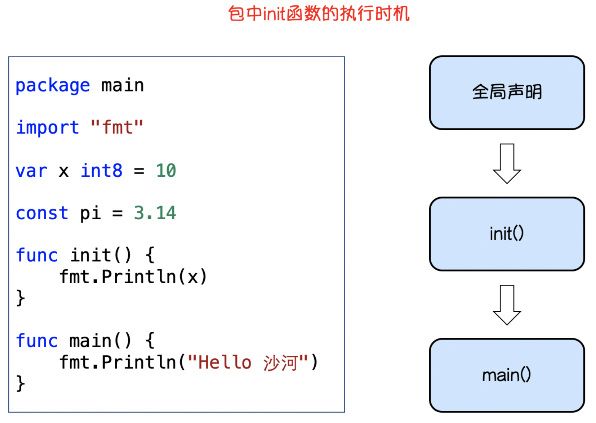

#### 第五天课程

##### 5.1 复习

结构体

~~~go
type person struct{
    name string
    age  int
}
~~~

构造函数

~~~go
type fb struct {
	x int
	y int
}
type person struct {
    name string
    age int
}
//构造函数
func newPerson(n string, i int) person {//person就是一种类型
    return person{
        name : n,
        age  : i,
    }
}
func main()  {
    //匿名结构体，多是临时使用
	var a = struct {
		x int
		y int
	}{10, 20} //后面是赋值
	fmt.Println(a) //{10, 20}

	var b = fb {
		x : 30,
		y : 40,
	}
	fmt.Println(b) //{30, 40}
    
    var p1 person
    p1.name = "chenglh"
    p1.age = 19
    //var p1 = person{"chenglh",19}
    fmt.Printf("%#v", p1) //main.person{name:"chenglh", age:19}
    
    p2 := newPerson("nzha", 25) //通过构造函数调用
}
~~~

方法和接收者

~~~go
type person struct {
    name string
    age int
}

//1、对象接收者
//只有person类型才能调用
func (p person) dream(str string) {
    fmt.Printf("%s的梦想是%s", p.name, str)
}
//2、指针接收者，实际使用建议，统一使用同一类型，如指针接收者
func (p *person) nextYear() {
    p.age++ 
}

func main() {
    var p2 = person{"chenglh",19}
    p2.dream("学好Go语言")
    p2.nextYear() //结构体是值类型，修改值需要使用指针
}
~~~

结构体嵌套

结构体匿名字段

JSON序列化与反序列化

##### 5.2 作业

##### 5.3 接口(interface)

###### 5.3.1 接口介绍

**接口(interface)是一种类型，一种抽象的类型，即是特殊的类型，**它规定了变量有哪些方法。

接口（interface）是一组函数method的集合，Golang中的接口不能包含任何变量。

接口定义了一个对象的行为规范，只定义规范不实现。

###### 5.3.2 接口定义

~~~go
type 接口名 interface {
    方法名1(参数1...)(返回值1....)
    方法名2(参数2...)(返回值2....)
    ......
}
~~~

**其中**

- **接口名**：使用type将接口定义为自定义的类型名。Go语言的接口在命名时，一般会在单词后面添加er，如有写操作的接口叫Writer，有字符串功能的接口叫Stringer等，接口名最好突出该接口的类型含义。
- **方法名**：当方法名首字母是大写且这个接口类型名首字母也是大写时，这个方法可以被接口所在的包（package）之外的代码访问。
- **参数列表、返回值列表**：参数列表和返回值列表中的参数变量名是可以省略

###### 5.3.3 接口的实现

举例：实现一个Usber接口

~~~go
type Usber interface { //加上 er 表示是接口类型
    start()
    stop()
}
~~~

如果接口里面有方法的话，必须要通过**结构体或自定义类型实现**这个接口。

~~~go
//手机结构体, 手机要实现usb接口，必须要实现usb接口中所有的方法
type Phone struct {
    Name string
}
func (p Phone) start() {
    fmt.Println(p.Name, "启动")
}
func (p Phone) stop() {
    fmt.Println(p.Name, "关机")
}

//照相机结构体
type Camera struct {
    Name string
}
func (c Camera) start() {
    fmt.Println(c.Name, "启动")
}
func (c Camera) stop() {
    fmt.Println(c.Name, "关机")
}
func (c Camera) update() {
    fmt.Println(c.Name, "更新")
}
~~~

一个变量如果实现了接口中规定的所有方法，那么这个变量就实现了这个接口，可以称这个接口类型的变量。

即如下例子：**接口的实例化**

~~~go
func main() {
		//普通结构体的实现
		p1 := Phone{
				Name: "华为手机",
		}
		p1.start()
		p1.stop()
  	p1.update() //结构体中的方法函数

		p2 := Phone{
				Name: "苹果手机",
		}
		var p Usber = p2  //表示手机实现了Usber的方法
		p.start()
		p.stop()
		//p.update() //错误用法，p.update undefined (type Usber has no field or method update)
		//这样是实现不了的，只能通过  p2.update()实现
		p2.update()	//结构体中的方法函数，非接口函数
}
~~~

电脑结构体实现Usber接口类

~~~go
//定义电脑的结构体
type Computer struct {}

//电脑实现接口类型
func (c Computer) work(usber Usber) {//参数必须是 接口类型，如果这个参数 没有实现到接口所有方法，会报错
		usber.start()
		usber.stop()
}

func main() {
  	var computer = Computer{}
    phone := Phone{
				Name: "苹果手机",
		}
  	computer.work(phone)
}
~~~

###### 5.3.4 空接口定义

Golang中接口可以不定义任何方法，没有定义任何方法的接口就是空接口。空接口表示没有任何约束，因此任何类型变量都可以实现空接口。

空接口在实际项目中用的非常多，用空接口可以表示任意数据类型。

定义格式：

~~~go
type 接口名字  interface{}

//空接口，表示没有任何约束 任意的类型都可以实现空接口
~~~

任意类型实现空接口

~~~go
type A interface{}

func main() {
		//测试任何类型都可以实现空接口
		var a A
  
    //var b interface{}  【定义在函数里的空接口】

		//string
		var Name = "chenglh"
		a = Name
		fmt.Printf("字符串的值：%v ,类型：%T\n", a, a)
  	//字符串的值：chenglh ,类型：string

		//int
		var num = 10
		a = num
		fmt.Printf("整型的值：%v ,类型：%T\n", a, a)
  	//整型的值：10 ,类型：int

		//bool
		var flag bool = true
		a = flag
		fmt.Printf("bool的值：%v ,类型：%T\n", a, a)
  	//bool的值：true ,类型：bool
}
~~~

###### 5.3.5 空接口的使用

**1、空接口作为函数的参数**

~~~go
func show( a interface{} ) {
    //fmt.Printf("type:%T value:%v\n" ,a ,a)
}

show(20)
show("this string")
show([]int{1,2,3}) //切片
~~~

**2、map的值实现空接口**

使用空接口实现可以保存任意值的字典。

~~~go
//空接口作为 map值
var student = make(map[string]interface{})

student["name"]    = "chenglh"
student["age"]     = 19
student["married"] = false
~~~

**3、切片实现空接口**

之前slice切片只能声明一种类型的值

~~~go
var slice = []interface{}{"chenglh", 18, true, 8.98}
~~~

举个例子：

~~~go
//空接口实现切片任意类型
var city = []string{"上海","北京","广州"}
fmt.Printf("type:%T  value:%#v\n", city, city)

var info = []interface{}{"广东", true, 20}
fmt.Printf("type:%T  value:%#v\n", info, info)
~~~

###### 5.3.6 类型断言

一个接口的值（简称接口值）是由一个具体类型和具体类型的值两部分组成的。这两部分分别称为接口的动态类型和动态值。

如果我们想要判断空接口中值的类型，那么这个时候就可以使用类型断言，其语法格式：

~~~go
x.(T)
~~~

其中：

- X：表示类型为interface{}的变量
- T：表示断言x可能是的类型

该语法返回两个参数，第一个参数是x转化为T类型后的变量，第二个值是一个布尔值，若为true则表示断言成功，false则表示断言失败

~~~go
func main() {
    var a interface{}
    a = "chenglh"
    val, ok := a.(string)
    if ok {
		fmt.Println("a就是字符串")
	} else {
		fmt.Println(val,"断言失败")
	}
}
~~~

**实现功能**：定义一个函数，判断传入不同的类型参数进行对应的操作处理

~~~go
func print1(x interface{}) {
	if _,ok := x.(string); ok {
		fmt.Println("传入的是字符串参数")
	} else if _,ok := x.(int); ok {
		fmt.Println("传入的是整型参数")
	} else if _,ok := x.(float64); ok {
		fmt.Println("传入的是浮点型参数")
	} else if _,ok := x.(bool); ok {
		fmt.Println("传入的是布尔型参数")
	} else {
		fmt.Println("找不到类型")
	}
}

func print2(x interface{}) {
	switch x.(type) {
		case string:
			fmt.Println("传入的是字符串参数")
		case int:
			fmt.Println("传入的是整型参数")
		case float64:
			fmt.Println("传入的是浮点型参数")
		case bool:
			fmt.Println("传入的是布尔型参数")
		default:
			fmt.Println("找不到类型")
	}
}

func main() {
	//需求：定义一个函数，判断传入不同类型的参数进行相对应的操作

	//方法一：if ... else if ...
	print1("chenglh")
	print1(120)
	print1(true)
	print1(12.9)

	//方法二：switch x.(type)结合使用
	print2("chenglh")
	print2(120)
	print2(true)
	print2(12.9)
}
~~~

**实现结构体断言**

~~~go
//结构体类型断言

//Usb接口
type Usber interface {
	start()
	stop()
}

//电脑结构体
type Computer struct {}

//电脑实现Usb接口
func (c Computer) work(usber Usber) {
	//在这里断言，是手机还是照相机
	if _,ok := usber.(Phone); ok {
		fmt.Println("请打开手机电源键")
		usber.start()
	} else if _,ok := usber.(Camera); ok {
		fmt.Println("请打开照相机电源键")
		usber.stop()
	}

	//usber.start()
	//usber.stop()
}

//手机
type Phone struct {
	Name string
}
func (p Phone) start() {
	fmt.Println(p.Name, " 已经启动")
}
func (p Phone) stop() {
	fmt.Println(p.Name, " 正在关机")
}

//照相机
type Camera struct {
	Name string
}
func (c Camera) start() {
	fmt.Println(c.Name, " 已经启动")
}
func (c Camera) stop() {
	fmt.Println(c.Name, " 正在关机")
}

func main() {
	//需求：电脑的usb接口，断言是：iphone 还是 照相机 接入实现
	var phone = Phone{
		Name: "华为手机",
	}
	var computer Computer
	computer.work(phone) //华为手机  已经启动

	var camera = Camera{
		Name: "佳能相机",
	}
	computer.work(camera)//佳能相机  正在关机
}
~~~

###### 5.3.7 方法与接收者

如果结构体中的**方法是值接收者**，那么实例化后的结构体**值类型**和结构体**指针类型**都可以赋值给接口变量。

**值接收者与指针类型接收者区别：**

~~~go
//如果结构体中的方法是值接收者，那么实例化后的结构体"值类型"和结构体"指针类型"都可以赋值给接口变量。

type Usber interface {
	start()
	stop()
}

//值接收者，参数可以值接收者也可以指针类型
type Phone struct {
	Name string
}
func (p Phone) start() {
	fmt.Println(p.Name, " 正在开机")
}
func (p Phone) stop() {
	fmt.Println(p.Name, " 正在关机")
}

//指针接收者
type Cameric struct {
	Name string
}
func (c *Cameric) start() {
	fmt.Println(c.Name, " 正在开机")
}
func (c *Cameric) stop() {
	fmt.Println(c.Name, " 正在关机")
}

func main() {
    //var p = Phone{  //值接收者中的方法参数，1、可以为值类型
	var p = &Phone{   //也可以2、指针类型
		Name: "华为手机",
	}
	var p1 Usber = p
	p1.start()
	p1.stop()

	var c = &Cameric{ //如果是指针类型接收者，必须要传递指针类型，否则编译错误
		Name: "佳能相机",
	}
	var p2 Usber = c
	p2.start()
	p2.stop()
}
~~~

###### 5.3.8 结构体实现多接口

~~~go
//结构体实现多个接口

//需求：实现结构体1中的set方法 和 实现结构体2中的 get方法

type Aminaler1 interface {
	SetName(string)
}
type Aminaler2 interface {
	GetName() string
}

type Dog struct {
	Name string
}

func (d *Dog) SetName(name string) {
	d.Name = name
}
func (d Dog) GetName() string {
	return d.Name
}

func main()  {
	var d = &Dog{
		Name: "",
	}
	var dog1 Aminaler1 = d
	var dog2 Aminaler2 = d
	dog1.SetName("花花")
	fmt.Println(dog2.GetName())
}
~~~

###### 5.3.9 嵌套接口

~~~go
//嵌套接口
type A interface {
	SetName(string)
}
type B interface {
	GetName()string
}
type Aminaler interface { //嵌套两个接口
	A
	B
}

type Dog struct {
	Name string
}
func (d *Dog) SetName(name string) {
	d.Name = name
}
func (d Dog) GetName() string {
	return d.Name
}

func main() {
	var dog = &Dog{
		Name: "",
	}
	var d1 Aminaler = dog
	d1.SetName("阿奇")
	ret := d1.GetName()
	fmt.Println(ret)
}
~~~

###### 5.3.10 空接口与断言细节

前情提要

~~~go
type Address struct {
	Province string
	City	 string
	Dist	 string
}

func main() {
	var address = Address{
		Province: "广东省",
		City: "广州市",
		Dist: "天河区",
	}
	var hobby = []string{"吃饭","睡觉","游戏"}
	fmt.Println(address.Province) //广东省
	fmt.Println(hobby[2]) //游戏

	var userInfo = make(map[string]interface{})
	userInfo["userName"] = "chenglh"
	userInfo["age"] = 19
	userInfo["hobby"] = []string{"吃饭","睡觉","游戏"}
	userInfo["address"] = address

	fmt.Printf("%#v\n",userInfo)
	//以下的写法在空接口中是编译出错的
	//fmt.Println(userInfo["hobby"][2]) //type interface {} does not support indexing
	//fmt.Println(userInfo["address"].Province) //type interface {} is interface with no methods
}
~~~

解决办法

~~~go
	//使用空接口与类型断言
	var userInfo = make(map[string]interface{})
	userInfo["userName"] = "chenglh"
	userInfo["age"] = 19
	userInfo["hobby"] = []string{"吃饭","睡觉","游戏"}
	userInfo["address"] = address

	//类型断言
	if hobbyVal,ok := userInfo["hobby"].([]string); ok {
		fmt.Println(hobbyVal[0], hobbyVal[1], hobbyVal[2])
	}
	if addressVal,ok := userInfo["address"].(Address); ok {
		fmt.Println(addressVal.Province, addressVal.City)
	}
~~~

其他知识：

~~~go
type animal interface{
    move()
    eat(string) //eat(food string)
}
type cat struct {
    name string
    feet int8
}
func (c cat)move() { fmt.Println("走猫步！") }
func (c cat)eat(food string) { fmt.Printf("猫吃%s！\n", food) }

type chicken struct {
    feet int8
}
func (c chicken)move() { fmt.Println("鸡动！") }
func (c chicken)eat(food string) { fmt.Printf("鸡吃饲料！\n", food) }

func main() {
    var a1 animal //定义一个animal接口类型的变量
    
    bc := cat{//定义一个cat类型的变量bc
        name:"淘气"
        feet:4
    }
    a1 = bc  //接口变量分为：类型和值两部分
    fmt.Println(a1)
    fmt.Printf("%T", a1)
    a1.eat("小黄鱼")
    
    kfc := chicken{
        feet:2,
    }
    a1 = kfc
    fmt.Printf("%T", a1)
}
~~~

举个例子

~~~go
type cat struct {}
type dog struct {}

func (c cat)speak() { fmt.Println("喵喵喵~") }
func (d dog)speak() { fmt.Println("汪汪汪~") }

func hitta(x) {//传参：x dog 或 x cat；x需要具体类型
    x.speak() //挨打了就要叫
}
func main() {
    var c1 cat
    var d1 dog
    hitta(c1)
    hitta(d1)
}
~~~

改造代码

~~~go
type speaker interface{
    speak() //只要实现了speak方法的变量都是speaker类型
}
type cat struct {}
type dog struct {}
func (c cat)speak() { fmt.Println("喵喵喵~") }
func (d dog)speak() { fmt.Println("汪汪汪~") }

func hitta(x speaker) {
    x.speak() //挨打了就要叫
}
func main() {
    var c1 cat
    var d1 dog
    hitta(c1)
    hitta(d1)
}
~~~

再举例子

~~~go
type car interace{
    run()
}
type falali struct {
    brand string
}
type baoshijie struct {
    brand string
}
func (f falali)run() { fmt.Printf("%s速度70迈~\n", f.brand) }
func (b baoshijie)run() { fmt.Printf("%s速度100迈~\n", b.brand) }

func drive(c car) {
    c.run()
}
func main() {
    var f1 = falali{brand:"法拉利",}
    var b1 = baoshijie(brand:"保时捷",)
    drive(f1)
    drive(b1)
}
//不同数据库，实现连接和增删查改等操作
~~~

##### 5.4 Go包(package)

###### 5.4.1 Go包介绍

包(package)是多个Go源码的集合，是一种高级的代码复用方案，go也为我们提供了很多内置包，如fmt、os、io等。

###### 5.4.2 定义包

~~~go
package 包名
~~~

注意：一个包下名可以有好多的 .go文件，但是go文件里的函数名不能重名。

###### 5.4.3 可见性

如果想在一个包中引用另外一个包里的标识符(如变量、常量、类型、函数等)，该标识符必须是对外可见的(public)

在go语言中只需要将**标识符的首字母大写**即可对外可见。

例子说明：

~~~go
var a = 100 //首字母小写，包外不可见
const Mode = 1 //包外可见，可用

type person struct { //包外不可用
	name string
}

func Sum(x, y int) int {//包外可用
	return x + y
}

func age() {//包外不可用
	var Age = 18 //局部变量，函数外、包外不可用，只能在当前函数内使用
	fmt.Println(Age)
}
~~~

结构体中的字段名和接口中的方法名如果首字母都是大写，外部包可以访问这些字段和方法。例如：

~~~go
type Student struct {
	Name  string //可在包外访问的方法
	class string //仅限包内访问的字段
}

type Payer interface {
	init() //仅限包内访问的方法
	Pay()  //可在包外访问的方法
}
~~~

###### 5.4.4 包的导入

~~~go
import "包的路径"
~~~

- import导入语句通常放在文件开头包声明语句的下面。
- 导入的包名需要使用双引号包裹起来。
- 包名是从$GOPATH/src/后开始计算的，使用/进行路径分隔。
- Go语言中禁止循环导入包。

> 单行导入

~~~go
import "包1"
import "包2"
~~~

> 多行导入

~~~go
import (
    "包1"
    "包2"
)
~~~

**fmt包知识要点**

~~~go
/** Print Println的区别 */
fmt.Print("A")
fmt.Print("B")
fmt.Print("C")
// ABC  输出是连在一起

fmt.Println("A")
fmt.Println("B")
fmt.Println("C")
// 每个字母占一行

fmt.Print("A"， "B", "C")
// ABC 输出是连在一起的

fmt.Println("A", "B", "C")
// A B C 一次性输出多个字符串时，Println输出是有一个空格的

/** Printf() 格式化输出 */
fmt.Printf(a)
~~~

**Printf()函数总结**

~~~go
func main()  {
		num := 100
		fmt.Printf("%T\n", num) //查看类型    int
		fmt.Printf("%v\n", num) //万能输出值	 100
  
		fmt.Printf("%b\n", num) //二进制	  1100100
		fmt.Printf("%o\n", num) //八进制	  144
		fmt.Printf("%d\n", num) //十进制	  100
		fmt.Printf("%x\n", num) //十六进制  64
    
  	number := 100.98
  	fmt.Printf("%T，%f\n", number, number) //%f输出10进制的浮点数,(这里float64，100.980000)
    fmt.Printf("%T，%.2f\n", number, number)//只保留两位小数点

		name := "chenglh"
		fmt.Printf("%s\n", name)  //字符串输出  chenglh
		fmt.Printf("%v\n", name)  //万能输出值  chenglh
	  fmt.Printf("%#v\n", name) //"结果串"会自动加上双引号 "chenglh"
    
  	//%c 输出单个字符
  	n1 := '程'
		n2 := 'A'
		fmt.Printf("%c\n",n1) //如果不格式化，显示ASCII码
		fmt.Printf("%c\n",n2)
  
  	age := 18
  	nickname = "chenglh"
  	fmt.Printf("%T\n", &age)      // *int    返回int类型的指针
		fmt.Printf("%T\n", &nickname) // *string 返回string类型的指针
}
~~~

##### 5.5 文件操作

###### 5.5.1 文件打开关闭

> os.Open() 和 file.Close()

~~~go
func main() {
	//打开文件
	file,err := os.Open("./main.go") //*file,err
	if err != nil {
		fmt.Println("open file failed!, err:", err)
		return
	}
	//关闭文件
	file.Close()
}
~~~

###### 5.5.2 按指定字节读取文件

>  file.Read()

~~~go
func (f *File) Read(b []byte) (n int, err error)
~~~

函数接收一个字节切片，返回读取的字节数和可能的具体错误，读到文件末尾会返回 `0` 和 `io.EOF`

~~~go
func main() {
	file,err := os.Open("./main.go")
	if err != nil {
		fmt.Println("打开文件错误")
		return
	}
	defer file.Close()

	var fileContext []byte
	var tmpStr = make([]byte, 128)
	for {
		n,err := file.Read(tmpStr) //按字节读取内容
		if err == io.EOF {
			break
		}
		if err != nil {
			fmt.Println("读取文件错误")
			return
		}
		fileContext = append(fileContext, tmpStr[:n]...)
	}

	fmt.Println(string(fileContext))
}
~~~

###### 5.5.3 按行读取文件

> bufio读取文件

~~~go
reader := bufio.NewReader(file)
line, err := reader.ReadString('\n') //注意是字符
~~~

代码如下：

~~~go
//一行行读取文件

func main() {
	file,err := os.Open("./main.go")
	if err != nil {
		fmt.Println("打开文件出错")
		return
	}
	defer file.Close()

	var fileContext []byte
	reader := bufio.NewReader(file)
	for {
		line, err := reader.ReadString('\n') // 注意是字符
		if err == io.EOF {
			break
		}
		if err != nil {
			fmt.Println("文件读取错误")
			return
		}
		fileContext = append(fileContext,line[:]...)
	}
	fmt.Println(string(fileContext))
}
~~~

###### 5.5.4 整个读取文件

> ioutil.ReadFile()

**ioutil读取整个文件**

`io/ioutil`包的`ReadFile`方法能够读取完整的文件，只需要将文件名作为参数传入。

~~~go
func main()  {
	contents,err := ioutil.ReadFile("./main.go")
	if err != nil {
		fmt.Println("read file railed, err:", err)
		return
	}
	fmt.Println(string(contents))
}
~~~

###### 5.5.2 文件写操作

定义格式：

~~~go
func OpenFile(name string, flag int, perm FileMode) (*File, error) {
	...
}
//参数1：文件名；参数2：打开文件的模式；参数3：文件权限 一个八进制数。r（读）04，w（写）02，x（执行）01。
~~~

**文件打开模式：**

| 模式        |   含义   |
| :---------- | :------: |
| os.O_WRONLY |   只写   |
| os.O_CREATE | 创建文件 |
| os.O_RDONLY |   只读   |
| os.O_RDWR   |   读写   |
| os.O_TRUNC  |   清空   |
| os.O_APPEND |   追加   |

> Write、WriteString

~~~go
func main()  {
	file,err := os.OpenFile("log.txt",os.O_CREATE|os.O_TRUNC|os.O_WRONLY, 0666)
	if err != nil {
		fmt.Println("open file failed, err:", err)
		return
	}
	defer file.Close()

	str := "天若有情\n"
	file.Write([]byte(str))    //通过字节写进去
	file.WriteString("人间正道")//通过字符串写进去
}
~~~

> Bufio.NewWriter

~~~go
func main()  {
	file,err := os.OpenFile("log.txt", os.O_CREATE|os.O_TRUNC|os.O_WRONLY, 0666)
	if err != nil {
		fmt.Println("创建文件失败")
	}
	defer file.Close()

	writer := bufio.NewWriter(file)
	for i := 0; i < 10; i++ {
		writer.WriteString(fmt.Sprintf("this is line:%d\n", i))//将数据写入缓存
	}
	writer.Flush()//刷新缓冲区
}
~~~

> Ioutil.WriteFile

~~~go
func main()  {
	//一次性读取文件
	contents,error := ioutil.ReadFile("./main.go")
	if error != nil {
		fmt.Println("read file railed, err:", error)
		return
	}

	//一次性写入文件
	err := ioutil.WriteFile("log.txt", []byte(contents), 0666)
	if err != nil {
		fmt.Println("创建文件失败", err)
		return
	}
}
~~~

###### 5.5.3 复制文件

~~~go
// 自定义 CopyFile 拷贝文件函数
func CopyFile(dstName, srcName string) (written int64, err error) {
	// 以读方式打开源文件
	src, err := os.Open(srcName)
	if err != nil {
		fmt.Printf("open %s failed, err:%v.\n", srcName, err)
		return
	}
	defer src.Close()

	// 以写|创建的方式打开目标文件
	dst, err := os.OpenFile(dstName, os.O_WRONLY|os.O_CREATE, 0644)
	if err != nil {
		fmt.Printf("open %s failed, err:%v.\n", dstName, err)
		return
	}
	defer dst.Close()

	//调用io.Copy()拷贝内容
	return io.Copy(dst, src)
}

func main()  {
	_, err := CopyFile("dst.txt", "src.txt")
	if err != nil {
		fmt.Println("copy file failed, err:", err)
		return
	}
	fmt.Println("copy done!")
}
~~~

###### 5.5.4 模拟cat命令

~~~go
func cat(r *bufio.Reader)  {
	for {
		buf, err := r.ReadBytes('\n') //注意是字符
		if err == io.EOF {
			break
		}
		fmt.Fprintf(os.Stdout, "%s", buf)
	}
}

func main()  {
	flag.Parse() //解析命令行参数
	if flag.NArg() == 0 {
		cat(bufio.NewReader(os.Stdin))
	}

	for i := 0; i < flag.NArg(); i++ {
		f, err := os.Open(flag.Arg(i))
		if err != nil {
			fmt.Fprintf(os.Stdout, "reading from %s failed, err:%v\n", flag.Arg(i), err)
			continue
		}
		cat(bufio.NewReader(f))
	}
}
~~~

#### 第六天课程

###### 6.1 复习

###### 6.2 作业

##### 6.3 Go Mod包管理

包（package）是多个Go源码的集合，是一种高级的代码复用方案，Go语言为我们提供了很多内置包，如fmt、strconv、strings、sort、errors、time、encoding/json、os、io等。

> Golang中的包可以分为三种：1、系统内置包 2、自定义包 3、第三方包

###### 6.3.1 Go包管理工具go mod

在Golang1.11版本之前如果我们要自定义包的话必须把项目放在GOPATH目录。

Go1.11版本之后无需手动配置环境变量，使用go mod管理项目，也不需要非得把项目放到GOPATH指定目录下，你可以在你磁盘的任何位置新建一个项目，Go1.13以后可以彻底不要GOPATH了。 

###### 6.3.2 go mod init 初始化项目

实际项目开发中我们首先要在我们项目目录中用go mod命令生成一个go.mod文件管理我们项目的依赖。

> 项目初始化

~~~php
# cd /User/chenglh/go/src/
# mkdir www.chenglh.com				//创建项目
# cd www.chenglh.com

# go mod init www.chenglh.com	//初始化项目
# ls -l
go.mod
~~~

**golang开启mod后import报红解决**

解决方法：创建项目的时候不要选择go mod

解决方法：File > Preferences 勾选 Go Modules

###### 6.3.3 引入其它项目的包

**自定义包**

~~~go
package 包名
~~~

例子说明：

~~~go
//在www.chenglh.com/calc目录下创建 calc.go文件
package calc

func Add(x , y int) int { //全局变量
	  return x + y
}

func Sub(x , y int) int {
	  return x - y
}
~~~

**引入包**

~~~go
//单行导入
import 包名1
import 包名2

//多行导入
import (
		包名1
  	包名2
)
~~~

例子说明：

~~~go
package main

import (
	  "fmt"
	  "www.chenglh.com/calc"
)

func main() {
	  var x = 10
	  var y = 2

	  ret1 := calc.Add(x, y)
	  ret2 := calc.Sub(x, y)
	  fmt.Println(ret1, ret2)
}
~~~

###### 6.3.4 自定义包别名

~~~go
import 别名 "包的路径"
~~~

可以单行或多行引入包：

~~~go
import c "www.chenglh.com/calc"

//使用别名 c
c.Add(10, 2)
c.Sub(10, 2)
~~~

###### 6.3.5 匿名导入包

如果只希望导入包，而不使用包内部的数据时，可以使用匿名导入包。

~~~go
import _ "包的路径"
~~~

###### 6.3.6  init()初始化函数

> init()函数的介绍

在Go语言程序执行时导入包语句会自动触发包内部init()函数的调用。
需要注意的是：init()函数没有参数也没有返回值。init()函数在程序运行时自动被调用执行，不能在代码中主动调用它。

**包初始化执行的顺序**  如下图所示：

> init()函数执行顺序

Go语言包会从`main`包开始检查其导入的所有包，每个包中又可能导入了其他的包。Go编译器由此构建出一个树状的包引用关系，再根据引用顺序决定编译顺序，依次编译这些包的代码。

在运行时，被最后导入的包会最先初始化并调用其`init()`函数， 如下图示：

包管理搜索入口，类似composer

~~~go
https://pkg.go.dev
~~~

如下载精度修复包

~~~go
https://github.com/shopspring/decimal

//下载包放在路径go/pkg/mod/github.com/shopspring
~~~

> 方法1：go get 包全名 （全局）

~~~go
go get github.com/shopspring/decimal
~~~

> 方法2：go mod download （全局）

~~~go
go mod download
~~~

实际操作

~~~go
//第一步：在main.go文件中引入第三方包
//第二步：在控制台 > go mod download
//       然后执行 > go run main.go
//程序会自动下载包到全局文件夹下

import "github.com/tidwall/gjson"

func main() {
		const json = `{"name":{"first":"Janet","last":"Prichard"},"age":47}`
		value := gjson.Get(json, "name.last")
		fmt.Println(value)
}
~~~

> 方法3：go mod vendor 将依赖复制到当前项目的vendor（本项目）

~~~go
go mod vendor
~~~

把当前项目中所用到的第三方包从全局，复制到当前项目路径下。

结合命令行**go run main.go**，会自动创建 vendor目录，完成拷贝。

 **go mod常见命令**

- go download    下载依赖的module到本地cache
- go edit               编辑go.mod文件
- go graph           打印模块依赖图
- go init                在当前文件夹下初始化一个新的module，创建go.mod文件
- tidy                    增加丢失的module，去掉未使用的module，**即整理go.mod文件**
- vendor              将依赖复制到vendor下
- verify                 校验依赖，检查下载的第三方库有没有本地修改，如果有修改，则会返回非0，否则校验成功

##### 6.4 time时间包

**time包提供了时间的显示和测量用的函数，日历的计算采用的是公历。**

###### 6.4.1 日期时间对象

~~~go
timeObj := time.Now() //时间对象

fmt.Printf("%T\n", timeObj) //类型：time.Time
fmt.Printf("%v\n", timeObj) //2020-08-12 10:54:19.2226132 +0800 CST m=+0.004000001

year  := timeObj.Year()
month := timeObj.Month() //默认是英文的月份,可以使用int强制转换数值
day   := timeObj.Day()
hour  := timeObj.Hour()
minute:= timeObj.Minute()
second:= timeObj.Second()

fmt.Printf("%d-%02d-%02d %02d:%02d:%02d", year, month, day, hour, minute, second);
//2020-08-12 11:06:57
//注意： %02d 2表示宽度，如果整数不够人列，就补上0

//12小时制  03
date1 := timeObj.Format("2006-01-02 03:04:05") //格式化的模板，可自定义
fmt.Println(date1)

//24小时制  15
date := timeObj.Format("2006-01-02 15:04:05")
fmt.Println(date)
~~~

###### 6.4.2 时间戳

~~~go
//10位数的时间戳是以 秒   为单位；
//13位数的时间戳是以 毫秒 为单位；
//19位数的时间戳是以 纳秒 为单位；

timeObj    := time.Now() 			   //时间对象
unixtime   := timeObj.Unix() 		 //获取当前时间戳
unixNatime := timeObj.UnixNano() //纳秒时间戳
~~~

###### 6.4.3 常用时间操作

~~~go
//获取当前时间戳
time.Now().Unix()								 //时间戳
time.Now().UnixNano() / 1e6  		 //毫秒，作了运算
time.Now().UnixNano()						 //纳秒
time.Now().UnixNano() / 1e9	  	 //纳秒转成时间戳

//获取当前日期时间
time.Now().Format("2006-01-02 15:04:05")
time.Now().Format("2006-01-02")
time.Now().Format("2006") //年
time.Now().Format("01")		//月
time.Now().Format("02")		//日
time.Now().Format("15")		//时
time.Now().Format("04")		//分
time.Now().Format("05")		//秒

year   := time.Now().Year()
month  := time.Now().Month() //得到的是英文的，int强制转换成数值
day    := time.Now().Day()
hour   := time.Now().Hour()
minute := time.Now().Minute()
second := time.Now().Second()
~~~

###### 6.4.4 时间戳转日期

~~~go
//时间戳转换日期格式化
var timestamp = 1598844373
ret := time.Unix(int64(timestamp), 0).Format("2006-01-02 15:04:05")//可以单单格式化年/月/日/时/分/秒或其他组合

// 时间戳转换年月日时分秒（一个参数是秒，另一个参数是毫秒）
var timeObj = time.Unix(1598844373, 0)
var timeStr = timeObj.Format("2006-01-02 15:04:05")
fmt.Println(timeStr)
~~~

###### 6.4.5 日期转时间戳

~~~go
//日期格式化成时间戳
date := "2020-08-31 13:33:42"
temp := "2006-01-02 15:04:05"
timeObj,_ := time.ParseInLocation(temp, date, time.Local) //temp与date的格式必须要一致,可以直接年月日
fmt.Println(timeObj.Unix())
~~~

###### 6.4.6 时间格式化例子

~~~go
fmt.Println(time.Now().Format("2006-01-02 15:04:05"))// 24小时制
fmt.Println(time.Now().Format("2006-01-02 03:04:05"))// 12小时制
fmt.Println(time.Now().Format("2006/01/02 15:04"))
fmt.Println(time.Now().Format("15:04 2006/01/02"))
fmt.Println(time.Now().Format("2006/01/02"))
~~~

###### 6.4.7 时间包中常量

~~~go
type Duration int64 //自定义类型

const (
	Nanosecond  Duration = 1 //类自定义 Duration = int64别名
	Microsecond			 = 1000 * Nanosecond
	Millisecond			 = 1000 * Microsecond
	Second				 = 1000 * Millisecond
	Minute				 = 60 * Second
	Hour				 = 60 * Minute
)
~~~

###### 6.4.8 时间操作函数

> Add

~~~go
//时间 + 时间间隔（如30分钟、1小时后）
timeObj := time.Now()
later := timeOjb.Add(time.Hour * 2) //返回的还是时间对象

//7天后
later := time.Now().Add(7*24*time.Hour)
fmt.Println(later.Format("2006-01-02 15:04:05"))
~~~

> Sub

~~~go
//时间作差
t1 := "2020-08-31 00:00:00"
t2 := "2020-08-31 23:30:10"

a,_ := time.Parse(tmp, t1)
b,_ := time.Parse(tmp, t2)
ret := b.Sub(a);
fmt.Printf("val:%v，T:%T\n",ret,ret)	//val:23h30m10s，T:time.Duration
~~~

> Before

~~~go
t1 := "2020-08-31 00:00:00"
tmp:= "2006-01-02 15:04:05"

a,_ := time.Parse(tmp, t1)
fmt.Println(time.Now().Before(a)) //true
~~~

###### 6.4.9 定时器

~~~go
//方法一
//var ticker = time.NewTicker(time.Second)
//for tt := range ticker.C {
//	fmt.Println("定时器",tt)
//}

//方法二
//for {
//	fmt.Println("计划任务")
//	time.Sleep(time.Second)
//}
~~~

**终止定时器**

~~~go
//清理定时器
var timeNum = 5
var ticker = time.NewTicker(time.Second)
for tt := range ticker.C {
	timeNum --
	if timeNum < 0 {
		ticker.Stop() //关闭定时器 ticker.Stop() 终止定时器
		break
	}
	fmt.Println("执行任务：", tt)
}
~~~

##### 6.5 日志需求

作业一：

~~~go
now := time.Now()

// 加载时区
loc, err := time.LoadLocation("Asia/Shanghai")
if err != nil {
	fmt.Println(err)
	return
}
// 按照指定时区和指定格式解析字符串时间
timeObj, err := time.ParseInLocation("2006/01/02 15:04:05", "2019/08/04 14:15:20", loc)
if err != nil {
	fmt.Println(err)
	return
}
fmt.Println(timeObj)

//编写程序统计一段代码的执行耗时时间，单位精确到微秒
fmt.Println(timeObj.Sub(now))
~~~

