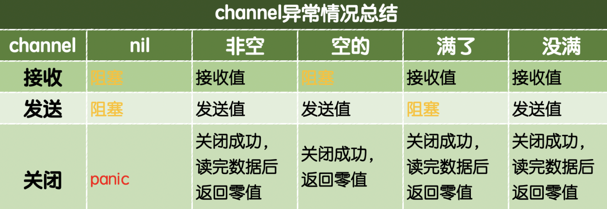

#### 第七天课程

###### 7.1 复习


###### 7.2 作业


##### 7.3 反射

###### 7.3.1 反射介绍

反射是指在程序运行期对程序本身进行访问和修改的能力。

支持反射的语言可以在程序编译期将变量的反射信息，如**字段名称、类型信息、结构体信息等**整合到可执行文件中，并给程序提供接口访问反射信息，这样就可以在程序运行期获取类型的反射信息，并且有能力修改它们。

Go程序在运行期使用**reflect包**访问程序的反射信息。


反射能实现的功能：

- 反射可以在程序运行期间**动态的获取变量**的各种信息，比如变量的类型类别
- 如果是结构体，通过反射还可以获取结构体本身的信息，比如结构体的字段、结构体的方法
- 通过反射，可以修改变量的值，可以调用关联的方法


Go语言中的**变量**是分为两部分的：

- **类型信息**：预先定义好的元信息。
- **值信息**    ：程序运行过程中可动态变化的。


1、反射的引子，空接口可以存储任意类型的变量，那我们如何知道空接口入保存的数据类型是什么？

- 可以使用类型断言
- 可以使用反射实现，却获取一个变量的类型信息和值信息

2、把结构体序列化成json字符串，自定义结构体Tag标签的时候就用到反射


###### 7.3.2 reflect包

reflect包提供了**`reflect.TypeOf`** 和 **`reflect.ValueOf`**两个函数来获取任意对象的**类型**和**值**。


在`reflect`包中定义的Kind类型如下：

~~~go
type Kind uint
const (
	Invalid Kind = iota	//非法类型
	Bool		// 布尔型
	Int			// 有符号整型
	Int8		// 有符号8位整型
	Int16		// 有符号16位整型
	Int32		// 有符号32位整型
	Int64		// 有符号64位整型
	Uint		// 无符号整型
	Uint8
	Uint16
	Uint32
	Uint64
	Uintptr		//指针
	Float32		//单精度浮点数
	Float64		//双精度浮点数
	Complex64	//64位复数类型
	Complex128	//128位复数类型
	Array		//数组
	Chan		//通道
	Func		//函数
	Interface	//接口
	Map			//映射
	Ptr			//指针
	Slice		//切片
	String
	Struct
	UnsafePointer//底层指针
)
~~~


> reflect.TypeOf   通过反射获取类型

~~~go
//反射获取任意变量的类型

type myInt int
type Person struct {
	Name string
	Age  int
}

func reflectFn(x interface{})  {
	retObj := reflect.TypeOf(x) //返回的是一个对象
	//retObj.Name() 类型名称
	//retObj.Kind() 类型种类，即变量的底层类型
	fmt.Printf("类型：%v 类型名称：%v 类型种类：%v\n", retObj, retObj.Name(), retObj.Kind())
}

func main() {
	a := 10					//类型：int 类型名称：int 类型种类：int
	var b float64 = 23.4	//类型：float64 类型名称：float64 类型种类：float64
	var c float32 = 2.345	//类型：float32 类型名称：float32 类型种类：float32
	d := true				//类型：bool 类型名称：bool 类型种类：bool
	e := "golang"			//类型：string 类型名称：string 类型种类：string
	var f myInt = 10		//类型：main.myInt 类型名称：myInt 类型种类：int
	var g = Person{			//类型：main.Person 类型名称：Person 类型种类：struct
		Name:"chenglh",
		Age:20,
	}
	h := 100				//类型：*int   类型名称： 类型种类：ptr
	i := [3]int{1,2,3}		//类型：[3]int 类型名称： 类型种类：array
	j := []int{11,22,33}	//类型：[]int  类型名称： 类型种类：slice
    //Go语言的反射中像数组、切片、Map、指针等类型的变量，它们的.Name()都是返回空。
	reflectFn(a)
	reflectFn(b)
	reflectFn(c)
	reflectFn(d)
	reflectFn(e)
	reflectFn(f)
	reflectFn(g)
	reflectFn(&h)
	reflectFn(i)
	reflectFn(j)
}
~~~


> reflect.ValueOf  通过反射获取值

~~~go
func reflectVal(x interface{}) {
	//fmt.Println(x) 传入的值就是 10，但它是interface接口类型
	//ret := x + 20 //invalid operation: x + 20 (mismatched types interface {} and int)
	//fmt.Println(ret) 如果要实现类型相加，1、断言 2、反射

	//1、断言
	//b,_ := x.(int)
	//ret := b + 20
	//fmt.Println(ret)

	//2、反射
	//v := reflect.ValueOf(x) //获取到x原始值，types reflect.Value，当前对象下各种对应的变量类型得到原始值
	//ret := v.Int() + 20
	//fmt.Println(ret)

    //通过反射来获取变量的原始值
	//v.Kind() 获取种类
	v := reflect.ValueOf(x)
	kind := v.Kind()
	switch kind {
		case reflect.Int://常量值
			fmt.Printf("int类型的原始值%v\n ", v.Int()+10)
		case reflect.Float32:
			fmt.Printf("float32类型的原始值%v\n ", v.Float()+10.32)
		case reflect.Float64:
			fmt.Printf("float64类型的原始值%v\n ", v.Float()+10.64)
		case reflect.String:
			fmt.Printf("string类型的原始值%v\n ", v.String())
		default:
			fmt.Printf("没匹配到类型\n")
	}
}

func main() {
	var num float32 = 10
	reflectVal(num)
}
~~~


常见`reflect.Value`类型提供的获取原始值的方法如下：

| 方法                     | 说明                                                         |
| :----------------------- | :----------------------------------------------------------- |
| Interface() interface {} | 将值以 interface{} 类型返回，可以通过类型断言转换为指定类型  |
| Int() int64              | 将值以 int 类型返回，所有有符号整型均可以此方式返回          |
| Uint() uint64            | 将值以 uint 类型返回，所有无符号整型均可以此方式返回         |
| Float() float64          | 将值以双精度（float64）类型返回，所有浮点数（float32、float64）均可以此方式返回 |
| Bool() bool              | 将值以 bool 类型返回                                         |
| Bytes() []bytes          | 将值以字节数组 []bytes 类型返回                              |
| String() string          | 将值以字符串类型返回                                         |


> 通过反射设置变量的值

想要在函数中通过反射修改变量的值，需要注意函数参数传递的是值拷贝，必须传递变量地址才能修改变量值。而反射中使用专有的`Elem()`方法来获取指针对应的值。


设置值：v.Elem().SetXxx()

~~~go
//修改值

//【变量值传递类型，修改的是副本值】
func reflectSetVal1(x interface{}) {
	//这里会报错
	//panic: reflect: reflect.flag.mustBeAssignable using unaddressable value
	//v := reflect.ValueOf(x)
	//if v.Kind() == reflect.Int {
	//	v.SetInt(2000)
	//}
}

func reflectSetVal2(x interface{}) {
	v := reflect.ValueOf(x)
	//fmt.Println(v.Elem().Kind(), v.Kind()) // int  ptr
	//if v.Elem().Kind() == reflect.Int {
	//	v.Elem().SetInt(2345)
	//}
	switch v.Elem().Kind() {
		case reflect.Int:
			v.Elem().SetInt(2345)
		case reflect.String:
			v.Elem().SetString("golang study")
		case reflect.Float64:
			v.Elem().SetFloat(123.456)
		default:
			fmt.Println("未添加的类型")
	}
}

func main() {
	var a = 100
	//reflectSetVal1(a)
	reflectSetVal2(&a)
	fmt.Println(a)

	var b = "hello golang"
	reflectSetVal2(&b)
	fmt.Println(b)

	var c float64 = 123.555
	reflectSetVal2(&c)
	fmt.Println(c)
}
~~~


###### 7.3.3 结构体反射属性和值


reflect.Type中与获取结构体成员相关的的方法如下表所示。

| 方法                                        | 说明                                      |
| ------------------------------------------- | ----------------------------------------- |
| Field(i int)StructField                     | 根据索引，返回索引对应的结构体字段的信息  |
| NumField() int                              | 返回结构体成员**字段数量**                |
| FieldByName(name string)(StructField, bool) | 根据给定字符串返回字符串的结构体字段信息  |
| FieldByIndex(index []int)StructField        | 多层成员访问时，根据[] int 提供的每个结构 |


> 获取结构体中的属性

~~~go
//结构体反射

//定义学生结构体
type Student struct {
	Name string `json:"name" init:"testvv"`
	Age  int      `json:"age"`
	Score float32 `json:"score"`
}

//结构体反射
func PrintStructField(s interface{})  {
	t := reflect.TypeOf(s)
	// 判断传递过来的是否是结构体
	if t.Kind() != reflect.Struct && t.Elem().Kind() != reflect.Struct {
		fmt.Println("请传入结构体类型!")
		return
	}

	//第一种方法：通过索引去查找
	// 通过类型变量里面的Field可以获取结构体的字段
	field0 := t.Field(0) // 获取第0个字段
	fmt.Printf("%#v\n", field0)
	fmt.Println("字段名称:", field0.Name)
	fmt.Println("字段类型:", field0.Type)
	fmt.Println("字段Tag:", field0.Tag.Get("json"))
    fmt.Println("字段Tag:", field0.Tag.Get("init"))

	//field1 := t.Field(1) // 获取第1个字段
	//fmt.Printf("%#v\n", field1)
	//fmt.Println("字段名称:", field1.Name)
	//fmt.Println("字段类型:", field1.Type)
	//fmt.Println("字段Tag:", field1.Tag.Get("json"))

	//第二种方法：通过名字查找
	// 通过类型变量里面的FieldByName可以获取结构体的字段中
	field1, ok := t.FieldByName("Age")
	if ok {
		fmt.Println("字段名称:", field1.Name)
		fmt.Println("字段类型:", field1.Type)
		fmt.Println("字段Tag:", field1.Tag)
	}

	// 通过类型变量里面的NumField获取该结构体有几个字段
	var fieldCount = t.NumField()
	fmt.Println("结构体有：", fieldCount, " 个属性")

	// 获取结构体属性对应的值
	v := reflect.ValueOf(s)
	nameValue := v.FieldByName("Name")
	fmt.Println("nameValue:", nameValue)
    fmt.Println("ScoreVal", v.FieldByName("Score"))
}
func main() {
	var studentInfo = Student{
		Name: "chenglh",
		Age: 20,
		Score: 634.01,
	}
	//fmt.Printf("studentInfo %#v\n", studentInfo)
	//studentInfo main.Student{Name:"chenglh", Age:20, Score:634.01}
	PrintStructField(studentInfo)
}
~~~


> 知识总结

```go
//获取结构体中的字段名称，类型，tag标签，结构体的字段数量 
//  t := reflect.TypeOf(s)
//    方法一：t.Field(0).Name/t.Field(0).Type/t.Field(0).Tag.Get("json")
//    方法二：field1,_ = t.FieldByName("Age")断言，field1.Name/field1.Type/field1.Tag.Get("json")
//获取结构体中的字段的值。 
//   v := reflect.ValueOf(s)
//       v.FieldByName("Name")
//       v.FieldByName("Score")
```


###### 7.3.4 结构体反射方法及调用

【这里的代码调试不成功】

~~~go
package main

import (
	"fmt"
	"reflect"
)

//结构体反射
//反射获取结构体中 方法及调用

//定义学生结构体
type Student struct {
	Name string   `json:"name"`
	Age  int      `json:"age"`
	Score int     `json:"score"`
}

func (s *Student)SetInfo(name string, age int, score int) {
	s.Name = name
	s.Age = age
	s.Score = score
	return
}

func (s Student)GetInfo()string {
	var str = fmt.Sprintf("姓名：%v 年龄：%v 成绩：%v", s.Name, s.Age, s.Score)
	return str
}

func (s Student)PrintStudent() {
	fmt.Println("打印学生")
}

// 打印执行方法
func PrintStructFn(s interface{}) {
	t := reflect.TypeOf(s)
	// 判断传递过来的是否是结构体
	if t.Kind() != reflect.Struct && t.Elem().Kind() != reflect.Struct {
		fmt.Println("请传入结构体类型!")
		return
	}
	// 通过类型变量里面的Method，可以获取结构体的方法
	method0 := t.Method(0)
	// 获取第一个方法， 这个是和ACSII相关
	fmt.Println(method0.Name)

	// 通过类型变量获取这个结构体有多少方法
	methodCount := t.NumMethod()
	fmt.Println("结构体拥有的方法个数：", methodCount)

	// 通过值变量 执行方法（注意需要使用值变量，并且要注意参数）
	v := reflect.ValueOf(s)
	// 通过值变量来获取参数
	v.MethodByName("GetInfo").Call(nil)

	//【执行失败】【执行失败】【执行失败】
	// 手动传参
	var params []reflect.Value
	params = append(params, reflect.ValueOf("张三"))
	params = append(params, reflect.ValueOf(23))
	params = append(params, reflect.ValueOf(99))
	// 执行setInfo方法
	v.MethodByName("SetInfo").Call(params)

	// 通过值变量来获取参数
	v.MethodByName("PrintStudent").Call(nil)
}

func main() {
	var studentInfo = Student{
		Name: "chenglh",
		Age: 20,
		Score: 98,
	}
	PrintStructFn(studentInfo)
}
~~~


反射是一个强大并富有表现力的工具，能让我们写出更灵活的代码。但是反射不应该被滥用，原因有以下三个。

1. 基于反射的代码是极其脆弱的，反射中的类型错误会在真正运行的时候才会引发panic，那很可能是在代码写完的很长时间之后。
2. 大量使用反射的代码通常难以理解。
3. 反射的性能低下，基于反射实现的代码通常比正常代码运行速度慢一到两个数量级。


##### 7.4 配置文件


##### 7.5 strconv内置包

> 包strconv主要实现对字符串和基本数据类型之间的转换。

基本数据类型包括：布尔、整型和浮点型等。


###### 7.5.1 字符串转整型

~~~go
str := "1000"
int64(str)

iNum := int32(97)
ret2 := string(i) //把当成asci编码和utf-8编码,转成字符一定不能这样写
fmt.Println(ret2) //字母a
~~~


> Atoi() 字符串转整数int类型

~~~go
func Atoi(s string) (i int, err error) //如果转不成功，返回错误,只能是“数值字符串”能才转成功
~~~


举个例子：

~~~go
str := "100000"
ret1,err := strconv.Atoi(str)
if err != nil {
  fmt.Println("解析出错") // 如传入：“1000程” 或 “10a00”
}
fmt.Printf("%#v , %T\n", ret1, ret1) // 100000  int
~~~


> Itoa() 整形转字符串

~~~go
func Itoa(i int) string
~~~


举个例子:

~~~go
str1 := 1000
ret2 := strconv.Itoa(str1)
fmt.Printf("%#v , %T\n", ret2, ret2) // "1000" string
~~~


C语言中没有string类型而是用字符数组(array)表示字符串，所以`Itoa`对很多C系的程序员很好理解。


###### 7.5.2 Sprintf函数

> Sprintf() 其他类型转换成字符串

~~~go
//Sprintf 使用时 int - %d ; float - %f ; bool - %t ; byte - %c  %2f两位小数

var i int = 20
var f float64 = 12.542
var t bool = true
var b byte = 'a'

str1 := fmt.Sprintf("%d", i)
fmt.Printf("值：%#v,类型：%T\n", str1, str1)

str2 := fmt.Sprintf("%f", f)
fmt.Printf("值：%#v,类型：%T\n", str2, str2)

str3 := fmt.Sprintf("%t", t)
fmt.Printf("值：%#v,类型：%T\n", str3, str3)

str4 := fmt.Sprintf("%c", b)
fmt.Printf("值：%#v,类型：%T\n", str4, str4)

/**
 * 值："20",类型：string
 * 值："12.542",类型：string
 * 值："true",类型：string
 * 值："a",类型：string
 */
~~~


###### 7.5.3 Parse系列函数

> Parse类函数用于转换字符串为给定类型的值：ParseBool()、ParseFloat()、ParseInt()、ParseUint()

举例说明：

~~~go
//字符串转换成其他类型
str        := "1000"
boolStr    := "true"
floatStr   := "3.14159"

ret1, _    := strconv.ParseInt(str, 10, 64)//Parse解析的意思，10进制；64位，而函数确实只返回int64
boolVal,_  := strconv.ParseBool(boolStr)	 //把字符串中解析出布尔类型
floatVal,_ := strconv.ParseFloat(floatStr, 64)//把字符串解析出浮点数

fmt.Printf("%#v , %T", ret1, ret1) // 1000 int
fmt.Printf("%#v , %T\n", boolVal, boolVal) // true bool
fmt.Printf("%#v , %T\n", floatVal, floatVal)// 3.14159  float64
~~~


注意点：区别sprintf和itoa

测试效率：

~~~go
//测试Sprintf 与  strconv 的效率
func main()  {
	startTime := time.Now()
	for iNum := 0; iNum < 10000; iNum++ {
		fmt.Sprintf("%v", iNum)
	}
	fmt.Println(time.Now().Sub(startTime)) // 874.956µs

	startTime1 := time.Now()
	for iNum := 0; iNum < 10000; iNum++ {
		strconv.Itoa(iNum)
	}
	fmt.Println(time.Now().Sub(startTime1)) //261.744µs
}
~~~

结论如下：

~~~
可见时间性能相差约3倍，Sprintf 性能差些可以预见，因为它接收的是 interface，需要进行反射等操作。
建议使用 strconv 包中的方法进行转换。
~~~


###### 7.5.4 Format系列函数

> Format()函数，将给定类型数据格式化为string类型数据的功能。FormatBool() 、FormatInt()、FormatUint()、FormatFloat()

~~~go
/**
 * func FormatBool(b bool) string
 *
 * func FormatInt(i int64, base int) string
 * base 必须在2到36之间，结果中会使用小写字母’a’到’z’表示大于10的数字
 *
 * func FormatUint(i uint64, base int) string
 *
 * func FormatFloat(f float64, fmt byte, prec, bitSize int) string
 * 参数1：传入要格式化的值；
 * 参数2："f" 正常格式;b 二进制；e 十进制指数；E 十进制指数；g (很大e格式)；G(很大的E格式)
 * 参数3：prec控制精度,对 f、e、E它表示小数点后的数字个数；对g、G 它控制总的数学个数。prec=-1则代表使用最少数量的、但又必需的 
 * 数字来表示f
 * 参数4：bitSize表示f的来源类型（32：float32、64：float64），会据此进行舍入。
 */

s1 := strconv.FormatBool(true) //"true"
s2 := strconv.FormatFloat(3.1415, 'E', -1, 64) // 3.1415E+00
s3 := strconv.FormatInt(-2, 16) //-2
s4 := strconv.FormatUint(2, 16) //2
~~~


##### 7.6 网络并发

###### 7.6.1 并发与并行

**并发**：同一时间段内执行多个任务(同两个人聊天)

**并行**：同一时刻执行多个任务 （两个人一起进门）


> 进程

进程（Process）就是程序在操作系统中的一次执行过程，是系统进行资源分配和调度的基本单位，进程是一个动态概念，是程序在执行过程中分配和管理资源的基本单位，每一个进程都有一个自己的地址空间。
一个进程至少有5种基本状态，它们是：**初始态，执行态，等待状态，就绪状态，终止状态**。


> 线程

线程是**进程的一个执行实例**，是程序执行的最小单元，它是比进程更小的能独立运行的基本单位
一个进程可以创建多个线程，同一个进程中多个线程可以并发执行 ，一个线程要运行的话，至少有一个进程


> 协程

可以理解为**用户级线程**，这是对内核透明的，也就是系统并不知道有协程的存在，是完全由用户自己的程序进行调度的。

Golang的一大特色就是从语言层面原生持协程，在函数或者方法前面加go关键字就可创建一个协程。可以说Golang中的协程就是goroutine。


**Golang中的多协程有点类似于Java中的多线程**

Golang中每个goroutine（协程）默认占用内存远比Java、C的线程少。


**Golang中协程（goroutine）以及主线程**
golang中的主线程：（可以理解为线程/也可以理解为进程），在一个Golang程序的主线程上可以起多个协程。
Golang中多协程可以实现并行或者并发。


###### 7.6.2 goroutine

**Go语言的并发通过goroutine实现**

- goroutine类似于线程，属于用户态的线程，我们可以根据需要创建成千上万个goroutine并发工作
- goroutine是由Go语言的运行时（runtime）调度完成，而线程是由操作系统调度完成
- Go语言还提供channel在多个goroutine间进行通信
- goroutine和channel是 Go 语言秉承的 CSP（Communicating Sequential Process）并发模式的重要实现基础。


在java/c++中要实现并发编程，需要维护一个线程池，包装任务，需要自己去高度线程执行任务并维护上下文切换。
goroutine的概念类似于线程，但 goroutine是由Go的运行时（runtime）调度和管理的。
Go程序会智能地将 goroutine 中的任务合理地分配给每个CPU。
Go语言之所以被称为现代化的编程语言，就是因为它在语言层面已经内置了调度和上下文切换的机制。


**串行执行**

~~~go
//串行执行
func test()  {
	for Num := 0; Num < 10; Num++ {
		fmt.Println("this is test ", Num)
		time.Sleep(time.Millisecond * 100)
	}
}

func main() {
	test()

	//需求：在主线程上每隔100ms执行打印一串字符
	for Num := 0; Num < 10; Num++ {
		fmt.Println("this is main", Num)
		time.Sleep(time.Millisecond * 100)
	}

	fmt.Println("main goroutine done!")
}
~~~


> **启用单个goroutine**

一个`goroutine`必定对应一个函数，可以创建多个`goroutine`去执行相同的函数。

~~~go
func main() {
	go test() //启动另外一个goroutine去执行test函数
	fmt.Println("main goroutine done!") //只打印这一行结果
  //time.Sleep(time.Second)
}
//当main()函数返回的时候该goroutine就结束了，所有在main()函数中启动的goroutine会一同结束，
/** 使用简单粗暴的方式 time.Sleep()等一等hello()函数执行 */
~~~


**引出的问题**

Goroutine 在主线程执行完就退出，而并非等待协程执行时再一起退出。

test()函数如果 time.Sleep(time.Millisecond * 200) 或更长时间时会明显看到打印的结果不完整。


解决办法

~~~go
var wg sync.WaitGroup

wg.Add(iNum int)

defer wg.Done()

wg.Wait()
~~~


举个例子：

~~~go
func hello(i int)  {
	fmt.Println("hello,goroutine~",i)
}
func main()  {
	for i := 0; i < 10; i++ {
		go hello(i)
	}
	fmt.Println("this is main")
	time.Sleep(time.Second)
}

//匿名函数
for i := 0; i < 10; i++ {
	//go func() {
	//   fmt.Println(i) 因为是使用协程调用函数，for遍历太快了，这里的i与预想中的i++不一样
	//}()
	go func(i int) {
		fmt.Println(i)
	}(i)
}
~~~


使用sleep时间来等待协程执行时间不可控，使用`sync.WaitGroup`来实现goroutine的同步

~~~go
var wg sync.WaitGroup

func hello()  {
	fmt.Println("hello,welcome~")
	wg.Done()
}
func main()  {
	wg.Add(1)
	go hello()
	//fmt.Println("job.")  会先执行打印job. ；协程的还需要时间处理，会后打印
	wg.Wait()
	fmt.Println("job.") //程序先阻塞挂起，等待执行完hello()方法，再执行后面的程序
}
~~~


> **启动多个groutine**

~~~go
var wg sync.WaitGroup

func hello(i int) {
	defer wg.Done() // goroutine结束就登记-1
	fmt.Println("Hello Goroutine!", i)
}
func main() {
	for i := 0; i < 10; i++ {
		wg.Add(1) // 启动一个goroutine就登记+1
		go hello(i)
	}
	wg.Wait() // 等待所有登记的goroutine都结束
}
~~~

多次执行上面的代码，会发现每次打印的数字的顺序都不一致。这是因为10个`goroutine`是并发执行的，而`goroutine`的调度是随机的。


###### 7.6.3 groutine与线程

> 可增长的栈

OS线程（操作系统线程）一般都有固定的栈内存（通常为2MB）

`goroutine`的栈在其生命周期开始时只有很小的栈（最小2KB），`goroutine`的栈不是固定的，可增缩，最大可达1G

Go语言中一次创建十万左右的`goroutine`也是可以的


> goroutine调度

**GPM**是Go语言运行时（runtime）层面的实现，是go语言自己实现的一套调度系统。

- **G** 就是个goroutine，里面除了存放本goroutine信息外，还有与所在P的绑定等信息。
- **P** 管理着一组goroutine队列，P里面会存储当前goroutine运行的上下文环境（函数指针，堆栈地址及地址边界），P会对自己管理的goroutine队列做一些调度（比如把占用CPU时间较长的goroutine暂停、运行后续的goroutine等等）当自己的队列消费完了就去全局队列里取，如果全局队列里也消费完了会去其他P的队列里抢任务。
- **M（machine)**是Go运行时（runtime）对操作系统内核线程的虚拟， M与内核线程一般是一一映射的关系，一个groutine最终是要放到M上执行的；


**M（machine）**是Go运行时（runtime）对操作系统内核线程的虚拟， M与内核线程一般是一一映射的关系，一个groutine最终是要放到M上执行的；


P的个数是通过**runtime.GOMAXPROCS**设定（最大256），Go1.5版本之后默认为物理线程数。 

在并发量大的时候会增加一些P和M，但不会太多，切换太频繁的话得不偿失。


> GOMAXPROCS

Go运行时的调度器使用`GOMAXPROCS`参数来确定需要使用多少个OS线程来同时执行Go代码。默认值是机器上的CPU核心数。例如在一个8核心的机器上，调度器会把Go代码同时调度到8个OS线程上（GOMAXPROCS是m:n调度中的n）。

Go语言中可以通过`runtime.GOMAXPROCS()`函数设置当前程序并发时占用的CPU逻辑核心数。

Go1.5版本之前，默认使用的是单核心执行。**Go1.5版本之后，默认使用全部的CPU逻辑核心数。**

~~~go
func main() {
	//默认是占满 cpu 的核数
	npmCpu := runtime.NumCPU()
	fmt.Println("cpu的个数", npmCpu)

	//设置允许使用的cpu数量
	runtime.GOMAXPROCS(runtime.NumCPU() - 1)
}
~~~


我们可以通过**将任务分配到不同的CPU逻辑核心上实现并行的效果**，这里举个例子：

~~~go
//需求：分别开 1个cpu / 2个cpu 来跑两个协程
var wg sync.WaitGroup

func test1() {
	defer wg.Done()
	for i := 1; i < 1000; i++ {
		fmt.Println("A:", i)
	}
}

func test2() {
	defer wg.Done()
	for i := 1; i < 1000; i++ {
		fmt.Println("B:", i)
	}
}

func main() {
	wg.Add(2)
    
	//开一个cpu来跑
	//结论：两个任务只有一个逻辑核心，此时是做完一个任务再做另一个任务。 
	/*runtime.GOMAXPROCS(1)
	go test1()
	go test2()
	wg.Wait()*/
    
    //开两个cpu来跑
    //结论：将逻辑核心数设为2，此时两个任务并行执行，打印的结果会有交叉穿插
    runtime.GOMAXPROCS(2)
	go test1()
	go test2()
	wg.Wait()
}
~~~

 

**任务需求**：统计出 1-12W中素数的值。

~~~go
//第一步：实现求素数
func main() {
	//测试案例 2 - 20
	for iNum := 2; iNum <= 20; iNum++ {
		var flag = true
		for i := 2; i < iNum; i++ {
			if iNum%i == 0 {
				flag = false
				break
			}
		}
		if flag {
			fmt.Println(iNum," 是素数")
		}
	}
}
~~~

统计程序运行时间：

~~~go
//第二步：统计求素数的花费多长时间
func main() {
	startTime := time.Now().Unix()
	for iNum := 2; iNum <= 120000; iNum++ {
		var flag = true
		for i := 2; i < iNum; i++ {
			if iNum%i == 0 {
				flag = false
				break
			}
		}
		if flag {
			fmt.Println(iNum," 是素数")
		}
	}
	endTime := time.Now().Unix()

	fmt.Println("统计计算所要的时间：",endTime-startTime)
    //如果 使用 go run main.go 是编译+运行的时间
}
~~~

开启协程来运行任务

~~~go
//第三步：开启协程统计使用的时间
var wg sync.WaitGroup

func isPrime(page, limit int)  {
	var startNum = (page - 1) * limit + 1 //开始数量
	var stopNum  = page * limit //结束数量

	for iNum := startNum; iNum <= stopNum; iNum++ {
		//var flag = true
		for i := 2; i < iNum; i++ {
			if iNum%i == 0 {
				//flag = false
				break
			}
		}
	}
	defer wg.Done()
}

func main() {
	//开启 4个协程来执行判断
	startTime := time.Now().Unix()
	for i := 1; i <= 4; i++ {
		wg.Add(1)
		go isPrime(i, 30000)
	}
	wg.Wait()
	endTime := time.Now().Unix()

	fmt.Println("统计运行所要的时间：",endTime-startTime)
}
~~~


###### 7.6.4 channel简介

单纯地将函数并发执行是没有意义的。函数与函数间需要**交换数据**才能体现并发执行函数的意义。

虽然可以使用共享内存进行数据交换，但是共享内存在不同的**`goroutine`**中容易发生竞态问题。

为了保证数据交换的正确性，必须使用互斥量对内存进行加锁，这种做法势必造成性能问题。


Go语言的并发模型是`CSP(Communicating Sequential Processes)`，提倡**通过通信共享内存**而不是**通过共享内存而实现通信**。

**`channel`是可以让一个`goroutine`发送特定值到另一个`goroutine`的通信机制。**


Go 语言中的通道（channel）是一种**特殊的类型**。通道像一个传送带或者队列，总是遵循先入先出（First In First Out）的规则，保证收发数据的顺序。每一个通道都是一个具体类型的管道，也就是声明channel的时候需要为其指定元素类型。


###### 7.6.5 channel定义

channel是一种类型，一种**引用类型**。声明管道类型的格式如下：

~~~go
var 变量 chan 元素类型
~~~


例子如下：

~~~go
// 声明一个传递整型的通道
var ch1 chan int

// 声明一个传递布尔型的通道
var ch2 chan bool

// 声明一个传递int切片的通道
var ch3 chan []int
~~~


通道是引用类型，通道类型的空值是`nil`。

~~~go
var ch1 chan int
fmt.Println(ch1) // <nil>
~~~


引用类型

~~~go
//如何确定是引用类型


~~~


###### 7.6.6 channel创建

声明管道后，需要使用make函数初始化之后才能使用

~~~go
make(chan 元素类型, [容量]) //容量，即缓冲大小 选填
~~~


例子如下：

~~~go
// 创建一个能存储10个int类型的数据管道
ch1 := make(chan int, 10)

// 创建一个能存储4个bool类型的数据管道
ch2 := make(chan bool, 4)

// 创建一个能存储3个[]int切片类型的管道
ch3 := make(chan []int, 3)
~~~


###### 7.6.7 channel操作

**通道有发送（send）、接收(receive）和关闭（close）三种操作。**

发送与接收都是使用 **<-**

**cap(管道名称)**      可以求通道总容量

**len(管道名称) **     可以求通道中现有数据长度

**fmt.Println(管道名称)**  得到的是一个内存地址

管道遍历

管道与goroutine

无缓冲管道

有缓冲管道


通道的生命期：

~~~go
// 第一步：定义一个ch变量的管道
ch := make(chan int, 3)

// 第二步：把10发送到ch中
ch <- 10

// 第三步：从ch中接收值并赋值给变量x
x := <- ch
// <- ch1  表示从ch中接收值，忽略结果

// 第四步：关闭管道
close(ch)
~~~


> **管道遍历数据**

当向管道中发送完数据时，我们可以通过close函数来关闭管道，**当管道被关闭时，再往该管道发送值会引发panic**，从该管道取值的操作会去完管道中的值，再然后取到的值一直都是对应类型的零值。那如何判断一个管道是否被关闭的呢？


**1、for遍历**

~~~go
//遍历管道中的数据

func main() {
	//创建管道
	ch := make(chan int, 10)

	//写入管道
	for num := 0; num < 10; num++ {
		ch <- num
	}

	//方法一：for 遍历管道
    var length = len(ch) //必须要提前算艰长度，不能在for里动态计算 len(ch)，否则只能遍历一半结果
	for num := 0; num < length; num++ {
		fmt.Println("数值：", <- ch)
	}
	//close(ch)
    
    //如果写入管道 5个数字
    //但是遍历管道 num=10 时会报错 fatal error: all goroutines are asleep - deadlock!
    
    fmt.Printf("地址:%v，容量：%v，长度：%v\n", ch, cap(ch), len(ch))
    //地址:0xc0000b6000，容量：10，长度：5
}
~~~

**说明通过for的循环方式，可以不关闭管道**


**2、range遍历**

~~~go
//遍历管道中的数据

func main() {
	//创建管道
	ch := make(chan int, 10)

	//写入管道
	for num := 0; num < 10; num++ {
		ch <- num
	}

	//方法二：range
	close(ch)
	for val := range ch {
		fmt.Println(val)
	}

	fmt.Printf("地址:%v，容量：%v，长度：%v\n", ch, cap(ch), len(ch))
}

//如果没有主动关闭 close(ch)会报以下错误信息：即管道中没有数据了，for range还在尝试读取数据
//fatal error: all goroutines are asleep - deadlock!
~~~


> **goroutine与channel**


需求1：定义两个方法，一个方法给管道里面写数据，一个给管道里面读取数据，要求同步进行。

~~~go
var wg sync.WaitGroup

func writeChannel(ch chan int) {
	defer wg.Done()
	for iNum := 1; iNum <= 10; iNum++ {
		ch <- iNum
	}
	close(ch)
}

func readChannel(ch chan int) {
	defer wg.Done()
	for val := range ch {
		fmt.Println(val * val) //打印平方
	}
}

func main() {
	wg.Add(2)
	var ch = make(chan int, 10)
	go writeChannel(ch) //写入管道
	go readChannel(ch)  //读取管道数据

	wg.Wait()
	fmt.Println("main主线程执行完成！")
}
~~~

**管道是安全的，是一边写入，一边读取，当读取比较快的时候，会等待写入**


需求2：实现 1~12w以内的素数打印输出。

~~~go
//需求2：实现 1~12w以内的素数打印输出

var wg sync.WaitGroup

//把 1-12W 写入通道
func putNum(intChan chan int) {
	defer wg.Done()
	for iNum := 2; iNum <= 1200; iNum++ {
		intChan <- iNum
	}
	close(intChan)
}

//判断是否是素数
func isPrime(intChan chan int, primeChan chan int, exitChan chan bool)  {
	for val := range intChan {
		var flag = true
		for iNum := 2; iNum < val; iNum++ {
			if val%iNum == 0 {
				flag = false
				break
			}
		}
		if flag {
			primeChan <- val
		}
	}

	exitChan <- true
	defer wg.Done()
}

//打印素数
func printPrime(primeChan chan int) {
	for val := range primeChan {
		fmt.Println(val)
	}
	wg.Done()
}

func main() {
	// 写入数字
	var intChan = make(chan int, 1000)

	// 存放素数
	var primeChan = make(chan int, 1000)

	// 存放primeChan退出状态
	var exitChan = make(chan bool, 16) //开16/10个协程来判断素数

	wg.Add(1)

	//第一步：开启 1-12W 写入数字
	go putNum(intChan)

	//第二步：开启16个协程来计算素数
	for iNum := 0; iNum < 16; iNum++ {
		wg.Add(1)
		go isPrime(intChan, primeChan, exitChan)
	}

	//第三步：开启打印素数协程
	wg.Add(1)
	go printPrime(primeChan)

	//第四步：关闭存放素数的通道
	wg.Add(1)
	go func() {
		for i := 0; i < 16; i++ {
			// 如果 exitChan 没有完成16次遍历，将会等待
			<- exitChan
		}
		// 关闭primeChan
		close(primeChan)
		wg.Done()
	}()

	wg.Wait()
	fmt.Println("主线程执行完毕")
}
~~~


**完整示例**

~~~go
//channel的定义、声明与使用

func main() {
	//定义并声明
	ch := make(chan int, 5)

	//放送值
	ch <- 10
	ch <- 15

	//从通道取值
	x := <- ch

	fmt.Println(x)
	fmt.Println(<-ch)
    
    //管道的值、容量、长度
	fmt.Printf("地址：%v 容量：%v 长度：%v \n", ch, cap(ch), len(ch))
    //地址：0xc000104000 容量：5 长度：0
    
    //管道的类型
	fmt.Printf("%T \n", ch)
    //chan int

	close(ch)
}
~~~


> **无缓冲的通道**

无缓冲的通道又称为**阻塞的通道**。

~~~go
func main() {
	ch := make(chan int) //make的第二个参数值为 0
	ch <- 10  //代码会阻塞在ch <- 10这一行代码形成死锁
	fmt.Println("发送成功")
    
    //上面这段代码能够通过编译，但是执行的时候会出现以下错误：
}
~~~

控制台错误信息：

~~~go
fatal error: all goroutines are asleep - deadlock!

goroutine 1 [chan send]:
main.main()
        /Users/xx/go/src/day07/04channel1/main.go:7 +0x54
exit status 2
~~~

为什么会出现`deadlock`错误呢？

因为我们使用`ch := make(chan int)`创建的是无缓冲的通道，无缓冲的通道只有在有人接收值的时候才能发送值。

简单来说就是无缓冲的通道必须有接收才能发送。

上面的代码会阻塞在 ch <- 10 这一行代码形成死锁，那如何解决这个问题呢？


**解决办法一**：启用一个goroutine去接收值，代码如下：

~~~go
func recv(c chan int) {
	for {
		ret := <-c
		fmt.Println("接收成功", ret)
	}
}
func main() {
	ch := make(chan int)
	go recv(ch) // 启用goroutine从通道接收值
	ch <- 10
	ch <- 20
	ch <- 30
	time.Sleep(time.Second * 2) //注意需要程序卡顿一下
	fmt.Println("发送成功")
}
~~~

使用无缓冲通道进行通信将导致发送和接收的goroutine同步化。因此，**无缓冲通道也被称为同步通道**。


> **有缓冲的通道**

**解决办法二：**创建有缓冲区的通道。

我们可以在使用make函数初始化通道的时候为其指定通道的**容量**，例如：

~~~go
func main() {
	ch := make(chan int, 1) // 创建一个容量为1的有缓冲区通道
	ch <- 10
	fmt.Println("发送成功")
}
~~~

只要通道的容量大于零，那么该通道就是有缓冲的通道，通道的容量表示通道中能存放元素的数量。

只有容量满了就装不下了，就阻塞了，等到协程取走一个就能往里面放一个。

**使用内置`cap`函数获取通道的容量，`len`函数获取通道内元素的数量。**


**关闭后的通道有以下特点：**

1. 对一个关闭的通道再发送值就会导致panic。
2. 对一个关闭的通道进行接收操作，会一直获取值直到通道为空。
3. 对一个关闭的并且没有值的通道执行接收操作会得到对应类型的零值。
4. 关闭一个已经关闭的通道会导致panic。


当向通道中发送完数据时，我们可以通过`close(ch)`函数来关闭通道。

当通道被关闭时，再往该通道发送值会引发`panic`，从该通道取值的操作会先取完通道中的值，再然后取到的值一直都是对应类型的零值。

~~~go
//channel练习
//关闭通道，for range也退出循环

var wg sync.WaitGroup
func main() {
	ch1 := make(chan int, 100)
	ch2 := make(chan int, 100)

	wg.Add(2)
	go func() {
		for iNum := 1; iNum <= 100; iNum++ {
			ch1 <- iNum
		}
		close(ch1)
		defer wg.Done()
	}()

	go func(ch1 chan int, ch2 chan int) {
		for val := range ch1 {
			ch2 <- val * val
		}
		close(ch2)
		defer wg.Done()
	}(ch1, ch2)

	wg.Wait()

	for vv := range ch2{
		fmt.Println(vv)
	}

	//for {
	//	if vv,ok := <- ch2; ok {
	//		fmt.Println(vv)
	//	} else {
	//		break
	//	}
	//}
}
~~~

使用`for range`遍历通道，当通道被关闭的时候就会退出`for range`。


###### 7.6.8 单向通道

在不同的任务函数中使用通道都会对其进行限制，比如限制通道在函数中只能发送或只能接收。

> 默认情况下：通道都是可读可写


Go语言中提供了**单向通道**来处理这种情况。

~~~go
// 定义一种可读可写的管道
var ch = make(chan int, 2)
ch <- 10
<- ch

// 管道声明为只写管道，只能够写入，不能读
var ch2 = make(chan<- int, 2)
ch2 <- 10

// 声明一个只读管道
var ch3 = make(<-chan int, 2)
<- ch3
~~~


需求1：实现单向通道，**只读**和**只写**

~~~go
//只能写入count通道
func counter(count chan<- int)  {
    defer wg.Done()
	for iNum := 1; iNum <= 100; iNum++ {
		count <- iNum
	}
	close(count)
}

//只能从count通道中取值
func squarer(square chan<- int, count <-chan int)  {
    defer wg.Done()
	for i := range count { //只读
		square <- i * i //写入
	}
	close(square)
}

func printer(out <- chan int)  {
	for i := range out{
		fmt.Println(i)
	}
}

func main()  {
    wg.Add(2)
	ch1 := make(chan int)
	ch2 := make(chan int)
	go counter(ch1)
	go squarer(ch2, ch1)
	printer(ch2)
    wg.Wait()
}
~~~

- `chan<- int`是一个只写单向通道（只能对其写入int类型值），可以对其执行发送操作但是不能执行接收操作；
- `<-chan int`是一个只读单向通道（只能从其读取int类型值），可以对其执行接收操作但是不能执行发送操作。


###### 7.6.9 通道异常panic




关闭已经关闭的`channel`也会引发`panic`。

**程序捕获异常**

~~~go
// 捕获异常
defer func() {
    if err := recover(); err != nil {
        fmt.Println("errTest发生错误")
    }
}()
~~~


例子如下：

~~~go
//Goroutine Recover解决协程中出现的Panic

func sayHello()  {
	fmt.Println("hello")
}
func errTest()  {
	// 捕获异常
	defer func() {
		if err := recover(); err != nil {
			fmt.Println("errTest发生错误", err)
		}
	}()
	var myMap map[int]string
	myMap[0] = "10"
}
func main() {
	go sayHello()
	go errTest()

	time.Sleep(time.Second*2)
}
~~~


###### 7.6.10 select多路复用

在某些场景下我们需要同时从多个通道接收数据。通道在接收数据时，如果没有数据可以接收将会发生阻塞。

~~~go
//以下代码，运行性能会差很多
for {
	// 尝试从ch1接收值
	data, ok := <-ch1
	// 尝试从ch2接收值
	data, ok := <-ch2
	…
}
~~~

**可以使select优化效率**

~~~go
func main() {
	intChan := make(chan int, 10)
	intChan <- 10
	intChan <- 12
	intChan <- 13

	stringChan := make(chan string, 10)
	stringChan <- "cheng"
	stringChan <- "li"
	stringChan <- "hui"

	// 每次循环的时候，会随机中一个chan中读取，其中for是死循环
	for {
		select {
            case v:= <- intChan:
                fmt.Println("从initChan中读取数据：", v)
            case v:= <- stringChan:
                fmt.Println("从stringChan中读取数据：", v)
            default:
                fmt.Println("所有的数据获取完毕")
                return //这里退出循环
		}
	}
}
~~~

**使用select来获取数据的时候，不需要关闭chan，不然会出现问题。**

使用`select`语句能提高代码的可读性。

- 可处理一个或多个channel的发送/接收操作。
- 如果多个case同时满足，select会随机选择一个。
- 对于没有case的select{}会一直等待，可用于阻塞main函数。


###### 7.6.11 worker pool

**Worker pool  即是goroutine池**，在工作中我们通常会使用可以指定启动的goroutine数量–`worker pool`模式，控制`goroutine`的数量，防止`goroutine`泄漏和暴涨。

一个简易的`work pool`示例代码如下：

~~~go
func worker(id int, jobs <-chan int, results chan<- int) {
	for j := range jobs {
		fmt.Printf("worker:%d start job:%d\n", id, j)
		time.Sleep(time.Second)
		fmt.Printf("worker:%d end job:%d\n", id, j)
		results <- j * 2
	}
}

func main() {
	jobs := make(chan int, 100)
	results := make(chan int, 100)
	// 开启3个goroutine
	for w := 1; w <= 3; w++ {
		go worker(w, jobs, results)
	}
	// 5个任务
	for j := 1; j <= 5; j++ {
		jobs <- j
	}
	close(jobs)
	// 输出结果
	for a := 1; a <= 5; a++ {
		<-results
	}
}
/**
 * worker:3 start job:1
 * worker:1 start job:2
 * worker:2 start job:3
 * worker:3 end job:1
 * worker:2 end job:3
 * worker:2 start job:5
 * worker:3 start job:4
 * worker:1 end job:2
 * worker:2 end job:5
 * worker:3 end job:4
 */
~~~


##### 7.7 并发安全与锁

并发环境下进行操作，就会出现并发访问的问题。即有时候在Go代码中可能会存在多个`goroutine`同时操作一个资源（临界区），这种情况会发生`竞态问题`（数据竞态）。

如多个 goroutine操作全局变量时，会引发问题。

~~~go
//问题1、多协程 操作全局变量 引出问题

var x int64
var wg sync.WaitGroup

func add() {
	for i := 0; i < 5000; i++ {
		x = x + 1
	}
	wg.Done()
}

func main() {
	wg.Add(2)
	go add()
	go add()
	wg.Wait()
	fmt.Println(x)  //协程会发生同时拿到x值，进行自增，只发生一次的修改。
}
~~~

**在windows系统下**：

~~~go
> go build -race main.go
> main.exe
==================
WARNING: DATA RACE
Read at 0x000000638ea8 by goroutine 8:
  main.add()
      G:/Go/src/07sync01/main.go:17 +0x4e

Previous write at 0x000000638ea8 by goroutine 7:
.....
~~~

又如例子：

~~~go
//问题2、多协程调用修改全局变量
var count int64
var wg sync.WaitGroup

func test() {
	count++
	fmt.Println("the count is : ", count)
	time.Sleep(time.Millisecond * 10)
	wg.Done()
}

func main() {
	for r := 0; r < 20; r++ {
		wg.Add(1)
		go test()
	}
	wg.Wait()

	fmt.Println("count=", count)
	fmt.Println("main主线程执行完成")
}
~~~


###### 7.7.1 互斥锁

**互斥锁**是传统并发编程中对共享资源进行访问控制的主要手段，它由标准库sync中的Mutex结构体类型表示。

sync.Mutex类型只有两个公开的指针方法，Lock 和 Unlock。Lock锁定当前的共享资源，Unlock 进行解锁。


**使用格式**

~~~go
// 定义一个锁
var mutex sync.Mutex

// 加锁
mutex.Lock()

// 解锁
mutex.Unlock()
~~~


**互斥锁使用**

~~~go
var x = 0
var wg sync.WaitGroup
var mutex sync.Mutex

func Sum() {
	for iNum := 0; iNum < 5000; iNum++ {
		mutex.Lock() //解决资源竞争问题，把并列修改成串行
		x = x + 1
		mutex.Unlock()
	}
	wg.Done()
}
func main() {
	wg.Add(2)

	go Sum()
	go Sum()

	wg.Wait()
	fmt.Println("x := ", x) //10000
	fmt.Println("main主线程完成")
}
~~~

使用互斥锁能够保证同一时间有且只有一个`goroutine`进入临界区，其他的`goroutine`则在等待锁；
当互斥锁释放后，等待的`goroutine`才可以获取锁进入临界区，多个`goroutine`同时等待一个锁时，唤醒的策略是随机的。


**Map类型不安全例子**

map是一个hash类型的容器

~~~go
//map容器不安全
//遍历求阶乘

var m = make(map[int]int, 0)
var wg sync.WaitGroup
//var mutex sync.Mutex 解决办法代码

func test(x int) {
	var sum = 1
	for iNum := x; 0 < iNum; iNum-- {
		sum *= iNum
	}
    //mutex.Lock()
	m[x] = sum
	time.Sleep(time.Millisecond * 5)
    //mutex.Unlock()
	fmt.Printf("key=%v val=%v\n", x, sum)
	wg.Done()
}
func main() {
	for i := 1; i <= 20; i++ {
		wg.Add(1)
		go test(i)
	}

	wg.Wait()
}

//windows下操作
> go build -race main.go
> main.exe
....
Found 2 data race(s)
~~~


###### 7.7.2 读写互斥锁

互斥锁的本质是当一个goroutine访问的时候，其他goroutine都不能访问。这样在资源同步，避免竞争的同时也降低了程序的并发性能。程序由原来的**并行执行变成了串行执行**。

互斥锁是完全互斥的，但是有很多实际的场景下是**读多写少**的，当我们并发的去读取一个资源不涉及资源修改的时候是没有必要加锁的，这种场景下使用读写锁是更好的一种选择。


**读写锁**分为两种：读锁和写锁。
当一个goroutine获取**读锁**之后，其他的goroutine如果是**获取读锁会继续获得锁，如果是获取写锁就会等待**；
当一个goroutine获取**写锁**之后，其他的goroutine无论是**获取读锁还是写锁都会等待**。


读写锁在Go语言中使用sync包中的**RWMutex**类型。此类型的方法包含两对方法：

一组是”写锁定“和“写解锁”

~~~go
func (*RWMutex)Lock()
func (*RWMutex)Unlock()
~~~

另一组是“读锁定“和“读解锁“

~~~go
func (*RWMutex)RLock()
func (*RWMutex)Runlock()
~~~

例子如下 ：

~~~go
//互斥锁，读写锁

var (
	wg sync.WaitGroup
    //mlock   sync.Mutex
	mutex sync.RWMutex
)

func write() {//只有一个协程进行操作
    //mlock.Lock() //互折锁
	mutex.Lock()   //写锁定
	fmt.Println("执行写操作")
	time.Sleep(time.Second)
    //mlock.Unlock() //互折锁
	mutex.Unlock() //写解锁
	wg.Done()
}

func read() { //多个协程可同时获取读写
	mutex.RLock()  //读锁定
	fmt.Println("-----执行读操作")
	time.Sleep(time.Second)
	mutex.RUnlock() //读解锁
	wg.Done()
}

func main() {
	for i := 0; i < 10; i++ {
		wg.Add(1)
		go write() //写锁
	}

	for i := 0; i < 10; i++ {
		wg.Add(1)
		go read()  //读锁
	}

	wg.Wait()
	fmt.Println("main主程进执行完成")
}
~~~

需要注意的是读写锁非常适合读多写少的场景，如果读和写的操作差别不大，读写锁的优势就发挥不出来。


###### 7.7.3 sync.WaitGroup

| 方法名                          | 功能                |
| ------------------------------- | ------------------- |
| (wg * WaitGroup) Add(delta int) | 计数器 + delta      |
| (wg *WaitGroup) Done()          | 计数器 -  1         |
| (wg *WaitGroup) Wait()          | 阻塞直到计数器变为0 |

`sync.WaitGroup`内部维护着一个计数器，计数器的值可以增加和减少。例如当我们启动了N 个并发任务时，就将计数器值增加N。每个任务完成时通过调用Done()方法将计数器减1。通过调用Wait()来等待并发任务执行完，当计数器值为0时，表示所有并发任务已经完成。

需要注意`sync.WaitGroup`是一个结构体，传递的时候要传递指针。


###### 7.7.4 sync.Once

在编程的很多场景下我们需要确保某些操作在高并发的场景下只执行一次，例如只加载一次配置文件、只关闭一次通道等。

Go语言中的`sync`包中提供了一个针对只执行一次场景的解决方案–`sync.Once`。

其签名如下：

~~~go
func (o *Once) Do(f func()) {}
~~~

备注：如果要执行的函数`f`需要传递参数就需要搭配闭包来使用。


###### 7.7.5 sync.Map


##### 7.8 原子操作

###### 7.1.1 atomic包


#### 第八天课程


https://www.bilibili.com/video/BV14C4y147y8?p=79

