#### 第十一天课程

##### 11.1 依赖管理 go module

###### 11.1.1 为什么要使用

因为不同的项目中所有的源码都放在src中，在项目迁移时，把用到的不用到的包都需要拷贝一份。

`go module`是Go1.11版本之后官方推出的版本管理工具，并且从Go1.13版本开始，`go module`将是Go语言默认的依赖管理工具。

go module是Go版本号，和记录依赖清单，区别版本号

`go module`将是Go语言默认的依赖管理工具。


###### 11.1.2 基本命令

项目初始化：

~~~go
go mod init projectName
~~~


> go model命令

常用的`go mod`命令如下：

```
go mod download    下载依赖的module到本地cache（默认为$GOPATH/pkg/mod目录）
go mod edit        编辑go.mod文件
go mod graph       打印模块依赖图
go mod init [项目名]初始化当前文件夹, 创建go.mod文件
go mod tidy        增加缺少的module，删除无用的module；检查代码里的依赖去更新go.mod文件中的依赖
go mod vendor      将依赖复制到vendor下
go mod verify      校验依赖
go mod why         解释为什么需要依赖
```


> go.mod

go.mod文件记录了项目所有的依赖信息，其结构大致如下：

~~~go
module www.fyouku.com

go 1.14

require github.com/astaxie/beego v1.12.1

require (
	github.com/go-sql-driver/mysql v1.4.1
	github.com/shiena/ansicolor v0.0.0-20200904210342-c7312218db18 // indirect
	github.com/smartystreets/goconvey v1.6.4
	google.golang.org/appengine v1.6.6 // indirect
)
~~~

其中，

- `module`用来定义包名
- `require`用来定义依赖包及版本
- `indirect`表示间接引用

go mod支持语义化版本号，比如：go get foo@v1.2.3，也可以跟git提交哈希。


> go get

在项目中执行`go get`命令可以下载依赖包，并且还可以指定下载的版本。

如果下载所有依赖可以使用`go mod download`命令。


> 添加依赖项

```bash
go mod edit -require=golang.org/x/text
```


> 移除依赖项

如果只是想修改`go.mod`文件中的内容，那么可以运行`go mod edit -droprequire=package path`，比如要在`go.mod`中移除`golang.org/x/text`包，可以使用如下命令：

```bash
go mod edit -droprequire=golang.org/x/text
```


##### 11.2 godep

###### 11.2.1 godep是什么

Go语言从**v1.5**开始开始引入`vendor`模式，如果项目目录下有vendor目录，那么go工具链会优先使用`vendor`内的包进行编译、测试等。


`godep`是一个通过vender模式实现的Go语言的第三方依赖管理工具，类似的还有由社区维护准官方包管理工具`dep`。


###### 11.2.2 安装

~~~go
go get github.com/tools/godep
~~~


###### 11.2.3 基本命令

安装好godep之后，在终端输入`godep`查看支持的所有命令。

```bash
godep save     将依赖项输出并复制到Godeps.json文件中
godep go       使用保存的依赖项运行go工具
godep get      下载并安装具有指定依赖项的包
godep path     打印依赖的GOPATH路径
godep restore  在GOPATH中拉取依赖的版本
godep update   更新选定的包或go版本
godep diff     显示当前和以前保存的依赖项集之间的差异
godep version  查看版本信息
```

使用`godep help [command]`可以看看具体命令的帮助信息。


> 使用godep

在项目目录下执行`godep save`命令，会在当前项目中创建`Godeps`和`vender`两个文件夹。

其中`Godeps`文件夹下有一个`Godeps.json`的文件，里面记录了项目所依赖的包信息。 `vender`文件夹下是项目依赖的包的源代码文件。


> vender机制

Go1.5版本之后开始支持，能够控制Go语言程序编译时依赖包搜索路径的优先级。

例如查找项目的某个依赖包，首先会在项目根目录下的`vender`文件夹中查找，如果没有找到就会去`$GOAPTH/src`目录下查找。


> godep开发流程

1. 保证程序能够正常编译
2. 执行`godep save`保存当前项目的所有第三方依赖的版本信息和代码
3. 提交Godeps目录和vender目录到代码库。
4. 如果要更新依赖的版本，可以直接修改`Godeps.json`文件中的对应项


##### 11.3 Context

###### 11.3.1 如何优雅控制子groutine?

方法一：使用全局变量

~~~go
//为什么要使用 context
var wg sync.WaitGroup
var notify bool

func f() {
	defer wg.Done()
	for {
		fmt.Println("chenglh")
		time.Sleep(time.Second * 2)
		if notify {
			break
		}
	}
}
func main() {
	wg.Add(1)
	go f()
	time.Sleep(time.Second * 10)
	notify = true
	wg.Wait()
	//如果通知子goroutine退出，需要定义一个全局变量，也可以单独写一个 goroutine来实现修改 notify的值
}
~~~


方法二：使用 channel

~~~go
//使用channel退出子goroutine
var wg sync.WaitGroup
var exitChan = make(chan bool, 1)

func f() {
	defer wg.Done()
FOELOOP:
	for {
		fmt.Println("chenglh")
		time.Sleep(time.Millisecond * 500)
		select {
            case <- exitChan:
                break FOELOOP//如果不使用 指定跳出块，break只是跳出 select语句块；FORLOOP是自定义名称
            default:
		}
	}
}

func main() {
	wg.Add(1)
	go f()
	time.Sleep(time.Second * 5)
	exitChan <- true
	wg.Wait()
}
~~~


以上的两种方法，不同的程序员使用的方法不一样，不统一规范。使用context来解决不统一方案


###### 11.3.2 Go标准库Context

在 Go http包的Server中，每一个请求在都有一个对应的 goroutine 去处理。请求处理函数通常会启动额外的 goroutine 用来访问后端服务，比如数据库和RPC服务。用来处理一个请求的 goroutine 通常需要访问一些与请求特定的数据，比如终端用户的身份认证信息、验证相关的token、请求的截止时间。 当一个请求被取消或超时时，所有用来处理该请求的 goroutine 都应该迅速退出，然后系统才能释放这些 goroutine 占用的资源。


> 官方版解决方案

~~~go
import (
	"context"
	"fmt"
	"sync"
	"time"
)
var wg sync.WaitGroup

func f(ctx context.Context) {
	defer wg.Done()
FORLOOP:
	for {
		fmt.Println("chenglh")
		time.Sleep(time.Millisecond * 500)
		select {
            case <- ctx.Done():// ctx.Done是只读通道
                break FORLOOP
            default:
		}
	}
}
func main() {
	//context是标准库，context.Background是根节点
	ctx, cancel := context.WithCancel(context.Background())//返回值 cancel是函数类型。
	wg.Add(1)
	go f(ctx)
	time.Sleep(time.Second * 5)

	//通知子groutine退出
	cancel()
	wg.Wait()
}
~~~


goroutine中再开启goroutine

~~~go
//goroutine中再启动 goroutine
var wg sync.WaitGroup

func f1(ctx context.Context) {
	defer wg.Done()
	go f2(ctx)
FORLOOP:
	for {
		fmt.Println("chenglh")
		time.Sleep(time.Millisecond * 500)
		select {
		case <-ctx.Done():
			break FORLOOP
		default:
		}
	}
}

func f2(ctx context.Context) {
LOOP:
	for {
		fmt.Println("worker2")
		time.Sleep(time.Second)
		select {
		case <-ctx.Done():
			break LOOP
		default:
		}
	}
}

func main() {
	ctx, cancal := context.WithCancel(context.Background())
	wg.Add(1)
	go f1(ctx)

	time.Sleep(time.Second * 10)
	//通知goroutine退出
	cancal()
	wg.Wait()
}
~~~


做到一个用户就一个处理，其中包括其下的goroutine。


###### 11.3.3 context初识

Go1.7加入了一个新的标准库`context`，它定义了`Context`类型，专门用来简化 对于处理单个请求的多个 goroutine 之间与请求域的数据、取消信号、截止时间等相关操作，这些操作可能涉及多个 API 调用。

对服务器传入的请求应该创建上下文，而对服务器的传出调用应该接受上下文。它们之间的函数调用链必须传递上下文，或者可以使用`WithCancel`主动调用终止、`WithDeadline`指定时间终止且是绝对时间、`WithTimeout`相对时间终止或`WithValue`创建的派生上下文。当一个上下文被取消时，它派生的所有上下文也被取消。


###### 11.3.4 context接口

`context.Context`是一个接口，该接口定义了四个需要实现的方法。具体签名如下：

```go
type Context interface {
    Deadline() (deadline time.Time, ok bool)
    Done() <-chan struct{}
    Err() error
    Value(key interface{}) interface{}
}
```

其中：

- `Deadline`方法需要返回当前`Context`被取消的时间，也就是完成工作的截止时间（deadline）；

- `Done`方法需要返回一个`Channel`，这个Channel会在当前工作完成或者上下文被取消之后关闭，多次调用`Done`方法会返回同一个Channel；

- `Err`方法会返回当前`Context`结束的原因，它只会在`Done`返回的Channel被关闭时才会返回非空的值；

  1、如果当前`Context`被取消就会返回`Canceled`错误；

  2、如果当前`Context`超时就会返回`DeadlineExceeded`错误；

- `Value`方法会从`Context`中返回键对应的值，对于同一个上下文来说，多次调用`Value` 并传入相同的`Key`会返回相同的结果，该方法仅用于传递跨API和进程间跟请求域的数据；


两个默认值

~~~go
context.Background()
context.TODO()
~~~

四个方法

~~~go
context.WithCancel(context.Background())
context.WithDeadline(context.Background(), time.Time)
context.WithTimeout(context.Background(), time.Duration)
context.WithValue(context.Background(), key, value)
~~~


##### 11.4 服务端Agent开发

###### 11.4.1 日志收集项目架构设计

**项目背景**
每个业务系统都有日志，当系统出现问题时，需要通过日志信息来定位和解决问题。当 系统机器比较少时，登陆到服务器上查看即可满足当系统机器规模巨大，登陆到机器上查看几乎不现实(分 布式的系统，一个系统部署在十几台机器上) 

**解决方案**
把机器上的日志实时收集，统一存储到中心系统。再对这些日志建立索引，通过搜索即可快速找到对应的日志记录。通过提供- -个界面友好的web页面实现日志展示与检索。

**面临的问题**
实时日志量非常大，每天处理几十亿条。日志准实时收集，延迟控制在分钟级别。系统的架构设计能够支持水平扩展。


业界解决方案：

ELK

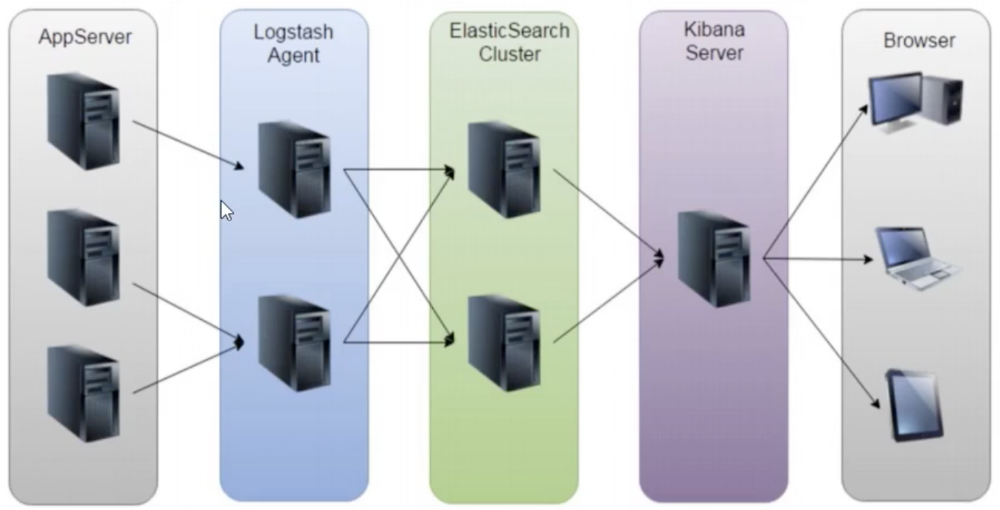


ELK方案的问题

- 运维成本高，每增加一个日志收集项，都需要手动修改配置
- 监控缺失，无法准确获取logstash的状态
- 无法做到定制化开发与维护


**日志收集系统架构设计**

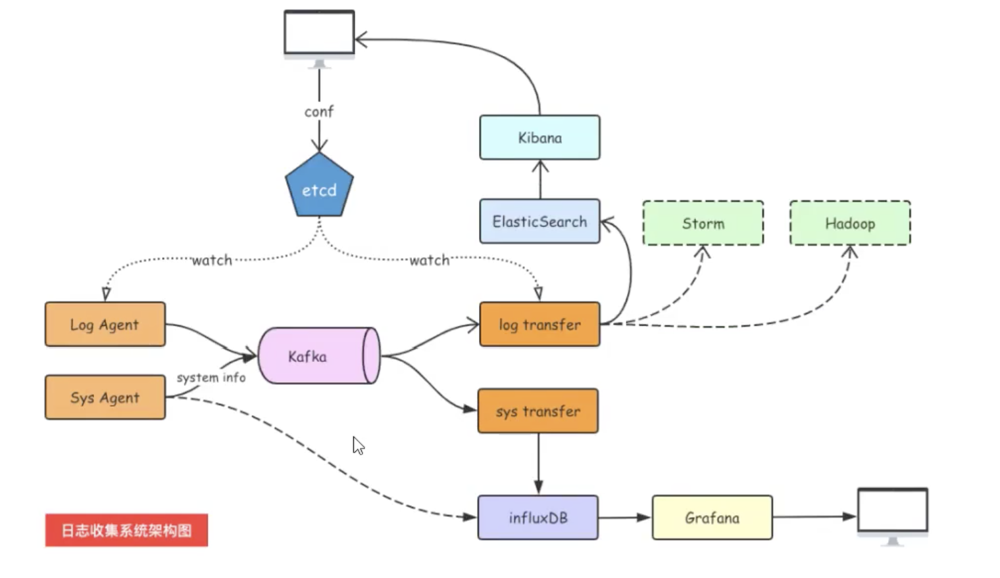


**组件介绍**

LogAgent:日志收集客户端，用来收集服务器上的日志。Kafka: 高吞吐量的分布式队列(Linkin开发，apache顶级开源项目) ElasticSearch: 开源的搜索引擎，提供基于HTTP RESTful的web接口。

Kibaa:开源的ES数据分析和可视化工具。Hadoop: 分布式计算框架，能够对大量数据进行分布式处理的平台。

Storm: 一个免费并开源的分布式实时计算系统。


**将学到技能**

- 服务端agent开发
- 后端服务组件开
- Kafka和zookeeper的使用
- ES和Kibana的使用
- etc的使用 （分布式存储）


**消息队列的通信模型**

**点对点模式(queue)**
消息生产者生产消息发送到queue中，然后消息消费者从queue中取出并且消费消息。-条消息被消费以后，queue中就没有了，不存在重复消费。


**发布/订阅(topic)**
消息生产者(发布) 将消息发布到topic中，同时有多个消息消费者(订阅)消费该消息。和点对点方式不同，发布到topic的消息会被所有订阅者消费(类似于关注了微信公众号的人都能收到推送的文章)。

补充:发布订阅模式下，当发布者消息量很大时，显然单个订阅者的处理能力是不足的。实际上现实场景中是多个订阅者节点组成-个订阅组负载均衡消费topic消息即分组订阅，这样订阅者很容易实现消费能力线性扩展。可以看成是一-个topic下有多个Queue,每个Queue是点对点的方式，Queue之间是发布订阅方式。


**Kafka**

Apache Kafka由著名职业社交公司LinkedIn开发，最初是被设计用来解决LinkedIn公司内部海量日志传输等问题。Kafka使用Scala语言编写，于2011年 开源并进入Apache孵化器，2012年10月 正式毕业，现在为Apache顶级项目。


**介绍**
Kafka是一个分布式数据流平台，可以运行在单台服务器上，也可以在多台服务器上部署形成集群。它提供了发布和订阅功能，使用者可以发送数据到Kafka中，也可以从Kafka中读取数据(以便进行后续的处理)。Kafka具有高吞吐、低延迟、高容错等特点。


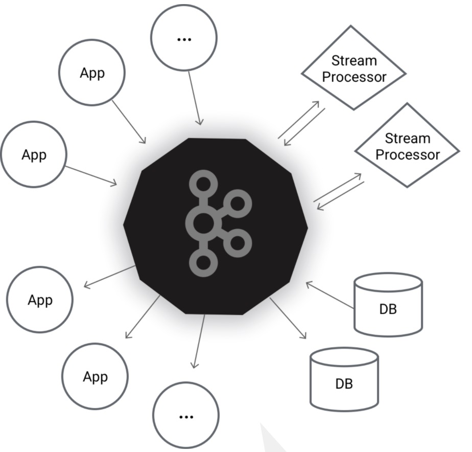


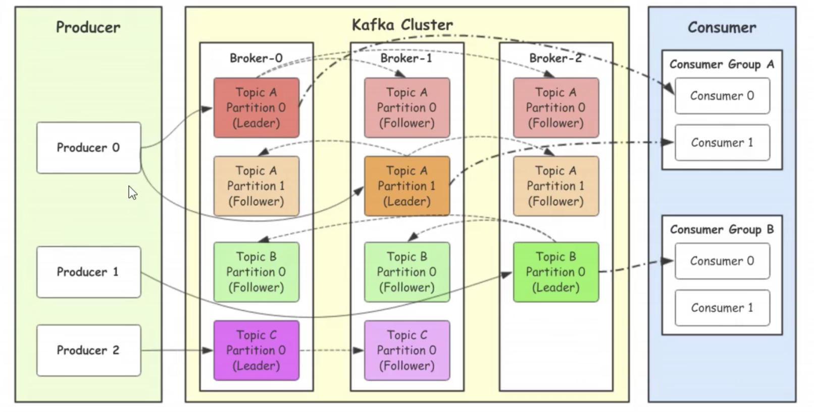


Producer: Producer即生产者， 消息的产生者，是消息的入口。

kafka cluster: kafka集群， 一台或多台服务器组成

- Broker: Broker是指部署了Kafka实例的服务器节点。每个服务器.上有一个或多个kafka的实例，我们姑且认为每个broker对应一台 服务器。每个kafka集群内的broker都有-一个不重复的编号，如图中的broker-0、 broker-1等 ...
- Topic: 消息的主题，可以理解为消息的分类，kafka的数据就保存在topic。 在每个broker上都可以创建多个topic。实际应用中通常是一个业务线建一个topic。
- Partition: Topic的分区， 每个topic可以有多个分区，**分区的作用是做负载，提高kafka的吞吐量**。同一个topic在不同的分区的数据是不重复的，partition的表 现形式就是一个一个的文件夹!
- Replication:每一 个分区都有**多个副本，副本的作用是做备胎**。当主分区(Leader) 故障的时候会选择-个备胎(Follower). 上位， 成为Leader。在kafka中默认副本的最大数量是10个，且副本的数量不能大于Broker的数量，**follower和leader绝对是在不同的机器**，同一机器对同一个分区也只可能存放一个副本(包括自己)
- Consumer:消费者，即消息的消费方，是消息的出口。


**工作流程**

Producer就是生产者，是数据的入口。Producer在写入数据的时候会把数据写入leader中，不会直接将数据写入foller，那leader怎么找呢，写入的流程又是怎么样的，如下图：

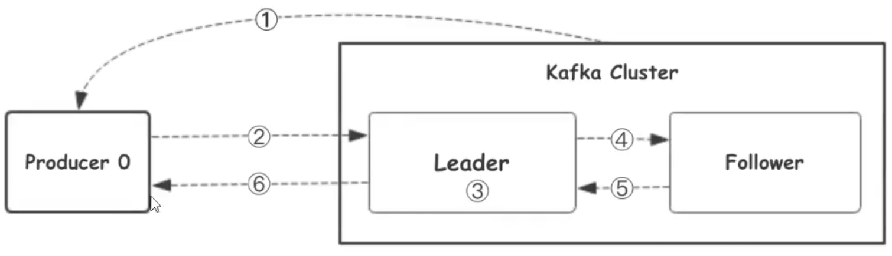


1、生产者从Kafka集群获取分区leader信息
2、生产者将消息发送给leader
3、leader将消息写入本地磁盘
4、follower从leader拉取消息数据
5、follower将消息写入本地磁盘后向leader发送ACK
6、leader收到所有的follower的ACK之后向生产者发送ACK


**选择partition的原则**

那在kafka中，如果某个topic有多个partition, producer又怎 么知道该将数据发往哪个partition呢?
kafka中有几个原则: 
1. partition在写入的时候可以指定需要写入的partition，如果有指定，则写入对应的partition。
2. 如果没有指定partition,但是设置了数据的key,则会根据key的值hash出一-个partition。
3. 如果既没指定partition，又没有设置key,则会采用轮询方式，即每次取一小段时间的数据写入某
    个partition，下一小段的时间写入下一个partition。


**ACK应答机制**

producer在向kafka写入消息的时候，可以设置参数来确定是否确认kafka接收到数据，这个参数可设置的值为0、1、all 。
● 0代表producer往集群发送数据不需要等到集群的返回，不确保消息发送成功。安全性最低但是效率最高。
● 1代表producer往集群发送数据只要leader应答就可以发送下一条，只确保leader发送成功。
● all代表producer往集 群发送数据需要所有的follower都完成从leader的同步才会发送下一条，确保leader发送成功和所有的副本都完成备份。安全性最高，但是效率最低。

最后要注意的是，如果往不存在的topic写数据，kafka会自动创建topic，partition和replication的数量，默认配置都是1。


**Kafka**

1、Kafka集群的架构

​	1）broker是节点，不同的节点上只有一个leader，其他的是 flower

​	2)  topic

​	3）partion：分区，把同一个topic分成不同的分区，提高负载

​		1，leader 分区的主节点(老大)

​		2，follower：分区的从节点(小弟)

​	4) Consumer Group

2、生产者往 Kafka发送数据的流程(6步)


3、Kafka选择分区的模式 （3种）

​	1）指定往哪个分区写

​	2）指定Key,kafka根据key做hash然后决定写哪个分区

​	3）轮询方式


4、生产者往 kafka发送数据的模式（3种）

1. 0  把数据发给leader就成功，效率最高、安全性最低。
2. 1  把数据发送给leader,等待leader回ACK
3. a11 把数据发给leader,确保follower从leader拉取数据回复ack给leader, leader再回复ACK;安全性最高


5、分区存储文件的原理


6、为什么kafka快？


Topic和数据日志

topic是同一类别的消息记录(record)的集合。在 Kafka中，一个主题通常有多个订阅者。对于每个主题，Kafka集群维护了一个分区数据日志文件，结构如下：

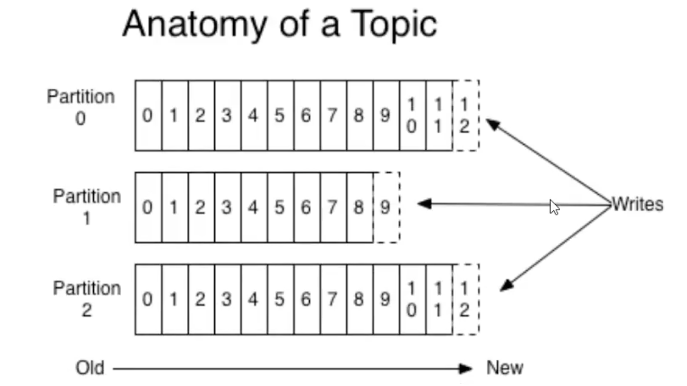


每个partition都是一个有序并且不可变的消息记录集合。当新的数据写入时，就被追加到partition的末尾。在每个partition中， 每条消息都会被分配一个顺序的唯一标识， 这个标识被称为offset，即偏移量。注意，Kafka只保证在同一个partition内部消息是有序的，在不同partition之间，并不能保证消息有序。（**平常是物理磁盘扇区上随机读，kafka是记录了offset，直接顺序读，即可以提高磁盘上的读取速度**）


Kafka可以配置**一个保留期限**，用来标识日志会在Kafka集群内保留多长时间。Kafka集群会保留在保留期限内所有被发布的消息，不管这些消息是否被消费过。比如保留期限设置为两天，那么数据被发布到Kafka集群的两天以内，所有的这些数据都可以被消费。当超过两天，这些数据将会被清空，以便为后续的数据腾出空间。由于Kafka会将数据进行持久化存储(即写入到硬盘上)，所以保留的数据大小可
以设置为一个比较大的值。


**Partition结构**

Partition在服务器上的表现形式就是一个一个的文件夹，每个partition的文件夹下面会有**多组segment文件**，每组segment文件又包含    **.index文件**、**. log文件**、**. timeindex文件**三个文件，其中.log文件就是实际存储message的地方，而. index和. timeindex文件为索引文件，用于检索消息。


**消费数据**
多个消费者实例可以组成一个消费者组，并用一个标签来标识这个消费者组。一个消费者组中的不同消费者实例可以运行在不同的进程甚至不同的服务器上。

如果所有的消费者实例都在同一一个消费者组中，那么消息记录会被很好的均衡的发送到每个消费者实例。

如果所有的消费者实例都在不同的消费者组，那么每一条消息记录会被广播到每一个消费者实例。


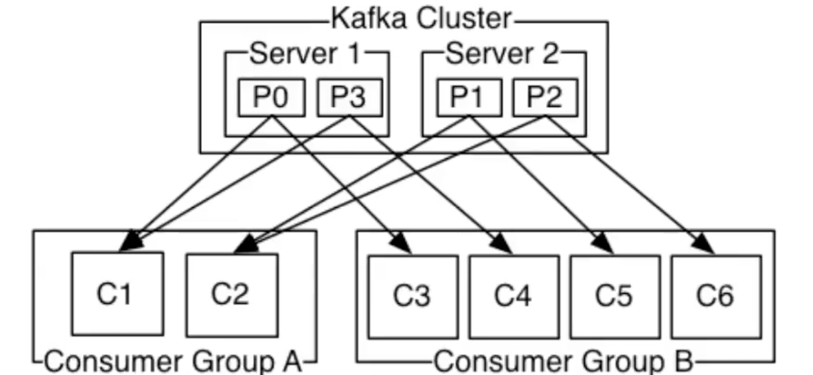


举个例子，如.上图所示一个两个节点的Kafka集群上拥有-个四个partition (P0-P3) 的topic。 有两个消费者组都在消费这个topic中的数据,消费者组A有两个消费者实例，消费者组B有四个消费者实例。
从图中我们可以看到，在同-一个消费者组中，每个消费者实例可以消费多个分区,但是每个分区最多只能被消费者组中的一个实例消费。也就是说，如果有-个4个分区的主题，那么消费者组中最多只能有4个消费者实例去消费，多出来的都不会被分配到分区。


**使用场景**
上面介绍了Kafka的一些基本概念和原理，那么Kafka可以做什么呢?目前主流使用场景基本如下:

**消息队列(MQ)**
在系统架构设计中，经常会使用消息队列(Message Queue) -- -MQ。 MQ是一种跨进程的通信机制，用于上下游的消息传递，使用MQ可以使上下游解耦，消息发送上游只需要依赖MQ，逻辑上和物理上都不需要依赖其他下游服务。MQ的常见使用场景如流量削峰、数据驱动的任务依赖等等。在MQ领域，除了Kafka外还有传统的消息队列如ActiveMQ和RabbitMQ等。

**追踪网站活动**
Kafka最出就是被设计用来进行网站活动(比如PV、 UV、搜索记录等)的追踪。可以将不同的活动放入不同的主题，供后续的实时计算、实时监控等程序使用，也可以将数据导入到数据仓库中进行后续的离线处理和生成报表等。


**Metrics**
Kafka经常被用来传输监控数据。主要用来聚合分布式应用程序的统计数据，将数据集中后进行统一的分析和展示等。


**日志聚合**

很多人使用Kafka作为日志聚合的解决方案。日志聚合通常指将不同服务器上的日志收集起来并放入一个日志中心，比如一台文件服务器或者HDFS中的一个目录，供后续进行分析处理。相比于Flume和Scribe等日志聚合工具，Kafka具 有更出色的性能。


###### 11.4.2 kafka介绍

Kafka是最初由Linkedin公司开发，是一个分布式、分区的、多副本的、多订阅者，基于zookeeper协调的分布式日志系统（也可以当做MQ系统），常见可以用于web/nginx日志、访问日志，消息服务等等，Linkedin于2010年贡献给了Apache基金会并成为顶级开源项目。

主要应用场景是：日志收集系统和消息系统。


###### 11.4.3 ZooKeeper介绍

ZooKeeper是一个分布式的， 开放源码的分布式应用程序协调服务，是Google的Chubby一个开源的实现，它是集群的管理者，监视着集群中各个节点的状态根据节点提交的反馈进行下一步合理操作。最终，将简单易用的接口和性能高效、功能稳定的系统提供给用户。


**kafka和zookeeper**

ZooKeeper是一个分布式协调服务，它的主要作用是为分布式系统提供一致性服务，提供的功能包括：配置维护、命名服务、分布式同步、组服务等。Kafka的运行依赖ZooKeeper。


###### 11.4.4 日志收集项目环境搭建指南

本文以Mac平台为例演示了JDK、kafka、 zookeeper的安装， Windows平台大同小异，请自行摸索。

kafka等需要java的jdk支持


> **第一步:安装Java 的 JDK**

下载地址: https://www.oracle.com/java/technologies/javase-downloads.html

先找到要下载的版本号，再点击进去，下载对应平台的安装包。

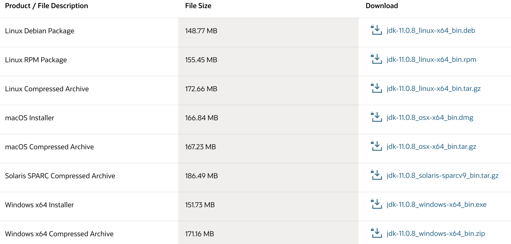


**安装JDK**
双击，下一步。


**检查是否安装成功**

终端输入 java -version


**配置环境变量**

安装好JDK后，命令行终端查看安装路径。

~~~go
/usr/libexec/java_home -V
//得到具体路径：
/* /Library/Java/JavaVirtualMachines/jdk-14.0.2.jdk/Contents/Home */
~~~


新增或修改 .profile

~~~go
vi /Users/chenglihui/.profile
~~~

写入具体内容

~~~go
JAVA_HOME='/Library/Java/JavaVirtualMachines/jdk-14.0.2.jdk/Contents/Home'
CLASSPATH=.:$JAVA_HOME/lib/dt.jar:$JAVA_HOME/lib/tools.jar
PATH=$JAVA_HOME/bin:$PATH

export JAVA_HOME
export CLASSPATH
export PATH
~~~


检查配置是否成功

~~~php
$ echo $JAVA_HOME
~~~


> **第二步：安装 zookeeper**

ZooKeeper主要用于服务注册与发现


【注意：kafka其实也已经集成了zookeeper，直接安装kafka即可】


ZooKeeper是一个分布式的，开放源码的分布式应用程序协调服务，是Google的Chubby一个开源的实现，它是集群的管理者，监视着集群中各个节点的状态根据节点提交的反馈进行下一步合理操作。最终，将简单易用的接口和性能高效、功能稳定的系统提供给用户。

下载地址

~~~go
https://zookeeper.apache.org/releases.html
https://www.apache.org/dyn/closer.lua/zookeeper/zookeeper-3.6.2/apache-zookeeper-3.6.2.tar.gz
~~~


**下载解压即可**

~~~go
$ cd /Users/chenglh/software
$ wget https://mirrors.tuna.tsinghua.edu.cn/apache/zookeeper/zookeeper-3.6.2/apache-zookeeper-3.6.2.tar.gz

$ tar zxvf apache-zookeeper-3.6.2.tar.gz
$ ......
~~~


> **第三步：安装kafka**

**下载路径：**

~~~go
http://kafka.apache.org/downloads
https://www.apache.org/dyn/closer.cgi?path=/kafka/2.6.0/kafka_2.12-2.6.0.tgz
~~~

**软件安装**

将下载好的压缩包解压到本地即可。


kafka已经集成了 zookeeper。

~~~bash
#第一步下载
$ wget https://mirrors.tuna.tsinghua.edu.cn/apache/kafka/2.6.0/kafka_2.12-2.6.0.tgz

#第二步解压
$ tar -zxvf kafka_2.12-2.6.0.tgz
$ cd kafka_2.12-2.6.0

#第三步；修改zookeeper配置文件,把数据写到实际应用中的指定目录
$ vi kafka_2.12-2.6.0/config/zookeeper.properties

#dataDir=/tmp/zookeeper  #主要是这一行需要修改
dataDir=/Users/chenglh/software/tmp/zookeeper
clientPort=2181
maxClientCnxns=0
admin.enableServer=false

#第四步；根据指定配置文件，启动 【zookeeper】
$ sh bin/zookeeper-server-start.sh config/zookeeper.properties
# $ sh /Users/xxxxx/software/kafka_2.12-2.6.0/bin/zookeeper-server-start.sh config/zookeeper.properties

#windows系统下走 bin/windows/zookeeper-server-start.bat config/zookeeper.properties

## zookeeper主要是维护集群列表的

#第五步；修改 kafka配置文件
$ vi config/server.properties

# log.dirs=/tmp/kafka-logs  #日志路径
log.dirs=/Users/xxxxx/software/tmp/kafka-logs
num.partitions=1 #分区个数
zookeeper.connect=localhost:2181

#第六步；使用指定文件启动 【kafka】
$ sh bin/kafka-server-start.sh config/server.properties

##注意在windows系统下，启动时cmd需要使用管理员身份
~~~


###### 11.4.5 tail介绍

**项目架构**


**LogAgent的工作流程：**

1、读日志 -  tailf 第三方库

2、往kafka写日志 - sarama第三方库


**tail安装**

~~~go
go get github.com/hpcloud/tail
~~~


安装tail时，报如下错误，因为依赖的第三方库已经修改了名称，而tail包还没有及时更新。

go get 安装github.com/hpcloud/tail依赖时，报错cannot find module providing package gopkg.in/fsnotify.v1

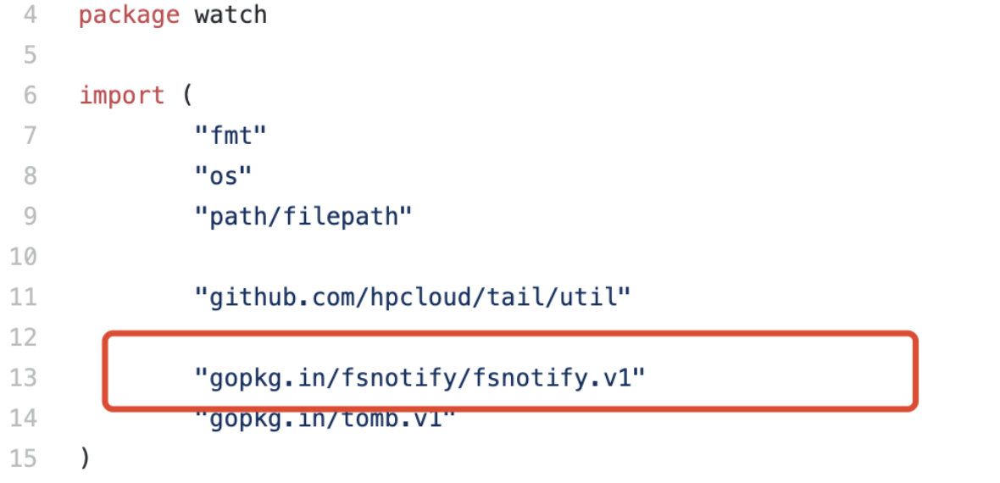

修复bug问题，使用 终端去修改以下两个文件。(注意* 不能在编辑器中直接修改，代码不知道什么原因，截断文件中后边代码。这里通过vi 命令修改代码)

~~~bash
$ vi /Users/chenglh/go/pkg/mod/github.com/hpcloud/tail@v1.0.0/watch/inotify.go        
$ vi /Users/chenglh/go/pkg/mod/github.com/hpcloud/tail@v1.0.0/watch/inotify_tracker.go
~~~


将goproxy.io/gopkg.in/fsnotify.v1用github.com/fsnotify/fsnotify 去替换


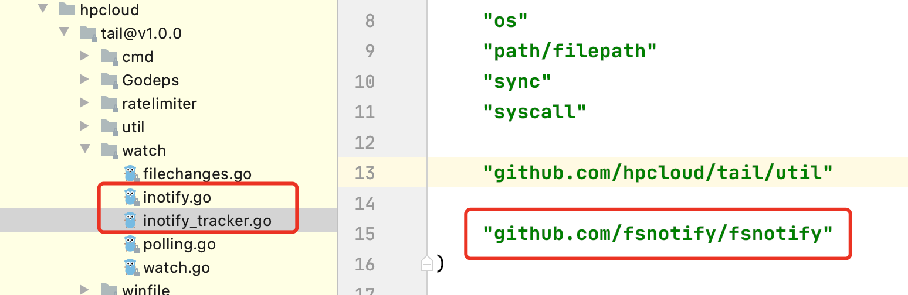


然后再执行命令：

~~~go
 go get -u  github.com/hpcloud/tail/...
~~~


###### 11.4.6 tail测试

~~~go
package main

import (
	"fmt"
	"github.com/hpcloud/tail"
	"time"
)

//tailf的用法示例

func main() {
	fileName := "./data.log"
	config := tail.Config{
		ReOpen:    true,                                 //重新打开，到切割的时候重新打开
		Follow:    true,                                 //是否跟随
		Location:  &tail.SeekInfo{Offset: 0, Whence: 2}, //从文件的哪个地方开始读
		MustExist: false,                                //检查文件是否存在,true不存在时报错
		Poll:      true,                                 //只轮循文件的变化部分
	}

	tails, err := tail.TailFile(fileName, config) //通过指定配置打开文件
	if err != nil {
		fmt.Println("tail file failed, err :", err)
		return
	}

	var (
		tailedLine *tail.Line //这里是单数
		ok         bool
	)
	for {
		tailedLine, ok = <-tails.Lines //这里是复数
		if !ok {
			fmt.Printf("tail file close reopen, filename:%s\n", tails.Filename)
			time.Sleep(time.Second)
			continue
		}

		fmt.Println("line:", tailedLine.Text)
	}
}
~~~


然后写 data.log文件及内容。


###### 11.4.6 sarama安装

Go语言中连接kafka使用第三方库:[github.com/Shopify/sarama](https://github.com/Shopify/sarama)。


**下载安装**

~~~go
go get github.com/Shopify/sarama
~~~


sarama v1 .20之后的版本加入了 zstd  压縮算法，需要用到cgo, 在Windows平 台編译时会提示类似如下错误:

~~~go
# github.com/DataDog/zstd
exec : "gcc" :executable file not found in %PАТH%
~~~


所以在Windows平台请使用v1.19版本的sarama。

windows下操作方法：

~~~go
> go mod init

$ vi go.mod
require github.com/Shopify/sarama v1.19

> go mod download
~~~


写代码：

~~~go
mkdir sarama
go mod init
~~~

写main.go文件

~~~go
package main

import (
	"fmt"
	"github.com/Shopify/sarama"
)

// 基于sarama第三方库开发的kafka client

func main() {
	config := sarama.NewConfig()
	config.Producer.RequiredAcks = sarama.WaitForAll          // 发送完数据需要leader和follow都确认，【三种模式】
	config.Producer.Partitioner = sarama.NewRandomPartitioner // 新选出一个partition
	config.Producer.Return.Successes = true                   // 成功交付的消息将在success channel返回

	// 构造一个消息
	msg := &sarama.ProducerMessage{}
	msg.Topic = "web_log"
	msg.Value = sarama.StringEncoder("this is a test log")
	// 连接kafka
	client, err := sarama.NewSyncProducer([]string{"127.0.0.1:9092"}, config)
	if err != nil {
		fmt.Println("producer closed, err:", err)
		return
	}
	fmt.Println("连接kafka成功")
	defer client.Close()

	// 发送消息
	pid, offset, err := client.SendMessage(msg)
	if err != nil {
		fmt.Println("send msg failed, err:", err)
		return
	}
	fmt.Println("发送消息成功")
	fmt.Printf("pid:%v offset:%v\n", pid, offset)
}
~~~


**代码分析**

自定义类型：

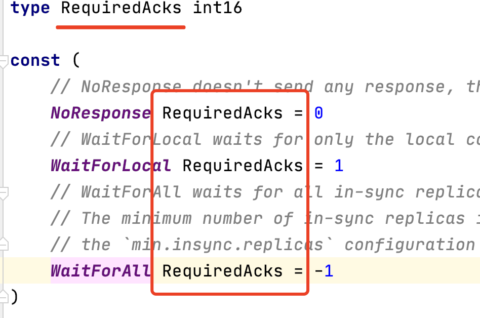

轮询一个分区：

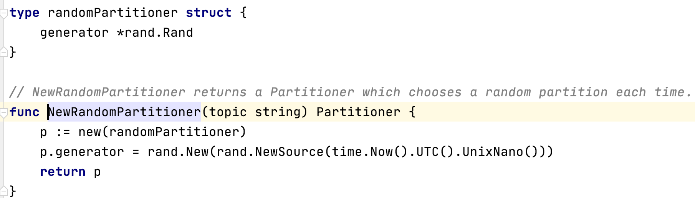


**执行得到结果**

~~~go
$ cd /Users/xxxxxx/software/tmp/kafka-logs/web_log-0
$ ls
00000000000000000000.index
00000000000000000000.log
00000000000000000000.timeindex
leader-epoch-checkpoint

//web_log-0 现在只是配置了一个分区，所以只生成一个分区的文件夹
~~~


###### 11.4.7 logAgent的实现

初始化项目：

~~~go
go mod init logAgent
~~~

|--logAgent

|     |--kafka   初始化kafka及专门往kafka写日志的模块

|     |--taillog 专门从日志文件收集日志的模块

|      -- main.go  程序入口


kafka模块 **/logAgent/kafka/kafka.go**

~~~go
package kafka

import (
	"fmt"
	"github.com/Shopify/sarama"
)

// 专门往kafka写日志的模块

var (
	client sarama.SyncProducer //声明一个全局的连接kafka的生产者 client
	err    error
)

//初始化
func Init(kafkaAddr []string) (err error) {
	// kafka配置
	config := sarama.NewConfig()
	config.Producer.RequiredAcks = sarama.WaitForAll          // 发送完数据需要leader和follow都确认，【三种模式】
	config.Producer.Partitioner = sarama.NewRandomPartitioner // 新选出一个partition
	config.Producer.Return.Successes = true                   // 成功交付的消息将在success channel返回

	// 连接kafka
	client, err = sarama.NewSyncProducer(kafkaAddr, config)
	if err != nil {
		fmt.Println("producer closed, err:", err)
		return
	}
	fmt.Println("连接kafka成功")
	//defer client.Close() 这里不需要关闭连接资源
	return
}

func SendToKafka(topic, data string) {
	// 构造一个消息
	msg := &sarama.ProducerMessage{}
	msg.Topic = topic
	msg.Value = sarama.StringEncoder(data)

	// 发送消息
	pid, offset, err := client.SendMessage(msg)
	if err != nil {
		fmt.Println("send msg failed, err:", err)
		return
	}
	fmt.Println("发送消息成功")
	fmt.Printf("pid:%v offset:%v\n", pid, offset)
}
~~~


tail模块 **/logAgent/taillog/taillog.go**

~~~go
package taillog

import (
	"fmt"
	"github.com/hpcloud/tail"
)

// 专门从日志文件收集日志的模块
var (
	tailObj *tail.Tail
	err     error
)

func Init(fileName string) (err error) {
	config := tail.Config{
		ReOpen:    true,                                 //重新打开，到切割的时候重新打开
		Follow:    true,                                 //是否跟随
		Location:  &tail.SeekInfo{Offset: 0, Whence: 2}, //从文件的哪个地方开始读
		MustExist: false,                                //检查文件是否存在,true不存在时报错
		Poll:      true,                                 //只轮循文件的变化部分
	}

	tailObj, err = tail.TailFile(fileName, config) //通过指定配置打开文件
	if err != nil {
		fmt.Println("tail file failed, err :", err)
		return
	}

	return nil
}

func ReadChan() <-chan *tail.Line {
	return tailObj.Lines
}
~~~


程序入口文件 **/logAgent/main.go**

~~~go
package main

import (
	"fmt"
	"time"
	"www.oldboy.com/day12/logAgent/kafka"
	"www.oldboy.com/day12/logAgent/taillog"
)

// logAgent入口程序

func run() {
	//1. 读取日志
	for {
		select {
		case line := <-taillog.ReadChan():
			//2. 发送到kafka
			kafka.SendToKafka("web_log", line.Text)
		default:
			time.Sleep(time.Second)
		}
	}
}

func main() {
	//【初始化组件】
	//1.初始化 kafka连接
	err := kafka.Init([]string{"127.0.0.1:9092"})
	if err != nil {
		fmt.Printf("init kafka failed, err:%v\n", err)
		return
	}
	fmt.Println("init kafka success")

	//2.打开文件日志准备收集日志
	err = taillog.Init("./data.log")
	if err != nil {
		fmt.Printf("init taillog failed, err:%v\n", err)
		return
	}
	fmt.Println("init tail success")

	run()
}
~~~


程序在处理过程中：尝试修复引入的包

~~~go
go mod tidy
~~~


程序运行

~~~go
go run main.go
~~~


创建data.log写入数据。


使用 kafka终端来消费队列数据

~~~bash
$ sh bin/kafka-console-consumer.sh --bootstrap-server=127.0.0.1:9092 --topic=web_log --from-beginning
~~~

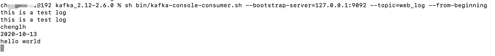


###### 11.4.8 配置文件版logAgent

vi  ./config/config.ini配置文件

~~~go
[kafka]
address=127.0.0.1:9092
topic=web_log

[taillog]
filename=./data.log
~~~


**github上搜索 go ini**

~~~go
https://github.com/go-ini/ini
~~~


手册地址

~~~go
https://ini.unknwon.io/docs/intro/getting_started
~~~


**下载安装**

~~~go
go get gopkg.in/ini.v1
~~~


使用方法一：直接使用

~~~go
func main() {
	//【初始化组件】

	//0.读取配置文件
	cfg, error := ini.Load("./config/config.ini")
	if error != nil {
		fmt.Printf("load ini failed, err:%v\n", error)
		return
	}
	fmt.Println(cfg.Section("kafka").Key("address").String())
	//cfg.Section("").Key("app_mode").String() 空节点下的Key
}
~~~


使用方法二：映射到结构体

定义结构体：

~~~go
package config

type AppConf struct {
	KafkaConf   `ini:"kafka"` //需要对应到配置文件中的 节点
	TaillogConf `ini:"taillog"`
}

type KafkaConf struct {
	Address string `ini:"address"`
	Topic   string `ini:"topic"`
}

type TaillogConf struct {
	FileName string `ini:"filename"`
}
~~~

初始化配置文件：

~~~go
var (
	cfg = new(config.AppConf)  //需要使用new关键字来初始化变量
)

func main() {
	//【初始化组件】

	//0.读取配置文件
	err := ini.MapTo(cfg, "./config/config.ini")
	if err != nil {
		fmt.Println("error")
	}
	fmt.Println("success")

	//1.初始化 kafka 连接
	err = kafka.Init([]string{cfg.KafkaConf.Address})
	......
}
~~~


#### 第十二天课程

##### 12.1 内容回顾

###### 12.1.1 go module

依赖管理工具


###### 12.1.2 context

goroutine管理

context.Context

两个根节点：context.Background()、context.TODO()

四个方法：

context.withCancel()

context.withTimeout()

context.withDeadTime()

context.withValue()


###### 12.1.3 日志收集项目

为什么要自己写，而不用 elk

ELK部署复杂，每一个filebeat都需要配置一个配置文件

使用 etcd来管理被收集的日志项。


1. kafka 消息队列
2. tail 从文件里读日志
3. go-ini 解析配置文件


##### 12.2 etcd内容

###### 12.2.1 etcd介绍

etcd 是使用Go语言开发的一个开源的、高可用的分布式key-value数据存储系统，可以**用于配置共享和服务的注册和发现**。


**类似项目有zookeeper和consul**。


etcd具有以下特点：

- 完全复制：集群中的每个节点都可以使用完整的存档
- 高可用性：Etcd可用于避免硬件的单点故障或网络问题
- 一致性：每次读取都会返回跨多主机的最新写入
- 简单：包括一个定义良好、面向用户的API（gRPC）
- 安全：实现了带有可选的客户端证书身份验证的自动化TLS
- 快速：每秒10000次写入的基准速度
- 可靠：使用**分布式系统的Raft算法**实现了强一致、高可用的服务存储目录


1、Raft协议

​	1.选举

​	2.日志复制机制

​	3.异常处理

​	4.与zookeeper的zad区别


**服务发现**

服务发现要解决的也是分布式系统中最常见的问题之一，即在同一个分布式集群中的进程或服务，要如何才能找到对方并建立连接。本质上来说，服务发现就是想要了解集群中是否有进程在监听udp或tcp端口，并且通过名字就可以查找和连接。


> 应用场景一：**服务注册与发现（etcd）**

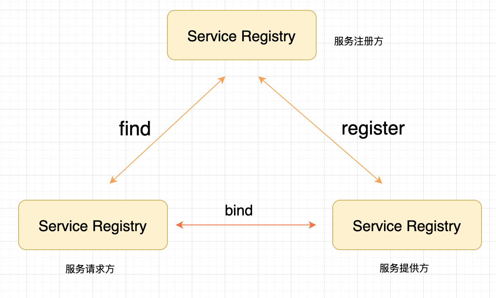


> 应用场景二：**配置中心**

将一些配置信息放到etcd.上进行集中管理。
这类场景的使用肪式通常是这样:应用在启动的时候主动从etcd获取一次配置信息，同时,在etcd节点上**注册一个Watcher并等待**，以后每次配置有更新的时候, etcd 都会实时通知订阅者,以此达到获取最新配置信息的目的。**（热加载）**


> 应用场景三：**分布式锁**

因为etcd使用Raft算法保持了数据的强一致性,某次操作存储到集群中的值必然是全局一致的，所以很容易实现分布式锁。锁服务有两种使用方式，**一是保持独占， 二是控制时序**。

- 保持独占即所有获取锁的用户最终只有一个可以得到。etcd为此提供了一 套实现分布式锁原子操作CAS ( CompareAndSwap)的API。通过设置prevExist值,可以保证在多个节点同时去创建某个目录时，只有一个成功。而创建成功的用户就可以认为是获得了锁。
- 控制时序，即所有想要获得锁的用户都会被安排执行,但是获得锁的顺序也是全局唯一的，同时决定了执行顺序。etcd 为此也提供了一套API (自动创建有序键)，对一个目录建值时指定为POST动作,这样etcd会自动在目录下生成一个当前最大的值为键, 存储这个新的值(客户端编号)，同时还可以使用API按顺序列出所有当前目录下的键值。此时这些键的值就是客户端的时序,而这些键中存储的值可以是代表客户端的编号。


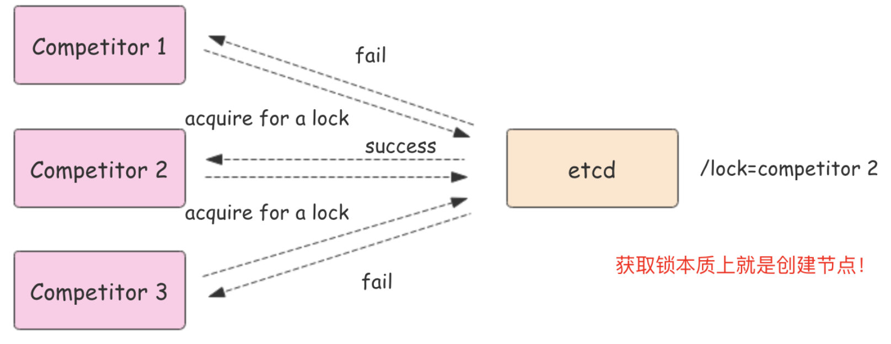


> **为什么用 etcd 而不用 zookeeper?**

etcd实现的这些功能，ZooKeeper都能实现。 

那么为什么要用etcd而非直接使用ZooKeeper呢? 相较之下，ZooKeeper有如下缺点:

1、复杂。ZooKeeper的部署维护复杂, 管理员需要掌握一-系列的知识和技能；而Paxos强-致性算法也是素来以复杂难懂而闻名于世;外, ZooKeeper的使用也此较复杂，需要安装客户端，官方只提供了Java和C两种语言的接口。

2、Java编写。这里不是对Java有偏见，而是Java本身就偏向于重型应用，它会引入大量的依赖。而运维人员则普遍希望保持强一致、高可用的机器集群尽可能简单,维护起来也不易出错。

3、发展缓慢。Apache 基金会项目特有的"Apache Way"在开源界饱受争议，其中一大原因就是由于基金会庞大的结构以及松散的管理导致项目发展缓慢。


而etcd作为一个后起之秀，其优点也很明显。

1、**简单**。使用Go语言编写部署简单;使用HTTP作为接口使用简单;使用Raft算法保证强一致性让用户易于理解。
2、**数据持久化**。etcd 默认数据更新就进行持久化。
3、**安全**。etcd 支持SSL客户端安全认证。

最后，etcd作为一个年轻的项目，真正告诉迭代和开发中，这既是一个优点,也是一个缺点。 优点是它的未来具有无限的可能性,缺点是无法得到大项目长时间使用的检验。然而，目前CoreOS、Kubernetes和CloudFoundry等知名项目均在生产环境中使用了etcd,所以总的来说，etcd 值得你去尝试。


###### 12.2.2 etcd架构

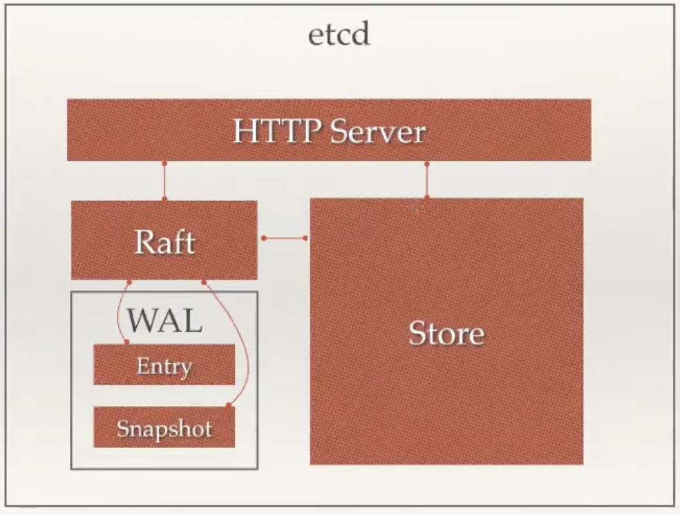


从etcd的架构图中我们可以看到，etcd 主要分为四个部分。

- HTTP Server: 用于处理用户发送的API请求以及其它etcd节点的同步与心跳信息请求。
- Store: 用于处理etcd支持的各类功能的事务,包括数据索引、节点状态变更、监控与反馈、事件处理与执行等等，是etcd对用户提供的大多数API功能的具体实现。
- Raft: Raft强一致性算法的具体实现，是etcd的核心。
- WAL: Write Ahead Log (颅写式日志)，是etcd的数据存储方式。除了在内存中存有所有数据的状态以及节点的索引以外，etcd 就通过WAL进行持久化存储。WAL中，所有的数据提交前都会事先记录日志。Snapshot 是为了防止数据过多而进行的状态快照; Entry 表示存储的具体日志内容。


###### 12.2.3 etcd集群

etcd作为一个高可用键值存储系统，天生就是为集群化而设计的。由于Raft算法在做决策时需要多数节点的投票，所以etcd -般部署集群**推荐奇数个节点**，推荐的数量为3、5或者7个节点构成一个集群。


> **搭建一个3节点集群示例:**

在每个etcd节点指定集群成员，为了区分不同的集群最好同时配置一个独一无二的token。
下面是提前定义好的集群信息，其中n1、n2 和n3表示3个不同的etcd节点。

~~~go
TOKEN=token-01
CLUSTER_STATE=new
CLUSTER=n1=http://10.240.0.17:2380,n2=http://10.240.0.18:2380,n3=http://10.240.0.19:2380
~~~


在`n1`这台机器上执行以下命令来启动etcd：

${CLUSTER}等表示变量，上面定义的。

~~~go
etcd --data-dir=data.etcd --name n1 \
	--initial-advertise-peer-urls http://10.240.0.17:2380 --listen-peer-urls http://10.240.0.17:2380 \
	--advertise-client-urls http://10.240.0.17:2379 --listen-client-urls http://10.240.0.17:2379 \
	--initial-cluster ${CLUSTER} \
	--initial-cluster-state ${CLUSTER_STATE} --initial-cluster-token ${TOKEN}
~~~


在`n2`这台机器上执行以下命令启动etcd：

~~~go
etcd --data-dir=data.etcd --name n2 \
	--initial-advertise-peer-urls http://10.240.0.18:2380 --listen-peer-urls http://10.240.0.18:2380 \
	--advertise-client-urls http://10.240.0.18:2379 --listen-client-urls http://10.240.0.18:2379 \
	--initial-cluster ${CLUSTER} \
	--initial-cluster-state ${CLUSTER_STATE} --initial-cluster-token ${TOKEN}
~~~


在`n3`这台机器上执行以下命令启动etcd：

~~~go
etcd --data-dir=data.etcd --name n3 \
	--initial-advertise-peer-urls http://10.240.0.19:2380 --listen-peer-urls http://10.240.0.19:2380 \
	--advertise-client-urls http://10.240.0.19:2379 --listen-client-urls http://10.240.0.19:2379 \
	--initial-cluster ${CLUSTER} \
	--initial-cluster-state ${CLUSTER_STATE} --initial-cluster-token ${TOKEN}
~~~


etcd 官网提供了一个可以公网访问的 etcd 存储地址。你可以通过如下命令得到 etcd 服务的目录，并把它作为`-discovery`参数使用。

~~~go
curl https://discovery.etcd.io/new?size=3
https://discovery.etcd.io/a81b5818e67a6ea83e9d4daea5ecbc92

# grab this token
TOKEN=token-01
CLUSTER_STATE=new
DISCOVERY=https://discovery.etcd.io/a81b5818e67a6ea83e9d4daea5ecbc92


etcd --data-dir=data.etcd --name n1 \
	--initial-advertise-peer-urls http://10.240.0.17:2380 --listen-peer-urls http://10.240.0.17:2380 \
	--advertise-client-urls http://10.240.0.17:2379 --listen-client-urls http://10.240.0.17:2379 \
	--discovery ${DISCOVERY} \
	--initial-cluster-state ${CLUSTER_STATE} --initial-cluster-token ${TOKEN}


etcd --data-dir=data.etcd --name n2 \
	--initial-advertise-peer-urls http://10.240.0.18:2380 --listen-peer-urls http://10.240.0.18:2380 \
	--advertise-client-urls http://10.240.0.18:2379 --listen-client-urls http://10.240.0.18:2379 \
	--discovery ${DISCOVERY} \
	--initial-cluster-state ${CLUSTER_STATE} --initial-cluster-token ${TOKEN}


etcd --data-dir=data.etcd --name n3 \
	--initial-advertise-peer-urls http://10.240.0.19:2380 --listen-peer-urls http://10.240.0.19:2380 \
	--advertise-client-urls http://10.240.0.19:2379 --listen-client-urls http:/10.240.0.19:2379 \
	--discovery ${DISCOVERY} \
	--initial-cluster-state ${CLUSTER_STATE} --initial-cluster-token ${TOKEN}
~~~


到此etcd集群就搭建起来了，可以使用`etcdctl`来连接etcd。

~~~go
export ETCDCTL_API=3
HOST_1=10.240.0.17
HOST_2=10.240.0.18
HOST_3=10.240.0.19
ENDPOINTS=$HOST_1:2379,$HOST_2:2379,$HOST_3:2379

etcdctl --endpoints=$ENDPOINTS member list
~~~


###### 12.2.4 etcd安装

github地址：

~~~go
https://github.com/etcd-io/etcd
https://github.com/etcd-io/etcd/releases
~~~


**下载 etcd**

> Windows平台

下载 [etcd-v3.4.13-windows-amd64.zip解压即可。


> Mac平台

方法一：下载解压：etcd-v3.4.13-darwin-amd64.zip,解压即可

方法二：brew install etcd


~~~go
$ cd /Users/xxxxx/software
$ wget https://github.com/etcd-io/etcd/releases/download/v3.4.13/etcd-v3.4.13-darwin-amd64.zip

$ unzip etcd-v3.4.13-darwin-amd64.zip
~~~


> Linux平台

下载xxx.tar.gz，解压即可。


###### 12.2.5 启动 etcd

进入到软件目录

双击 etcd.exe就是启动了 etcd。其他平台解压之后在bin目录下找到 etcd可执行文件。

默认会监听**客户端口 2379**，在**2380端口**监听节点间通信。


解压包里，README.md里有说怎么启动的

~~~go
$ cp /Users/xxxxxx/software/etcd-v3.4.13-darwin-amd64/etcd  /usr/local/bin/

//启动
$ etcd
~~~


###### 12.2.6 连接etcd

使用客户端连接 etcd

注意：默计的 **etcdctrl** 使用的时v2版本的命令。（v3.3以下默认是使用 etcdct_api=2，最新的应该是使用v3版本）

我们需要**设置环境变量ETCDCT_APl=3**来使用v3版本的API，而默认的也就是环境变量为ETCDCTL_ API=2是使用v2版本的API。


**修改环境变量指定使用API的版本**

**Windows平台**

~~~go
> cd /d  D:\software\etcd-v3.4.13-windows-amd64
> SET ETCDCT_API=3
~~~


**Mac & Linux平台**

~~~GO
export ETCDCTL_API=3
~~~


###### 12.2.7 简单使用

**新包默认不需要设置 ETCDCTL_API=3**

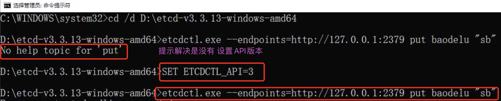


**参数 endpoint则是服务位于哪个访问点**

> **put**

~~~go
$ ./ectdctl --endpoints=http://127.0.0.1:2379 put name "chenglh"
OK
~~~


> **get**

~~~go
$ ./ectdctl --endpoints=http://127.0.0.1:2379 get name
name
chenglh
~~~


> **del**

~~~go
$ ./ectdctl --endpoints=http://127.0.0.1:2379 del name
1 //返回1
~~~


###### 12.2.8 使用go来操作

这里使用官方的**etcd/clientv3**包来连接etcd并进行相关操作。


Main.go简单使用 Put和Get命令

~~~go
package main

import (
	"context"
	"fmt"
	"go.etcd.io/etcd/clientv3"
	"time"
)

// etcd client put/get demo
// use etcd/clientv3

func main() {
	cli, err := clientv3.New(clientv3.Config{
		Endpoints:   []string{"127.0.0.1:2379"}, //连接的节点
		DialTimeout: 5 * time.Second,            //超时时间
	})
	if err != nil {
		fmt.Printf("connect to etcd failed, err:%v\n", err)
		return
	}
	fmt.Println("connect to etcd success")
	//关闭连接
	defer cli.Close()

	// put
	ctx, cancel := context.WithTimeout(context.Background(), time.Second)
	_, err = cli.Put(ctx, "chenglh", "dsb")
	cancel()
	if err != nil {
		fmt.Printf("put to etcd failed, err:%v\n", err)
		return
	}
	// get
	ctx, cancel = context.WithTimeout(context.Background(), time.Second)
	resp, err := cli.Get(ctx, "chenglh") //可选参数：, clientv3.WithPrefix()没找到怎么用，前缀区分业务线
	cancel()
	if err != nil {
		fmt.Printf("get from etcd failed, err:%v\n", err)
		return
	}

	for _, ev := range resp.Kvs {
		fmt.Printf("%s:%s\n", ev.Key, ev.Value)
	}
}
~~~


> 下载安装

~~~go
go get -u go.etcd.io/etcd/clientv3
~~~

很多时候是下载失败的，多尝试几次。

再是失败，修改系统环境变量，切换镜向，以下使用七牛云镜向

~~~go
go env -w GO111MODULE=on
go env -w GOPROXY=https://goproxy.cn,direct
~~~


如果报错信息：

~~~go
//如果3.3.25版本，包用：
github.com/coreos/etcd v3.3.25+incompatible

//grpc用：
replace google.golang.org/grpc => google.golang.org/grpc v1.26.0
~~~


直接在go.mod文件中修改

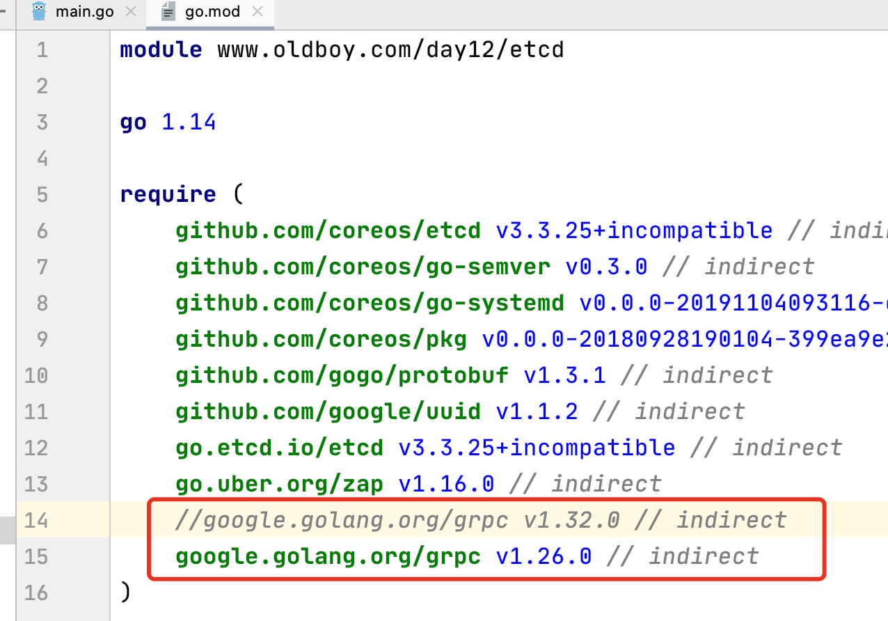


再执行命令行：

~~~go
go mod tidy

go run main.go
~~~

运行得到结果：

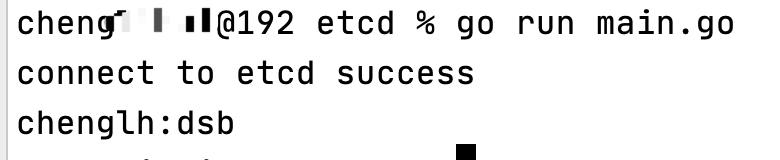


###### 12.2.9 Watch命令

watch监控Key的增加、修改、删除操作

~~~go
package main

import (
	"context"
	"fmt"
	"go.etcd.io/etcd/clientv3"
	"time"
)

//watch操作

func main() {
	cli, err := clientv3.New(clientv3.Config{
		Endpoints:   []string{"127.0.0.1:2379"}, //连接的节点
		DialTimeout: 5 * time.Second,            //超时时间
	})
	if err != nil {
		fmt.Printf("connect to etcd failed, err:%v\n", err)
		return
	}
	fmt.Println("connect to etcd success")
	//关闭连接
	defer cli.Close()

	//watch
	//派一个哨兵一直监视着 chenglh 这个 key的变化(新增、修改、删除)
	watchChan := cli.Watch(context.Background(), "chenglh")
	for wresp := range watchChan {
		for _, evt := range wresp.Events {
			fmt.Printf("Type:%v key:%v val:%v\n", evt.Type, string(evt.Kv.Key), string(evt.Kv.Value))
		}
	}
}
~~~


例如：我们打开终端执行以下命令修改、删除、设置`chenglh`这个key。

~~~go
$ cd /Users/chenglh/software/etcd-v3.4.13-darwin-amd64

$ ./etcdctl --endpoints=http://127.0.0.1:2379 put chenglh "flp"
OK
$ ./etcdctl --endpoints=http://127.0.0.1:2379 put chenglh "boy"
OK
$ ./etcdctl --endpoints=http://127.0.0.1:2379 del  chenglh     
1
~~~


执行的结果：

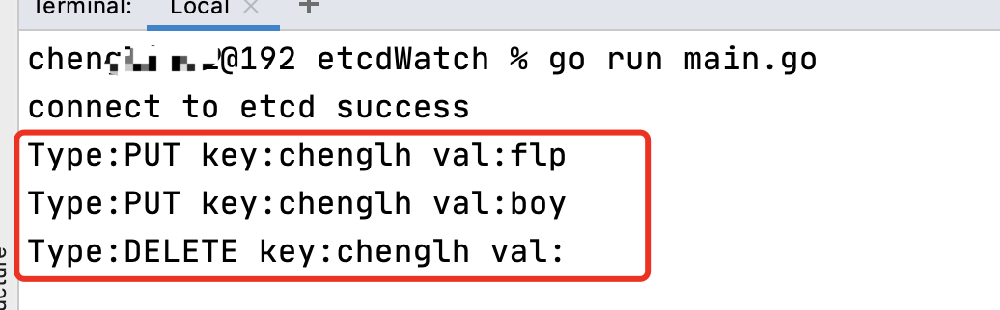


###### 12.2.10 logAgent初始化etcd

配置文件 config.ini

~~~go
[kafka]
address=127.0.0.1:9092
topic=web_log

[etcd]
address=127.0.0.1:2379
timeout=5

[taillog]
filename=./data.log
~~~


配置文件结构体

~~~go
type AppConf struct {
	KafkaConf `ini:"kafka"` //需要对应到配置文件中的 节点
	EtcdConf `ini:"etcd"`
}

type KafkaConf struct {
	Address string `ini:"address"`
	Topic   string `ini:"topic"`
}

type EtcdConf struct {
	Address string `ini:"address"`
	Timeout int    `ini:"timeout"`
}
~~~


Main.go

~~~go
func main() {
	//【初始化组件】
	//0.读取配置文件
	err := ini.MapTo(cfg, "./config/config.ini")
	if err != nil {
		fmt.Println("error")
	}
	fmt.Println("success")

	//1.初始化 kafka 连接
	err = kafka.Init([]string{cfg.KafkaConf.Address})
	if err != nil {
		fmt.Printf("init kafka failed, err:%v\n", err)
		return
	}
	fmt.Println("init kafka success")

	//2.初始化etcd，以下使用到了类型转换
	err = etcd.Init(cfg.EtcdConf.Address, time.Duration(cfg.EtcdConf.Timeout)*time.Second)
	if err != nil {
		fmt.Printf("init etcd failed, err:%v\n", err)
		return
	}
	fmt.Println("init etcd success")
}
~~~


如果go run main.go运行下载包软件，注意修改使用 grpc 是 v1.26.0版本

~~~go
google.golang.org/grpc v1.26.0 // indirect
~~~


监听要配置文件中收集日志的路径，如果有新内容，发往kafka；

以下代码第三步是有问题的，会一直卡在第一次遍历过程中，需要使用 go协程

~~~go
func main() {
	//【初始化组件】

	//0.读取配置文件
	err := ini.MapTo(cfg, "./config/config.ini")
	if err != nil {
		fmt.Println("error")
	}
	fmt.Println("success")

	//1.初始化 kafka 连接
	err = kafka.Init([]string{cfg.KafkaConf.Address})
	if err != nil {
		fmt.Printf("init kafka failed, err:%v\n", err)
		return
	}
	fmt.Println("init kafka success")

	//2.初始化etcd
	err = etcd.Init(cfg.EtcdConf.Address, time.Duration(cfg.EtcdConf.Timeout)*time.Second)
	if err != nil {
		fmt.Printf("init etcd failed, err:%v\n", err)
		return
	}
	fmt.Println("init etcd success")

	//2.1 从etcd中获取日志收集的配置信息
	logEntryConf, err := etcd.GetEtcdLogConf(cfg.EtcdConf.Key)
	if err != nil {
		fmt.Printf("etcd.GetEtcdLogConf failed,err:%v\n", err)
	}
	fmt.Println("get conf from etcd success")
	for index, value := range logEntryConf {
		fmt.Printf("index:%v value:%v\n", index, value)
	}

	//3 收集日志，发往kafka
	//logEntryConf = [{"path":"/usr/local/nginx.log", "topic":"nginx_log"},
	// {"path":"/usr/local/myslq.log", "topic":"mysql_log"},
	// {"path":"/usr/local/redis.log", "topic":"redis_log"} ]
	//3.1 循环每一个日志收集项，创建 TailObj
	for _, logEntry := range logEntryConf {
		//logEntry *etcd.logEntry
		//logEntry.Path 要收集的日志文件路径
		config := tail.Config{
			ReOpen:    true,                                 //重新打开，到切割的时候重新打开
			Follow:    true,                                 //是否跟随
			Location:  &tail.SeekInfo{Offset: 0, Whence: 2}, //从文件的哪个地方开始读
			MustExist: false,                                //检查文件是否存在,true不存在时报错
			Poll:      true,                                 //只轮循文件的变化部分
		}

		tailObj, err := tail.TailFile(logEntry.Path, config) //通过指定配置打开文件
		if err != nil {
			fmt.Println("tail file failed, err :", err)
			return
		}
		for {
			select {
			case line := <-tailObj.Lines:
				//发往kafka
				kafka.SendToKafka(logEntry.Topic, line.Text)
			}
		}
	}
}
~~~


https://www.bilibili.com/video/BV1ST4y1L7bj?p=23


