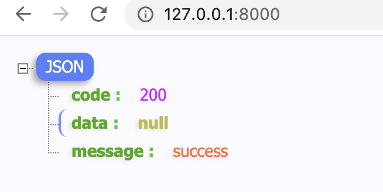

#### 第十三讲

#### 第十四天课程

##### 14.1 gin框架

###### 14.1.1 框架介绍

- Gin是一个golang的微框架，封装比较优雅，API友好，源码注释比较明确，具有快速灵活，容错方便等特点
- 对于golang而言, web框架的依赖要远比Python, Java之类的要小。自身的net/http足够简单,性能也非常不错
- 借助框架开发,不仅可以省去很多常用的封装带来的时间,也有助于团队的编码风格和形成规范

###### 14.1.2 框架安装

下载连接

~~~go
https://github.com/gin-gonic/gin
~~~

~~~go
$ go get -u github.com/gin-gonic/gin  //-u 下载对应依赖；-v 显示下载对应信息
~~~

**导包**

~~~go
import "github.com/gin-gonic/gin"
~~~

**hello world**

~~~go
go mod init
~~~

> gin第一个事例

~~~go
package main

import (
	"github.com/gin-gonic/gin"
	"net/http"
)

func main() {
	//1、创建路由
	r := gin.Default()
	//2、绑定路由规则，执行的函数
	//gin.Context，封装了 request和 response
	r.GET("/", func(context *gin.Context) {
		//context.String(http.StatusOK, "hello world~") 只输出字符串
		context.JSON(200, gin.H{ //返回json数据
			"code":    200,
			"message": "success",
			"data":    nil,
		})
	})
	//3、监听端口，默认在 8080
	r.Run() //r.Run(":8000")
}
~~~

运行后入口文件

~~~go
http://localhost:8080/
~~~

###### 14.1.3 路由及参数获取

1. **基本路由**

   gin框架中采用的路由库是基于httprouter做的。

   ~~~go
   地址为：https:/github.com/julienschmidt/httprouter
   ~~~

2. **Restful风格的API**

   gin支持Restful风格的API

   即Representational State Transfer的缩写。直接翻译的意思是"表现层状态转化",是一种互联网应用程序的API设计理念；URL定位资

   源，用HTTP描述操作。

旧方式与Restful对比：新的方式简单明了

1、获取文章 /blog/getXxx				GET		 blog/Xxx

2、添加		/blog/addXxx			   POST 	  blog/Xxx

3、修改		/blog/updateXxx		 PUT		 blog/Xxx

4、删除		/blog/delXxx				DELETE	blog/Xxx

**Restful风格程序入口**

中间件路由

~~~go
func main() {
	//1、创建路由
	//默认使用了2个中间件：Logger(), Recovery()
	r := gin.Default()
	//可以创建一个没有带中间件的路由
	// r := gin.New()
	//2、绑定路由规则，执行的函数
	r.GET("/blog", func(context *gin.Context) {
		context.String(http.StatusOK, "hello world~")
	})
	r.POST("/blog", func(context *gin.Context) {})
	r.PUT("/blog", func(context *gin.Context) {})
	r.DELETE("/blog", func(context *gin.Context) {})
	//3、监听端口，默认在 8080
	r.Run() //r.Run(":8000")
}
~~~

> 3、**API_URL获取path参数**

可以通过context.Param("KEY")方法获取

例如：localhost:8000/user/zhangsan/boy

~~~go
func main() {
	//1、创建路由
	r := gin.Default()
    //r.GET("/user/:name/:sex", func(context *gin.Context) {
    //	name := context.Param("name")
    //	sex := context.Param("sex")
	//})
	r.GET("/user/:name/*action", func(context *gin.Context) {
		name := context.Param("name")
		action := context.Param("action")//后边的字符串参数全部截取到一个变量中
		context.String(http.StatusOK, name + " is "+ action)
	})

	//3、监听端口
	r.Run(":8000") //r.Run(":8000")
}
~~~

> 4、**URL通过querystring获取**

`querystring`指的是URL中`?`后面携带的参数，例如：

~~~go
/user/search?name=chenglh&sex=boy
~~~

URL 参数可以通过DefaultQuery() 或 Query()方法获取。

DefaultQuery若参数不存在，返回默认值；Query()若不存在，返回空串。

 获取请求的querystring参数的方法如下：

~~~go
	//2、绑定路由规则，执行的函数
	r.GET("/welcome", func(context *gin.Context) {
		name := context.DefaultQuery("name", "chenglh")
		context.String(http.StatusOK, fmt.Sprintf("hello %v", name))
	})
~~~

通过API_URL访问结果

~~~go
http://127.0.0.1:8000/welcome?
hello jack

http://127.0.0.1:8000/welcome?name=chenglh
hellow chenglh
~~~

> 5、表单参数

表单传输为post 请求，http 常见的传输格式为四种：

~~~go
application/json
application/x-www-form-urlencoded
application xml
multipart/form-data
~~~

表单参数可以通过PostForm()方法获取，该方法默认解析的是x-www-form-urlencoded或from-data格式的参数。

~~~go
r.POST("/user/search", func(c *gin.Context) {
	// DefaultPostForm取不到值时会返回指定的默认值
	//username := c.DefaultPostForm("username", "chenglh")
	username := c.PostForm("username")
	address := c.PostForm("address")
	//输出json结果给调用方
	c.JSON(http.StatusOK, gin.H{
		"message":  "ok",
		"username": username,
		"address":  address,
	})
})
~~~

表单页面：

~~~html
<form action="http://127.0.0.1:8000/form" method="post" enctype="application/x-www-form-urlencoded">
	用户名：<input type="text" name="username" /> 
	密  码：<input type="password" name="password" /> 
	兴  趣：<input type="checkbox" value="run" name="hobby" />跑步 
    <input type="checkbox" value="game" name="hobby" />游戏 
    <input type="checkbox" value="girl" name="hobby" />女孩 
	<input type="submit" value="登录" />
</form>
~~~

接收页面：PostFormArray()多选框

~~~go
r.POST("/form", func(context *gin.Context) {
	userName := context.DefaultPostForm("username", "jack")
	password := context.DefaultPostForm("password", "000000")
	hobby := context.PostFormArray("hobby") //多选框
	context.String(http.StatusOK, fmt.Sprintf("hello username = %v, password = %v, hobby:%v\n", userName, password, hobby))
})
~~~

> 6、表单上传图片

multipart/form-data 格式用于文件上传

gin文件上传与原生的net/http方法类似，不同在于 gin把原生的request封装到c.Request中

~~~html
<form action="http://127.0.0.1:8000/upload" method="post" enctype="multipart/form-data">
	图片：<input type="file" name="file" /> 
	<input type="submit" value="登录" />
</form>
~~~

~~~go
r.POST("/upload", func(context *gin.Context) {
	//表单取文件
	file, _ := context.FormFile("file") //input中的文件框名称
	log.Println(file, file.Filename)
	//移动到项目根目录
	context.SaveUploadedFile(file, file.Filename)
	context.String(200, fmt.Sprintf("%s upload", file.Filename))
})
~~~

> 7、多文件上传

注意多文件上传，使用multiple="multiple"， 这里的name="files" 修改成了复数

~~~html
<form action="http://127.0.0.1:8000/upload" method="post" enctype="multipart/form-data">
	图片：<input type="file" name="files" multiple="multiple" /> 
	<input type="submit" value="登录" />
</form>
~~~

~~~go
//限制表单上传大小，8Mb ；默认为 32MB
func main() {
	//1、创建路由
	r := gin.Default()
	//限制表单上传大小 8MB；默认为 32MB
	r.MaxMultipartMemory = 8 << 20
	r.POST("/upload", func(context *gin.Context) {
		//表单取文件
		form, err := context.MultipartForm()
		if err != nil {
			context.String(http.StatusBadRequest, fmt.Sprintf("get err %s", err.Error()))
		}
		//获取所有图片
		files := form.File["files"]
		log.Println(files)
		//遍历所有图片
		for _, file := range files {
			//逐个存图片
			if err := context.SaveUploadedFile(file, file.Filename); err != nil {
				context.String(http.StatusBadRequest, fmt.Sprintf("upload err %s", err.Error()))
				return
			}
		}
		context.String(200, fmt.Sprintf("upload ok , %s", len(files)))
	})
}
~~~

> 反射参数绑定

为了能够更方便的获取请求相关参数，提高开发效率，我们可以基于请求的`Content-Type`识别请求数据类型并利用反射机制自动提取请求中`QueryString`、`form表单`、`JSON`、`XML`等参数到结构体中。 下面的示例代码演示了`.ShouldBind()`强大的功能，它能够基于请求自动提取`JSON`、`form表单`和`QueryString`类型的数据，并把值绑定到指定的结构体对象。

~~~go
// Binding from JSON/form/QueryString
type Login struct {
	User     string `form:"user" json:"user" binding:"required"`
	Password string `form:"password" json:"password" binding:"required"`
}

~~~

