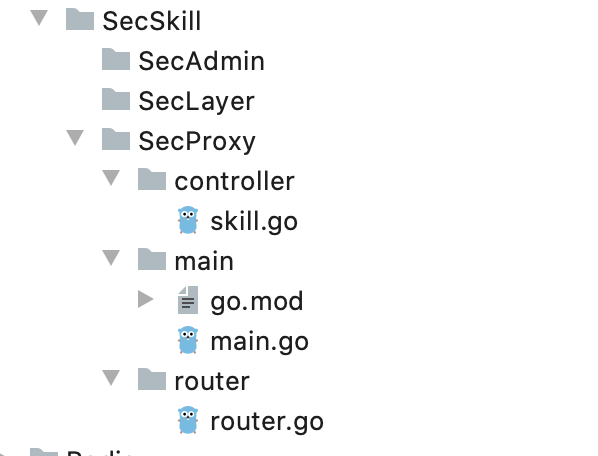

创建目录：




~~~go
go mod init
~~~

在main.go实现

~~~go
package router

import (
	"github.com/astaxie/beego"
	"www.oldboy.com/day14/SecSkill/SecProxy/controller"
)

func init() {
	beego.Router("/seckill", &controller.SkillController{}, "*:SecKill")
	beego.Router("/secinfo", &controller.SkillController{}, "*:SecInfo")
}

~~~


使用 etcd 和 grpc 遇到的版本冲突的那些事儿

```
Invalid case 'mvccpb.PUT' in switch on 'ev.Type' 
(mismatched types '"go.etcd.io/etcd/mvcc/mvccpb".Event_EventType' 
and '"github.com/coreos/etcd/mvcc/mvccpb".Event_EventType')
```

这里是包的引入出错了。

~~~go
将默认引入的包：go.etcd.io/etcd/mvcc/mvccpb
修改成为 github.com/coreos/etcd/mvcc/mvccpb
~~~


https://www.bilibili.com/video/BV1et4y1i7LY?p=7


