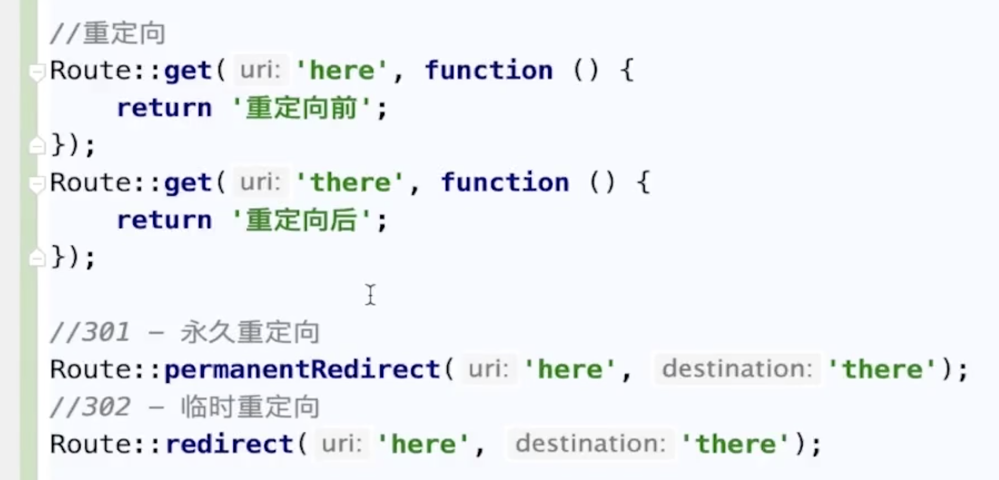
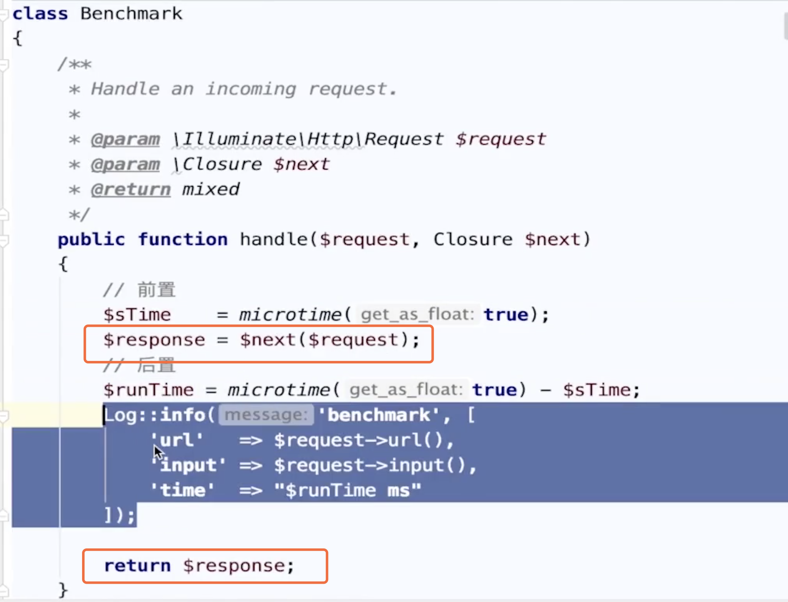

==Laravel入门到放弃==

文档路径

~~~php
https://learnku.com/docs/laravel/5.7/releases/2239
~~~

###### ==1.1 下载安装==

~~~php
composer create-project --prefer-dist laravel/laravel dev.laravel.com "5.7.*"
~~~

默认是要带index.php访问

~~~php
Nginx重写：

location / {
    try_files $uri $uri/ /index.php?$query_string;
}
~~~

生成密钥

~~~php
php artisan key:generate
~~~

~~~php
php artisan  就可以查看所有的命令
~~~

查看路由

~~~php
php artisan| grep route

route:cache 把路由缓存起来
route:clear 清除路由缓存
route:list  查看所有的路由
~~~

路由重定向

~~~php
//301 - 永久重定向 （seO收录重写向后的地址）

//302 - 临时重定向 (seo收录之前的)
~~~

###### ==1.2 创建控制器==

自动加载好相关继承基类

~~~php
php artisan make:controller UserController
~~~

模型创建，指定目录下

~~~php
php artisan make:model Models/Menu
~~~

常见操作，指定表名，主键和禁用时间戳

~~~php
namespace App\Models;

use Illuminate\Database\Eloquent\Model;

class Menu extends Model
{
    protected $table = "menu";
    
    protected $primaryKey = "menu_id";
    
    public $timestamps = false;
}
~~~

web请求出现 419代码错误时，是 

~~~php
中间件的问题，app/Http/Kernel.php文件中修改数组 'web'=>...

\App\Http\Middleware\VerifyCsrfToken::class,
~~~

==方法一：传递参数(get、post)==

~~~php
路由

Route::any("/user", "UserController@index");

控制器

public function index(Request $request)
{
    $query = $request->query();
    $input = $request->input();

    return ['query'=>$query, 'input'=>$input];
}
~~~

==方法二：路径传参==

~~~php
Route::post("/user/{id?}", "UserController@index");

//如果加了 ？ 表示可以不传参数，但是控制器中必须要给默认值。

public function index(Request $request, int $id = 0)
{
    $query = $request->query();
    $input = $request->input();

    return ['query'=>$query, 'id'=>$id ,'input'=>$input];
}
~~~

路由需要保持唯一，否则只有第一个才生效。

~~~php
路由支持正则
Route::get("/test/{id?}/{name?}", "UserController@test")
    ->where('id', "[0-9]+")
    ->where('name', "[a-zA-Z]+");

public function test(int $id=0, string $name = '')
{
    return [$id, $name];
}
~~~

服务提供者中路由

~~~php
/app/Providers/RouteServicePrivder.php
现在只有 

$this->mapApiRoutes();

$this->mapWebRoutes();

可以添加一个
$this->mapAdminRoutes();
~~~

中间件

~~~php
php artisan make:middleware Benchmark
~~~

==中间件定义==

==中间件注册到框架中==

1、全局中间件

2、路由中间件

全局中间件 app/Http/Kernel.php

~~~php
//全局中间件
protected $middleware = [
    \App\Http\Middleware\CheckForMaintenanceMode::class,
    \Illuminate\Foundation\Http\Middleware\ValidatePostSize::class,
    \App\Http\Middleware\TrimStrings::class,
    \Illuminate\Foundation\Http\Middleware\ConvertEmptyStringsToNull::class,
    \App\Http\Middleware\TrustProxies::class,
    Benchmark::class   //这里写入中间件类
    //'benchmark',这里是别名写法
];
~~~

路由中间件  (只在当前路由中生效)

~~~php
Route::get('/test',"UserController@test")->middleware(App\Http\Middleware\Benchmark::class);
//Route::get('/test',"UserController@test")->middleware('benchmark'); 这里是别名写法
~~~

根据路由分组来实现

~~~php
protected $middlewareGroups = [
    'web' => [
        //......
        \Illuminate\Routing\Middleware\SubstituteBindings::class,
        Benchmark::class //只能web路由分组有效
    ],

    'api' => [
        'throttle:20,1',
        'bindings',
    ],
];
~~~

路由别名  ( app/Http/Kernel.php)

~~~php
protected $routeMiddleware = [
    'auth' => \App\Http\Middleware\Authenticate::class,
    'auth.basic' => \Illuminate\Auth\Middleware\AuthenticateWithBasicAuth::class,
    'bindings' => \Illuminate\Routing\Middleware\SubstituteBindings::class,
    'cache.headers' => \Illuminate\Http\Middleware\SetCacheHeaders::class,
    'can' => \Illuminate\Auth\Middleware\Authorize::class,
    'guest' => \App\Http\Middleware\RedirectIfAuthenticated::class,
    'signed' => \Illuminate\Routing\Middleware\ValidateSignature::class,
    'throttle' => \Illuminate\Routing\Middleware\ThrottleRequests::class,
    'verified' => \Illuminate\Auth\Middleware\EnsureEmailIsVerified::class,
    'benchmark' => \App\Http\Middleware\Benchmark::class,
    
    //定义好别名之后，上面的两处注释就可以简写了
];
~~~

中间件还可以通过控制器构造函数来生效

==这里的好处是可以，使用黑白名单过滤方法名==

~~~php
class UserController extends Controller
{
    public function __construct()
    {
        $this->middleware("benchmark", //点进去可以看到详细的 exptet 和 only属性
            //['exptet' => ['index', 'test']] //这是黑名单，即排除掉
            ['only'=>['index']] //这是白名单，即生效方法
        );
    }

    public function index(Request $request)
    {
        $query = $request->query();
        $input = $request->input();

        return ['query'=>$query, 'input'=>$input];
    }

}
~~~

中间件传参与接收参数

~~~php
//传参(控制器)
public function __construct()
{
    //中间件传参，如果多个要用,分隔
    $this->middleware("benchmark:admin,general",
         //['exptet' => ['index', 'test']] //这是黑名单，即排除掉
         ['only'=>['index']] //这是白名单，即生效方法
    );
}

//接参(中间件)
class Benchmark
{
    public function handle($request, Closure $next, $params1, $params2)
    {
        //$params1 = admin; $params2=general
    }
}
~~~

全局中间件是 按从上向下的顺序执行

中间件指定顺序执行，app/Kernel.php指定顺序

~~~php
protected $middlewarePriority = [
    //中间件名称1
	//.....
];
~~~

系统中间件说明

~~~php
protected $middleware = [
    \App\Http\Middleware\CheckForMaintenanceMode::class,//检测 laravel是否处于维护状态
    \Illuminate\Foundation\Http\Middleware\ValidatePostSize::class,//ValidatePostSize检验上传数据的大小
    \App\Http\Middleware\TrimStrings::class,//传入参数头尾的空格
    \Illuminate\Foundation\Http\Middleware\ConvertEmptyStringsToNull::class,//空串传为null
    \App\Http\Middleware\TrustProxies::class, //服务器与客户端中间有一层代理服务器，信任代理中间件
];

protected $middlewareGroups = [
    'web' => [
        //cookie
        \App\Http\Middleware\EncryptCookies::class,//cookie加密
        \Illuminate\Cookie\Middleware\AddQueuedCookiesToResponse::class,//cookie添加到response
        
        //session
        \Illuminate\Session\Middleware\StartSession::class,//开启session
        // \Illuminate\Session\Middleware\AuthenticateSession::class,
        \Illuminate\View\Middleware\ShareErrorsFromSession::class,
        
        //csrf攻击
        //\App\Http\Middleware\VerifyCsrfToken::class, web访问的可以开启，api的就不需要了
        \Illuminate\Routing\Middleware\SubstituteBindings::class,//参数的绑定如: /{id} 可以传成 ?id=12
    ],

    'api' => [
        'throttle:60,1', // throttle别名，可以用来限流的，对应文件中有具体类路径
        'bindings',
    ],
];

protected $routeMiddleware = [
    //鉴权
    'auth' => \App\Http\Middleware\Authenticate::class,
    'auth.basic' => \Illuminate\Auth\Middleware\AuthenticateWithBasicAuth::class,
    
	//绑定参数
    'bindings' => \Illuminate\Routing\Middleware\SubstituteBindings::class,
    'cache.headers' => \Illuminate\Http\Middleware\SetCacheHeaders::class,
    
    //认证
    'can' => \Illuminate\Auth\Middleware\Authorize::class,
    'guest' => \App\Http\Middleware\RedirectIfAuthenticated::class,
    
    'signed' => \Illuminate\Routing\Middleware\ValidateSignature::class,//签名检验
    'throttle' => \Illuminate\Routing\Middleware\ThrottleRequests::class,//限流
    'verified' => \Illuminate\Auth\Middleware\EnsureEmailIsVerified::class,//系统验证邮件地址

    //自定义中间件
    'benchmark' => \App\Http\Middleware\Benchmark::class,
];
~~~

数据库配置

~~~php
//app/database.php
<?php
    
'default' => env('DB_CONNECTION', 'mysql'), //这里的值对应的是下面的 真正连接名字

'connections' => [
	//这个名称对应的 上面default 的具体名字
    'mysql' => [
        'driver' => 'mysql',
        'host' => env('DB_HOST', '127.0.0.1'),
        'port' => env('DB_PORT', '3306'),
        'database' => env('DB_DATABASE', 'forge'),
        'username' => env('DB_USERNAME', 'forge'),
        'password' => env('DB_PASSWORD', ''),
        'unix_socket' => env('DB_SOCKET', ''),
		'charset' => 'utf8mb4',
        'collation' => 'utf8mb4_unicode_ci',
        'prefix' => '',
        'prefix_indexes' => true,
        'strict' => true, //mysql严格格式，如int在严格模式下 "1"写不进去，长度60字段写入100字节，严格下不可以写成功，但是在非严格模式下会截断写成功
        'engine' => null,
~~~

数据库对应的参数配置在 .env文件中

~~~php
DB_CONNECTION=mysql
DB_HOST=127.0.0.1
DB_PORT=3306
DB_DATABASE=testdb
DB_USERNAME=root
DB_PASSWORD=123456
~~~

数据库迁移

先安装 migrate数据表（第一次执行迁移文件时需要操作以下命令，主要是创建migrate表）

~~~php
php artisan migrate:install
~~~

回滚上一批次的操作

~~~php
php artisan migrate:rollback
~~~

如果 迁移文件已经创建好并且执行了，建议不要再去修改迁移文件的名称了，容易出错。

==创建数据表==

~~~php
php artisan make:migration create_sys_order_table 

php artisan make:migration create_sys_order_product_table
~~~

==1、创建数据表==

~~~php
#  php artisan make:migration create_sys_sale_order_table

#  vi 2021xxx_create_sys_sale_order_table

public function up()
{
    Schema::create('sys_sale_order', function (Blueprint $table) {
        $table->increments('order_id')->comment('ID主键');//默认就是主键
        $table->string('order_sn', 60)->nullable(false)->default('')->comment('订单编号');
        $table->unsignedInteger('store_id')->default(0)->comment('店铺ID');
        $table->string('customer_id', 120)->default('')->comment('用户ID');
        $table->decimal('total_amount', 10, 2)->default('0.00')->comment("订单金额");
        $table->decimal('final_amount',10,2)->default('0.00')->comment('实付金额');
        $table->decimal('discount_amount',10,2)->default('0.00')->comment('优惠金额');
        $table->tinyInteger('payment_type')->default(1)->comment('支付方式，1支付宝;2微信');
        $table->dateTime('payment_time')->comment('支付时间');
        $table->string('ship_reciver', 120)->default('')->comment('收货姓名');
        $table->string('ship_province', 120)->default('')->comment('收货省份');
        $table->string('ship_city', 150)->default('')->comment('收货市区');
        $table->timestamps();

        //添加索引
        $table->unique('order_sn', 'order_sn');
        $table->index('store_id', 'store_id');
        $table->index('customer_id', 'customer_id');
        $table->index('payment_time', 'payment_time');
        $table->index('ship_reciver', 'ship_reciver');

        //表引擎
		$table->engine = 'innodb';
    });
}
~~~

==2、修改数据表==

安装插件：

~~~php
composer require doctrine/dbal
~~~

如果遇到问题：

~~~php
//查看composer的安装路径
composer -h
~~~

~~~php
//如果报内存不够的错误信息

php -d memory_limit=-1 /usr/local/bin/composer require  doctrine/dbal
~~~

==3、如新增字段、添加表备注==

正常执行的是 up方法

如果回滚即执行 down方法

~~~php
规范
$ php artisan make:migration add_score_to_sys_sale_order_table --table=sys_sale_order //增加字段
移除  remove_score_to_sys....
修改  modify_ 或 update_....

$  php artisan make:migration modify_sys_sale_order_table --table=sys_sale_order
//需要指定表

public function up()
{
    Schema::table('sys_sale_order', function (Blueprint $table) {
        //新增字段
        $table->string('ship_telephone', 15)->default('')->after('payment_time')->comment('手机号码');
		
		//修改字段
		$table->string('name', 50)->change();//修改长度或类型都可以
        
        //列重命名
        $table->renameColumn('oldName', 'newName');

		//删除单列或多列
        $table->dropColumn('votes');
        //$table->dropColumn(['votes', 'avatar', 'location']);

		//删除索引
        $table->dropIndex(['state']);//单列或多列
    });

    //修改表备注
    DB::statement("ALTER TABLE `sys_sale_order` comment '订单主表'");
}
~~~

==4、更新操作==

~~~php
php artisan migrate
~~~

数据库操作：

~~~php
//select * from users where id > 1 and (email like '%@163' or name like '明%')

//有括号的 就使用闭包的方式把条件写出来

//引入的类
//use Illuminate\Database\Query\Builder;
echo DB::table('users')->where("id", ">", 1)->where(function(Builder $query){
    $query->where('email', 'like', '%@163')
        ->orWhere('name', 'like', '明%');
})->toSql();
~~~

插入记录/批量插入

更新操作

自增/减

删除

事务

开启方式1：闭包方式，自动提交和回滚，不需要人为控制

~~~php
//参数1，闭包函数，参数2：重试次数
~~~

==模型==

软删的字段 默认名称是 deleted_at

模型

~~~php
<?php

namespace App\Models;

use Illuminate\Database\Eloquent\Model;

class Menu extends Model
{
    //默认数据库表名
    protected $table = "hx_channel_menu";

    //哪个连接驱动
    protected $connection = "mysql";

    //数据库主键
    protected $primaryKey = "menu_id";

    //不主动修改 created_at 和 updated_at字段
    public $timestamps = false;

    //自定义的时间字段
    //const CREATED_AT = 'add_time';
    //const UPDATED_AT = 'update_time';

    protected $casts = [
        'url' => 'array'   //自动转换
    ];

    //白名单
//    protected $fillable = [
//        'title',
//        'pid',
//        'sort',
//        'url',
//        'hide',
//        'tip',
//        'group',
//        'icon'
//    ];

        //黑名单 不能与白名单同时出现
        protected $guarded = [];
}

~~~

模型使用

~~~php
$result = Menu::query()->create([
    'title'=>'test',
    'pid' =>0,
    'sort' => 0,
    'url'=> ['user_id'=>12, 'user_name'=>'李四'],
    'hide'=>0,
    'tip'=>'',
    'group'=>'',
    'icon'=>''
]);
var_dump($result);
~~~

软删除，创建表时必须有对应字段，模型中使用对应属性，以下表示 模型在使用时自动带上   `deleted_at` is null  user 表示使用代码块

软删除和恢复

~~~php
##Laravel6.x从入门到进阶，深入浅出
https://www.bilibili.com/video/BV1eg4y1q7r7?p=42

##基于PHP Laravel 框架的项目实战全程实录
https://www.bilibili.com/video/BV1kJ411i7RY?p=1
~~~

1.1 分布式锁

> 下载安装

~~~php
#下载安装Laravel
composer create-project --prefer-dist laravel/laravel blog

#安装predis
composer require predis/predis
~~~

> 分布式锁：使用Redis来做互拆锁

如服务器A、B、C三台，一般不建议把Redis部署到某一台服务器(如B)上，对于用户访问B时没有延迟，但对于A、C有延迟，会造成不公平。可以把Redis单独部署一台服务器，对于服务器A、B、C是公平获取锁的。

> laravel已经封装了-分布式锁

**配置**

~~~php
# vi .env
将缓存驱动 CACHE_DRIVER=file 修改成 CACHE_DRIVER=redis
~~~

**分布式锁**

~~~php
# /vendor/laravel/framework/src/Illuminate/Events/RedisLock.php

//当前路径下还有其他的锁，如MemcachedLock.php缓存锁等
class RedisLock extends Lock{  //继承锁类
    //....
}

#对应的缓存执行器：/vendor/laravel/framework/src/Illuminate/Events/RedisStore.php
public function lock($name, $seconds = 0, $owner = null) {
    return new RedisLock($this->connection(), $this->prefix.$name, $seconds, $owner);
}
~~~

**原理**

~~~php
setnx key value
exprie key 10s
    
Redis单线程
    事件的分配器
    命令执行器
~~~

**Laravel框架**

~~~php
//创建控制器
> php artisan make:controller RedisLockController

# vi routes/web.php 添加路由
Route::get('index', 'RedisLockController@index');
~~~

举个栗子：

~~~php
use Illuminate\Support\Facades\Cache;

class RedisCacheController extends Controller {
    public function index() {
        $block = Cache::lock('stock', 10); //(key,10s缓存)，返回是Redis Lock对象
        //$block 对象获取锁
        if ($block->get()) {
            //TODO执行业务逻辑
            $block->release(); //释放锁
            return '执行完成';
        }
    }
}
~~~

> 问题：会不会互删锁，如A服务请求会不会删除B服务请求的锁，A缓存锁时间到10s释放了，B服务请求进来，已经上锁，但是A服务器执行到  $block->release()，即把B的锁给删除了

~~~php
#laravel底层 /vendor/laravel/framework/src/Illuminate/Events/RedisLock.php
public function release() {
    $this->redis->eval(LuaScripts::releaseLock(), 1, $this->name, $this->owner);
}

//链接到对应的函数
public static function releaseLock()
{
    return <<<'LUA'
if redis.call("get",KEYS[1]) == ARGV[1] then
    return redis.call("del",KEYS[1])
else
    return 0
end
LUA;
}
/** 从而A服务器的锁，删除加到A对应的锁
 * 所以不会乱删除锁
 */
~~~

1.2 消息队列

> 秒杀、排队处理业务、应用解耦、流量削峰等

~~~php
#创建控制器
> php artisan make:controller TradeController

#创建任务类
> php artisan make:job Trade

<?php
//...
class TradeController extends Controller {
    public function trade() {
        //订单参数
        $data = [
            'order_id' => date('YmdHis').uniqid()
        ];
        
        $job = new Trade();
        $job->dispatch($job)->onQueue('trade'); //分发到队列，且命名为trade
        return '订单的方法';
    }    
}

/** 命令行生成文件原理 */
/**
 * 1.在 index.php 文件里
 * $app = require_once __DIR__.'/../bootstrap/app.php';
 *
 * 2.代码跟踪到 app.php 文件
 * $app->singleton(
 *    Illuminate\Contracts\Http\Kernel::class,   "走路由模式"
 *    App\Http\Kernel::class
 *	);
 * $app->singleton(
 *   Illuminate\Contracts\Console\Kernel::class,  "走命令行模式"
 *   App\Console\Kernel::class   //点进去看代码，去到第三步
 * );
 *
 * 3. App\Console\Kernel.php
 * use Illuminate\Foundation\Console\Kernel as ConsoleKernel; //再点进去第4步
 * class Kernel extends ConsoleKernel {...}
 * 
 * 4.拿到这个实例(容器)，进行操作
 * public function __construct(Application $app, Dispatcher $events){
 * 	   $this->app = $app;
 *     ......
 * }
 * 
 * 5.其实是来到 /vendor\laravel\framework\src\Illumiate\Foundation\Console\JobMakeCommand.php
 * protected $name = 'make:job';
 * return $this->option('sync')
 *                 ? __DIR__.'/stubs/job.stub'
 *                 : __DIR__.'/stubs/job-queued.stub';
 * 里边有对应的文件模板，即命令行调用模板生成指定文件
 */
~~~

> 修改配置

~~~php
# vi .env
QUEUE_CONNECTION=redis
~~~

> 队列任务

~~~php
#控制器
<?php
namespace App\Http\Controllers;

use App\Jobs\Trade;
use Illuminate\Http\Request;

class TradeController extends Controller
{
    public function index() {
        //订单参数
        $data = [
            'order_id' => date('YmdHis').uniqid()
        ];

        $job = new Trade($data);
        $job->dispatch($job)->onQueue('trade'); //分发到队列，且命名为trade
        return '订单的方法';
    }
}

#任务类
<?php
namespace App\Jobs;

use Illuminate\Bus\Queueable;
use Illuminate\Queue\SerializesModels;
use Illuminate\Queue\InteractsWithQueue;
use Illuminate\Contracts\Queue\ShouldQueue;
use Illuminate\Foundation\Bus\Dispatchable;

class Trade implements ShouldQueue
{
    use Dispatchable, InteractsWithQueue, Queueable, SerializesModels;

    /** 接收传递数据 */
    public $data;

    public function __construct($data) {
        $this->data = $data;
    }

    public function handle() {
        $rand = mt_rand(1, 2);
        if ($rand == 2) {
            sleep(3);//延迟3秒执行
            throw new \Exception('任务失败');
        }
        var_dump($rand, $this->data->data);
    }
}
~~~

> 定时任务调度

1. 修改数据库配置

~~~php
# vi .env
DB_CONNECTION=mysql
DB_HOST=127.0.0.1
DB_PORT=3306
DB_DATABASE=thinkphp
DB_USERNAME=root
DB_PASSWORD=123456
DB_PREFIX=tp_

# vi config/database.php
'prefix' => env('DB_PREFIX', ''),
~~~

2. 创建数据表

~~~mysql
CREATE TABLE `tp_goods` (
  `id` int(10) unsigned NOT NULL AUTO_INCREMENT,
  `counts` int(11) DEFAULT NULL,
  `goods_name` varchar(150) DEFAULT NULL,
  PRIMARY KEY (`id`)
) ENGINE=InnoDB DEFAULT CHARSET=utf8mb4;
~~~

3. 任务调度程序

~~~php
# vi app\Console\Kernel.php
protected function schedule(Schedule $schedule)
{
    //异步任务的处理 每一分钟
    $schedule->call(function (){
        $str = implode(array_merge(range('a','z'), range('A','Z'), range('0', '9')));
        $str = substr(str_shuffle($str), 0, 5);
        DB::table('Goods')->insert(['counts'=>4,'goods_name'=>$str]);
    })->everyMinute();
}
~~~

4. 调用方式

~~~php
# 一、终端命令行方式调用
> php artisan schedule:run

# 二、windows下的脚本
# vi task.bat
E:
CD E:\www\blog
php artisan schedule:run 1>> NUL 2>&1

# 三、Linux下调度

~~~

1.3 RBAC权限管理

https://www.bilibili.com/video/av329058585?p=3

工具选择

重构仿站

~~~php
https://github.com/linlinjava/litemall
~~~

docker下载

~~~php
https://hub.docker.com
~~~

镜向下载 ==阿里去镜向==

~~~php
https://developer.aliyun.com/mirror
~~~

选择容器

点进去，会看到对应下载连接

~~~php
http://mirrors.aliyun.com/docker-toolbox/?spm=a2c6h.13651104.0.0.22c675bflsNyef
~~~

使用国内镜向，下载速度会快点

登录阿里云

~~~php
https://account.aliyun.com/
~~~

详细路径或直接搜索即可

~~~php
https://cr.console.aliyun.com/cn-qingdao/instances/mirrors
~~~

粘贴重启docker

命令行终端

~~~php
docker --version
    
docker-compose --version
~~~

下载软件

~~~php
https://iterm2.com/downloads.html
~~~

主题设置

~~~php
参考页面
https://www.cnblogs.com/guopeng112/p/12549084.html

主题下载
https://iterm2colorschemes.com/
~~~

语言包

~~~
 //https://www.bilibili.com/video/BV1cZ4y1u7xM?p=14
~~~

