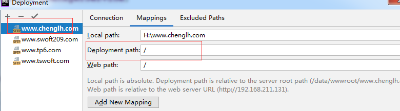
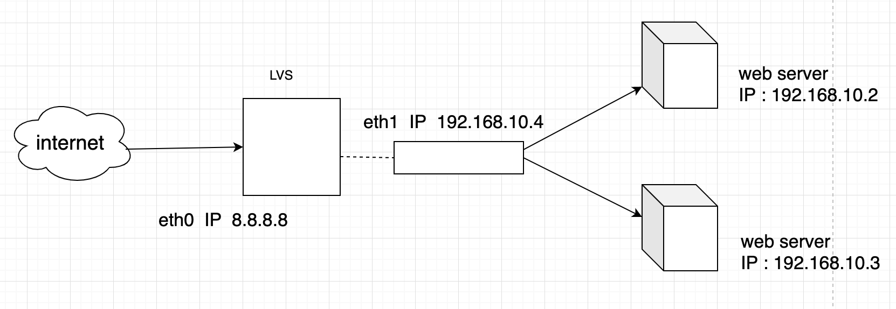

##### PHP常用知识

###### 1.1 IP地址查询

**国内免费**

1、淘宝，不稳定，有次数限制，经常404

~~~
http://ip.taobao.com/service/getIpInfo.php?ip={IP地址}
~~~

2、搜狐，当能访问当前IP，没什么作用

~~~
http://pv.sohu.com/cityjson?ie=utf-8
~~~

3、百度

~~~php
https://sp0.baidu.com/8aQDcjqpAAV3otqbppnN2DJv/api.php?query={IP地址}&resource_id=6006&oe=UTF-8

/**返回格式*/
{"status":"0","t":"","set_cache_time":"","data":[{"location":"广东省广州市 电信","titlecont":"IP地址查询","origip":"61.140.178.112","origipquery"....
~~~

4、126

~~~php
http://ip.ws.126.net/ipquery?ip={IP地址}

/*返回格式$ipInfo = 'var lo="广东省", lc="广州市"; var localAddress={city:"广州市", province:"广东省"}';*/

$ipInfo = httpGet('http://ip.ws.126.net/ipquery?ip=' . $ip);
$ipInfo = iconv("gb2312", "utf-8//IGNORE",$ipInfo);
$ipInfo = str_replace('city', '"city"', $ipInfo);
$ipInfo = str_replace('province', '"province"', $ipInfo);

//处理成json格式
preg_match_all("/(?:\{)(.*)(?:\})/i", $ipInfo, $match);
$ipInfo = $match[0][0];
$ipInfo = json_decode($ipInfo);
if ($ipInfo->city && $ipInfo->province) {
	$country = '中国'; $province = $ipInfo->province; $city = $ipInfo->city;
}
~~~

5、太平洋

~~~php
http://whois.pconline.com.cn/?ip={IP地址}
内容太多，再框框里有其他接口请求

http://whois.pconline.com.cn/ipJson.jsp?ip={IP地址}
/** 返回格式 */
if(window.IPCallBack) {IPCallBack({"ip":"61.140.178.112","pro":"广东省","proCode":"440000","city":"广州市"...
~~~

**国际免费**

~~~php
http://ip-api.com/json/　　# 国际化英文显示

http://ip-api.com/json/?lang=zh-CN　　# 中文显示

http://ip-api.com/json/{IP地址}?lang=zh-CN　　# 查询某个ip的信息

/** 返回格式 */
{"status":"success","country":"中国","countryCode":"CN","region":"GD","regionName":"广东","city":"广州",...
~~~

###### 1.2 Phpstorm

> phpstorm软件，代码右键 deployment 灰色，不可点击

~~~php
#参考文章
# https://blog.csdn.net/u013249853/article/details/89525486
~~~

解决办法：

###### 1.3 Composer

~~~php
//文档参考：https://getcomposer.org/download

# composer -v

下载软件包
# php -r "copy('https://getcomposer.org/installer', 'composer-setup.php');"
# php -r "if (hash_file('sha384', 'composer-setup.php') === 'e5325b19b381bfd88ce90a5ddb7823406b2a38cff6bb704b0acc289a09c8128d4a8ce2bbafcd1fcbdc38666422fe2806') { echo 'Installer verified'; } else { echo 'Installer corrupt'; unlink('composer-setup.php'); } echo PHP_EOL;"
# php composer-setup.php
# php -r "unlink('composer-setup.php');"
  
设置全局可用
# mv composer.phar /usr/local/bin/composer
# composer -v
~~~

> composer 镜向加速

文档参考：https://developer.aliyun.com/composer

~~~php
//全局配置
composer config -g repo.packagist composer https://mirrors.aliyun.com/composer/

//取消配置
composer config -g --unset repos.packagist
~~~

###### 1.4 Mac

> Nginx 

~~~php
$ brew install nginx

//设置权限
$ sudo chown root:wheel /usr/local/opt/nginx/bin/nginx
$ sudo chmod u+s /usr/local/opt/nginx/bin/nginx
  
//开机启动
mkdir -p ~/Library/LaunchAgents
cp /usr/local/opt/nginx/homebrew.mxcl.nginx.plist ~/Library/LaunchAgents/
launchctl load -w ~/Library/LaunchAgents/homebrew.mxcl.nginx.plist
launchctl unload ~/Library/LaunchAgents/homebrew.mxcl.nginx.plist(取消开机启动)
  
sudo nginx #打开nginx
nginx -s reload | reopen | stop | quit #得新加载配置|重启|停止|退出
nginx -t #测试配置是否有语法错误
#如果提示pid丢失的话，就用这句话
nginx -c /usr/local/etc/nginx/nginx.conf
~~~

访问方式：localhost:8080

> php

~~~php
# brew search php7

# brew install php@7.4

# php -v

启动
# brew services start php@7.4
  
关停
# brew services stop php@7.4
  
重启
# brew services restart php@7.4
~~~

> nginx+php

~~~php
备份配置文件
# cp /usr/local/etc/nginx/nginx.conf /usr/local/etc/nginx/nginx.conf.bak

创建虚拟主机
# mkdir sites-enabled
# cd sites-enabled
# vi www.test.com
server{
    listen 80;
    index index.php index.html index.htm;
    server_name www.test.com;
    root  /Users/chenglihui/wwwroot/www.test.com;

    charset utf-8;

    location ~ [^/]\.php(/|$) {
        fastcgi_pass   127.0.0.1:9000;
        fastcgi_index  index.php;
        fastcgi_param  SCRIPT_FILENAME $document_root$fastcgi_script_name;
        include        fastcgi_params;
    }
}
~~~

修改nginx.conf

~~~php
//在最后一个大括号前加上
include sites-enabled/*;
~~~

然后重启 nginx

> Mysql

~~~php
下载
# brew install mysql

启动
# mysql.server start

设置安全访问
# mysql_secure_installation
阅读好选项 一路 Y 或 N

这里设置密码是 12345678

查看端口
# lsof -i:3306
  
开机启动
cp /usr/local/Cellar/mysql/8.0.21/homebrew.mxcl.mysql.plist /Users/chenglihui/Library/LaunchAgents
~~~

> redis

~~~php
# brew install redis

# vi /usr/local/etc/redis.conf
daemonize yes

开机启动
cp /usr/local/Cellar/redis/6.0.6/homebrew.mxcl.redis.plist /Users/chenglihui/Library/LaunchAgents

配置文件启动
redis-server /usr/local/etc/redis.conf
~~~

> phpredis

~~~php
//下载适合的版本
http://pecl.php.net/package/redis

# cd /Users/chenglihui/Downloads/
# wget http://pecl.php.net/get/redis-5.3.1.tgz
# tar xvf redis-5.3.1.tgz

# sudo mv redis-5.3.1 /usr/local/phpredis-5.3.1
# which php     //查看PHP编译环境
/usr/local/bin/php

# cd /usr/local/phpredis-5.3.1
# /usr/local/bin/phpize
# sudo ./configure
# sudo make
# sudo make install
Installing shared extensions:     /usr/local/Cellar/php/7.4.8_1/pecl/20190902/

# vi /usr/local/etc/php/7.4/php.ini
[redis]
//extension_dir ="/usr/local/Cellar/php/7.4.8_1/pecl/20190902/"  如果这一行已经存在 就不需要再写了
extension=redis.so
~~~

  重启php

~~~php
# brew services restart php@7.4
~~~

> Swoole

~~~php
下载和编译安装
https://github.com/swoole/swoole-src/releases

swoole-src-4.5.2.zip
# unzip v4.5.2.zip

$ sudo mv swoole-src-4.5.2 /usr/local/swoole-4.5.2
$ cd swoole-src-v4.5.2
$ /usr/local/php/bin/phpize
$ ./configure //mac环境下不用指定配置文件--with-php-config=/usr/local/php/bin/php-config
$ make && make install

$ vi /usr/local/etc/php/7.4/php.ini
修改配置文件
[swoole]
extension=swoole.so

重启php
$ brew services restart php@7.4

检查版本号
方法1：# php --ri swoole
~~~

~~~php
//http://blog.phpdr.net/mac-zendstudio-字体过小问题解决.html

-Dorg.eclipse.swt.internal.carbon.smallFonts
~~~

###### 1.5 压力测试

~~~
ab -n1000 -c 1000 -k http://www.tp6.com
-n 请求数
-c 客户端数

ap工具是apache部分功能
~~~

###### 1.6 swagger

~~~php
https://swagger.io
~~~

###### 1.7 注册回调

~~~php
https://www.jb51.net/article/129213.htm
~~~

1.8 Json插件

~~~php
JSON-handle

http://www.cnplugins.com/zhuanti/jsontuijian.html
~~~

对缓存（Redis/Memcached）、

消息（ActiveMQ/RabbitMQ）、

搜索(ElasticSearch)等机制有深刻的理解

###### 1.8 swoole

服务端：server.php

~~~php
<?php
// 绑定端口，监听IP地址，为所有IP地址提供服务，9501
$server = new Swoole\Server('127.0.0.1', 9501); // tcp服务端

// 设置参数
$server->set([
    'worker_num' => 4, //设置4个子进程数
]);

//监听连接进入事件
$server->on('Connect', function ($server, $fd) {
    echo "Client: Connect.\n";
});

//监听数据接收事件
$server->on('Receive', function ($server, $fd, $from_id, $data) {
    var_dump($data);
    $server->send($fd, "Server: " . $data);
});

//监听连接关闭事件
$server->on('Close', function ($server, $fd) {
    echo "Client: Close.\n";
});

//启动服务器
$server->start();
~~~

客户端：client.php

~~~php
<?php
$client = new Swoole\Client(SWOOLE_SOCK_TCP);
$client->connect("127.0.0.1", 9501);

$params = json_encode([
    'service' => 'cartService',
    'action'    => 'cart',
    'params' => ["token"=>'asaff',"uid"=>123]
]);
$client->send($params);

echo $client->recv(), PHP_EOL;
~~~

然后在终端分别运行这两个PHP文件即可得到结果。

> 实现rpc分布式调用

###### 1.9 负载均衡

LVS常用三种负载均衡模式：

1、lvs nat 模式 （Network Address ，轮叫机制）

2、lvs ip-tun模式

3、lvs dr模式

Lvs   基于  VS/NAT，轮叫机制 （左边是公网地址，右侧是内网地址）

