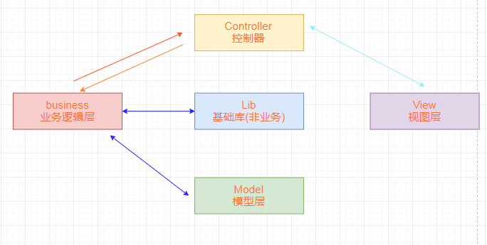

###### 第一章 Tp6项目实战

###### 1.1 框架获取

~~~php
# composer create-project topthink/think tp
~~~

~~~php
<?php
namespace app\controller;
use app\BaseController;
use think\facade\Request;

//use think\Request;

class Index extends BaseController
{
    //public function demo(Request $request) {
    //    print_r($request->param());//注入方式调用
    //}

    public function test() {
        $params = Request::param();//门面方式调用
        print_r($params);
    }
}
~~~

~~~php
<?php
public function show() {
   $result = [
       'status' => 1,
       'message' => 'ok',
       'data' => [
           'user_id' => 1,
           'user_name' => 'chenglh'
       ]
   ];
   $header = ['token'=>"asdfasdfdcre"];
   
   return json($result, 201, $header);
}

public function request(/** Request $request*/) {
    //第一种：对象获取
    dump($this->request->post());
    dump($this->request->get());
    dump($this->request->param('age', 18, 'intval'));
    
    //第二种：方法参数中注入对象
    $request->param('age', 18, 'intval');
	
    //第三种,input方法
    vardump(input('name','clh','string'));
    
    //第四种，TP方法
    request()->param('name','clh','string');
    
    //第五种，门面模式
    Request::param('age', 18, 'intval');
}
~~~

调试模式

~~~php
#.evn文件
APP_DEBUG = true

#错误信息页面
# vi ./config/app.php
<?php
// 异常页面的模板文件
'exception_tmpl'   => app()->getThinkPath() . 'tpl/think_exception.tpl',

// 错误显示信息,非调试模式有效
'error_message'    => '页面错误！请稍后再试～',
~~~

**如果访问不存在的控制器或方法**

Tp会显示一个错误信息页面，但是api请求时不需要html页面

~~~php
#方法不存在：
# vi baseController.php
public function __call($name, $arguments)
{
	// TODO: Implement __call() method.
    var_dump($name);
    var_dump($arguments);

    //逻辑：API接口返回 json数据
	$result = [
        'status' => 0,
        'message' => '找不到该方法',
        'result' => null
    ];
    return json($result, 400);
    //模板引擎返回 html页面数据
}

#控制器不存在
#创建异步控制器
# vi app/Error.php
<?php
namespace app\controller;

class Error {
    public function __call($name, $arguments)
    {
        // TODO: Implement __call() method.
        $result = [
            'status' => 0,
            'message' => '找不到该控制器',
            'result' => null
        ];
        return json($result, 400);
    }
}
~~~

~~~php
#通用化输出
# vi app/common.php
<?php
function show($status, $message = 'error', $data = null, $httpStatus = 200) {
    $result = [
            'status' => $status,
            'message' => $message,
            'result' => $data
        ];
    return json($result, $httpStatus);
}

# vi baseController.php
public function __call($name, $arguments){
    return show(0, "找不到{$name}方法", null, 404);
}
~~~

> 数据库配置

~~~ php
# vi .env
[DATABASE]
TYPE = mysql
HOSTNAME = 127.0.0.1
DATABASE = test
USERNAME = root
PASSWORD = 123456
HOSTPORT = 3306
CHARSET = utf8
PREFIX = tp_
DEBUG = true

# vi config/database.php
......

#第一种方法
use thinkphp\facade\Db; //使用门面模式
$result = Db::table('hx_user')->where('id',2)->find();

#第二种方法
//通过容器方式
$result = app('db')->table('hx_user')->where('id',2)->find();
~~~

调试模式

~~~php
# vi .env
APP_DEBUG = true
~~~

输出Sql语句：

~~~php
#第一种方式
$result = Db::table('tp_user')
	->order('id', 'desc')
    ->where('id',2)
    ->page(1,2)
    ->fetchSql()   //打印sql语句
    ->select();
dump($result) ;

#第二种方式
$result = Db::table('tp_user')
    ->order('id', 'desc')
    ->where('id',2)
	->page(1,2)
	->select();
echo Db::getLastSql();
~~~

新增：

~~~php
#插入一条
$data = [
    'user_name' => 'flp001',
    'user_mobile' => '13678913396',
    'created_time' => date('Y-m-d H:i:s'),
    'updated_time' => date('Y-m-d H:i:s')
];
$result = Db::table('tp_user')->insert($data);

#插入多条
$data = [
    [
        'user_name' => 'flp002',
        'user_mobile' => '13678913396',
        'created_time' => date('Y-m-d H:i:s'),
        'updated_time' => date('Y-m-d H:i:s')
    ],
    [
        'user_name' => 'pp001',
        'user_mobile' => '13678913300',
        'created_time' => date('Y-m-d H:i:s'),
        'updated_time' => date('Y-m-d H:i:s')
    ]
];

$result = Db::table('tp_user')->insertAll($data);
~~~

> 数据删除，一般先是假删除，然后月份、季度等计划任务去清洗数据

~~~php
$result = Db::table('hx_user')->where('id', 1)->delete();
echo Db::getLastSql();
~~~

~~~php
#更新操作
Db::table('hx_user')->where('id', 2)->update(['user_name'=>'test']);
echo Db::getLastSql();
~~~

> 模型操作

~~~php
<?php
namespace app\model;
use think\Model;

class User extends Model {
    protected $table = 'tp_user';
}
~~~

~~~php
#使用模型
public function tt() {
    $result = User::find(1);
    dump($result->toArray());
}
~~~

> 操作技巧 ，修改属性(函数命令需要注意，get+字段名+TextAttr，控制器中使用 (字段名_text)

~~~php
<?php
namespace app\model;

use think\Model;

class User extends Model
{
    protected $table = 'tp_user';

	#
    public function getUserStateTextAttr($value, $data) {
        $status = [
            0 => '待审核',
            1 => '正常',
            2 => '禁用'
        ];

        return $status[$data['user_state']];
    }

    public function getIdTextAttr($value, $data) {
        return 'ID:'.$data['id'];
    }
}

#控制器中
public function tt() {
    $user = new User();
    $result = $user->where('id','>=',2)
        ->limit(5)
        ->order('id', 'desc')
        ->select();
    foreach ($result as $item) {
        dump($item->user_state_text);//字段名_text
        dump($item->id_text);
    }
}
~~~

> 如果要使用多应用模式，你需要安装多应用模式扩展think-multi-app。

~~~php
# composer require topthink/think-multi-app
~~~

然后在 app目录下，创建 前台、后台、接口等应用目录

~~~php
# vi app/Front/Controller/Index.php
<?php
namespace app\Front\Controller;
use app\BaseController;

class Index extends BaseController {
    public function index() {
        echo "hello front";
    }
}

#访问地址
http://www.tp6.com/?s=/Front/Index/index
~~~

多应用路由

~~~php
# vi app\Front\Route\Front.php    //名字可随意起
<?php
namespace app\Front\Route;
use think\facade\Route;

Route::rule('test', 'Index/index', 'GET');

#访问地址
http://www.tp6.com/?s=/Front/test
~~~

> 架构分层

~~~

~~~

异常

~~~php
# vi app/ExceptionHandle.php

~~~

