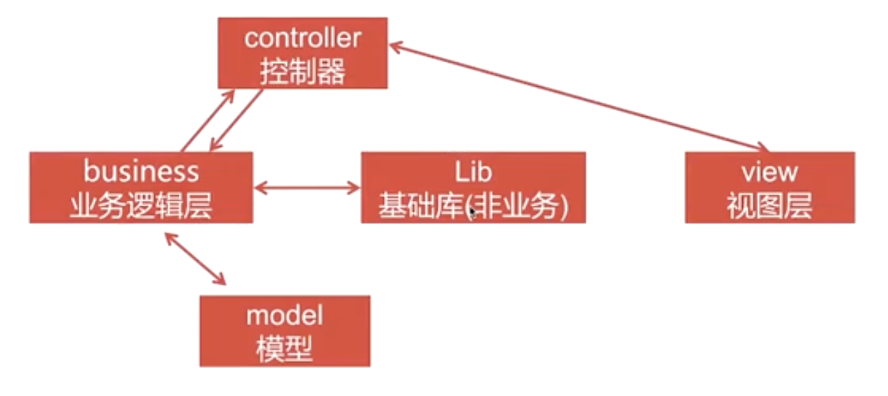
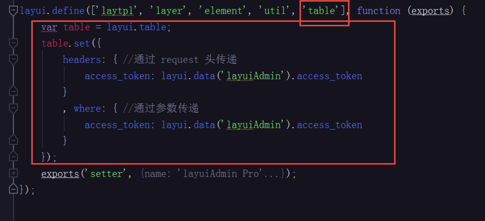

###### 第一章 Tp6项目实战

###### 1.1 框架入门

~~~php
//下载安装
# composer create-project topthink/think tp

//下载模板引擎
# composer require topthink/think-view
//提示信息：Driver [Think] not supported.表示没有模板引擎
~~~

```
{{ layui.setter.website_admin_url }}login/verify

https://github.com/cccjt/layui_thinkphp/blob/master/application/admin/controller/Login.php
```

> 项目架构图


> Request对象

~~~php
<?php
namespace app\controller;
use app\BaseController;
use think\facade\Request;

//use think\Request;

class Index extends BaseController {
    //方法1：注入方式调用
    //public function demo(Request $request) {
    //    print_r($request->param());
    //}

    //方法2：门面方式调用
    public function test() {
        $params = Request::param();
        print_r($params);
    }
}
~~~

测试访问连接：http://www.tp6.io/index.php?s=/Index/test/age/18/sex/boy/name/chenglh


> Json数据返回

~~~php
public function show() {
   $result = [
       'status' => 1,
       'message' => 'ok',
       'data' => [
           'user_id' => 1,
           'user_name' => 'chenglh'
       ]
   ];
   $header = ['token'=>"asdfasdfdcre"];
   
   return json($result, 201, $header);
}
~~~


> 参数获取

~~~php
<?php
public function request(/** Request $request */) {
    //第一种：对象获取
    dump($this->request->post());
    dump($this->request->get());
    dump($this->request->param('age', 18, 'intval'));
    
    //第二种：方法参数中注入对象
    $request->param('age', 18, 'intval');
	
    //第三种,input方法
    vardump(input('name','clh','string'));
    
    //第四种，TP方法
    request()->param('name','clh','string');
    
    //第五种，门面模式
    Request::param('age', 18, 'intval');

	//判断是哪种方式请求
	$request->isPost();
	$request->isGet();
	$request->isAjax();
}
~~~

如果同一个方法中使用 依赖注入和门面模式，会引起冲突，解决方法

~~~php
use app\Rrequest;
use think\facade\Request as Abc
~~~


> 调试模式

~~~php
#.env文件
APP_DEBUG = true

#错误信息页面
# vi ./config/app.php
<?php
// 异常页面的模板文件
'exception_tmpl'   => app()->getThinkPath() . 'tpl/think_exception.tpl',

// 错误显示信息,非调试模式有效
'error_message'    => '页面错误！请稍后再试～',
~~~


**如果访问不存在的控制器或方法**

TP会显示一个错误信息页面，但是**api请求时不需要html页面**


**控制器或方法找不对时处理的方法**

~~~php
####【方法不存在】
# vi baseController.php
public function __call($name, $arguments) {
	// TODO: Implement __call() method.
    var_dump($name);
    var_dump($arguments);

    //逻辑：API接口返回 json数据
	$result = [
        'status' => 0,
        'message' => '找不到该方法',
        'result' => null
    ];
    return json($result, 400);
    //模板引擎返回 html页面数据
}

####【控制器不存在】
# vi app/Error.php
<?php
namespace app\controller;

class Error {
    public function __call($name, $arguments) {
        // TODO: Implement __call() method.
        $result = [
            'status' => 0,
            'message' => "找不到{$name}控制器",
            'result' => null
        ];
        return json($result, 400);
    }
}
~~~


> 接口统一输出

~~~php
# vi app/common.php
<?php
function show($status, $message = 'error', $data = null, $httpStatus = 200) {
	$result = [
		'status' => $status,//业务状态
		'message' => $message,
		'result' => $data
	];
	return json($result, $httpStatus);
}

# vi baseController.php
public function __call($name, $arguments){
	return show(0, "找不到{$name}方法", null, 404);
}
~~~


> 状态码统一管理

~~~php
# vi ./config/status.php 创建
<?php
//业务状态码

return [
	"success" => 200,
	"error" => 201,
	"noLogin" => -1,
	"isRegister" => -2,
	"actionNotFound" => -3
	"controllerNotFound" => -4
];
~~~

状态码调用：

~~~php
# vi baseController.php
public function __call($name, $arguments){
	return show(config("status.actionNotFound"), "找不到{$name}方法", null, 404);
}
~~~


###### 1.2 数据库操作

> 数据库配置

~~~ php
# vi .env
[DATABASE]
TYPE 	 = mysql
HOSTNAME = 127.0.0.1
DATABASE = test
USERNAME = root
PASSWORD = 123456
HOSTPORT = 3306
CHARSET  = utf8
PREFIX   = tp_			//默认是没有这个参数的，手动添加
DEBUG    = true

# 数据库具体配置config/database.php
'prefix' => env('database.prefix', ''), // 数据库表前缀
~~~


> 数据库使用

~~~php
use thinkphp\facade\Db;

##方法1:使用门面模式
$result = Db::table('tp_user')->where('id',2)->find();//table方法必须指定完整的数据表名
//$result = Db::name('user')->where('id',1)->find();  //这里不需要写前缀

##方法2:通过容器方式
$result = app('db')->table('tp_user')->where('id',2)->find();
~~~


> 打印Sql语句

~~~php
#方法1：->fetchSql()
$result = Db::table('tp_user')
	->order('id', 'desc')
    ->where('id',2)
    ->page(1,2)//参数1：是哪一页，参数2：查询记录数
    ->fetchSql()   //打印sql语句
    ->select();
dump($result) ;

#方法2：Db::getLastSql()
$result = Db::table('tp_user')
	->order('id', 'desc')
	->where('id',2)
	->where('age','>',18) //多个where条件查询
	->page(1,2)
	->select();
echo Db::getLastSql();
~~~


> 新增数据

~~~php
#插入一条
$data = [
    'user_name' => 'flp001',
    'user_mobile' => '13678913396',
    'created_time' => date('Y-m-d H:i:s'),
    'updated_time' => date('Y-m-d H:i:s')
];
$result = Db::table('tp_user')->insert($data);
//$result = Db::name('user')->insert($data);

#插入多条
$data = [
    [
        'user_name' => 'flp002',
        'user_mobile' => '13678913396',
        'created_time' => date('Y-m-d H:i:s'),
        'updated_time' => date('Y-m-d H:i:s')
    ],
    [
        'user_name' => 'pp001',
        'user_mobile' => '13678913300',
        'created_time' => date('Y-m-d H:i:s'),
        'updated_time' => date('Y-m-d H:i:s')
    ]
];

$result = Db::table('tp_user')->insertAll($data);
~~~


> 数据删除，一般先是假删除，然后月份、季度等计划任务去清洗数据

~~~php
$result = Db::table('hx_user')->where('id', 1)->delete();
echo Db::getLastSql();
~~~


> 更新操作

~~~php
Db::name('user')->where('id', 2)->update(['user_name'=>'li44']);
Db::name('user')->where('id', 3)->save(['user_name'=>'zhang33']);
echo Db::getLastSql();
~~~


> 查询操作

~~~php
//查询一条
$userInfo = Db::name('user')->where('id', 1)->find();

//查询多条
$result = Db::name('user')->where('user_state', 1)->select()->toArray();

//查询一个字段值
$user_name = Db::name('user')->where('id', 1)->value('user_name');

//查询一列字段，返回索引数组
$result = Db::name('user')->where('user_state',1)->column('user_name');

//指定id列为key
$result = Db::name('user')->where('user_state',1)->column('user_name','id');

//指定id列为key，查询所有/部分字段
$result = Db::name('user')->where('user_state',1)->column('*', 'id');
//$result = Db::name('user')->where('user_state',1)->column('id,user_name,user_mobile', 'id');
~~~


###### 1.3 模型操作

创建目录：app/model

~~~php
<?php
namespace app\model;
use think\Model;
//定义一个模型
class User extends Model {
    protected $table = 'tp_user';
}
~~~

~~~php
#（控制器等）使用模型
public function tt() {
    $result = User::find(1);
    dump($result->toArray());
}

public function tt2() {
    $userObj = new User();
	$result = $userObj->where("user_id", ">=", 1)->limit(2)->order("id", "desc")->select();
	foreach($result as $item) {
		//dump($item->user_name); //对象或数组读取值
		dump($item["user_name"]);
	}
    dump($result->toArray());
}
~~~


~~~php
/**自动生成写入、更新时间**/
protected $autoWriteTimestamp = true;
~~~


> 操作技巧 ，修改属性(函数命令需要注意，get+字段名+TextAttr，控制器中使用 (字段名_text)

~~~php
<?php
namespace app\model;

use think\Model;
class User extends Model{
    protected $table = 'tp_user';

	#
    public function getUserStateTextAttr($value, $data) {
        $status = [
            0 => '待审核',
            1 => '正常',
            2 => '禁用'
        ];

        return $status[$data['user_state']];
    }

    public function getIdTextAttr($value, $data) {
        return 'ID:'.$data['id'];
    }
}

#控制器中，字段状态转文字表达。//字段名_text
public function tt() {
    $user = new User();
    $result = $user->where('id','>=',2)
        ->limit(5)
        ->order('id', 'desc')
        ->select();
    foreach ($result as $item) {
        dump($item->user_state_text);//字段名_text
        dump($item->id_text);
    }
}
~~~


###### 1.4 多应用模式

前台、后台、接口等分离

> 如果要使用多应用模式，你需要安装多应用模式扩展think-multi-app。

~~~php
# composer require topthink/think-multi-app
~~~

然后在 app目录下，创建 Front前台、Admin后台、Api接口等应用目录


$ vi config/app.php

~~~php
	// 域名绑定（自动多应用模式有效）
    'domain_bind'      => [
        'front' => 'Front',
        'admin' => 'Admin',
        'api'   => 'Api',
    ],
~~~


**原代码中的 controller控制器就不能再使用了**


~~~php
# vi app/Front/Controller/Index.php
<?php
namespace app\Front\Controller;
use app\BaseController;

class Index extends BaseController {
    public function index() {
        echo "hello front";
    }
}

#访问地址
http://www.tp6.com/?s=/Front/Index/index
~~~


> 多应用路由

~~~php
# vi app\Front\Route\Front.php    //名字可自己起
<?php
namespace app\Front\Route;
use think\facade\Route;

Route::rule('test', 'Index/index', 'GET');//默认是当前应用下，也可写'Front/Index/index'

#访问地址
http://www.tp6.com/?s=/Front/test
~~~


> 新手容易犯的错误

~~~php
halt($result); //等同于 dump() ; exit();
~~~

~~~php
public function tt() {
	$user = new User();
	$result = $user->where('id','>=',2000000)
		->limit(5)
		->order('id', 'desc')
		->select();
	//记录为空
	halt($result); //等同于 dump() ; exit();
	//if(empty($result)) { //这样是进不了当前判断的，因为 $result对象是空，但是里边有个空数组
	//	return show(0, "数据为空", nul);
	//}
	//正确使用
	if (empty($result->toArray()) {
		//.....
	}
}
~~~


###### 1.5 架构分层




~~~php
//Model模型数据层
namespace app\model;
use think\Model;
class Demo extends Model {
	/**自动生成写入、更新时间**/
	protected $autoWriteTimestamp = true;

	public function getDemoDataByCategoryId($categoryId, $limit = 10) {
		if (empty($categoryId)) {
			return [];
		}
		$results = $this->where("category_ id", $categoryId)
			->limit($limit)
			->order("id", "desc")
			->select()
			->toArray();
		return $results;
	}
}
~~~


~~~php
//Business业务逻辑层
<?php
namespace app\Common\business;
use app\Common\model\mysql\User as UserModel; // 如不定义别名，与业务中的类冲突，飘红

class User{
	public $userObj = null;
	public function __construct() {
		$this->userObj = new UserModel();
	}

	


}
~~~


###### 1.6 异常处理

不可预知的异常：

~~~php
//控制器中输出一个不存在的变量，页面或接口会返回TP定义的错误信息

//修改
# vi app/ExceptionHandle.php
public function render($request, Throwable $e): Response {
	// 添加自定义异常处理机制
	return show("400", $e->getMessage(), null);
	// 其他错误交给系统处理
	//return parent::render($request, $e);
}
~~~

但是以上的异常却是控制全局的，不太好友。


在不同Admin、Front、Api下各自应用下的处理。

1、自定义异常处理类：

~~~php
# vi /app/Front/Exception/HttpException.php 创建应用下的异常处理文件
//仿照app/ExeptionHandle.php写代码； 只要是引继承Handle类
<?php
namespace app\Front\Exception;

use think\exception\Handle;
use think\Response;
use Throwable;

class HttpException extends Handle {
	public $httpStatus = 500;

	/**
	 * Render an exception into an HTTP response.
	 *
	 * @access public
	 * @param \think\Request   $request
	 * @param Throwable $e
	 * @return Response
	 */
	public function render($request, Throwable $e): Response
	{
		//这样调用 throw new \think\Exception("自定义错误信息", -1009); //如果没有写入状态码，下面拦截到的默认值是0
		if ($e instanceof \think\Exception) {
			return show($e->getCode(), $e->getMessage()); 
		}	

		if (method_exists($e, "getCode")) {
			$httpStatus = $e->getCode();
		} else {
			$httpStatus = $this->httpStatus;
		}

		// 添加自定义异常处理机制
		return show(config("status.error"), $e->getMessage(), null, $httpStatus);
	}
}
~~~


2、绑定处理类：

将 app/provider.php 复制一份到应用Front/provider.php下面，然后修改异常类接收类路径。

~~~php
// 容器Provider定义文件
return [
    'think\exception\Handle' => "app\\Front\\Exception\\HttpException",
];
~~~


3、调用

~~~php
public function index() {
	echo $aaa;//输出没有定义的变量
	//throw new Exception("test", 200);//主动抛出异常
}
~~~


验证码：

~~~php
composer require topthink/think-captcha
~~~

在后台修改验证码自定义配置

~~~php
cp /config/captcha.php  /app/admin/config/
return [
    'length'    =>  4,
    'codeSet'   =>  '2345678abcdefhijkmnprstuvwxyzABCDEFGHJKLMNPQRTUVWXY',
    'fontSize'  =>  30,
];
~~~


开启session

~~~php
vi ./app/middleware.php

// Session初始化
\think\middleware\SessionInit::class
~~~


~~~php
composer require firebase/php-jwt
~~~


登录信息校验

1、base控制器处理

2、中间件处理


###### 1.7 配置redis

~~~php
复制一分 config/cache.php 到 Admin/config/cache.php
具体配置参数：vendor/topthink/framework/src/think/cache/driver/Redis.php
<?php
return [
    // 默认缓存驱动
    'default' => env('cache.driver', 'file'),

    // 缓存连接方式配置
    'stores'  => [
        'file' => [
            // 驱动方式
            'type'       => 'File',
            // 缓存保存目录
            'path'       => '',
            // 缓存前缀
            'prefix'     => '',
            // 缓存有效期 0表示永久缓存
            'expire'     => 0,
            // 缓存标签前缀
            'tag_prefix' => 'tag:',
            // 序列化机制 例如 ['serialize', 'unserialize']
            'serialize'  => [],
        ],
        // redis缓存连接
        'redis' => [
            // 驱动方式
            'type'       => 'Redis',
            'host'       => '127.0.0.1',
            'port'       => 6379,
            'password'   => '',
            'select'     => 0,
            'timeout'    => 0,
            'expire'     => 0,
            'persistent' => false,
            'prefix'     => 'admin_',
        ],
    ],
];
~~~


使用

~~~php
Cache::store('redis')->get($key);
Cache::store('redis')->set($key,$var,600); //$val可以是字符串或数组
~~~


###### 1.8 验证器

~~~php
<?php
namespace app\Admin\validate;

use think\Validate;
class Login extends Validate {
	protected $rule = [
		'username' => 'require|checkMobile',
		'password' => 'require',
		'captcha'  => 'require|checkCaptcha',
		//这里可以写很多字段，不同的场景下验证不同的字段，以下方法设置
		// 'code' => 'require|number|min:4'
		// 'type' => 'require|in:1,2',
		// 'type' => ['require', "in"=>'1,2'],
	];

	protected $message = [
		'username' => '登录账号不能为空',
		'password' => '密码不能为空',
		'captcha'  => '验证码不能为空',
	];

	protected $scene = [
		'send_code' => ['username', 'captcha'], //这个 send_code的场景下只验证 username和captcha字段
	];

	protected function checkMobile($value, $rule, $data = []) {
		if (!isMobile($value)) {
			return "登录帐号错误";
		}
		return true;
	}

	protected function checkCaptcha($value, $rule, $data = []) {
		if (!captcha_check($value)) {
			return "验证码错误";
		}
		return true;
	}
}
~~~


控制器中使用

~~~php
// 校验数据
$vdata = [//这里的对应字段需要与验证器一一对应
	'username'   => $userName,
	'password'   => $passWord,
	'captcha'	 => $verifyCode,
];
$validate = new \app\Admin\validate\Login();
//如果是指定使用场景验证：$validate->scene('send_code')->check($vdata)
if (!$validate->check($vdata)) {
	throw new Exception($validate->getError());
}
~~~


另一种使用场景

~~~php
$data = ['phone_number' => $phone_number];
try {
	validate(\app\Admin\validate\Login::class)->scene("send_code")->check($data);
} catch (\think\exception\ValidateDateException $e) {
	return returnSuccess(.....);
}
~~~


###### 1.9 中间件

可以验证登录信息

仿照 app/middleware.php，写一个app/admin/middleware.php

~~~php
<?php
// 全局中间件定义文件
return [
    // 全局请求缓存
    \app\Admin\middleware\Auth::class,

];
~~~


中间件写法：app/admin/middleware/Auth.php

~~~php
<?php
namespace app\Admin\middleware;
class Auth
{
	public function handle($request, \Closure $next)
	{
		//前置中间件处理，如数据校验
		$response = $next($request); //控制器中处理方法
		//后置中间件处理，数据加工后的修改操作
		return $response;
	}

	public function end(\think\Response $response) {
		//
	}
}
~~~


实现登录验证器中间件

~~~php
<?php
namespace app\Admin\middleware;

use app\Admin\model\Token;
use Firebase\JWT\JWT;

class Auth
{
    public function handle($request, \Closure $next)
    {
        $user = $this->parserAccessToken($request);
        $request->user_id = $user['user_id'];
        $request->user_nickname = $user['user_nickname'];

        $response = $next($request);

        if (empty($request->user_id) && $request->controller()!="Login") {
            return redirect('admin/start');
        }

        return $response;
    }

    public function end(\think\Response $response) {
        //
    }

    /**
     * 解析出access_token中信息
     * @param $request
     * @return array
     * @throws \Psr\SimpleCache\InvalidArgumentException
     */
    public function parserAccessToken($request) {
        $auth = ['user_id'=>0, 'user_nickname'=>''];
        $token = $request->header('token');
        if (!empty($token)) {
            $result = JWT::decode($token, \config('jwt.publicKey'), [\config('jwt.type')]);
            $tokenObj = new Token();
            if ($tokenObj->checkTokenCache($result->user->user_id) === $token) {
                $auth['user_id'] = $result->user->user_id;
                $auth['user_nickname'] = $result->user->user_name;
            }
        }

        return $auth;
    }
}
~~~

##### 第二章 Tp6基础

###### 2.1 Session

Session默认是不开启的，如开启全局Session

~~~php
# vi app/middleware.php

<?php
// 全局中间件定义文件
return [
    // 全局请求缓存
    // \think\middleware\CheckRequestCache::class,
    // 多语言加载
    // \think\middleware\LoadLangPack::class,
    // Session初始化
    \think\middleware\SessionInit::class
];
~~~


Session使用

~~~php
Session::set('name', 'thinkphp');
Session::get('name');

//如果多个应用放在同一台服务器下，为了不引起key冲突
//对应的key在 app/Admin/config/admin.php
Session::set('admin.session_admin', $adminUser);
~~~


**独立会话**

> 多应用情况下默认`Session`是跨应用的，也就是说多应用之间是共享会话数据的，如果不希望共享会话数据，可以给每个应用设置不同的前缀`prefix`。

~~~php
# vi app/admin/config/cache.php
<?php
return [
    // 默认缓存驱动
    'default' => env('cache.driver', 'file'),

    // 缓存连接方式配置
    'stores'  => [
		//文件缓存
        'file' => [
            'type'       => 'File', // 驱动方式
            'path'       => '',		// 缓存保存目录
            'prefix'     => '',		// 缓存前缀
            'expire'     => 0,		// 缓存有效期 0表示永久缓存
            'tag_prefix' => 'tag:', // 缓存标签前缀
            'serialize'  => [],		// 序列化机制 例如 ['serialize', 'unserialize']
        ],
        // redis缓存连接
        'redis' => [
            // 驱动方式
            'type'       => 'Redis',
            'host'       => '127.0.0.1',
            'port'       => 6379,
            'password'   => '',
            'select'     => 0,
            'timeout'    => 0,
            'expire'     => 0,
            'persistent' => false,
            'prefix'     => 'yunshop_admin_', //缓存前缀
        ],
    ],
];
~~~


###### 2.2 阿里云短信

先去官网去登录阿里云平台，查看短信相关信息

第一步：下载安装，里边有教怎么下载sdk

~~~php
composer require alibabacloud/sdk
~~~


第二步：设置配置参数

~~~php
// 阿里云相关配置
// vi config/aliyun.php

return [
    #阿里云短信
    'dy_accessKeyId'        => 'xxxxxx',
    'dy_accessSecret'       => 'xxxxxx',
    'dy_regionId'           => 'cn-hangzhou',
    'dy_host'               => 'dysmsapi.aliyuncs.com',
    'dy_SignName'           => 'ABC商城', //短信签名
    'dy_TemplateCode_login' => 'SMS_205391427', //注册、登录模板
    'dy_codeType'           => 1,//自定义的短信平台类型
];
~~~


第三步：把官方的php-demo中代码拿过来放在项目中

~~~php
# vi app/Common/lib/sms/AliSms.php

<?php
declare(strict_types=1);

namespace app\Common\lib\sms;

use AlibabaCloud\Client\AlibabaCloud;
use AlibabaCloud\Client\Exception\ClientException;
use AlibabaCloud\Client\Exception\ServerException;

class AliSms
{
    /**
     * 阿里云短信发送
     * @param string $phone
     * @param int $code
     * @param string $templateCode
     * @return bool
     * @throws ClientException
     */
    public static function sendCode(string $phone, int $code, string $templateCode): bool
    {
        if (empty($phone) || empty($code) || empty($templateCode)) {
            return false;
        }

        // 以下代码是从官方API中复制过来的
        AlibabaCloud::accessKeyClient(config('aliyun.dy_accessKeyId'), config('aliyun.dy_accessSecret'))
            ->regionId(config('aliyun.dy_regionId'))
            ->asDefaultClient();

        try {
            $result = AlibabaCloud::rpc()
                ->product('Dysmsapi')
                // ->scheme('https') // https | http
                ->version('2017-05-25')
                ->action('SendSms')
                ->method('POST')
                ->host(config('aliyun.dy_host'))
                ->options([
                    'query' => [
                        'RegionId' => config('aliyun.dy_regionId'),
                        'PhoneNumbers' => $phone,
                        'SignName' => config('aliyun.dy_SignName'),
                        'TemplateCode' => $templateCode,
                        'TemplateParam' => json_encode(['code' => $code]),
                    ],
                ])
                ->request();
//            print_r($result->toArray());
        } catch (ClientException $e) {
//            echo $e->getErrorMessage() . PHP_EOL;
            return false;
        } catch (ServerException $e) {
//            echo $e->getErrorMessage() . PHP_EOL;
            return false;
        }

        return true;
    }
}
~~~


第四步：调用发送短信

~~~php
// 发送短信验证码
$sms = AliSms::sendCode($mobile,$code,config('aliyun.dy_TemplateCode_login'));
~~~


###### 2.3 工厂模式发送短信

> 如何实现多渠道的短信发送，使用**工厂模式**

~~~php
// 随时切换短信商 或 限流分发到不同的短信商

// # vi app/Common/lib/sms/BaseSms.php
<?php
declare(strict_types=1);
namespace app\Common\lib\sms;

interface BaseSms
{
	// 定义一个接口，方法未实现
	public static function sendCode(string $phone, int $code, string $tpCode) : bool;
}
~~~


> 阿里云短信接口：

~~~php
<?php
declare(strict_types=1);
namespace app\Common\lib\sms;

use AlibabaCloud\Client\AlibabaCloud;
use AlibabaCloud\Client\Exception\ClientException;
use AlibabaCloud\Client\Exception\ServerException;
use think\facade\Log;

class AliSms implements BaseSms {
    /**
     * 阿里云短信发送
     * @param string $phone
     * @param int $code
     * @param string $templateCode
     * @return bool
     * @throws ClientException
     */
    public static function sendCode(string $phone, int $code, string $tpCode) : bool {
        if (empty($phone) || empty($code) || empty($tpCode)) {
            return false;
        }

        $templateCode = self::getTempleteCode($tpCode);

        // 以下代码是从官方API中复制过来的
        AlibabaCloud::accessKeyClient(config('aliyun.dy_accessKeyId'), config('aliyun.dy_accessSecret'))
            ->regionId(config('aliyun.dy_regionId'))
            ->asDefaultClient();

        try {
            $result = AlibabaCloud::rpc()
                ->product('Dysmsapi')
                // ->scheme('https') // https | http
                ->version('2017-05-25')
                ->action('SendSms')
                ->method('POST')
                ->host(config('aliyun.dy_host'))
                ->options([
                    'query' => [
                        'RegionId' => config('aliyun.dy_regionId'),
                        'PhoneNumbers' => $phone,
                        'SignName' => config('aliyun.dy_SignName'),
                        'TemplateCode' => $templateCode,
                        'TemplateParam' => json_encode(['code'=>$code]),
                    ],
                ])
                ->request();
            Log::info("aliyun-send-code-result:" . json_encode($result->toArray()));
//          var_dump($result->toArray());
        } catch (ClientException $e) {
            Log::info("aliyun-send-code-clientException:" . $e->getErrorMessage());
            return false;
        } catch (ServerException $e) {
            Log::info("aliyun-send-code-serverException:" . $e->getErrorMessage());
            return false;
        }

        return true;
    }

    public static function getTempleteCode($tpCode) {
        switch ($tpCode) {
            case 'login' ://登录|注册短信
                $templateCode = config('aliyun.dy_TemplateCode_login');
                break;
            case 'express';//物流短信
                break;
            default :
                $templateCode = config('aliyun.dy_TemplateCode_login');
                break;
        }

        return $templateCode;
    }
}
~~~

如有其他短信商，京东云，阿里云等，按照上面模式编写代码即可。


> 调用发送短信

可以在配置文件中直接调用哪个运营商，如果设置分流，即在获取$smsType 前实现具体分流运营商的代码。

~~~php
// 发送短信验证码
$smsType = ucfirst(config('sms.smsType'));
$class = "app\Common\lib\sms\\".$smsType."Sms"; //这里不知道为什么要加多一个斜线，否则飘红。
$sms = $class::sendCode($mobile,$code,'login');
if ($sms == false) {
	throw new \Exception('短信下发错误');
}
~~~


**利用反射机制处理工厂模式**

~~~php
<?php
namespace app\common\lib;

class ClassArr {
	public static function smsClassStat(){
		return [
			"ali" => "app\common\lib\sms\AliSms",
			"baidu" => "app\common\lib\sms\BaiduSms",
			"jd" => "app\common\lib\sms\JdSms",
		];
	}
	public static function uploadClassStat(){
		return [
			"text" => "xxx",
			"image" => "xxx",
		];
	}
	public static function initClass($type, $class, $params=[], $needInstance=false){
		// 如果工厂模式调用的是静态方法，直接返回类库 如 AliSms
		// 如果不是静态的，就需要返回实现化的对象
		if (!array_key_exists($type, $class)) {
			return false;
        }
		$className = $class[$type];

		// new ReflectionClass("A") => 建立A的反射类
		// ->newInstanceArgs($args) => 相当于实例化A对象
		return $needInstance == true ? (new \ReflectionClass($className))->newInstanceArgs($params) : $className;
	}
}
~~~


> 反射方式的调用：

~~~php
<?php
$classStats = ClassArr::smsClassStat();
$classObj = ClassArr::initClass($type, $classStats);
$clasObj::sendCode($mobile, $code, $loginType);
~~~


###### 2.4 日志使用

~~~php
// 引入日志的门面模式
use think\facade\Log;

// 日志调用写入字符串
Log::info("aliyun-send-code-clientException:" . $e->getErrorMessage());
~~~


###### 2.5 Nginx分析日志

~~~php
// nginx查看编译安装参数
nginx -V

/usr/local/var/run/nginx.pid 
/usr/local/var/log/nginx/access.log
.......
~~~


查看API的访问次数，去重，排序

~~~php
$ cat access.log | grep "api/" | awk '{print $4}' | uniq -c | sort -r
~~~


###### 2.6 生成token例子

自己可以使用 md5(用户ID+手机号+时间戳等)

~~~php
<?php
namespace app\common\lib;
class Str {
	public static function getLoginToken(string $string) {
		$str = md5(uniqid(md5(microtime(true)), true)); // 生成不会重复的字符串
		return shal($str . $string);// 生成token
	}
}
~~~


定义两个基类，AuthBase是用于验证登录使用，ApiBase用于未登录下继承的。

~~~php
<?php
namespace app\api\controller;

use app\BaseController;
use think\exception\HttpResponseException;
class ApiBase extends BaseController {
	public function initialize() {
		parent::initialize();
	}
	public function show(...$args) {
        throw new HttpResponseException(show(...$args));
    }
}
~~~


~~~php
<?php
namespace app\api\controller;
.....
class AuthBase extends ApiBase {
    public $userId = 0;
    public $userName = "";
	public $accessToken = "";
    
    public function initalize() {
		parent::initialize();
        $this->accessToken = $this->request->header("access-token");
		//access-token  access_token 这里写都可以，tp6是有帮忙处理了，可查看源码
        // 但是前端 Access-Token传值
        if (!$this->accessToken || !$this->isLogin() ) {
            return $this->show("10002", "not login");
        }
    }
    
    public function isLogin() {
        $userInfo = cache("token_pre".$this->accessToken);
        if (!$userInfo) {
            return false;
        }
        if (!empty($userInfo["id"]) && !empty($userInfo["username"])) {
            $this->userId = $userInfo["id"];
            $this->userName = $userInfo["username"];
            return true;
        }
    }
}
~~~


异常类中作一个判断：if ($e instanceof \think\exception\HttpResponseException) {......}

~~~php
# vi /app/Api/Exception/HttpException.php 创建应用下的异常处理文件
//仿照app/ExeptionHandle.php写代码； 只要是引继承Handle类

<?php
namespace app\Api\Exception;

use think\exception\Handle;
use think\Response;
use Throwable;

class HttpException extends Handle {
	public $httpStatus = 500;

	public function render($request, Throwable $e): Response
	{
		//这样调用 throw new \think\Exception("自定义错误信息", -1009); //如果没有写入状态码，下面拦截到的默认值是0
		if ($e instanceof \think\Exception) {
			return show($e->getCode(), $e->getMessage()); 
		}
        
        if ($e instanceof \think\exception\HttpResponseException) {
			return parent::render($request, $e);// 这里又返回基类中的 show（）处理方法
		}

		if (method_exists($e, "getCode")) {
			$httpStatus = $e->getCode();
		} else {
			$httpStatus = $this->httpStatus;
		}

		// 添加自定义异常处理机制
		return show(config("status.error"), $e->getMessage(), null, $httpStatus);
	}
}
~~~


**用于判断用户登录的可以使用 中间件 或 写两个基类。**


layuiadmin中注释链接传递token值

~~~php
$ vi src/lib/view.js

//自动给参数传入默认 token
/*options.data[request.tokenName] = request.tokenName in sendData
	?  options.data[request.tokenName]
	: (layui.data(setter.tableName)[request.tokenName] || '');*/
~~~





