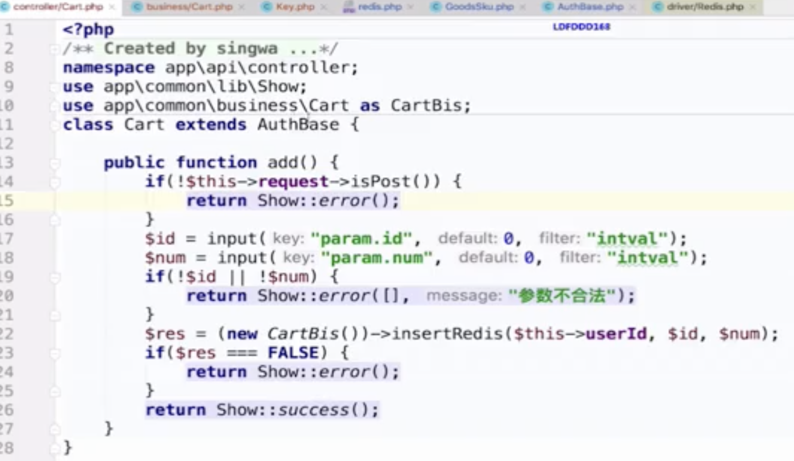
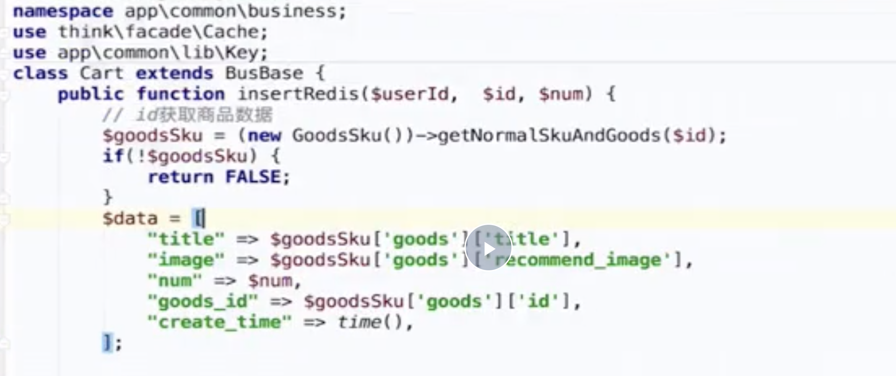
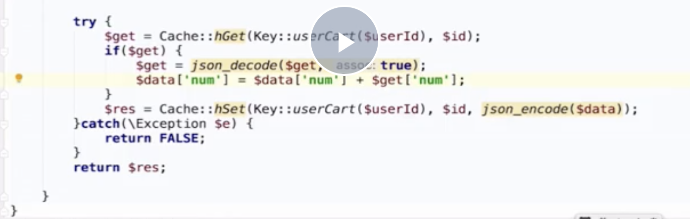

##### 第2章 基础环境安装

###### 2.1 虚拟主机


##### 第3章 TP6基础知识


1、安装方式：Tp6只能通过composer安装

2、类自动加载方式：Tp6 composer；Tp5 composer+自己实现一套

3、Tp6严格模式；支持更多的psr规范

4、组件独立，ORM、模板引擎

5、中间件改进，使用管道模式来实现中间件，简洁有序

6、引入Filesystem组件


返回json数据

~~~php
public function index(){
	$result = [
		"status" => 0,
		"message" => "success",
		"data" => [
			"user_id" => 1200,
			"user_name" => "chenglh"
		]
	];

	return json($result);
}
~~~

状态码和请求头信息：

~~~php
public function index(){
	$result = [
		"status" => 0,
		"message" => "success",
		"data" => [
			"user_id" => 1200,
			"user_name" => "chenglh"
		]
	];

	$header = [
		"token" => "1123434xaipdfap"
	];
	return json($result, 200, $header);
}
~~~


###### 3.1 $request对象

baseController.class.php

~~~php
/**
 * 构造方法
 * @access public
 * @param App $app 应用对象
 */
public function __construct(App $app)
	{
	$this->app = $app;
	$this->request = $this->app->request;

	// 控制器初始化
	$this->initialize();
}
~~~

App对象

~~~php
/vendor/topthink/framework/src/think/App.php
//最主要是 继承了 Container容器类
class App extends Container
{
	//.....
}

//再点击进入 Container容器类中，找到如下方法：容器的灵魂 make()
/**
 * 获取容器中的对象实例
 * @access public
 * @param string $abstract 类名或者标识
 * @return object
 */
public function get($abstract) {
	if ($this->has($abstract)) {
		return $this->make($abstract);
	}

	throw new ClassNotFoundException('class not exists: ' . $abstract, $abstract);
}
/**
* 创建类的实例 已经存在则直接获取
* @access public
* @param string $abstract 类名或者标识
* @param array $vars 变量
* @param bool $newInstance 是否每次创建新的实例
* @return mixed
*/
public function make(string $abstract, array $vars = [], bool $newInstance = false) {
	$abstract = $this->getAlias($abstract);

	if (isset($this->instances[$abstract]) && !$newInstance) {
		return $this->instances[$abstract];
	}

	if (isset($this->bind[$abstract]) && $this->bind[$abstract] instanceof Closure) {
		$object = $this->invokeFunction($this->bind[$abstract], $vars);
	} else {
		$object = $this->invokeClass($abstract, $vars);
	}

	if (!$newInstance) {
		$this->instances[$abstract] = $object;
	}

	return $object;
}
~~~


$request

~~~php
public function index() {
	dump($this->request->param());
	dump($this->request->get("sex"));
	dump($this->request->get("age", 18, "intval"));//默认值，类型强制转换
	dump($this->request->post());
}
~~~


复制 dist 、start、src目录到 public/admin目录下

~~~html
# vi public/admin.html

<script>
    location.href='admin/start'
</script>
~~~


修改项目开发环境

~~~html
# vi start/index.html
<script>
  layui.config({
    base: '../src/' //指定 layuiAdmin 项目路径，本地开发用 src，线上用 dist
    ,version: new Date().getTime() //  缓存设置
  }).use('index');
</script>
~~~


修改配置文件

~~~html
# vi src/config.js
,name: 'blmCMS'
,tableName: 'layuiAdmin' //本地存储表名
,MOD_NAME: 'admin' //模块事件名
~~~


获取路由上参数

~~~html
# vi src/views/category.html
<script type="text/html" template>
    {{ layui.router().search.id }}
</script>

<script>
    var r = layui.router().search;
    layui.use('admin', function(){
       var admin = layui.admin;
       admin.on('hash(id)', function(router){
           //
       });
    });
</script>
~~~


验证码

~~~html
$ composer require topthink/think-captcha
~~~


需要开启session


thinkphp6与layuiadmin部署：

https://www.kancloud.cn/monday/thinkphp6/1802421


Layuiadmin 打印内容

```js
var field = data.field;
alert(JSON.stringify(field));
```


==购物车添加==

~~~php
/cart/add
~~~


==控制层==



==逻辑层处理==






