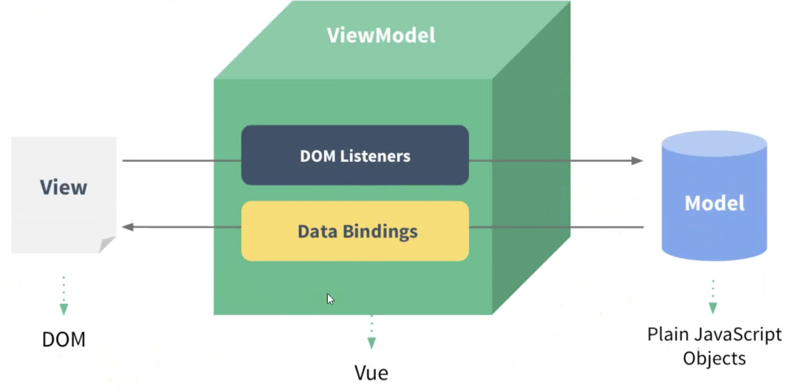
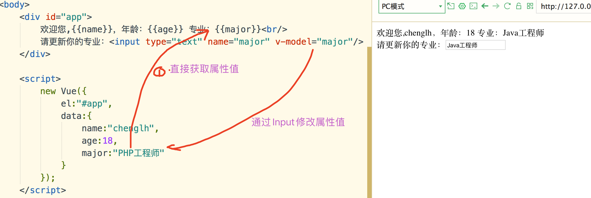

> 什么是虚拟DOM

传统的web开发，是利用jQuery操作DOM,这是非常耗资源的。
我们可以在JS的内存里构建类似于DOM的对象，去拼装数据，拼装完整后，把数据整体解析，- -次性插入到html
里去。这就形成了虚拟DOM。
Vue1.0没有虚拟DOM，Vue2.0改成 了基于虚拟DOM。

Vue是一个渐进式的js框架，只重视图层，结合了html+css+js，简单易用，有很好的生态，而且vue体积小，速度快，优化到位。

SSM的整合，搞定了后端一套：增删改查。

==1、CDN是一个内容分发网络，实现加速策略，能够人离自己最近的服务器上快速的获取外部的资源==

MVVM，=>  Model、View  、VM viewmodel：==连接视图和数据的中间件==。

demo代码：

~~~html
<!DOCTYPE html>
<html>
<head>
	<meta charset="utf-8">
	<title></title>
	
</head>
<body>
	

		{{title}}
		<input type="text" name="username" value="" v-model="title" /> <!--联动变化-->
	

	
</body>
</html>
~~~

如图所示：

在MVVM架构中，是不允许数据和视图直接通信的，只能通过ViewModel 来通信，而ViewModel就是定义了一个Observer观察者

●ViewModel 能够观察到数据的变化，并对视图对应的内容进行更新

●ViewModel 能够监听到视图的变化，并能够通知数据发生改变

至此，我们就明白了，Vue.js 就是一个MVM的实现者，他的核心就是实现了DOM 监听与数据绑定

==2、VM的实现原理==

viewmodel中内置了一个观察者，这个观察者观察两个维度。

1）观察视图的变化：当视图(如input中val)变了 ，就通知数据进行变化。

2）观察数据的变化：当数据(如接口)变了，就通知视图进行变化。

----MVVM通过VM实现了==双向数据绑定==。

微信小程序也是实现了MVVM的

获取 vue的cdn文件

~~~php
https://cdn.baomitu.com/vue
~~~

1、引入vue.js

2、在页面中使用vue

​	a、html：

​	b、js：需要有一个Vue对象(实例)

3、vue对象里有哪些东西？

~~~html

~~~

4、通过差（插）值表达式获取vue对象中的数据

~~~html

	欢迎您,{{name}}，年龄：{{age}} 
	{{[0, 11, 22, 33, 44][1]}}  <!-- 从数组中获取对应的索引值 -->
	{{{name:"chenglh22", age:"19"}.name}} <!-- 从对象中获取对应的索引值 -->
	{{ sayHello() }}  <!-- 调用方法 -->

		

~~~

5、vue中关键字

> v-model    是将标签的value值与vue实例中的data属性值进行绑定(==双向绑定==)

~~~html

	欢迎您,{{name}}，年龄：{{age}} 专业：{{major}} 
	请更新你的专业：<input type="text" name="major" v-model="major"/>

		

~~~

如图所示：

> v-on  通过配合具体事件名，来绑定vue中定义的函数

~~~html

	欢迎您,{{name}}，年龄：{{age}} 专业：{{major}} 
	请更新你的专业：<input type="text" name="major" v-on:input="updateMajor"/>

		

~~~

https://www.bilibili.com/video/BV1YE411A746?p=8

