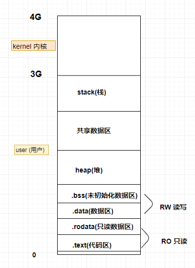

**Go基础巩固加强**

###### 第一章 指针

指针是一个代表着某个内存地址的值。Go语言保留了指针，但与c语言指针有所不同，主要表现：

1、默认值是nil

2、& 取变量地址；* 通过指针访问目标对象

3、不支持指针运算，直接用  " . " 访问目标成员

~~~go
var a int = 10
var p *int = &a

*p = 100 // 这里是 取值运算符 *，也叫解引用或间接引用。 修改内存值为250 
~~~

**栈帧的内存布局**

32位操作系统，2的32次方 = 4G内存

62位操作系统，2的64次方 = 16G内存

Kernel内核，操作系统的主体部分，驱动等；0-3G是用户区；data区是全局初始化的存放的区，

栈帧：用来给函数运行提供内存空间。取内存于stack上。

当函数调用时，产生栈帧。函数调用结束，释放栈帧。

栈帧存储：1、局部变量，2、形参。（形参与局部变量存储地位等同）3、内存字段描述值（记录栈基、栈顶指针位置）

stack开辟一片空间来运行 main()，main()里边有函数Test()，再在 main在相邻内存空间再开辟一块来运行

Test()函数。函数运行完要释放内存空间。

~~~go
func test(m int) {
	var b = 10
}
func main() {
	var a = 10
	var p *int = &a
    test(10)
}
~~~

指针使用注意：

空指针：未被初始化的指针。var  p  *int

野指针：被一片无效空间初始化。var p *int = 0xc00001c080  程序直接飘红，不能编译通过。

以上使用指针变量，都需要另一个变量来跟随取地址。可以使用new来初始化指针变量，而new出来的内存地址是在 heap（堆）上面的。

~~~go
func main() {
	//在 heap 上申请一片内存地址空间
	var p *int
	p = new(int) //8字符空间大小，p是地址，对应的值是，默认类型的零值
	fmt.Println(*p)
}
~~~

~~~go
var a int = 10
var b int = 20 //b是一个变量名称，指向的是一个内存地址； b也是左值

a = b //b是右值，即变量b所指向的值
~~~

变量存储：等号左边的变量，代表变量所指向的内存空间。

等号右边的变量，代表变量内存空间存储的数据值。

~~~go
func test () {
	var p *int
	*p = 100
}
//函数是在栈帧上的，运行完回收内存空间
//如果参数是传指针变量，因为指针是存放在堆空间上的，没有在栈空间上，所以不会被消毁
~~~

栈 stack的空间在32位操作系统上是 1M-8M，但是heap堆却 1G+

如果指针不再使用，可以置成 nil，gc是去回收。

**函数new**

表达式 new(T) 将创建一个T类型的匿名变量，所做的是为T类型的新值分配并清零一块内存空间，然后将这块内存空间的地址作为结果返回，而这个结果就是指向这个新的T类型值的指针值，返回的指针类型为 *T。

new创建的内存空间位于heap上，空间的默认值为数据类型的默认值。如， var p = new(int) 则 *p 为 0。

我们只需使用 new()函数，无需担心其内存的生命周期或怎样将其删除，因为Go语言的内存管理会帮我们打理一切。

传地址(引用)：将地址值作为函数参数、返回值后传递。

传值(数据值)：将实参的值，拷贝一份给形参。

~~~go
func swap(a, b int)  {
	a,b = b, a
	fmt.Println("swap : a = ",a," b= ", b)
}

func main()  {
	a,b := 10, 20
	swap(a, b)
	fmt.Println("main : a = ",a," b= ", b)
}
/**
swap : a =  20  b=  10
main : a =  10  b=  20
*/
~~~

**图解程序：**

**引用传参**

~~~go
func swap(a, b int)  {
	a,b = b, a
	fmt.Println("swap : a = ",a," b = ", b)
}

func swap1(x, y *int) {
	*x,*y = *y, *x //如果没有星号就是 地址交换，得不预期的值
	fmt.Println("swap : x = ", *x," y = ", *y)
}

func main()  {
	a,b := 10, 20
	swap(a, b) // 20 10
	swap1(&a, &b) // 传地址：20 10
	fmt.Println("main : a = ",a," b = ", b) //经过swap1() a b底层值已被修改
}
~~~

**图解程序**

传引用：在A栈帧内部，修改B栈帧中的变量值。

###### 第二章 切片

为什么要用切片：

1、数组的容量固定，不能自动拓展；

2、值传递。数组作为函数参数时，将整个数组值拷贝一份给形参。

在Go语言中，几乎可以在所有场景中，使用切片代替数组。

一个 slice由三部分构成：指针、长度和容量。

指针指向第一个slice元素对应的底层数组元素的地址，要注意的是 slice的第一个元素并不一定是数组的第一个元素。

切片的本质：不是一个数组的指针，来用操作数组内部元素

**切片并不是数组或数组指针，它通过内部指针和相关属性引用数组片段，以实现变长方案**

~~~go
type slice struct {
	*p
	len()
	cap()
}
~~~

切片的使用：

切片名称：a[low : high : max]

low : 起始下标位置(包括)

High：结束下标位置(不包括)

容量 : cap = max - low

Len = high - low

截取数组，初始化时，没有指定切片容量时，切片容量跟随原底层数组(切片)

~~~go
arr := [6]int{1,2,3,4,5,6}
s := arr[1:3:5] //s = []int{2,3} 长度是2 容量：5-1 = 4
//s := arr[1:3] //容量是max跟随底层数组值,6-1 = 5
~~~

切片的创建：

1、自动推导类型创建切片   slice := []int{1,2,3,4,5,6}

2、slice :=  make([]int, 长度, 容量)

3、slice := make([]int, 长度)  //没有指定容量， 容量值跟随长度。

注意：make 只能创建 slice、map、和 channel，并且返回一个有初始值(非零)的对象。

切片做函数参数 ---- 传引用，(传址)，切片和Map在函数参数中都是引用类型

append(切片对象, 待追加元素)

练习1：slice上过滤空串。

~~~go
//{"red", "", "black", "", "", "blue", "pink"}

func fn1(data []string) []string {
	//output := data[:0] //在原切片上截取一个长度为0的切片 == make([]string, 0)
	//for _,valStr := range data{
	//	if valStr != "" {
	//		output = append(output, valStr)
	//	}
	//}
	//
	//return output

	//直接在原串上挪动值的位置,不过这种方法会破坏底层原数据
	iNum := 0
	for _,str := range data {
		if str != "" {
			data[iNum] = str
			iNum++
		}
	}
	return data[:iNum]
}

func main() {
	data := []string{"red", "", "black", "", "", "blue", "pink"}
	slice1 := fn1(data)

	fmt.Println(slice1)
}
~~~

练习2：消除[]string中重复字符串。

~~~go
//消除 重复字符串
func fn2(data []string) []string {
	//有一个元素的切片
	var outSlice = data[:1]
	for _,val := range data {
		var flag = true
		for _,sVal := range outSlice { //循环已有切片
			if sVal == val {
				flag = false
				break
			}
		}
		if flag {
			outSlice = append(outSlice, val)
		}
	}

	return outSlice
}

func main() {
	data := []string{"red", "red", "black", "pink", "blue", "blue", "pink","white"}
	slice1 := fn2(data)
	fmt.Println(slice1)
}
~~~

copy 函数在 两个  slice 间复制数据，复制长度以 len 小的为准，两个 slice 指向同一底层数组，直接对应位置覆盖。

copy(目标位置切片，源位置切片)

切片拷贝：对应的下标进行覆盖。

~~~go
func main() {
	//copy(dst, src)
	data := [...]int{0,1,2,3,4,5,6,7,8,9}
	s1 := data[8:]	// {8,9}
	s2 := data[:5]  // {0,1,2,3,4}
	//copy(s2, s1)	// s1的值去覆盖 s2 得到 [8 9 2 3 4]
	copy(s1, s2) //这里覆盖后，s1 = {0，1}

	fmt.Println(s1)
}
~~~

练习：删除slice中间某个元素并保存原有元素顺序。如：{5, 6, 7, 8, 9}  -> {5, 6, 8, 9}

~~~go
func fn3(data []int, idx int) []int {
	// {5 ,6, 7, 8, 9}  即 8 9往前拷贝
	//方法一：
	//copy(data[idx:], data[idx+1:])
	//return data[:len(data)-1]

	//方法二：
	return append(data[:idx], data[idx+1:]...)
}

func main() {
	data := []int{5, 6, 7, 8, 9}
	ret := fn3(data, 2)
	fmt.Println(ret)
}
~~~

###### 第三章 Map

字典、映射。 Key -- value  key：唯一、无序，不能是引用类型数据。即key不能变化。

map是无序的。每次打印出的顺序可能不一样。

~~~go
func main() {
	var m1 map[int]string //只是声明一个map，没有初始化，为空 nil map
	fmt.Println(m1 == nil) //true
	//m1[1] = "luffy"  //nil 的map 没初始化，不使用使用 panic: assignment to entry in nil map

	//初始化
	m2 := map[int]string{}
	m3 := make(map[int]string)
	fmt.Println(m2, m3) // map[] map[]
	
	m4 := make(map[int]string, 10) //第二个参数是指定容量
	fmt.Println(m4) // map[]
}
~~~

map可以自动扩容，只不过不用借助类似 append函数，直接赋值即可。如 m1[10] = "Nini"，在赋值过程中，如果 key重复，新值会覆盖旧值。

但是！ 对于 map而言，可以使用  len() 函数，但是不能使用 cap()函数。

点进去看源码，cap()的注释上有标明，array、slice、channel可以使用  cap

make()的源码也看到注释标明哪些类型可以使用

创建方法：

~~~go
1、var m1 map[int]string -- 不能存储数据

2、m2 := map[int]string{}  -- 能存储数据

3、m3 := make(map[int]string)  --默认 len =0

4、m4 := make(map[int]string, 10)
~~~

初始化：

~~~go
var m = map[int]string{1:"lufei", 250:"zhansan"} //类型推导方式
//m =  map[1:lufei 250:zhansan]
~~~

赋值：

~~~go
m2 := make(map[int]string, 10) //如果长度不够，会自动扩容
m2[0] = "chenglh"
m2[1] = "fph"
~~~

map的使用：

var m = make(map[int]string, 10)

遍历 map: 1、 for k, v := range  m   2、for k := range m    读取值 m[k]

判断 map中某key是否存在： val,ok = m[k]

Val 存在 即为有值，不存在 为 nil

Ok 值是 true 或 false

删除 map

map做函数参数时，**是引用类型传参**

delete(m, key) 函数，如果 m[key]存在即删除，如果不存在即不进行任何操作。

~~~go
//删除map中某个key
func mapDelete(m map[int]string, key int) map[int]string {
	delete(m, key)
	return m
}
//因为map做函数参数，返回值 都是传引用
//可以没有返回值。简化写法
/**
func mapDelete(m map[int]string, key int) {
	delete(m, key)
}*/
~~~

练习：接收一段英文字符串，返回一个 map ，记录每个单词出现的次数。

提示：使用 strings.Fields() 函数可提高效率。

~~~go
//如 "I love my work and I love my family too too"
//1、字符串拆分
func tjWords(str string) map[string]int {
	var tjWord = make(map[string]int)
	slice := strings.Fields(str)  //拆分方法一
	//slice := strings.Split(str, " ") //拆分方法二
	for _,valStr := range slice {
		if _,ok := tjWord[valStr]; ok {
			tjWord[valStr] += 1
		} else {
			tjWord[valStr] = 1
		}
	}
	return tjWord
}
~~~

###### 第四章 struct

结构体是一种数据类型。

~~~go
type Persion struct {
	name string  //只是类型定义；name string = "test" 错误代码，不能赋值，基本定义，只有默认零值
	sex byte
	age int
}
~~~

变通变量定义和初始化：

~~~go
1、依次初始化
//顺序初始化，必须全部初始化完整
var boy1 = Person{
	"chenglh",
	1,
	20,
}

//部分初始化
var boy2 = Person{
	name: "chenglh",
	sex : 1,
	age : 20,
}

//3、声明类型，属性成员赋值
var boy3 Person
boy3.name = "mike"
boy3.sex = 1
boy3.age = 20
~~~

结构体比较

1、只支持 == 和 != ， 不支持 大于、小于等符号

2、相同结构体类型变量(成员变量的类型，个数，顺序要一致)之间可以直接赋值。（即定义结构体属性的顺序也要一致）

~~~go
var p1 = Person{"chenglh", 1, 20}
var p2 = Person{"chenglh", 1, 20}
var p3 = Person{"chenglh", 1, 18}
fmt.Println("p1 = p2 ? ", p1 == p2) //true
fmt.Println("p1 = p3 ? ", p1 == p3) //false
~~~

函数内部使用结构体传参。

unSafe.Sizeof(指针) ： 不管在何种类型的指针，在64位操作系统下，均为 8 字节。

将结构体变量的值拷贝一份，**值传递**，很少使用，内存消耗大，效率低

~~~go
var temp Person //放在  RW 内存区，声明后即会初始化默认零值

test(temp)  //值传递，拷贝一份副本给形参，所以 test方法里修改等操作不会改变原值
~~~

嵌套结构体

~~~go
type Student struct{
	p Person
	No string
	......
}
~~~

结构体地址：

结构体变量的地址 == 结构体首个元素的地址。(结构体比较第二点中的 原因)

unSafe.Sizeof(结构体名称)  可以获得结构体所战胜的内存空间大小。

指针变量定义和初始化：

~~~go
1、顺序初始化：
var boy1 *Person = &Person{ "chenglh", 1, 20,}
//使用类型推导
//var boy1 = &Person{ "chenglh", 1, 20,}

//new关键字，都放在堆内存空间上
boy := new(Person)
boy.name = "asdf"
boy.age = 20
boy.sex = 1

fmt.Printf("boy = %p\n", boy) //结构体指针地址
fmt.Printf("&boy.name = %p\n", &boy.name) //这里的两个值是一样的
~~~

图解结构体地址引用：

结构体指针做函数返回值：

**不能返回局部变量的地址值**。-- 局部变量保存在栈帧上，函数调用结束后，栈帧释放，局部变量的地址，不再受系统骂人的话，随时可能分配给其他程序。

返回局部变量值。

###### 1.5 string

字符串拆分

~~~go
Strings.Split(str, sep) //按指定字符分割，返回的是切片

//按空格拆分
Strings.Fields(str)
~~~

判断字符串是否有前缀、后缀

~~~go
strings.HasPrefix(str, suffix string) bool

strings.HasSuffix(str, suffix string) bool
~~~

字符串处理函数:

1.字符串按指定分割符拆分:     Split
ret := strings.Split(str, ";")

2.字符串按空格拆分: Fields
ret = strings.Fields(str)

3.判断字符串结束标记HasSuffix
flg := strings.Hassuffix("test.abc", ".mp3")

4.判断字符串起始标记HasPrefix
flg = strings.HasPrefix("test.abc", "tes.")

###### 1.6 文件操作

打开、创建文件：

1、创建文件 os.Create(fileName string)  (*file ,err)  文件不存在时创建； 文件存在时，将文件内容清空。

​	参数：name 文件名称，打开文件的路径：绝对路径、相对路径。

2、打开文件 os.Open		以只读文件打开文件。文件不存在，打开失败。

​	参数：name 文件名称，打开文件的路径：绝对路径、相对路径。

3、打开文件 os.OpenFile	以只读、只写、读写方式 打开文件。文件不存在，打开失败。

​	参数1：name 文件名称，打开文件的路径：绝对路径、相对路径。

​	参数2：打开文件模式：O_RDONLY、O_WRONLY、O_RDWR

​	参数3：权限值，0666

**文件打开模式：**

| 模式        |   含义   |
| :---------- | :------: |
| os.O_WRONLY |   只写   |
| os.O_CREATE | 创建文件 |
| os.O_RDONLY |   只读   |
| os.O_RDWR   |   读写   |
| os.O_TRUNC  |   清空   |
| os.O_APPEND |   追加   |

~~~go
func main() {
	file,err := os.Create("./a.log")
	if err != nil {
		fmt.Println("create file err :", err)
		return
	}
	defer file.Close()
}
~~~

写文件：

​	按字符串写   file.WriteString(str) 返回写入的字符个数

​	回车 ；window下 \n\r ; Linux系统下 \n

​	按位置写	Seek() 获取文件的读写指针位置；

​			参数1：偏移量； 正数：向文件尾偏；负数：向文件头偏

​			参数2：偏移起始位置：

​					io.SeekStart：文件起始位置

​					io.SeekCurrent：文件当前位置

​					io.SeekEnd：文件结尾位置

​			返回值：表示从文件起始位置，到当前文件读写指针位置的偏移量。（无论是从前往后，还是从后往前读）

​	按字节写：

​			writeAt()  在文件制定偏移位置，写入 []byte，通常搭配 Seek()

​			n,_ := file.WriteAt([]byte("this word"),  offset)

按字符串写：

~~~go
func main() {
	file,_ := os.OpenFile("log.txt",os.O_CREATE|os.O_WRONLY, 0666) //读写模式
	defer file.Close()

	n, _ := file.WriteString("123")
	fmt.Println(n) //返回写入了n个字符数，如果 log.txt中已经有内容，字符串会从0开始覆盖原有字符串
    //这里代码没多少实用性 ，可用 os.O_APPEND 追加方式写入文件
}
~~~

按位置写：

~~~go
	//offset,_ := file.Seek(5, io.SeekStart) // offset = 5
	offset,_ := file.Seek(-5, io.SeekEnd)
	fmt.Println("offset = ", offset)

	//可以以读写模式打开文件，使用offset偏移光标位置，然后写入文件
	//即可以修改覆盖文件内容
~~~

读文件：

https://www.bilibili.com/video/BV1TK4y1a7ex?p=34

