phpstudy

~~~php
https://www.xp.cn/download.html
~~~

> php工具

~~~php
https://www.php.cn/xiazai/gongju
~~~

Hbuildx

typora

localhost/index.php/setup

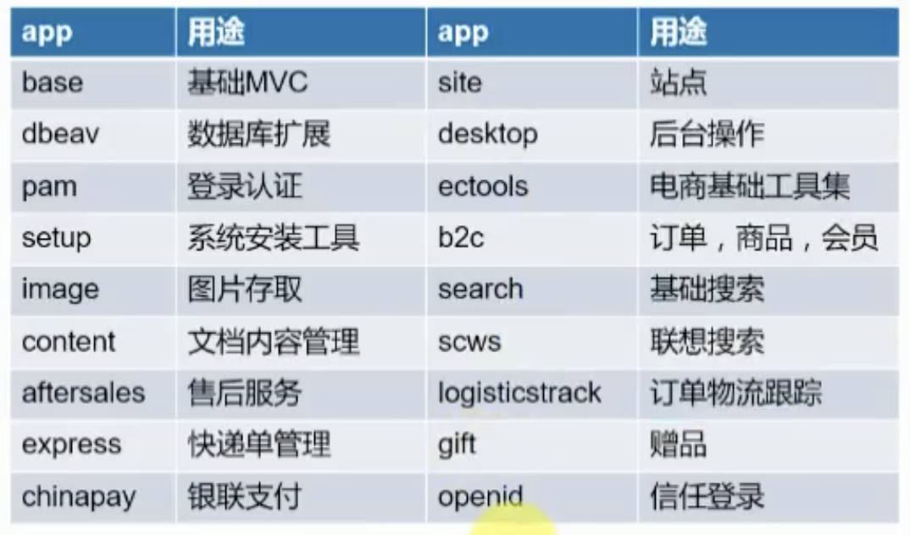

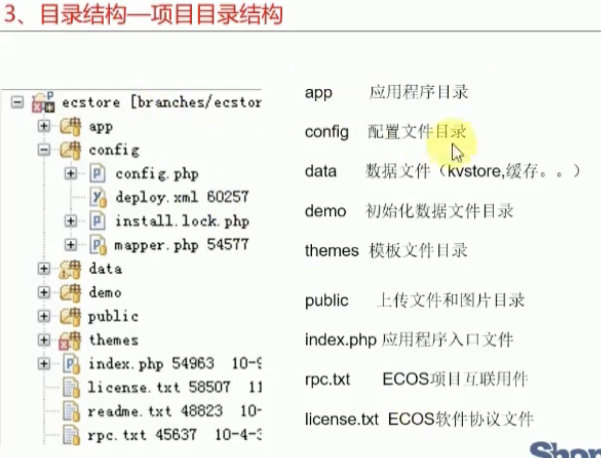

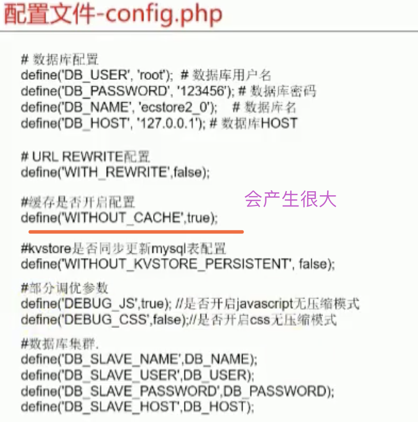

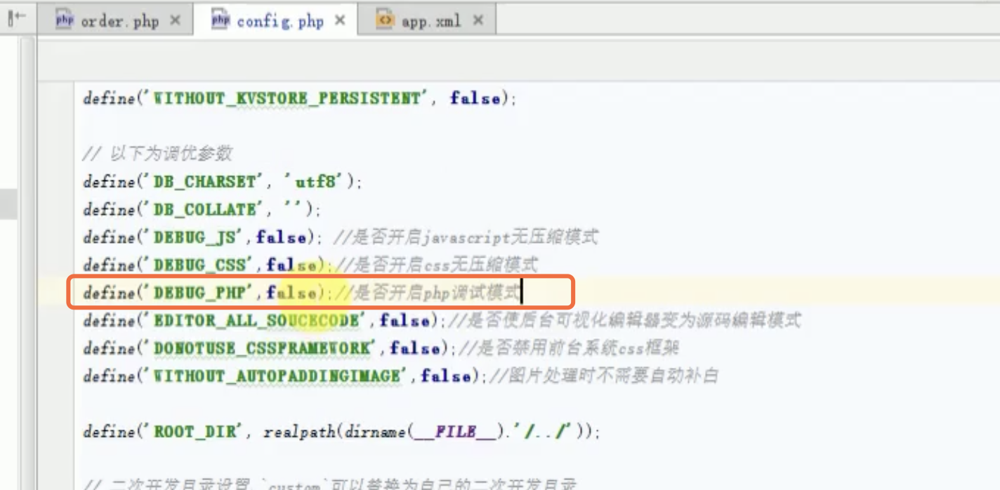

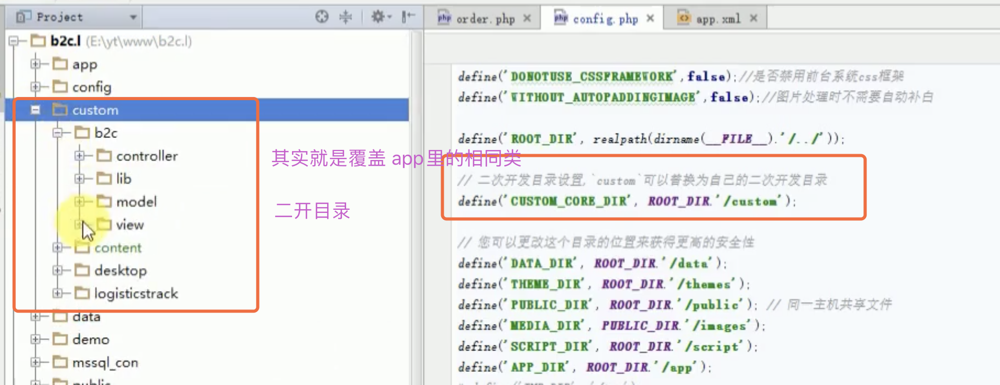

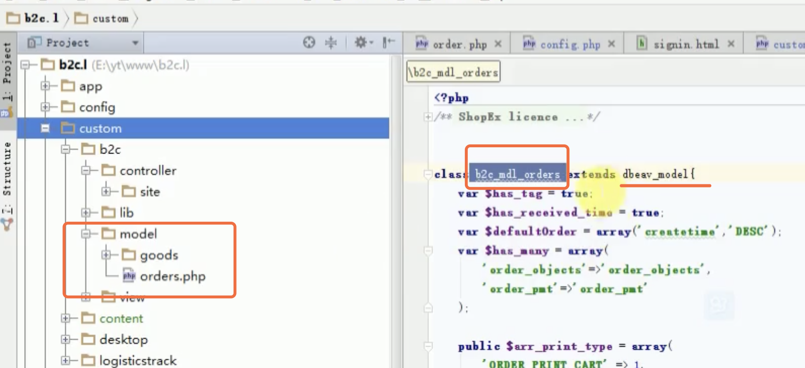

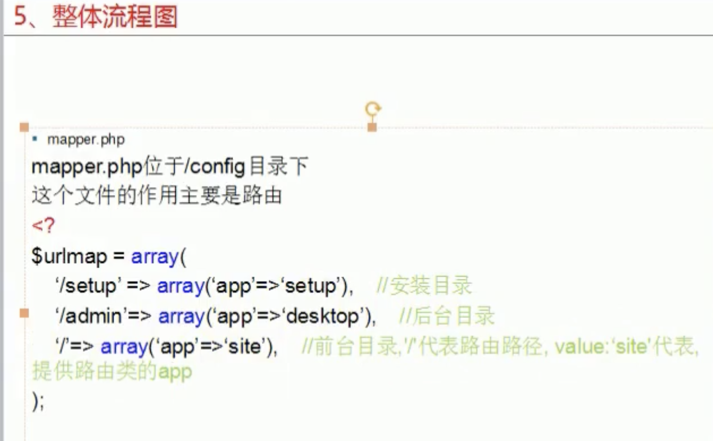

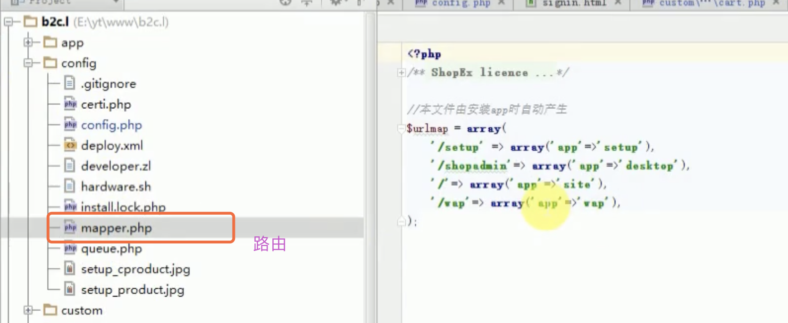

> 案例：路由拆分

Localhost/index.php/product-168.html

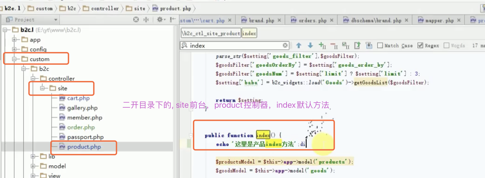

==需要配合 config.php中的设置==

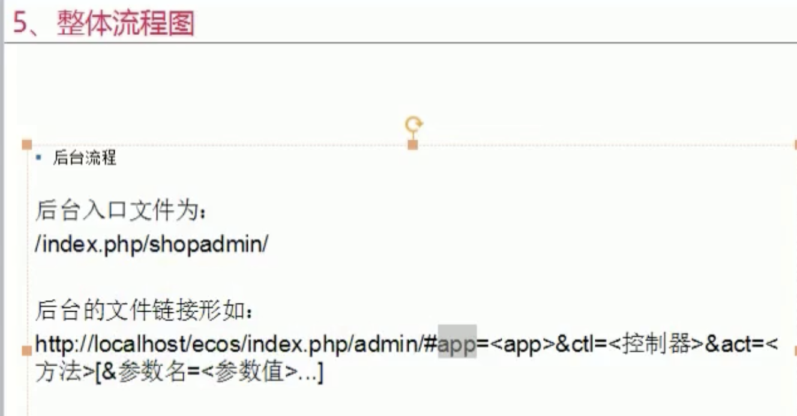

命令行方式安装：

~~~php
php -v
~~~

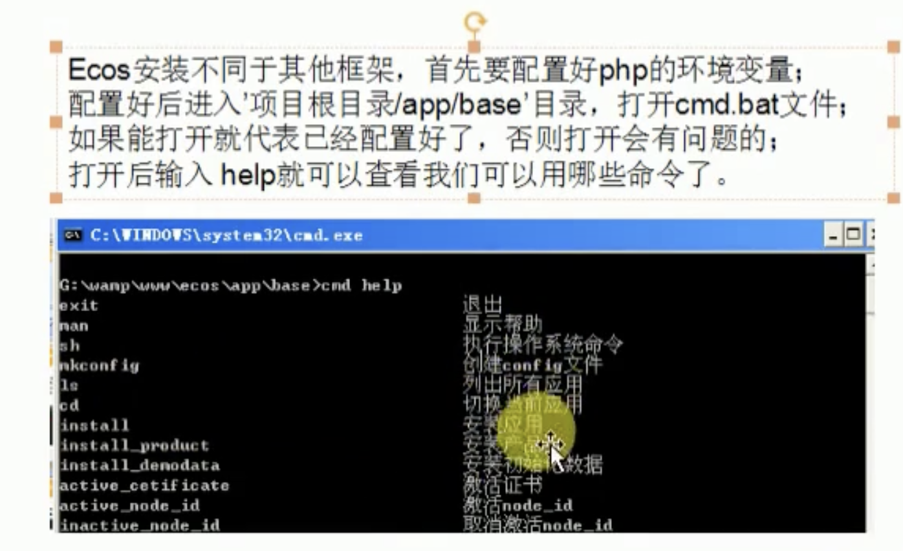

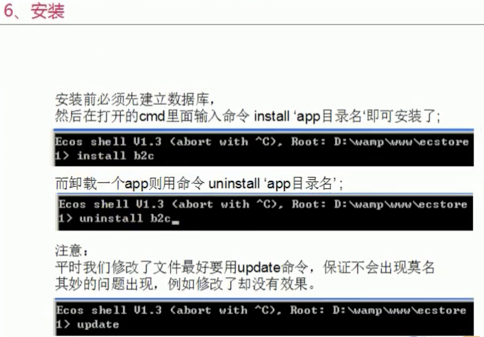

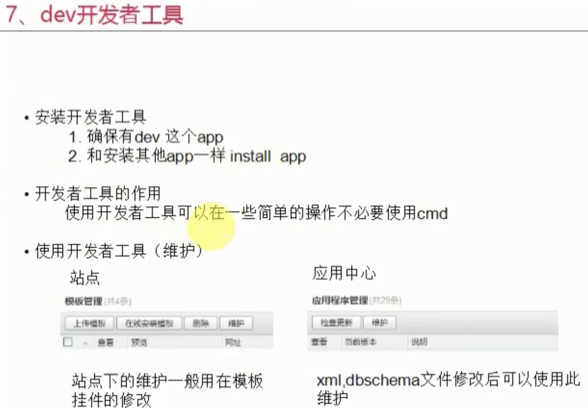

