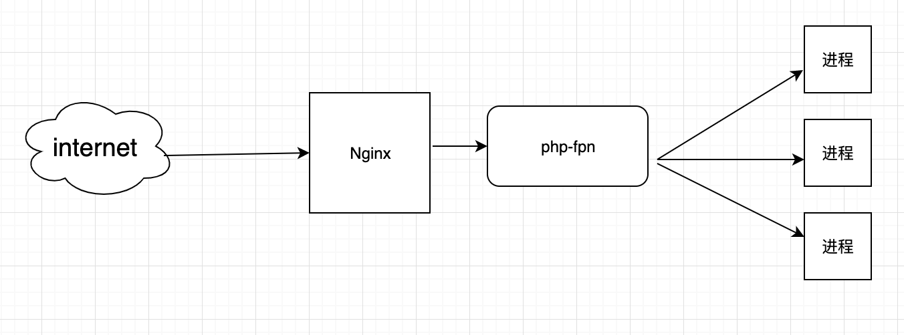

##### 全面解读PHP面试

------

1、PHP基础知识

2、Javascript、JQuery、Ajax基础知识

3、Linux基础知识

4、Mysql基础与优化

5、程序设计题

6、PHP框架基础知识

7、算法、逻辑思维

8、高并发解决方案


##### 程序员晋级

------

PHP中级程序员

PHP高级程序员

服务端技术专家

架构师

君子不器，先要为器，器中成道


##### 常见经典面试题

------

1、什么是引用变量？在PHP当中，用什么符号来定义引用变量？

2、要求写出JQuery中，可以处理Ajax的几种方法

3、写出尽可能多的Linux命令

4、写出三种以上Mysql数据库存储引擎名称

5、编写一个在线留言本，实现用户在线留言功能

6、谈谈你以MVC的认识，介绍几种目前比较流行的MVC框架

7、请写出常见的排序算法

8、PHP如何解决网站大流量与高并发的问题


##### 第一讲-PHP基础知识

------

###### 1、引用变量概念及其定义

概念：在PHP中引用意味着用不同的名字访问同一个变量内容。

定义：& 符号

原理：COPY  ON WRITE

```php
<?php
//定义一个数组变量，在内存空间中开劈一段内存空间存放变量
$a = range(0, 1000);

//定义一个变量b，将a变量的值赋给b，但并不会开劈新内存空间存放变量b，而是将b指向a地址
//COW : Copy On Write
$b = $a; //如下图一所示

//变量a重新写操作，虽然值一样，可确实是重新写过值了
$a = range(0, 1000);//如下图二所示
```


代码上查看对应结果，使用memory_get_usage() 获取内存消耗的函数

```php
<?php
$a = range(0, 1000);
var_dump(memory_get_usage());
$b = $a;
var_dump(memory_get_usage());
$a = range(0, 1000);//重新赋值，内存变动大
var_dump(memory_get_usage());

得到结果
int(373392)
int(373392)
int(402112)
```

```php
<?php
$a = range(0, 1000);
var_dump(memory_get_usage());
$b = &$a;   //$a与$b是同一个引用地址，$a变或$b变，都是指向已经开劈空间地址
var_dump(memory_get_usage());
$a = range(0, 1000);//依旧使用原来的内在地址
var_dump(memory_get_usage());

得到结果
int(372824)
int(372848)
int(372848)
```


------

Windows下安装xdebug扩展方法：

```
[Xdebug]
zend_extension="D:/phpstudy/Extensions/php/php7.3.4nts/ext/php_xdebug.dll"
;启用性能检测分析
xdebug.profiler_enable=on
;启用代码自动跟踪
xdebug.auto_trace=on
;允许收集传递给函数的参数变量
xdebug.collect_params=on
;允许收集函数调用的返回值
xdebug.collect_return=on
;指定堆栈跟踪文件的存放目录
xdebug.trace_output_dir="D:/phpstudy/debuglog"
;指定性能分析文件的存放目录
xdebug.profiler_output_dir="D:/phpstudy/debuglog"
xdebug.profiler_output_name = cachegrind.out.%t.%p
```

Linux下安装xdebug扩展，下载扩展包

------

代码测试案例：

```php
<?php
// zvar变量容器
$a = range(0,3);
xdebug_debug_zval('a');

//结果集分析如下：
//变量a，地址变量个数是refcount=1，is_ref=0是否地址引用, {array是变量具体值}
```


```php
<?php
$a = range(0, 3);
xdebug_debug_zval('a');
//定义变量b，将a赋值给b
$b = $a;
xdebug_debug_zval('a');
//当前变量a地址中变量个数是2
```


```php
<?php
$a = range(0, 3);
xdebug_debug_zval('a');
//定义变量b，将a赋值给b
$b = $a;
xdebug_debug_zval('a');
//当前变量a地址中变量个数是2
$a = range(0, 3);
xdebug_debug_zval('a');//变量a又重新申请内存空间
```


------

地址引用测试代码

```php
<?php
$a = range(0, 3);
xdebug_debug_zval('a');
//定义变量b，将b地址指向a
$b = &$a;
xdebug_debug_zval('a');
$a = range(0, 3);
xdebug_debug_zval('a');//地址变量个数为2，是地址引用
```


------

```php
<?php
    $a = range(0,3);
	$b = &$a;
	unset($b); //unset只会取消引用，不会销毁空间
	echo $a;
```


------

```php
<?php
//对象本身就是引用传递
class Person{
    public $name = "zhangsan";
}
$p1 = new Person;
xdebug_debug_zval('p1');
$p2 = $p1; //没有COW
xdebug_debug_zval('p1');
$p2->name = "lisi";
xdebug_debug_zval('p1');
```


------

###### 2、常量及数据类型考点

真题回顾：

(1)PHP中字符串可以使用哪三种定义方法及各自的区别是什么？

定义方式：

单引号：单引号不能解析变量，单引号不能解析转义字符，只能解释单引号和反斜线本身，变量和变量、变量和字符串，字符串和字符串之间可以用 . 连接

双引号：双引号可以解析变量，变量可以使用特殊字符和{}包含，双引号可以解析所有转义字符，也可以用  .  连接

**单引号效率要高于双引号**

```php
$str = 'abcdef$ag'; //abcdef$ag 不解析变量
$str = "abcdef{$a}g";//用于区分$a还是$ag
$sql = "select * from user where name='{$name}' ";
$sql = 'select * from user where name=\'' . $name. '\'';
```

heredoc和newdoc

两者都是用来处理大文本，具体区别：

Heredoc类似于双引号

Newdow类似于单引号

```php
$abc = "vvvv";
$str = <<<EOT
$abc
EOT;

//单引号，不解析变量
$str = <<<'EOT'
$abc
EOT;
```

数据类型

```php
//三大数据类型(标量、复合、特殊)
浮点类型
    浮点类型不能运用到比较运算中
$a = 0.1;
$b = 0.7;
if ($a + $b == 0.8) {
    //不会进入当前判断的 $a + $b = 0.7999 与 0.8比较为false
}
布尔类型
    flase的七种情况
    0，0.0，' '，'0'，false，array()，NULL
    //整型0，浮点0.0，布尔false，空字符串，0字符串，空数组，NULL
数组类型
    超全局数组
    $GLOBALS、$_GET、$_POST、$_REQUEST、$_SESSION、$_COOKIE、$_SERVER、$_FILES、$_ENV
    //$GLOBALS包含了后面所有的内容，少用$_REQUEST
    $_SERVER['SERVER_ADDR'] 服务器端的IP地址
    $_SERVER['SERVER_NAME'] 服务器名称
    $_SERVER['REQUEST_TIME'] 服务器的时间
    $_SERVER['QUERY_STRING'] 请求地址问号后面的一大串
    $_SERVER['HTTP_REFERER'] 当前请求的上一级页面
    $_SERVER['HTTP_USER_AGENT'] 请求头信息
    $_SERVER['REMOTE_ADDR'] 客户端IP地址
    $_SERVER['REQUEST_URI'] /index.php
    $_SERVER['PATH_INFO'] 处理请求中的路由
    http://www.baidu.com/index.php/user/reg?status=go
    
NULL三种情况
    直接赋值为NULL、未定义的变量、unset销毁的变量

常量
    定义：const、define
    const更快，是语言结构
    define是函数
    const可以定义类的常量，define不能
    常量一经定义，不能被修改，不能被删除
预定义常量
    __FILE__、__LINE__、__DIR__、__FUNCTION__、__CLASS__、__TRAIT__、__METHOD__、__NAMESPACE__
```

面试真题

```php
//写出显示客户端IP与服务器IP的代码
//__DIR__  文件路径 E:\www\www.test.com
//__FILE__表示什么意思，文件路径+脚本名字如 E:\www\www.test.com\demo6.php
```

------

###### 3、运算符考点

真题回顾

foo()与@foo()之间的区别

@错误控制器，产生的任何错误信息都被忽略掉

延伸：PHP所有运算符考点


延伸考点：运算符的**优先级**

递增/递减  》！ 》 算术运算符   》 大小比较  》 (不)相等比较  》 引用  》 位运算符 (^) 》 位运算符 (|)  》逻辑与 》逻辑或  》 三目  》 赋值  >  and  >  xor  >  or

常用顺序：递增/递减  > ！ >  逻辑与  >  逻辑或  >  三目   >  赋值


延伸考点：比较运算符

== 和 === 的区别

==   用来比较值的关系

=== 比较值和类型的关系

等值判断，false的7种情况

```php
// 0，0.0，' '，'0'，false，array()，NULL
```


延伸考点：递增/递减运算符

```
true++ /true-- 还是true;
false++/false--还是false;

递减null值没有效果
递增null值为1

递增和递减在前就先运算符后返回；在后就先返回再运算
```


延伸考点：逻辑运算符

```php
//短路作用，$a 是赋值 true；$b 赋值 false
$a = true || $b == 3    //true
$b = false && $a == 1   //false

|| 和&& 与 or 和 and的优先级不同
$a = false || true;     //优先级 $a = (false || true) 最终 $a = true
$b = false or true;     //优先级 ($b = false) or true 最终 true
```

```php
<?php
/**
 * 下列程序中请写出打印结果
 */
$a = 0;
$b = 0;
if ($a = 3 > 0 || $b = 3 > 0) { //优先级 >  || =
    //( $a = ((3>0) || $b= 3>0) ) 得到 $a = true; $b = 0;
    $a++;//true
    $b++;//1
    echo 'a的值:' . $a . PHP_EOL;//1
    echo 'b的值:' . $b . PHP_EOL;//1
    var_dump($a, $b);//boolean true ; int 1
}
```

------

###### 4、流程控制考点

回顾真题

| 请列出3种PHP数组循环操作的语法，并注明各种循环的**区别**     |
| ------------------------------------------------------------ |
| for只能遍历索引数组                                          |
| foreach 可以遍历索引和关联数组，会对数组进行reset()操作，即数组的指针回到开头 |
| do while、list()、each() 可以遍历索引和关联数组，不会reset()，所以如果之前对数组进行了指针操作，可能是只遍历部分数据。 |

延伸考点：PHP分支考点

(1)、if......elseif  语句中只能有一个表达式为true，即多个elseif从句是排斥关系

```php
if ( exp1 ) { } //优先范围小的条件放前面，可能性大的条件放前面
elseif ( exp2 ) { } 
else { }
```

(2)、switch......case......

switch后面的控制表达式的数据类型只能是整型、浮点型或者字符串

```php
switch($var) { //数据类型只能是整型、浮点型或者字符串
    case 'xxx':
        #TODO
        break; //continue = break；如果外层再有一个 for，这里使用 continue2
    case 'yyy':
        #TODO
        break;
    default :
        #TODO
        break;
}
```

continue语句作用到switch的作用类似于break

跳出switch外的for循环，可以使用continue2，第一层跳出switch，第二层跳出for

switch......case......会生成一个跳转表，直接跳转到对应的case，效率相对高一点，条件简单，处理过程复杂情况下

注意事项：

记忆foreach的reset特性，重置指针；

分支结构switch...case执行步骤，生成跳转表，效率高，而不像if...elseif一层层去判断

```php
#真题
PHP中如何优化多个if....elseif语句？
    1、优先范围小的条件放前面
    2、可能性大的条件放前面
    3、条件简单的使用switch
```

###### 5、自定义函数及内部函数考点

变量的作用域和静态变量

延伸：函数的参数及参数的引用传递

延伸：函数的返回值及引用返回

延伸：外部文件的导入

延伸：系统内置函数


知识点：

变量的作用域也称变量的范围，即它定义的上下文背景(也是生效范围)。大部分PHP变量只有一个单独的范围，跨度同样包含了include和require引入的文件。

```html
global关键字
$GLOBALS及其他超全局数组，$_POST、$_GET、$_FILES等....
```

```php
/** 代码片段一 */
$outer = 'str';//全局变量，即函数体外的变量
function func() {
    echo $outer;//局部变量，读取不到外面的值
}

/** 代码片段二 */
$outer = 'str';//全局变量，即函数体外的变量
function func() {
    global $outer;//外部的变量拿到函数里边使用
    //或者使用 $GLOBALS['outer']
    echo $outer;//使用全局变量
}
```

静态变量仅在局部函数域中存在，但当程序执行离开些作用域时，其值并不会消失。

```
static关键字
1、仅初始化一次
2、初始化时需要赋值
3、每次执行函数该值会保留
4、static修饰的变量是局部的，仅在函数内部有效
5、可以记录函数的调用次数，从而可以在某些条件下终止递归
```

```php
function func() {
    static $a = 1;//只有第一次调用时
    echo $a ++;
}
func(); // 1
func(); // 2
func(); // 3
```

```php
<?php
#面试真题
$count = 5;
function func() {
    static $count; //默认为 null
    return $count++;
}
echo $count; // 5
++ $count; // 6

echo func();//null
echo func();//1
```

延伸考点：函数的参数

默认情况下，函数参数通过值传递

如果希望允许函数修改它的值，必须通过引用传递参数

```php
/** 代码片段一 */
$a = 1;
function func($a) {
    $a = 2;
}
func($a);
echo $a; //还是1

/** 代码片段二 */
$a = 1;
function func(&$a) { //参数引用传递
    $a = 2;
}
func($a); //只能传变量，不能传常量等
echo $a; //2
```

延伸考点：函数的返回值

省略 return ,默认返回值为NULL

```php
function &func() {
    static $b = 10;
    return $b;
}
$a = func();//a = 10
$a = &func();//a = 10
$a = 100;
echo func(); // 100
```

延伸考点：外部文件的导入

include/require语句包含并运行指定文件

如果给出路径按路径来找，否则从include_path中查找

如果include_path中也没有，则从调用脚本文件所在的目录和当前工作目录下寻找

当一个文件被包含时，其中所包含的代码继承了include所在行的变量范围

```
加载过程中未找到文件则include结构会发出一条警告，即产生 E_WARNING，脚本会继续运行；
而require不同，会发出一个致命错误，产生E_COMPILE_ERROR级别的错误，脚本中止。

require(include)/require_once(include_once)唯一区别是PHP会检查该文件是否已经被包含过，如果是则不会再次包含
```

延伸考点：系统内置函数

```php
时间日期函数：
date()、strtotime()、mktime()、time()、microtime()、date_default_timezone_set()

IP处理函数
ip2long()、long2ip()

打印处理
print()、printf()、print_r()、echo、sprintf()、
var_dump()、var_export()
区别：
echo：是语句不是函数，没有返回值，可输出多个变量值，不需要圆括号.可输出int string等简单类型
print：是语句不是函数，有返回值 1 ，只能输出一个变量，不需要圆括号.可输出int string等简单类型
print_r：是函数，可以打印复合类型，print_r($str,true)来使print_r不输出而返回print_r处理后的值
printf：是函数，有返回值，把文字格式化以后输出；
$txt = sprintf("%s world. Day number %u",'hello','2020');

序列化及反序列化函数
serialize()、unserialize()

字符串处理函数
implode()、explode()、join()、strrev()、trim()、ltrim()、rtrim()、number_format()......
join() 函数是 implode() 函数的别名；join(";", $array);
strrev() 函数反转字符串，镜向效果

数组处理函数
array_keys()   //拿key
array_values() //拿value
array_diff()   //差集
array_intersect()//交集
array_merge()  //合并
array_shift()  //将数组开头的单元移出数组
array_unshift()//将单元插入数组开头
array_pop()    //弹出数组最后一个单元(出栈)
array_push()   //在数组在尾部入栈一个或多个单元
sort()
....
```

```php
$var1 = 5;
$var2 = 10;

function foo(&$var) {
    global $var1; // 5
    $var1 += 2; // $var1 = 7
    $var2 = 4;
    $var += 3; // 8
    return $var2;
}
$var = 5;
echo foo($var) . '\n'; // 4
echo $var . '\n'; // 8
echo $var1 . '\n'; // 7
echo $var2 . '\n'; // 10

$bar = 'foo';
$var = 10;
echo $bar($var)  . '\n'; // 4
```

###### 6、正则表达式考点

```
正则表达式的作用：分割、查找、匹配、替换字符串
分隔符：/ 、#、~
通用原子：
 \d 含义是 [0-9]
 \D 含义是 [^0-9]
 \w 字母(大小写)、数字或下划线，等价于 [A-Za-z0-9_]
 \W 表示[^A-Za-z0-9_]
 \s 表示，只要出现空白就匹配
 \S 表示，非空白就匹配
元字符：
 . * ? ^ $ + {n} {n,} {n,m} [] () [^] | [-]
模式修正符：i m e s U x A D u

```

后向引用与贪婪模式

```php
$str = '<b>abc</b>';
$pattern = '#<b>(.*)<\/b>#';
preg_replace($pattern, '\\1', $str);

$str = '<b>abc</b><b>qwe</b>';
//$pattern = '#<b>(.*)<\/b>#'; 贪婪模式
//preg_replace_all($pattern, '\\1', $str); 贪婪模式下只匹配到首尾的b标签

$pattern = '#<b>(.*?)<\/b>#'; // ? 表示取消贪婪模式
//$pattern = '#<b>(.*)<\/b>#U'; // U 表示取消贪婪模式
preg_replace_all($pattern, '\\1', $str);
```

```
preg_match()
preg_match_all()
preg_replace()
preg_split()
```

中文匹配：utf-8汉字编码范围 0x4e00-0x9fa5

ANSI(gb2312)下0xb0-0xf7,0xa1-0xfe

```php
$str = '中文';
$pattern = '/[\x{4e00}-\x{9fa5}]+/u';
preg_match($pattern, $str, $match);
var_dump($match);
```

```php
//写出以139开头的11位手机号码正则表达式
$mobile = '13967890000';
$pattern = '/^139\d{8}$/';
preg_match($pattern, $str, $match);

//写一个正则表达式，取出页面中所有的img标签中的src值
$str = '';
$pattern = '##i';
preg_match_all($pattern, $str, $match);
print_r($match);
```

###### 7、文件及目录相关考点

```php
fopen()函数，用来打开一个文件，打开时需要指定打开模式
r/r+(读/读写模式，将文件指针指向文件开头)
w/w+(清空文件，没有则创建，w写模式,w+读写模式)
a/a+(追加模式，将指针指向文件末尾,没有文件则创建)
x/x+(创建)
b、t

写入函数
fwrite()
fputs()

读取函数
fread()
fgets() //一行
fgetc() //一个字符

关闭文件
fclose()

不需要fopen()打开的函数
file_get_contents()
file_put_contents()

其他读取函数
file() //整个文件读取到数组里
readfile() //读取内容，并输出到缓冲区
    
访问远程文件
开启allow_url_fopen扩展，http协议连接只能使用只读，FTP协议可只读或只写
```

延伸考点：目录操作函数

```php
名称相关：basename() 、dirname()、pathinfo()
目录读取：opendir()、readdir()、closedir()、rewinddir()
目录删除：rmdir()，目录下要为空才能删除
```

延伸考点：其他函数

```php
文件大小：filesize()
磁盘空间：disk_frree_space()、disk_total_space()
文件拷贝：copy
删除文件：unlink()
文件类型：filetype()
重命名文件或目录：rename()
文件界外取 ：ftruncate()
文件属性：file_exists()、is_readable()、is_writeable()、is_executable()、filectime()上次 inode 修改时间、fileatime()上次文件访问时间、filemtime()返回文件内容的上次修改时间
文件锁：flock()
文件指针：ftell()、fseek()、rewind()
```

```php
//在文件的开头写入helloWorld
$file = './info.txt';
$handle  = fopen($file, 'r');
$content = fread($handle, filesize($file));
$content = 'helloWorld' . $content;
fclose($handle);

$handle  = fopen($file, 'w');
fwrite($handle, $content);
fclose($handle);

//通过PHP函数的方式对目录进行遍历
$dir = './test';

//打开
//读取，文件类型是文件或目录，递归遍历
//关闭

function loopDir($dir) {
    $handle = opendir($dir);
    while(false !== ($file = readdir($handle))) //防止空目录影响遍历
    {
        echo $file . '\n';
        if ($file != '.' && $file != '..') {
            if (filetype($dir . '/' . $file) == 'dir') {
                loopDir($dir . '/' . $file);
            }
        }
    }
}
```

###### 8、会话控制技术

真题回顾

简述cookie和session的区别及各自的工作机制，存储位置等，简述cookie的优缺点。

为什么要使用会话控制技术

web是使用http协议的，而http协议是无状态的，允许服务端跟踪用户的请求，保存用户状态

Cookie存储在客户端

```php
//Cookie的操作
setcookie($name,$value,$expire,$path,$domain,$secure)
$_COOKIE();
setcookie($name, '', time()-1000);
```

Cookie的优点
存储在客户端，不会占用服务端资源；安全性问题，建议不要保存敏感的信息到cookie

Session的操作

```php
session_start()
$_SESSION;
$_SESSION = [];
session_destroy();
```

php.ini中文件配置

```php
session.auto_start
session.cookie_domain
session_cookie_lifetime
session.cookie_path
session.name            //PHPSESSID
session.save_path
session.use_cookies
session.use_trans_sid

session.gc_probability = 1
session.gc_divisor = 100 //即过期后有 1/100机会清除
session.gc_maxlifetime

session.save_handler  存储的句柄，可以文件，memcache，redis，mysql等
```

如果客户端禁用了cookie，则session_id可通过连接传递

```php+HTML
<a href="1.php?<?php echo session_name() . '=' . session_id(); ?>">下一页</a>

/** SID是 name=id形式的拼接，如果客户端禁用cookie才有值，否则没值*/
<a href="1.php?<?php echo SID; ?>">下一页</a>
```

session存储

session_set_save_handler()

MySQL、Memcache、Redis等


###### 9、面向对象考点

PHP类权限控制修饰符

```
public
protected
private
```

单一继承

方法重写

```php
class father {
    public function test() {}
}
class son extends father{
    public function test() {
        parent::test();//继承父类的test方法，再扩写
        //如果不继承，即重写test()方法
    }
}
```

延伸考点：抽象类的定义

```
abstract
```

延伸考点：魔术方法

```php
__construct() 构造函数，或者方法名与类名一样
__destruct()  析构函数
__call()
__callStatic()
__get()
__set()
__isset()
_unset()
__sleep()
__wakeup()
__toString()
__clone()
```

###### 10、网络协议考点

真题回顾

HTTP/1.1中，状态码 200、301、304、403、404、500的含义

```
200 OK
301 永久重定向
307 临时重写向

1xx  服务器端接收请求相关状态码
2xx  客户端接收返回的状态码
3xx  重定向相关状态码
4xx  客户端错误状态码
5xx  服务端错误状态码
```

延伸考点：OSI七层模型

```
物理层：建立、维护、断开物理连接

数据链路层：建立逻辑连接、进行硬件地址寻址、差错校验等功能

网络层：进行逻辑地址寻址，实现不同网络之间的路径选择

传输层：定义传输数据的协议端口号，以及流控和差错校验
协议有：TCP UDP，数据包一旦离开网卡即进入网络传输层

会话层：建立、管理、终止会话

表示层：数据的表示，安全和压缩

应用层：网络服务与最终用户的一个接口
协议有：HTTP FTP TFTP SMTP SNMP DNS TELNET HTTPS POP3 DHCP

```

延伸考点：HTTP协议的工作特点和工作原理

```
基于B/S模式
通信开销小、简单快速、传输成本低
使用灵活、可使用超文本传输协议
节省传输时间
无状态

工作原理：
客户端发送请求给服务器，创建一个TCP连接，指定端口号，默认80，连接到服务器，服务器监听到浏览器请求，一旦监听到客户端请求，分析请求类型后，服务器会向客户端返回状态信息和数据内容
```

延伸考点：HTTP协议常见请求/响应头和请求方法

```php
#常见响应头
Content-Type、Accept、Origin、Cookie、Cache-Control、User-Agent、Referrer、
X-Forwarded-For(请求端真实IP)、Access-Control-Allow-Origin(用于跨域)、Last-Modified

#请求方法
GET  //查询
POST //保存,创建
HEAD //提交信息到服务器，但是服务器不回传内容，只回头信息
OPTIONS //查询服务器信息，可测试服务器功能是否正常
PUT     //修改
DELETE  //删除
TRACE   //用于测试http

GET和POST请求的区别
GET 在后退或刷新时，参数还是不变；浏览器可缓存；在长度限制
POST会重新提交；浏览器不能缓存；无长度限制；相对安全
```

延伸考点：HTTPS协议的工作原理

```
HTTPS是一种基于SSL/TLS的HTTP协议，所有的HTTP数据都是在SSL/TLS协议封装之上传输

HTTPS协议在HTTP协议的基础上，添加了SSL/TLS握手以及数据加密传输，也属于应用层协议
```

延伸考点：常见网络协议含义及端口

```
FTP、Telnet、SMTP、POP3、HTTP、DNS
```

###### 11、开发环境及配置相关考点

你是否使用过版本控制软件？如果有是哪些版本控制软件

版本控制软件

```
集中式和分布式
CVS和SVN是集中式
Git分布式
```

延伸：PHP运行原理

```
CGI是一种协议解析器，接收请求，fork进程，通过调用php的php_execute_script函数来解析和运行php脚本，不断的新建和销毁，耗废资源。
FastCGI
```

延伸：PHP配置项


###### 12、高并发和大流量解决方案考点

并发：在某个时间点，有多少个访问点同时请求过来。


QPS：每秒钟请求或查询的数量。

吞吐量：单位时间内处理的请求数据

响应时间：

PV

UV


ab -c 100 -n 5000 待测试的网站


测试机与被测试机分开

不要对线上服务做压力测试

CPU,内存，网络等都 不超过最高限度的 70%


==前端优化==

减少HTTP请求

添加异步请求

启动浏览器缓存和文件压缩

CDN加速，把一些资源添加到CDN节点当中

建立独立的图片服务器，与web的IO分开


==服务端的优化==

页面静态化

并发处理，队列等处理，协程

数据库的优化

数据缓存

分库分表，分区操作

读写分离


防盗链

通过refer

Nginx模块，ngx_http_referer_module用于阻挡来源非法的


Nginx负载均衡

加权轮询策略，权重到服务器性能好的

IP Hash策略  变相的轮询

fair策略 选出负载最轻的服务器

能用Hash、一致必Hash策略


Nginx配置

~~~php
http{
	upstream cluster {
        ip_hash;
		server srv1 weight=10; //权重
        server srv2 weight=15; //反射代理
        server srv3 weight=20;
	}
}
~~~


###### 13、秒杀

减库存时 卡顿或并发，会同时读取到有效库存进行操作。


执行函数，设置

设置成功即表示，获取到锁

```php
x10 1function setLock(.....) {2    $script = <<<LUA3    //定义变量的语法4    local key = KEYS[1]5    local expire = ARGV[1]6    7    //写入缓存和过期时间8    if redis.call("setnx", key, 1) ==1 then9        return redis.call("expire", key, expire)10    end11    12    return 013LUA14}php
```

设置成功即表示，获取到锁

~~~php
function delLock(.....) {
    $script = <<<LUA
	local key = KEYS[1]
	return redis.call("del", key)
LUA
}
~~~


~~~php
function lock(....) {
    $retry = $this->retry; //建议获取三次
	whill ($retry-- > 0) {
		$getLock = getLock(....);
		if ($getLock) {
			return true;
        }
		usleep(1000*10*1); //休眠100毫秒
    }
    
    return false;   
}
~~~


~~~php
function run(....) {
	try {
        if (lock(...)) { //取锁成功
            //业务操作
                        
            delLock(....);
            return true;                                    
        }
        return false;        
    } catch() {
        delLock(....);
        return false;        
    }
}
~~~


整体逻辑是争夺锁，执行业务逻辑，释放锁。


##### 第二讲-分布式

Nginx 配置知识。

负载均衡


接口 去服务注册与管理中心拿到一个健康的连接，自己去调用服务。

内部也可以调用其他服务。熔断与降级  rpc


传统的 nginx + php-fpm模式




