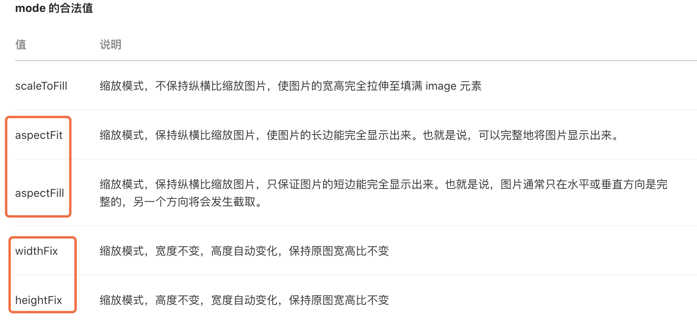
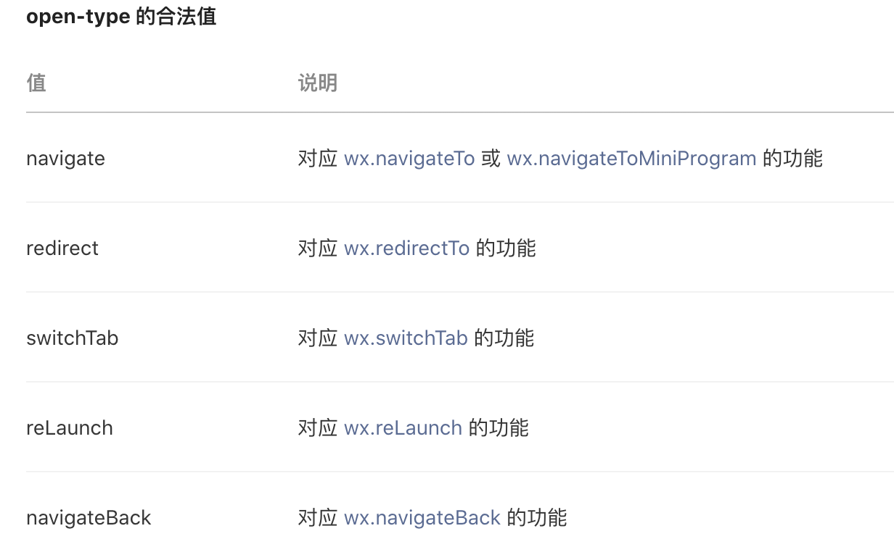
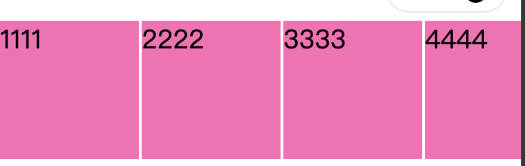
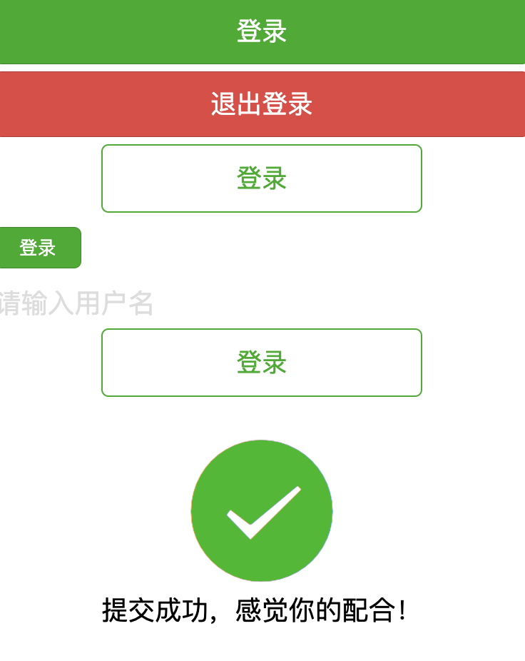
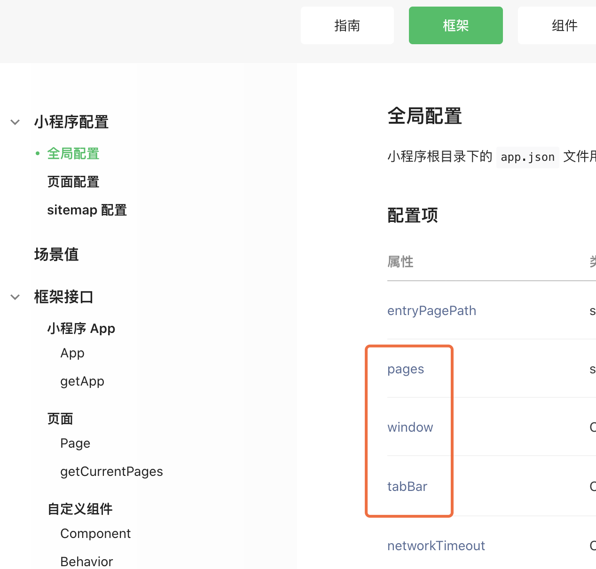

小程序开发：

~~~php
https://developers.weixin.qq.com/miniprogram/dev/framework/app-service/api.html
~~~

下载工具：

~~~php
https://developers.weixin.qq.com/miniprogram/dev/devtools/stable.html
~~~

==文本标签：==视图容器》view

~~~html
<view class="out">
	<text>chenglh is it man</text>
    <text>微信  <text decode>&nbsp; &lt;<text></text>  //这里是解析 &nbsp;标签
</view>

<text selectable space="ensp">新视觉实训     测试空格</text>   //selectable 文段可选，space解释空格
~~~

==图片标签：==媒体组件》image

~~~php
<image src="/images/xxx.jpg" mode="scaleToFill"></image> //很多模式，以下只选取几种，要试下哪种不变形
~~~

图片的链接可以访问外网的图片资源。

==navigator：== 导航 》navigator (其实是a标签，只能在小程序里跳，不能跳出外网)

~~~php
<view>
<navigator url="/pages/logs/logs" open-type="">跳转到日志</navigator> //open-type的属性值
</view>
~~~

**带不带值，能不能返回上一页：**

==横向滚动：== 视图容器 》 

~~~php
<scroll-view scroll-x>
  <view class="scrOut">
    <view class="scrBox">1111</view>
    <view class="scrBox">2222</view>
    <view class="scrBox">3333</view>
    <view class="scrBox">4444</view>
    <view class="scrBox">5555</view>
  </view>
</scroll-view>

/**index.wxss**/
.scrOut{ display: flex; flex-wrap: nowrap;}
.scrBox{width: 100px; height: 100px; background: hotpink;margin-right: 2px;flex: 0 0 100px;}
~~~

除了横向滚动还有竖向滚动。

==swiper：== 视图容器 》swiper (滑块视图容器 banner)

 ~~~php
<swiper class="banner" indicator-dots="true" indicator-color="rgba(255,255,255,0.5)" indicator-active-color="#fff" autoplay interval="3000" circular>   // 小点&自动切换&切换时间&循环  这里也有好多属性，可以参考文档
//可以设置 左右边距  previous-margin="20" next-margin="20"
  <swiper-item>
    <image src="/images/11.png"></image>
  </swiper-item>
  <swiper-item>
    <image src="/images/22.png"></image>
  </swiper-item>
  <swiper-item>
    <image src="/images/33.png"></image>
  </swiper-item>
</swiper>

.banner{height: 295rpx;}
.banner image{width: 100%; height: 295rpx;}   //这里使用了 rpx  只有微信能识别
 ~~~

实际效果：

==表单==

~~~php
<view>
  <button type="primary">登录</button>
  <button type="warn">退出登录</button>
  <button class="button-sp-area" type="primary" plain>登录</button> //plain 缕空
  <button type="primary" size="mini">登录</button>
</view>

<view>
  <form bindsubmit="onSubmit">
    //光标&设置样式&获取光标后与键盘的距离 cursor-spacing 只有手机上能看效果
    <input placeholder="请输入用户名" auto-focus placeholder-class="inputname" cursor-spacing="100"></input>
	<input placeholder="手机号" type="number"></input>
    <button class="button-sp-area" type="primary" plain>登录</button>
  </form>
</view>

button{margin: 10rpx 0;}
.button-sp-area{ margin: 10rpx auto; width: 60%;}
.inputname{color: #ddd;}
~~~

~~~php
<view style="padding:50rpx;text-align:center">
  <icon type="success" size="100"></icon>
  <view>提交成功，感觉你的配合！</view>
</view>
~~~

效果图：

==全局配置==

app.json

~~~php
{
  "pages":[
    "pages/index/index",
    "pages/logs/logs",
    "pages/news/news"
  ],
  "window":{
    "backgroundTextStyle":"light",
    "navigationBarBackgroundColor": "#fff",
    "navigationBarTitleText": "XXXX科技", // 首页或全局的标题
    "navigationBarTextStyle":"black",
    "enablePullDownRefresh":true   //设置下拉刷新数据
  },
  "tabBar":{  //设置菜单
    "list": [
      {
        "text": "首页",
        "pagePath": "pages/index/index"
      },
      {
        "text": "新闻",
        "pagePath": "pages/news/news"
      },
      {
        "text": "日志",
        "pagePath": "pages/logs/logs"
      }
    ]
  },
  "style": "v2",
  "sitemapLocation": "sitemap.json"
}
~~~

==数据渲染==

~~~php
<view>{{ title }}</view>
<view>{{ content }}</view>

<view>{{ dataArr[0] }} {{ dataArr[1] }} {{ dataArr[2] }}</view>
<view>{{ dataObj.name }} {{ dataObj.age }} {{ dataObj.sex }}</view>
~~~

js文件

~~~php
  /**
   * 页面的初始数据
   */
  data: {
      "title":"2020还能做小程序吗",
      "contents":"这里是内容部分",
      "dataArr":["数学","语言","体育"],
      "dataObj":{name:"chenglh",age:22,sex:"boy"}
  },
~~~

