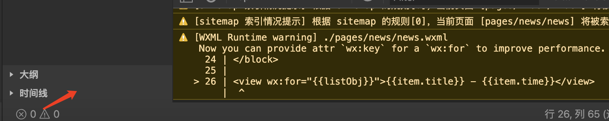
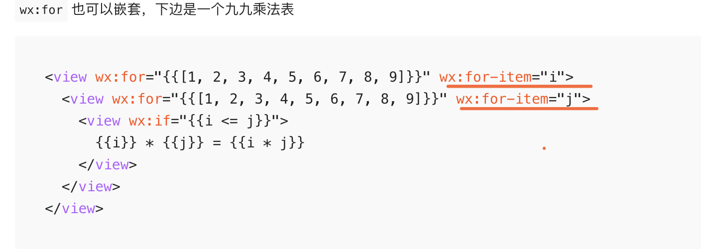
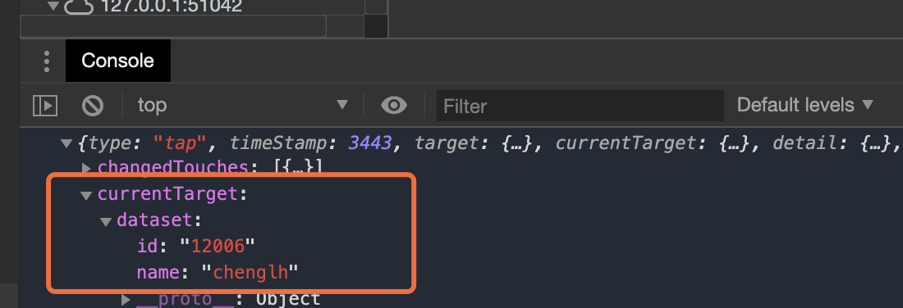
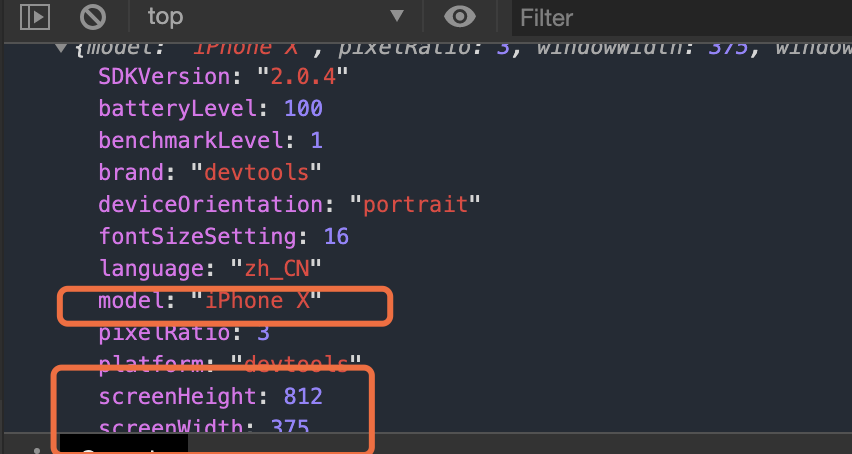
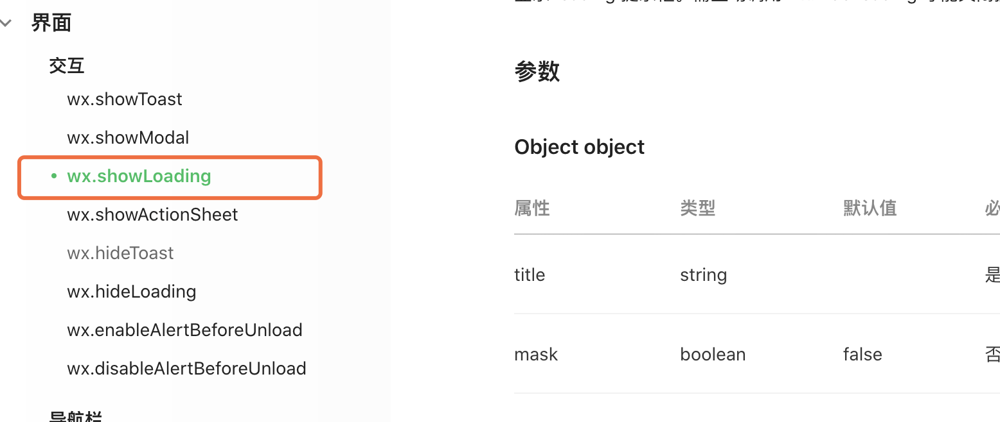
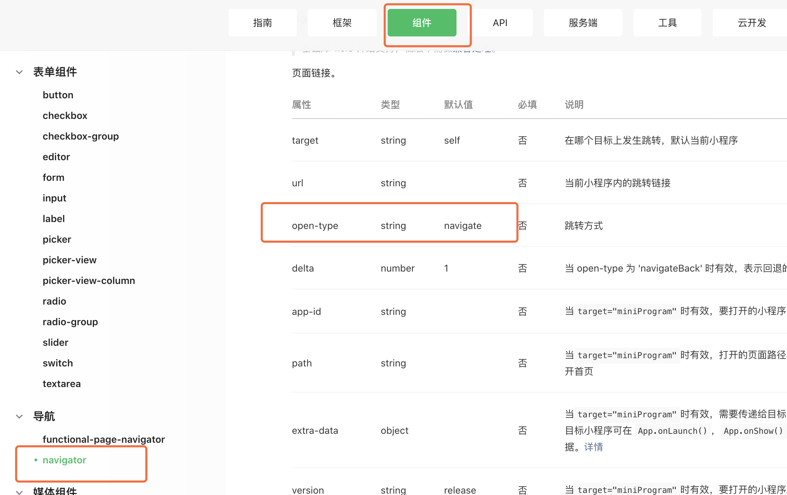
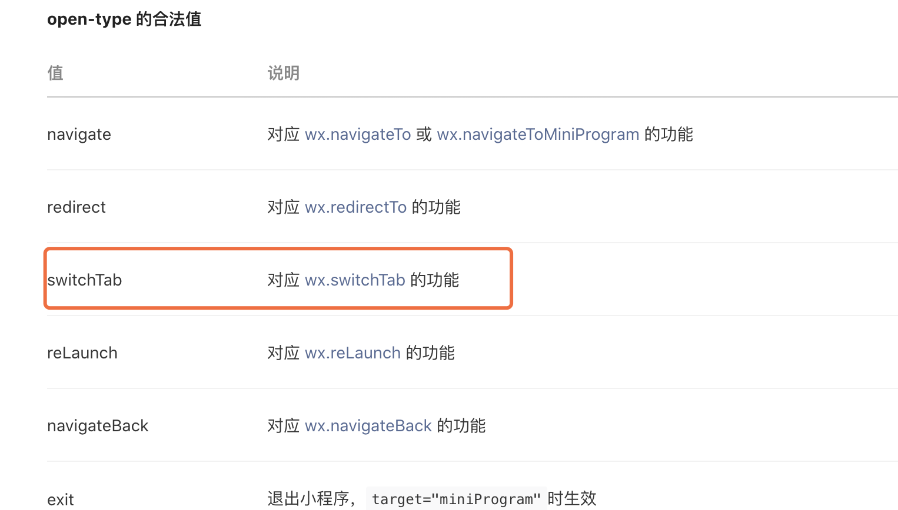
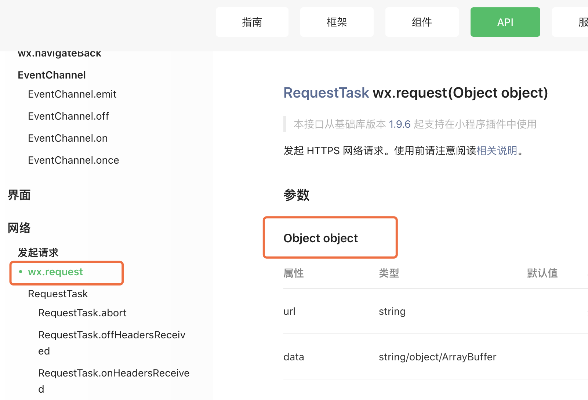

小程序开发：

~~~php
https://developers.weixin.qq.com/miniprogram/dev/framework/app-service/api.html
~~~

下载工具：

~~~php
https://developers.weixin.qq.com/miniprogram/dev/devtools/stable.html
~~~

==文本标签：==视图容器》view

~~~html
<view class="out">
	<text>chenglh is it man</text>
    <text>微信  <text decode>&nbsp; &lt;<text></text>  //这里是解析 &nbsp;标签
</view>

<text selectable space="ensp">新视觉实训     测试空格</text>   //selectable 文段可选，space解释空格
~~~

==图片标签：==媒体组件》image

~~~php
<image src="/images/xxx.jpg" mode="scaleToFill"></image> //很多模式，以下只选取几种，要试下哪种不变形
~~~

图片的链接可以访问外网的图片资源。

==navigator：== 导航 》navigator (其实是a标签，只能在小程序里跳，不能跳出外网)

~~~php
<view>
<navigator url="/pages/logs/logs" open-type="">跳转到日志</navigator> //open-type的属性值
</view>
~~~

**带不带值，能不能返回上一页：**

==横向滚动：== 视图容器 》 

~~~php
<scroll-view scroll-x>
  <view class="scrOut">
    <view class="scrBox">1111</view>
    <view class="scrBox">2222</view>
    <view class="scrBox">3333</view>
    <view class="scrBox">4444</view>
    <view class="scrBox">5555</view>
  </view>
</scroll-view>

/**index.wxss**/
.scrOut{ display: flex; flex-wrap: nowrap;}
.scrBox{width: 100px; height: 100px; background: hotpink;margin-right: 2px;flex: 0 0 100px;}
~~~

除了横向滚动还有竖向滚动。

==swiper：== 视图容器 》swiper (滑块视图容器 banner)

 ~~~php
<swiper class="banner" indicator-dots="true" indicator-color="rgba(255,255,255,0.5)" indicator-active-color="#fff" autoplay interval="3000" circular>   // 小点&自动切换&切换时间&循环  这里也有好多属性，可以参考文档
//可以设置 左右边距  previous-margin="20" next-margin="20"
  <swiper-item>
    <image src="/images/11.png"></image>
  </swiper-item>
  <swiper-item>
    <image src="/images/22.png"></image>
  </swiper-item>
  <swiper-item>
    <image src="/images/33.png"></image>
  </swiper-item>
</swiper>

.banner{height: 295rpx;}
.banner image{width: 100%; height: 295rpx;}   //这里使用了 rpx  只有微信能识别
 ~~~

实际效果：

==表单==

~~~php
<view>
  <button type="primary">登录</button>
  <button type="warn">退出登录</button>
  <button class="button-sp-area" type="primary" plain>登录</button> //plain 缕空
  <button type="primary" size="mini">登录</button>
</view>

<view>
  <form bindsubmit="onSubmit">
    //光标&设置样式&获取光标后与键盘的距离 cursor-spacing 只有手机上能看效果
    <input placeholder="请输入用户名" auto-focus placeholder-class="inputname" cursor-spacing="100"></input>
	<input placeholder="手机号" type="number"></input>
    <button class="button-sp-area" type="primary" plain>登录</button>
  </form>
</view>

button{margin: 10rpx 0;}
.button-sp-area{ margin: 10rpx auto; width: 60%;}
.inputname{color: #ddd;}
~~~

~~~php
<view style="padding:50rpx;text-align:center">
  <icon type="success" size="100"></icon>
  <view>提交成功，感觉你的配合！</view>
</view>
~~~

效果图：

==全局配置==

app.json

~~~php
{
  "pages":[
    "pages/index/index",
    "pages/logs/logs",
    "pages/news/news"
  ],
  "window":{
    "backgroundTextStyle":"light",
    "navigationBarBackgroundColor": "#fff",
    "navigationBarTitleText": "XXXX科技", // 首页或全局的标题
    "navigationBarTextStyle":"black",
    "enablePullDownRefresh":true   //设置下拉刷新数据
  },
  "tabBar":{  //设置菜单
    "list": [
      {
        "text": "首页",
        "pagePath": "pages/index/index"
      },
      {
        "text": "新闻",
        "pagePath": "pages/news/news"
      },
      {
        "text": "日志",
        "pagePath": "pages/logs/logs"
      }
    ]
  },
  "style": "v2",
  "sitemapLocation": "sitemap.json"
}
~~~

==数据渲染==

~~~php
<view>{{ title }}</view>
<view>{{ content }}</view>

<view>{{ dataArr[0] }} {{ dataArr[1] }} {{ dataArr[2] }}</view>
<view>{{ dataObj.name }} {{ dataObj.age }} {{ dataObj.sex }}</view>
~~~

js文件

~~~php
  /**
   * 页面的初始数据
   */
  data: {
      "title":"2020还能做小程序吗",
      "contents":"这里是内容部分",
      "dataArr":["数学","语言","体育"],
      "dataObj":{name:"chenglh",age:22,sex:"boy"}
  },
~~~

==判断==

~~~js
<view wx:if="{{ false }}">测试使用</view>
<view wx:else>else分支</view>

<view wx:if="{{ day==1 }}">周一</view>
<view wx:elif="{{ day==2 }}">周二</view>
<view wx:else>不知道</view>

<block wx:if="{{ day==1 }}">
  <view>周一</view>
  <view>上班</view>
  <view>购物</view>
</block>
<block wx:else>
  <view>11</view>
  <view>22</view>
  <view>33</view>
</block>
~~~

==循环输出==

~~~php
<view wx:for="{{5}}">{{index+1}} 循环5次</view>
<text decode>&nbsp;</text>
<view wx:for="{{dataArr}}" wx:for-index="i">{{i}} . {{item}}</view>  //数组
<view wx:for="{{listObj}}">{{item.title}} - {{item.time}}</view>   //对象
~~~

解决控制台中的Notic信息提示

指定 wx:key

~~~php
<view wx:for="{{listObj}}" wx:key="*this">{{item.title}} - {{item.time}}</view>
~~~

需要指定，否则上面的会覆盖下面的那个

还原默认的 js，在 js文件中写入  page，在提示中选择 某个page就会自动初始化 js模板。

~~~php
Page({

  /**
   * 页面的初始数据
   */
  data: {
    
  },

  /**
   * 生命周期函数--监听页面加载
   */
  onLoad: function (options) {
    
  },

  /**
   * 生命周期函数--监听页面初次渲染完成
   */
  onReady: function () {
    
  },

  /**
   * 生命周期函数--监听页面显示
   */
  onShow: function () {
    
  },

  /**
   * 生命周期函数--监听页面隐藏
   */
  onHide: function () {
    
  },

  /**
   * 生命周期函数--监听页面卸载
   */
  onUnload: function () {
    
  },

  /**
   * 页面相关事件处理函数--监听用户下拉动作
   */
  onPullDownRefresh: function () {
    
  },

  /**
   * 页面上拉触底事件的处理函数
   */
  onReachBottom: function () {
    
  },

  /**
   * 用户点击右上角分享
   */
  onShareAppMessage: function () {
    
  }
})
~~~

事件：

~~~js
<view data-name="chenglh" data-id="12006" bindtap="myTap" style="width:100rpx;height:100rpx;background:red;">{{nickname}}</view>

bindtap="myTap" 绑定了事件

//js脚本的实现：
  data: {
    nickname:"aaa",
  },

  myTap:function(res) {
    var vv = res.currentTarget.dataset.name;
    //console.log(vv);
    this.setData({
      nickname:vv
    })
  },
~~~

==API==

> 获取系统信息

~~~js
onLoad: function (options) {
	console.log(wx.getSystemInfoSync())
},
~~~

> 加载数据中

~~~php
onLoad: function (options) {
   wx.showLoading({
     title: '数据加载中...',
   })

  setTimeout(res=>{
     wx.hideLoading()
  },1500)
},
~~~

弹窗显示：

~~~php
  onLoad: function (options) {
    wx.showToast({
      title:"提交成功",
    });
  },
~~~

其他页面想跳到 tarbar菜单，如果没有写上参数，是打不开的；但是可以跳到其他 非 tarbar的页面

switchTab不能带参数

reLaunch 可以带参数

**方法一：**

~~~php
<navigator url="/pages/logs/logs" open-type="switchTab"> //指定跳转方式才可以跳到菜单栏
  <button type="primary">跳转到日志</button>
</navigator>
~~~

因为 logs在菜单栏下面，里边的参数又配置到 app.json中

方法二绑定事件：

~~~js
clickBtn:function(){
    //事件跳转  不能带参数,带了也会被过滤掉
    //wx.switchTab({
    //  url: '/pages/logs/logs',
    //  //url: '/pages/logs/logs?id=12313', 这里带参数是无效的
    //})

    //带参数
    wx.reLaunch({
      url: '/pages/logs/logs?id=123123',
    })
  },
~~~

==网络请求==

1、设置 勾选本地才能测试

2、API接口

3、代码

~~~php
  data: {
    resData:[],
    page:1,
    num:5
  },

  nextPage:function() {// 下一页数据
    ++this.data.num;
    this.getList(this.data.num);
  },

  getList:function(page = 1) { //独立出一个函数，分页可以调用
    wx.request({
      url: 'https://edu.newsight.cn/wxList.php',
      data:{
        page:page,
        num:this.data.num
      },
      success:res=>{
        this.setData({
            resData:res.data
        });
      }
    })
  },

  /**
   * 生命周期函数--监听页面加载
   */
  onLoad: function (options) {
    this.getList(); //加载第一页数据
  },
~~~

ES6语法：

> 1、常量

~~~php
const str = "chenglh";
//str = "asdfasdf"; 不能修改常量，报错
~~~

> 2、变量块域

~~~php
if (true) {
    let num = 3;//let 声明块域变量，外面访问不到
    console.log(num);
}
~~~

> 3、模板字面量

~~~php
var name="chenglh",age=20,sex="男";
var obj = `名字：${name} 年龄：${age} 性别：${sex}`;  //小波浪线
var ele = `
<h1>
    测试使用
    <em>实训</em>
    基地
</h1>
`;//可以为了格式化，容易辨认标签。
~~~

> 4、解构赋值

交换变量

~~~php
var a = 1;
var b = 2;
[a, b] = [b, a] //交换AB值
~~~

从数组中获得元素

~~~php
var arr = [11, 22, 33, 44];
[a, b, c, d] = arr; //PHP中的list函数
//[a, b, , d] = arr 丢弃一个值
~~~

从对象中获取值

~~~php
var obj = {user:"张三", age:18, sex:"男"};
var {user, age, sex} = obj;
console.log(user, age, sex);
~~~

定义函数

~~~php
var obb = {
	name:"张三",
	fun:function() {
		return this.name;
	}
}
console.log(obb.fun());
~~~

方法二：

~~~php
var obb = {
	name:"张三",
	fun2() {
		return this.name;//只有一层的函数，可以直接获取上层的值
	}
}
console.log(obb.fun2());
~~~

函数中的函数

~~~php
var abb = {
	name:"张三",
	fun(){
		var that = this //这里需要获取外层的变量赋值，或者使用剪头函数
		setTimeout(function(){ //函数的函数，在需要调用外面层的变量
			console.log(that.name);
		}, 1000);
	}
};
abb.fun();
~~~

箭头函数

~~~php
var abb = {
	name:"张三",
	fun(){
		setTimeout(()=>{ //使用箭头函数
			console.log(this.name);
		}, 1000);
	}
};
abb.fun();
~~~

遍历数组

~~~php
var arr = [111, 222, 333, 444];
// for (var i=0; i < arr.length; i++) {
// 	arr[i] = arr[i] + "这里是文段";
// }
// console.log(arr);
		
// var newArr = [];
// arr.forEach((item, index)=>{
// 	item = item + "文段";
// 	newArr.push(item);
// })
// console.log(newArr);
		
var newArr = arr.map((item)=>{
	return item + "文案";
})
console.log(newArr);
~~~

合并数组

~~~php
var aa = [111, 222, 333, 444];
var bb = ["aaa", "bbb", "ccc"];
// arr = aa.concat(bb)
// console.log(arr);
		
var newArr = [...aa, ...bb]; //...展开字符
console.log(newArr);
~~~

###### 1.1 创建项目

1、创建新项目

2、清理内容

清空app.wxss

修改app.json

重新生成 index.js

清空index.wxml

清空index.wxss

openid只是用户在某一应用下的唯一标识，如A用户在小程序的openid与A用户在公众号的openid是不一致的。

同一用户，对==同一个微信开放平台下的不同应用==，unionid是相同的。

获取 unionid，请求接口。

~~~php
GET https://api.weixin.qq.com/cgi-bin/user/info?access_token=ACCESS_TOKEN&openid=OPENID&lang=zh_CN 
~~~

