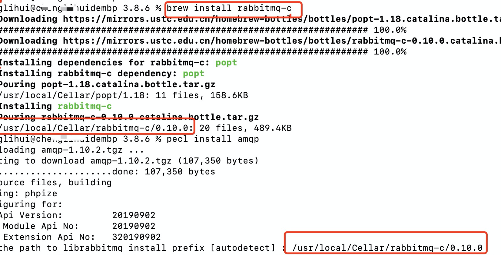
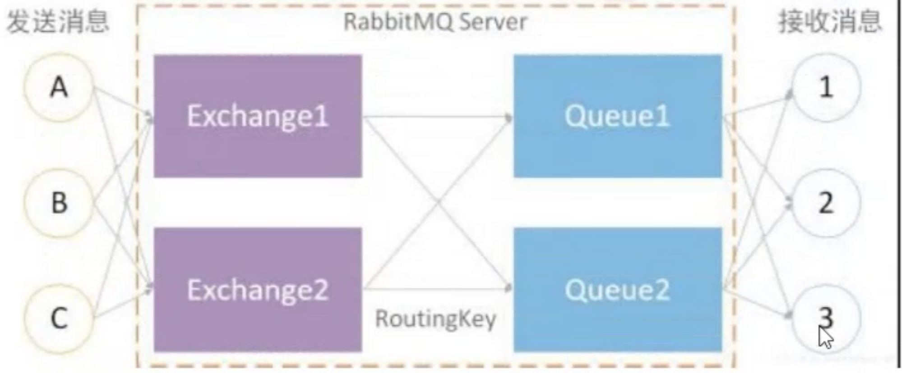
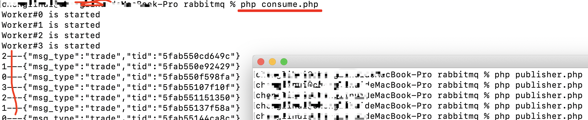

##### 第一章：RabbitMQ

###### 1.1 软件安装

RabbitMQ 是 Erlang 语言写的，首先我们需要安装Erlang 环境
RabbitMQ 不同版本也对应着不同的Erlang 版本，进入官网：[RabbitMQ](https://www.rabbitmq.com/which-erlang.html)

> ubuntu下安装

~~~php
##1、安装RabbitMQ服务
sudo apt-get install rabbitmq-server

//开启、暂停服务 
service rabbitmq-server start 
service rabbitmq-server stop 
//查看运行状态 
service rabbitmq-server status

##2、安装rabbitmq的库 
sudo apt-get install librabbitmq-dev

##3、安装PHP扩展
sudo pecl install amqp

##4、启用 Web 管理接口
sudo rabbitmq-plugins enable rabbitmq_management

##5、添加管理用户
sudo rabbitmqctl add_user admin yourpassword          # 增加普通用户
sudo rabbitmqctl set_user_tags admin administrator    # 给普通用户分配管理员角色
~~~

> mac下安装

~~~php
##更新homebrew
brew update

##然后安装
brew install rabbitmq

##添加环境变量
vi ~/.bash_profile

export PATH=$PATH:/usr/local/sbin //如果有了当前路径，则不需要再添加

##安装Rabitmq的可视化监控插件
//切换到MQ目录
cd /usr/local/Cellar/rabbitmq/3.8.6

//启用rabbitmq management插件
sudo sbin/rabbitmq-plugins enable rabbitmq_management

##配置环境变量
# vi ~/.bash_profile
export RABBIT_HOME=/usr/local/Cellar/rabbitmq/3.8.6
export PATH=$PATH:$RABBIT_HOME/sbin

//配置文件生效
# source ~/.bash_profile

#后台启动rabbitmq
rabbitmq-server -detached

//查看状态
rabbitmqctl status
rabbitmqctl stop   //关闭
~~~

**浏览器访问：**

~~~php
http://127.0.0.1:15672/
账号和密码：guest guest
~~~

如果要浏览器访问，可以需要开放端口

> docker下安装

~~~php
//启动会自动搜索rabbitMQ
docker run -d --name rabbit -p 15672:15672 -p 5672:5672 rabbitmq:management

-d 开启守护进程，程序后台运行
-p 5672：5672 将主机的5672端口，映射到容器的 5672端口，用于外网访问容器 15672 web管理后台
--name rabbit ：容器的名字

//进入容器
docker exec -it rabbit bash
~~~

###### 1.2 安装扩展

mac系统

~~~php
# 1、安装rabbitmq-c
brew install rabbitmq-c

//获得文件路径 /usr/local/Cellar/rabbitmq-c/0.10.0

# 2、安装amqp
pecl install amqp

//直至出现Set the path to librabbitmq install prefix [autodetect] : 上面得到的路径

# 3、添加扩展到php.ini
vi /usr/local/etc/php/7.4/php.ini
[rabbitmq]
extension=amqp.so

# 4、重启php
brew services restart php@7.4

//通过phpinfo();
//搜索查看是否有 amqp 扩展
    
//或者  php -m  查看扩展
~~~

第一、二步如下图：

> AMQP协议介绍

RabbitMQ Server：也叫broker server，它是一种传输服务。 他的角色就是维护一条 从Producer到Consumer的路线，保证数据能够按照指定的方式进行传输。

- Producer：消息生产者， 如图A、B. C.数据的发送方。消息生产者连接RabbitMQ服务器然后将消息投递到Exchange。

- Consumer：消息消费者，如图1、 2、3，数据的接收方。消息消费者订阅队列，RabbitMQ将Queue中的消 息发送到消息消费者。

- Exchange：生产者将消息发送到Exchange (交换器)，由Exchange将消 息路由到-一个或多个Queue中(或者丢弃)。**Exchange并不存储消息**（就是一个路由功能）。RabbitMQ中的Exchange有**fanout(广播一对多)、direct(直连一对一).、topic(匹配)、headers四种类型**， 每种类型对应不同的路由规则，后面详细介绍这四种类型。

- Queue：(队列)是RabbitMQ的内部对象，用于存储消息。消息消费者就是通过订阅队列来获取消息的，RabbitMQ中 的消息都只能存

  储在Queue中，生产者生产消息并最终投递到Queue中，消费者可以从Queue中获取消息并消费。多个消费者可以订阅同一Queue，这时Queue中的消息会被平均分摊给多个消费者进行处理，而不是每个消费者都收到所有的消息并处理。

- RoutingKey：生产者在将消息发送给Exchange的时候，一般会指定一个routing key，来指定这个消息的路由规则，**而这个routing key需要与Exchange Type及binding key联合使用才能最终生效。**在Exchange Type与binding key固定的情况下(在正常使用时一般这些内容都是固定配置好的)，我们的生产者就可以在发送消息给Exchange时，通过指定routing key来决定消息流向哪里RabbitMQ 为routing key设定的长度限制为255 bytes。

- Connection:：(连接 ) Producer和IConsumer都是通过TCP连接到RabbitMQ Server的。以后我们可以看到，程序的起始处就是建立这个TCP连接。

- Channels：(信道)它建立在上述的TCP连接中。数据流动都是在Channel中进行的。也就是说，一-般情况是程序起始建 立TCP连接，第二步就是建立这个Channel。

> 代码测试

消息生产者：publisher.php

~~~php
<?php
// 生产任务(rabbitMQ)

try {
    $exchangeName = "trade";// 交换机的名字
    $routingKey = "/trade"; //路由

    // 1.建立连接
    $connection = new AMQPConnection([
        'host' => '127.0.0.1',
        'vhost' => '/', //虚拟主机，查多个
        'port' => 5672,
        'login' => 'guest', //默认账号
        'password' => 'guest'
    ]);
    $connection->connect();//需要手动去连接，而非创建就连接

    // 2. 建立通道
    $channel = new AMQPChannel($connection);

    // 3.创建交换机
    $exchange = new AMQPExchange($channel);
    $exchange->setName($exchangeName);
    $exchange->setType(AMQP_EX_TYPE_DIRECT);
    $exchange->declareExchange(); // 声明交换机
    /** 设置交换机类型
        AMQP_EX_TYPE_DIRECT:直连交换机
        AMQP_EX_TYPE_FANOUT:广播交换机
        AMQP_EX_TYPE_HEADERS:头交换机
        AMQP_EX_TYPE_TOPIC:主题交换机
     */

    // 4.绑定路由关系，发送消息
    $data = ["msg_type" => "trade", 'tid'=>uniqid()];
    $exchange->publish(json_encode($data), $routingKey);

    //delivery_mode:2声明消息持久，持久的队列+持久的消息在RabbitMQ重启后才不会丢失
    //$ex->publish(json_encode($msg), $routingKey, AMQP_NOPARAM, array('delivery_mode' => 2)).
    //代码执行完毕后进程会自动退出

    $connection->disconnect();// 断开连接
} catch (\Exception $e) {
    var_dump($e);
}
~~~

消费者 consume.php

~~~php
<?php
// 消费者
try {
    $exchangeName = "trade";// 交换机的名字
    $routingKey = "/trade"; //路由
    $queueName = 'trade'; //队列名称

    // 1.建立连接
    $connection = new AMQPConnection([
        'host' => '127.0.0.1',
        'vhost' => '/', //虚拟主机，查多个
        'port' => 5672,
        'login' => 'guest', //默认账号
        'password' => 'guest'
    ]);
    $connection->connect();

    // 2. 建立通道
    $channel = new AMQPChannel($connection);

    // 3. 创建队列
    $queue = new AMQPQueue($channel);
    $queue->setName($queueName);
    $queue->declareQueue(); //声明队列

    // 4. 绑定路由监听
    $queue->bind($exchangeName, $routingKey);

    // 消费队列消息
    // 没数据时候。就是阻塞状态，获取数据才会执行
    //设置消息队列消费者回调方法，并进行阻塞 (可以把function 单独出去，这里传入函数名即可)
    $queue->consume(function ($envelope, $queue) {
        // 消费 (取出消息，执行不成功 -》 丢失数据 ack应答机制)
        // 业务逻辑的地方
        var_dump($envelope->getBody());

        //显式确认，队列收到消费者显式确认后，会删除该消息
        $queue->ack($envelope->getDeliveryTag());
        sleep(1);
    });
} catch (\Exception $e) {
    var_dump($e);
}
~~~

> 结合Swoole开启多个进程来消费

~~~php
<?php
$workerNum = 4; //看配置，消耗 （CPU 1-4倍左右）
$pool = new Swoole\Process\Pool($workerNum);

// 如果多进程，共享一个连接(窜数据的问题)
// 绑定了一个事件(底层C触发的)
$pool->on("WorkerStart", function ($pool, $workerId) {
    echo "Worker#{$workerId} is started\n";
    // 子进程，必须一个连接占一个进程
    try {
        $exchangeName = "trade";// 交换机的名字
        $routingKey = "/trade"; //路由
        $queueName = 'trade'; //队列名称

        // 1.建立连接
        $connection = new AMQPConnection([
            'host' => '127.0.0.1',
            'vhost' => '/', //虚拟主机，查多个
            'port' => 5672,
            'login' => 'guest', //默认账号
            'password' => 'guest'
        ]);
        $connection->connect();

        // 2. 建立通道
        $channel = new AMQPChannel($connection);

        // 3. 创建队列
        $queue = new AMQPQueue($channel);
        $queue->setName($queueName);
        $queue->declareQueue(); //声明队列

        // 4. 绑定路由监听
        $queue->bind($exchangeName, $routingKey);

        // 消费队列消息
        // 没数据时候。就是阻塞状态，获取数据才会执行
        //设置消息队列消费者回调方法，并进行阻塞 (可以把function 单独出去，这里传入函数名即可)
        $queue->consume(function ($envelope, $queue) use($workerId) {
            // 消费 (取出消息，执行不成功 -》 丢失数据 ack应答机制)
            // 业务逻辑的地方
            echo $workerId,'---',$envelope->getBody(),PHP_EOL;

            //显式确认，队列收到消费者显式确认后，会删除该消息
            $queue->ack($envelope->getDeliveryTag());
            sleep(1);
        });
    } catch (\Exception $e) {
        var_dump($e);
    }
});

//进程关闭
//$pool->on("WorkerStop", function ($pool, $workerId) {
//    echo "Worker#{$workerId} is stopped\n";
//});

$pool->start();
~~~

> **行动结果：**

###### 1.3 Tp6+rabbitmq类

==tp6 & RabbitMQ企业最佳实践==

~~~php
https://www.kancloud.cn/zhangqi/tp6_rabbitmq/1770289
~~~

> composer安装类

~~~php
# composer搜索 rabbitmq
composer require php-amqplib/php-amqplib
~~~

